# Cybertalent CTF, julen 2020


E-tjenesten holdt enda en CTF i slutten av desember 2020. Formatet er det samme [som sist](../etjenesten20/README.md), men med et nytt oppdrag og nye utfordringer. Fjorårets oppgaver er også inkludert, men foruten et par utvalgte fra hjernetrim, så er ingen av oppgavene poenggivende. Det har også blitt gjort små endringer i oppgavene, som plassering av flagg på mer logiske steder, samt oppgradering til en kernel hvor man ikke kan bruke Dirty Cow.


## 1. Grunnleggende

Oppgave 1, 2, 3, 4 og 6 er helt like som forrige gang. Oppgave 5 er ny.


### 1.5_nettverk

```
Så langt har oppgavene dreid seg om å få tilgang til filer på en maskin hvor man allerede har tilgang. Dataangrep starter ofte ved at man må skaffe seg denne tilgangen ved å utnytte en *nettverkstjeneste* som er tilgjengelig på internett.

I denne mappen ligger en server som, etter å ha blitt startet, lytter på port `tcp/10015`. For å få tak i flagget trenger du ikke overflows som i forrige oppgave, men du må vise at du behersker programmeringsferdigheter som å håndtere flere samtidige tilkoblinger og konvertering av binære data.
```

Vedlagt ligger det et `server`-program med setuid til `basic5`, og filen `FLAGG` som eies av `basic5`. Målet er å starte opp `server`, og så koble til denne på port 10015 og følge instruksjonene som kommer. Oppgaven krever at man først kobler til en "hoved-socket" som får instruksjonene, så ytterligere 10 sockets til som vil få hvert sitt tall. Hovedsocketen skal sende summen av dette tallet, representert som hexadecimalt, til serveren. Deretter vil man begynne å få en melding tilbake, 1 byte om gangen, fordelt utover alle de 11 aktive socketene.

```bash
login@corax:~/1_grunnleggende/5_nettverk$ ./server &
[1] 59
Lytter på port 10015, koble til for videre instruksjoner.
login@corax:~/1_grunnleggende/5_nettverk$ python3 ~/client.py
Dette er en grunnleggende introduksjon til nettverksprogrammering.
Når du har åpnet ti nye tilkoblinger til denne serveren vil du få videre instruksjoner på denne socketen.

Du vil nå få tilsendt et 32-bits heltall i `network byte order` i hver av de ti andre sesjonene.
Summer alle, og send resultatet tilbake på denne socketen.
Det er mange måter å konvertere data på. En av dem er `struct.unpack`.

100156465
162151653
255831055
127387575
162544181
261113337
63687561
118566558
197303127
189649586
1638391098
[b'a\xa7\xdd:']
Neste melding sendes fordelt over de ti sesjonene.
For å unngå å blokkere mens du leser kan du for eksempel bruke `select.select()` eller `socket.settimeout(0)`.

Husk at utf-8 kan ha multi-byte tegn 😊

╭────────────────────────────────────────╮
│ Gratulerer!                            │
│                                        │
│ Her er flagget:                        │
│                                        │
├────────────────────────────────────────┤
│    3b25a1b0721f2b884fe60351f7dd7c3f    │
╰────────────────────────────────────────╯
```

Den ferdige koden ligger in [client.py](client.py)


## 2. Oppdrag

Årets oppdrag starter med en historie om en kidnapping og en fiktiv terror-organisasjon som er ute etter å befri Antarktis. En av terroristene har blitt pågrepet, og vi har fått innholdet på hans mobiltelefon og noe trafikkdata utlevert. `INTREP.txt` nevner hva oppdraget går ut på

```
PRIORITERINGANE VÅRE ER:

    (1) FRIGJEVA GISSELET ELLER GISSELA
    (2) IDENTIFISERA GISSELTAKARANE
    (3) HALDA FAST PÅ NORSK SUVERENITET OVER DRONNING MAUD LAND
```


La oss starte med å analysere beslaget.

`lt3000.apk` inneholder en Android-app, som terroristene tydeligvis har brukt til å lagre ting og kommunisere. Det følger med en del data-filer som hører til denne, og vi skal undersøke de i tur og orden:

`users.db` er en SQLite-database som inneholder noe informasjon om en bruker

````
1	hungry_hippo_123	Frank	Shorius	2034F6E32958647FDFF75D265B455EBF
````

hvor sistnevnte er en passord-hash. Enkelt Google-søk sier at dette er en velkjent MD5-hash for passordet `secretpassword`.

`data.bin` ser ut til å være ganske random, og lengden er delelig med 16 - enten av tilfeldigheter, eller fordi filen kryptert med en blockbasert algoritme som AES.

`files/!aW1wb3J0YW50X2xpbmtz`, `files/!c2hvcHBpbmdfbGlzdA==` etc. har base64-enkodede navn for "flag", "todo", "shopping_list" og "important_links" med et utropstegn foran. Alle filene har lengder og entropi som tilsier at de er krypterte med en block-cipher som AES.

Selve appen består av flere komponenter, og hver av disse inneholder et flagg. APKen er delvis obfuskert, og har flere funksjoner gjemt i native libs, som gjør at denne antageligvis er enklere å reverse-engineere dynamisk enn statisk. Det er også noen sjekker for å se etter emulerte miljø, hvor dekryptering blir stoppet om det detekteres noen form for emulering eller rooting.


### 2.1_beslag_1

I `Tuner`-modulen, så kan man høre på ulike "radio"-kanaler. Disse er representert av mp3-filer inne i APKen. Ingen av disse er noe interessante. Det er også et felt hvor man kan taste inn brukernavn og passord, og hvis vi legger over `data.bin` fra beslaget over på telefonen/emulatoren, og så logger inn med `hungry_hippo_123` / `secretpassword` så vil det dukke opp en 7. kanal som leser opp et flagg: `london_calling`.

Jeg løste denne statisk, ved å bruke upper-case MD5-hexdigest av `secretpassword` som passord i en pbkdf2_hmac-rutine, med saltet `saltpaamaten` og 0x10000 runder, samt dklen 0x100. De første 16 bytene av filen er initialiseringsvektoren (IV) for AES i CBC-mode.

```python
def getKey(pw):
    return pbkdf2_hmac(
        hash_name = 'sha256',
        password = md5(pw).hexdigest().upper().encode(),
        salt = b"saltpaamaten",
        iterations = 0x10000,
        dklen = 0x100
    )

with open("flag.mp3", "wb") as fd:
    encdata = open("data.bin", "rb").read()
    iv = encdata[:16]
    enc = encdata[16:]
    key = getKey(b"secretpassword")
    aes = AES.new(key[:32], AES.MODE_CBC, iv=iv)
    fd.write(aes.decrypt(enc))
```


Ved levering kommer meldingen

```
Bra jobbet!
Det hadde vært praktisk om vi visste hvordan de har kommunisert.
```


### 2.1_beslag_2

`Chat`-modulen til appen kontakter `https://mobile.cybertalent.no/login`. Ved å logge inn der med brukernavnet og passordet vi har, så blir vi sendt videre til `https://mobile.cybertalent.no/challenge` hvor det er en boks med et tilfeldig generert ord, og så skal vi skrive inn en respons. Dette ordet endrer seg ca. hvert 10. sekund, og ser ut til å representere en TOTP (Timed One-Time Password), altså en slags tofaktor-tjeneste.

Hvis vi ser i den delvis dekompilerte APK-koden, så er det et native-lib som henter responsen for oss. Ved å se nærmere på dette biblioteket i IDA, så ser vi at det tar i bruk tiden, rundet av til nærmeste 10 sekunder, og gjør mange kalkulasjoner på den. Men en annen - mye viktigere - observasjon, er at når det sendes inn et forsøk på å løse en challenge, så ser responsen sånn her ut:

```
{"corr":"b\'4581b488a5b4bb5aa5a4b7b75988b9b4bb8b888a825588b6b6b4bb\'","error":"Bad response code"}
```

altså sier de "Nei, det var feil. Det skulle ha vært dette: ..." Siden kodene er gyldige i hele 10 sekunder, så er det derfor rimelig rett-fram å bare vente til challenge endrer seg, gjette noe, så skrive inn det korrekte svaret som vi får i responsen.

```python
from requests import session
s = session()
s.get("https://mobile.cybertalent.no/")
r = s.post("https://mobile.cybertalent.no/login", json={"user": "hungry_hippo_123", "pass": "secretpassword"})
r = s.post("https://mobile.cybertalent.no/getchall", json={})
r = s.post("https://mobile.cybertalent.no/challenge", json={"response": "aa"})
correct = r.json()['corr']
r = s.post("https://mobile.cybertalent.no/challenge", json={"response": correct})
print(r.content)
```

(Litt senere ut i konkurransen så forsvant dette "corr"-feltet fra responsen, så spørs om dette ikke var meningen. I så fall må funksjonen i native-lib reverse-engineeres.)

Tastes denne inn, kommer en ny melding

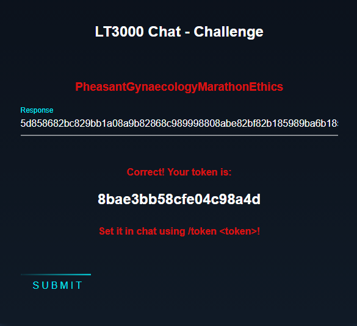


Ved å gå til `https://mobile.cybertalent.no/chat?token=8bae3bb58cfe04c98a4d` innen 10 sekunder, så får vi ut en [chatlog](chat.txt) som inneholder et flagg og noe viktig informasjon:

- De har alle vært på samme flight, siden det går svært få fly til destinasjonen deres per år, men de har ulike bookinger. Vi får vite booking-nummeret til Frank Shorius.
- De har en bakdør på en server, hvor brukernavnene er på formatet `<3 bokstaver av fornavn><lengde på nick><etternavn>` uten å fjerne store bokstaver.

Flagget gir meldingen

```
Flott! Nå vet vi litt mer om gisseltakerne.
Ligger det noen interessante filer eller tekniske spor her også?
```


### 2.1_beslag_3

Siste flagg finnes i `Vault`-delen av appen. Denne var litt vrien å løste statisk, men ser ut til å være ganske enkel med en dynamisk approach.

Vault lar deg skrive inn små tekstbiter med en overskrift. Disse kan krypteres ved å sette en 4-sifret PIN-kode og trykke på `Lock`. Da krypteres de originale filene med en nøkkel utledet av PIN-koden, og lagres i formatet `!<base64(originalnavn)>`. I `VaultActivity.xml` fra beslaget, finner vi også en entry `<string name="pin_hash">BSzN6uy2dDcolImpMKxffg==</string>` som ser ut til å brukes til å sammenligne inntastet PIN mot riktig PIN; altså den som ble brukt til å kryptere notatene vi ser i beslaget.

Det er mange steg på veien for å utlede hvordan krypteringen fungerer. Algoritmene er de samme som for `data.bin` i `2.1_beslag_1`, men det er noe ekstra som skjer i tillegg. Filen `https://mobile.cybertalent.no/xtra` lastes ned, og native-funksjonen `undo()` blir kalt på dataene som lastes ned, slik at filen blir en gyldig DEX-fil. Deretter lastes denne inn som en dynamisk klasse. Etter å ha reverset `undo()` så ser den ca. sånn her ut

```python
i = 0
j = 0
k = 0

v8 = open("xtra","rb").read()
v7 = len(v8)
v9 = [0]*len(v8)

while True:
  v14 = j + (v7 >> 1)
  v15 = i & 1
  if ( not (i & 1) ):
    v14 = k
  k += v15 ^ 1;
  j += v15;
  v9[i] = v8[v14]
  i += 1
  if v7 == i:
    break

with open("xtra.undo.dex","wb") as fd:
    fd.write(bytes(v9))
```


Denne ekstra-klassen implementerer funksjonen `getData(String str)`, som ender opp med å hashe `str+"y_so_salty"` med MD5 og SHA256 (individuelt) og så returnere begge digestene etter hverandre. MD5-delen brukes til å sammenligne mot `pin_hash`, mens SHA256-delen brukes som nøkkel for å dekryptere notatene.

```python
def getData(s):
    if type(s) == str:
        s = s.encode()
    s += b"y_so_salty"
    h1 = md5(s).digest()
    h2 = sha256(s).digest()
    return (h1 + h2)
```

med denne funksjonen på plass, og viten om at vi skal bare bruke sha256-delen når vi dekrypterer, så kan vi endelig lese ut filene:

```python
for file in os.listdir("files"):
    key = getKey(getData(pin)[16:48])
    encdata = open(f"files/{file}","rb").read()
    iv = encdata[:16]
    enc = encdata[16:]
    aes = AES.new(key[:32], AES.MODE_CBC, iv=iv)
    dec = aes.decrypt(enc)
    print(f"~~~{b64decode(file).decode()}~~~")
    print(unpad(dec, AES.block_size).decode().rstrip())
    print(f"~~~~~~~~~\n")
```

som gir outputen

```
Found pin! 5693
~~~important_links~~~
Hidden service URL:
http://fileserver/files/onion_name.txt

Scada client binary:
http://fileserver/files/0823...
Rembember this only works on the internal network, not from the outside.
~~~~~~~~~

~~~shopping_list~~~
1 Milk
1 Bread
6 Eggs
1000 rounds 7.76mm
10 HE grenades
4 Yoghurt
1 Butter
~~~~~~~~~

~~~todo~~~
Buy xmas presents
Find an xmas tree
Order airline tickets
~~~~~~~~~

~~~flag~~~
d025...
~~~~~~~~~

```


Siste del tok veldig lang tid, ettersom all den relevante koden ikke kunne bli dekompilert skikkelig av jadx. Andre decompilere bruker `dex2jar` internt, og dette verktøyet feilet fullstendig på den utleverte APK-filen, noe som gjorde at mange klasser rett og slett bare forsvant. Her måtte jeg manuelt lese SMALI-kode og pusle sammen hva som skjedde på egenhånd. Om jeg hadde tatt i bruk instrumentering som Frida, så hadde nok dette vært redusert til å faktisk bare finne en workaround for emuleringssjekken og så testet alle PIN-kodene i rekkefølge.

Ut av denne får vi uansett to viktige filer på filserveren; en fil med onion-URL til et Scada-system (hvor vi umiddelbart finner flagg 2.3 i JS console) og en binary som sender merkelige meldinger til oppgitt host/port i argv[1] og argv[2]. Når vi leverer flagget får vi enda et hint

```
Kanskje det ligger noen interessante filer her?
```


### 2.2_seatheworld

I PCAP-filen er det noe DNS-data og en webrequest mot domenet `seatheworld.tld`. Vi prøver oss på en freidig DNS Zone Transfer:

```
dig axfr seatheworld.tld @ns1.seatheworld.tld
; <<>> DiG 9.11.5-P4-5.1+deb10u2-Debian <<>> axfr seatheworld.tld @ns1.seatheworld.tld
;; global options: +cmd
seatheworld.tld.        600     IN      SOA     ns1.seatheworld.tld. ns1.seatheworld.tld. 12345678 1200 180 1209600 600
seatheworld.tld.        600     IN      NS      ns1.seatheworld.tld.
seatheworld.tld.        600     IN      MX      10 mail.seatheworld.tld.
_flagg.nusse.seatheworld.tld. 600 IN    TXT     "0825fac...."
mail.seatheworld.tld.   600     IN      CNAME   www.seatheworld.tld.
seatheworld.tld.        600     IN      A       10.0.114.50
nusse.seatheworld.tld.  600     IN      A       10.0.114.43
ns1.seatheworld.tld.    600     IN      A       10.0.114.61
www.seatheworld.tld.    600     IN      A       10.0.114.50
seatheworld.tld.        600     IN      SOA     ns1.seatheworld.tld. ns1.seatheworld.tld. 12345678 1200 180 1209600 600  
```

og finner et flagg i TXT, med enda et hint etter innlevering

```
Bra jobbet!
Hva kan det være denne maskinen brukes til?
```


### 2.2_seatheworld_aksess

Mye scanning av frontenden `seatheworld.tld`, tyder på at det ikke er noe å finne der. Det er bare port 80 som svarer, og det er bare en statisk webside som serveres tilbake. Dirbusting fører ikke til et eneste funn. `nusse.seatheworld.tld` kjører derimot FTP, SSH, Telnet og HTTPd. Banner fra alle tjenestene tyder på at dette er IBM z/OS, og en svært gammel utgivelse av denne. Etter mye lesing på nett, så fikk jeg brukt `nmap` til å enumerere brukernavn og en del annet på terminal (Telnet)-tjenesten. Blant annet kan vi logge på med "USER/USER" eller "IBMUSER/SYS1", hvor sistnevnte er en slags superbruker. For å kommunisere med terminalen, har Corax preinstallert mange python-biblioteker og kommandolinjeverktøy, og jeg falt på `c3270`.

```
c3270 nusse.seatheworld.tld
LOGON IBMUSER
(passord: SYS1)
```

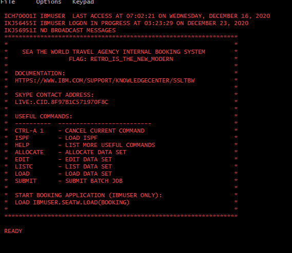


Flagget er altså `RETRO_IS_THE_NEW_MODERN`, og under står instruksjoner på hvordan vi kan starte booking-applikasjonen.

```
Navn på gisseltakerne burde være tilgjengelig et sted på denne stormaskinen.
```


### 2.2_seatheworld_booking

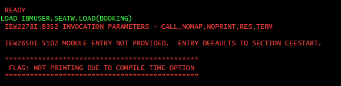


Når vi starter booking-systemet, så dukker det opp en melding om at flagget ikke kan printes, fordi funksjonen er avskrudd. Dette hinter ganske sterkt mot at vi skal finne en måte å skru på igjen denne funksjonaliteten. Målet med booking-deloppgaven er uansett å finne navnet på terroristene, så dette flagget får vente litt.

Jeg kjørte først `LISTC` (utefor booking) for å få en liste over entries, og noterte meg ned et par interessante:

- `IBMUSER.SEATW.BOOKINGS`
- `IBMUSER.SEATW.LOAD`
- `IBMUSER.SEATW.SRC`
- `IBMUSER.SEATW.SRC(CIPHER)`

Deretter ga jeg brukeren `USER` tilgang til å lese disse via `PERMIT 'IBMUSER.SEATW.BOOKINGS' ID(USER) ACCESS(READ)` og tilsvarende for de andre. Derfra kunne jeg logge inn som `USER` via FTP (`IBMUSER` hadde ikke tilgang til FTP) og laste de ned (CD .. -> CD IBMUSER.SEATW -> get BOOKINGS).

Inne i SRC lå det 3 entries: 

- `C` inneholder C-kode for booking-programmet.
- `JCL` inneholder noe metadata etter kompilering, eller noe i den dur.
- `CIPHER` inneholder et kryptert flagg. Dette referes til i `C`.

I tillegg lastet jeg ned `BOOKINGS` rett fra `IBMUSER.SEATW`. Alle filene må dekodes som EBCDIC, siden det er tekst-enkodingen IBM bruker.

Ut fra `BOOKINGS` kan vi søke opp Frank Shorius, eller bruke referansenummeret vi så i chatloggen fra `2.1_beslag_2` for å finne flighten

`WJWQX AMS 2020-12-14 18:20 TXA 2020-12-14 22:40`

Ved å søke etter denne finner vi 3 personer til, og alle disse er gyldige som flagg. I nevnte chatlog kunne vi også lære at det fantes en bakdør til scada-serveren, og reglene for hvordan brukernavn genereres. Via nmap kan vi lete etter denne bakdøren, og finner den til slutt på hosten `scada` på port 1338, hvor det spørres om "Username: " når vi kobler til. Ved å korrelere lengde på brukernavn fra chatloggen, navnene fra bookingen, og gyldige inputs til bakdøren, kan vi sette sammen en liste over terroristenes bookingreferanse, navn, nick og brukernavn til bakdøren:

```
UHKVP AMS 2020-12-14 18:20 TXA 2020-12-14 22:40
DILLIAN CRUISE
B4tCracK
Dil8Cruise

WJWQX AMS 2020-12-14 18:20 TXA 2020-12-14 22:40
FRANK SHORIUS
hungry_hippo_123
Fra16Shorius

WTHHX AMS 2020-12-14 18:20 TXA 2020-12-14 22:40
JOE FARNABY
RADAR
Joe5Farnaby

Y6MY AMS 2020-12-14 18:20 TXA 2020-12-14 22:40
EIREEN FARNABY
eireen89
Eir8Farnaby
```

Merk at `Fra16Shorius` kun gir `User access revoked..` når vi forsøker å logge inn mot bakdøren med det brukernavnet.

Det er også et Skype-nummer i MOTD ved innlogging til terminaltjenesten, og en alternativ måte å løse `booking` på er å ringe disse og overbevise de om å finne booking-dataene for deg. Da får man derimot ikke løst `ekstra`-oppgaven.


### 2.2_seatheworld_ekstra

Flagget som ikke printes pga. "compile time option" er interessant. Nå har jeg en form for C-kode, bare med altfor mye whitespace og en del korrupterte bytes her og der. Men det er nok til å lese følgende (etter mye opprydning):

```c
void print_flag()
{
    char buf[512];
    FILE * fd = fopen("IBMUSER.SEATW.SRC(CIPHER)", "r");
    size_t i, n = fread(buf, 1, 32, fd);
    fclose(fd);                              
    buf[32] = 0;                             
    for (i = 0; i < n; i++)                      
        buf[i] = buf[i] ^ 17;
    printf("\n***********************************************"
           "\n FLAG: %s"
           "\n***********************************************\n\n", buf);
}
```

Altså leses entryen `CIPHER`, den XORes med 17, og så printes det ut. Vi har allerede hentet ut CIPHER, men så var det denne EBCDIC-enkodingen da... Litt dekoding senere så har vi den:

```python
>>> import ebcdic
>>> a=open("CIPHER","rb").read()
>>> bxor(a,bytes([17]*len(a))).decode('cp1142')
'c0da14705d80.....céééééééééééééééééééééééééééééééééééééééééééééééé' #(Sensurert)
```

```
Gratulerer! Du har utvist grunnleggende kunnskap om IBM stormaskiner.
Det er behov for kunnskap om en rekke forskjellige systemer i en jobb hos oss,
og evnen til å sette seg inn i nye (og gamle!) ting er viktig.

En stor takk til IBM Norge som lot oss benytte z/OS for årets CTF!
```


### 2.3_onion

Det er mulig å `nmap`-e seg til dette flagget ganske tidlig, men jeg dumpet først over det når jeg løste notatet i beslag 3. Dette pekte mot `http://fileserver/files/onion_name.txt`, som inneholder navnet på en TOR-server man kan aksessere for å se en oversikt over et slags fengsel med  dører som går opp og igjen.

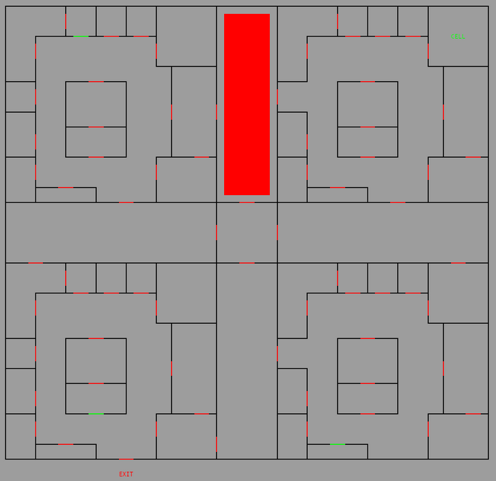


Nettsiden setter opp en websocket og begynner å abonnere på oppdateringer fra systemet. Oppdateringene er en fullstendig tilstand over alle dørene og detektorene i fengselet. Røde dører er lukket og låst, gule er opplåst (men lukket) og grønn er opplåst og åpnet. De store, røde feltene er detektorer som er trigget, og betyr egentlig bare at det er noen (eller noe?) i det rommet for øyeblikket.

I JS console får vi følgende hint og et flagg:

```
PRO TIP: In case the TOR connection is unstable - you can access this via the hostname 'scada' internally
Here is a flag: b4ba...
```

Vi leverer flagget og får en beskjed:

```
Du har fått tilgang til gisseltakerenes bakdør inn i styringssystemet. Klarer du å styre systemet selv?
```


### 2.3_scada_aksess

Vi skal åpenbart styre dørene. Vi har en bakdør via de hemmelige brukernavnene. Vi plukker et av brukernavnene på måfå og forsøker å logge inn:

```
login@corax:~$ nc scada 1338
Username: Dil8Cruise
We have now sent a login PIN to you via SMS
Enter PIN: 1234
..the provided PIN was not correct.
..the provided PIN was not correct.
3214
..the provided PIN was not correct.
..the provided PIN was not correct.
..the provided PIN was not correct.
..the provided PIN was not correct.
```


Brukernavn var altså ikke nok. Vi må ha en PIN også. Ettersom vi har gjort alle oppgavene hittil, og ikke hørt noe om et mobilnummer noe sted, er det sannsynlig at vi skal prøve å brute-force denne. Det er derimot noe veldig merkelig med tilbakemeldingene vi får, så det er ikke rett-fram å scripte prosessen på en stabil måte. Antall feilmeldinger varierer nemlig veldig, og av og til henger ting seg opp. Vi finner til slutt ut at det er maksimalt 256 forsøk på å taste inn PIN før vi blir kastet ut, og hver gang vi logger inn så blir det generert en ny PIN. Dette var en litt irriterende del av oppdraget, ettersom denne servicen var så ustabil. Når man først kom inn, så var det mulig at man allerede hadde sendt neste kode pga. opphopning av feilmeldinger, og da fikk man syntaksfeil på neste bit og ble kastet ut. Selv om vi utelukkende sender samme brukernavn hver gang, får vi også ofte `That username is not recognized`.

Men etter noen minutter med bruteforcing, så kommer vi endelig inn, og første linje er flagget. Etter dette blir vi bedt om å sende kommandoer i hex-format. Innlevert flagg gir det siste hintet

``` 
Godt jobbet! Nå må du bare hjelpe gisselet med å komme seg ut av bygningen!
```


### 2.3_scada_gissel

Den siste oppgaven var litt vag. Vi har allerede etablert at vi kan komme oss inn via bakdøren til SCADA-systemet via PIN-bruteforce. I notatene fra `2.1_beslag_3` fikk vi også URL til en programfil, som forsøker å koble seg til et system for å sende kommandoer. Denne er inkompatibel med bakdøren pga. krav om brukernavn/PIN, men formatet den sender data på er `\x02 <antall bytes som følger><dør-ID-i-ASCII>` f.eks. `\x02\x040005` for døren med ID "0005". En slik melding er det vi skal sende til bakdøren, og dette åpner opp en av dørene. Ved å følge med i webgrensesnittet på TOR, eller ved å lage en egen websocket-klient, så kan vi følge med på at dørene åpnes, står oppe litt, og så lukkes og låses.

Ved å fuzze litt input, så er det tydelig at de aksepterer ganske mange typer input, så lenge lengdebyten er korrekt. Men det skjer ikke noe nevneverdig hvis IDen går til en ikke-eksisterende dør, eller refererer en av sensorene. "\x00" i starten ser også ut til å stenge dører (rød), og "\x01" ser ut til å låse de opp (gul). Selv om jeg looper steng-kommandoen til alle dørene, så er det fortsatt noen dører som går opp med jevne mellomrom, så det er ikke mulig å stenge inne hva eller hvem enn det er som rusler rundt inne der. Hver gang jeg ryker på en feiltilstand under fuzzingen, blir jeg kastet ut og må gjennom mange runder med ny bruteforcing før jeg kommer meg inn igjen, så jeg tester ikke veldig mye her. Jeg har satt opp en enkel klient som ber om input, og enten formatterer denne riktig for meg, eller tolker det som ren hex om den starter med `h`.

```python
def get_input(r):
    while True:
        inp = input("Door? >")
        if not inp.strip(): continue
        if inp.startswith("h"):
            pload = inp[1:].rstrip().encode()
            r.sendline(pload)
        else:
            door = format(int(inp), "04d")
            if door not in door_list.keys():
                print(f"{door} not in list")
                continue
            pload = b"\x02\x04" + door.encode()
            r.sendline(pload.hex())
        print(r.recv())
```

Ved å låse opp (men ikke åpne) døra til cellen, så ser vi at den åpner seg opp etter en kort stund (går fra gul til grønn). Dette er gisselet som åpner døren selv! Målet er å lede gisselet til exit på kartet, men det er noen hindringer i veien:

- Dørene har ikke ekstremt logiske navn, i alle fall ikke ved første øyekast. De er gitt av et slags koordinatsystem, men med dør-posisjon og rom-nummer som en ekstra identifikator. Jeg valgte meg ut en rute og identifiserte navnene på alle dørene for å komme dit.
- Man må vente på at gisselet faktisk går til neste dør, og låse den opp om og om igjen til gisselet går gjennom.
- Det er noen vakter eller detektorer som ender opp med at gisselet går rett tilbake til cella.
- Gisselet og vaktene er ikke synlig i oversikten. Det eneste man ser er dører og detektorer.

Ved å observere detektorene så er det derimot mulig å time det slik at gisselet kommer seg ut, uten å støte på så mye motstand. Jeg valgte dørene `5, 513, 1325, 1925, 1928, 2833, 3334, 9934` (hvor første og siste er celledør og exit), noe som blir ruten gitt av de grønne dørene her (minus en av de)

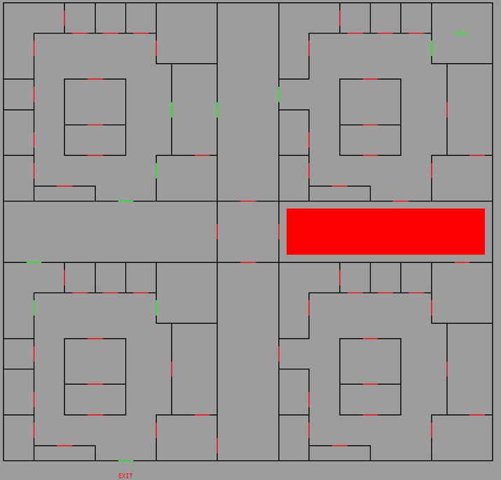


Disse ble låst opp 1 og 1 i rekkefølge, inntil jeg så at de ble åpnet og passert. Deretter låste jeg opp neste osv. Etter noen forsøk, så dukker det plutselig opp et flagg i nettleseren.

```
Gratulerer! Du klarte å frigi gisselet, og har løst årets oppdrag!
I en jobb i Etterretningstjenesten vil du få mulighet til å bidra til å løse
et viktig samfunnsoppdrag med ekte situasjoner og "skarpe" oppdrag.

Vi har laget denne CTF-en for å tiltrekke oss søkere til vårt talentprogram
i 2021.
```

Samt noe informasjon om hvordan man søker seg inn til E-tjenesten.


## 3. Utfordringer

### 3.1 Utfordringer lett

#### 3.1.1_clmystery

Kopi av fjorårets oppgave. Løst likt.

#### 3.1.2_fibonacci

```
Klarer du å regne ut fibonacci raskt nok?

Adresse: tcp://fibonacci:7600
```

Her bes det om Fibonacci-tall nummer N, i flere runder, og man har ganske kort tid på å svare riktig. N er et relativt lite tall, så vi kan enkelt prekalkulere en rekke med tall og plukke blant de

```python
from pwn import *
import re

context.log_level = "debug"

f = [0, 1]
for i in range(1000):
    f.append(f[-1] + f[-2])

r = remote("fibonacci", 7600)
while True:
    data = r.recv()
    print(data)
    num = int(re.findall(b"\d+", data)[0])
    print(num)
    r.send(str(f[num+1]))
r.interactive()
r.close()
```


#### 3.1.3_math_1

```
Jeg har laget en matematikk-tjeneste.
Vil du prøve å logge inn på systemet?

Adresse: http://math:7070

PS: Det er 2(TO) flagg i denne oppgaven
```

Enkel `curl http://math:7070/` gir at det finnes en `/flag_1` og en `flag_2`. Ved å requeste `/flag_1` får man første flagget.

#### 3.1.3_math_2

Når vi requester `/flag_2` får vi beskjed om at `User-Agent`-headeren skal være `User-Agent: Math Calculator (Python 3)`. Når denne settes, så får vi utdelt en cookie og blir sendt til `/challenge`. På `/challenge`-endpointet er det eneste inneholdet et mattestykke av formatet `824928+777334`. Når vi så POSTer svaret tilbake, så kommer det enda en mattestykke å løse osv.

```python
from requests import session

s = session()
s.headers.update({"User-Agent": "Math Calculator (Python 3)"})

curr = s.get("http://math:7070/challenge").text
print(curr)

while True:
    curr = s.post("http://math:7070/challenge", data=str(eval(curr))).text
    print(curr)
```

Etter 30 oppgaver så kommer flagget.

##### P.S.

Serveren på denne kjører `bottlepy`, noe som betyr at cookiene i denne oppgaven benytter Python pickles, hvor de tolkes som f.eks. `('user_id', '7121fe7bff4c1bff')` på serversiden. De er derimot også signert med en hmac, men ved å gjette hva secret til hmac er, så er det mulig å signe vilkårlige cookies og få RCE under pickle deserialization.

#### 3.1.4_rusty_reversing_easy

Denne oppgaven var først bugget, og passordet virket ikke. Intensjonen virket å kun være å åpne programmet i en debugger, breake etter input leses inn, og så oppdage at den sammenligner med `this_super_secret_password_should_not_be_guessable` for så å dekryptere flagget og printe det ut. Men dette virket ikke før den ble fikset. Løsningen var å bare lure sammenligningen, ved å sette registerne lik hverandre før compare.

`etj{rusty_binaries_are_not_thaaat_difficult_right}`


### 3.2. Utfordringer middels

#### 3.2.1_coordinate

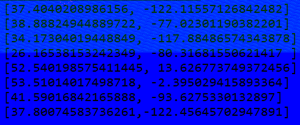


Denne oppgaven har 4 deler, men kommer bare med én bildefil. Navnene hinter derimot litt til hvor vi bør lete.

a(lpha): Ved å se på alpha-layer til bildet, er det en QR-kode gjemt i den


denne dekodes til en URL til `w3w://daytime.hacking.above` som er en måte å oppgi en koordinat på, via 3 ord. Disse ordene har 2 mulige lokasjoner i verden, hvor en av de er i Norge, nærmere bestemt `Lutvann` - som også er flagget.

b(lue): Det blå laget inneholder en del koordinater, når vi enten leser av bildet, eller henter ut `b8,b,lsb,xy` med zsteg.

```
[37.4040208986156, -122.11557126842482]
[38.88824944889722, -77.02301190382201]
[34.17304019448849, -117.88486574343878]
[26.16538153242349, -80.31681550621417 ]
[52.540198575411445, 13.626773749372456]
[53.51014017498718, -2.395029415893364]
[41.59016842165888, -93.6275330132897]
[37.80074583736261,-122.45645702947891]
```

ved å se på disse lokasjonene, så danner det seg fort et mønster; de peker på bygninger eller ting som ser ut som bokstaver. I rekkefølge fra øverst til nederst, så staver det ordet `FONTSIZE`, som er flagget.

r(ed):

Ser man nøye på det originale bildet, så er det noen tydelige, røde pixler ca. på midten av det første tallet, helt øverst. X-posisjonen til disse pixlene, lest fra venstre mot høyre, og fra topp mot bunn, danner ASCII-strengen `subpixel`.

g(reen):

Den mest kompliserte for meg. Ved å hente ut `b8,g,lsb,xy` med zsteg, så får vi en lang rekke med koordinater over et 3-dimensjonalt område. Når jeg forsøkte å plotte dette, så fikk jeg bare støy, helt til jeg forsøkte scatter plot i stedet for wireframe. Etter å ha linet opp kameraet nøyaktig, så er det mulig å tyde ordet `focal point` som er flagget.

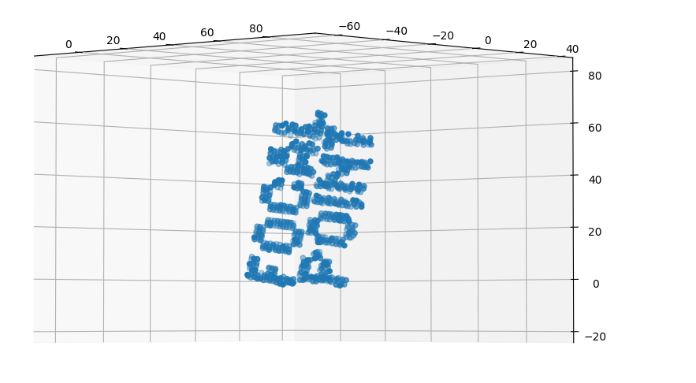

#### 3.2.2_minesweeper

```
I denne oppgaven skal du lage en minesweeper-klient som automatisk løser brett den får fra en minesweeper-server.

Du må løse 10 brett på rad med varierende vanskelighetsgrad. Det er mulig å oppnå totalt 3 flagg på denne oppgaven.
...
```

Denne oppgaven var blant de vanskeligste for meg, og den siste jeg fullførte. Man skal kommunisere med protobuf over en socket, og spille minesveiper på den måten. Man har 3600 sekunder på å løse level 1, og så 10 sekunder per level fra 2-8 og kun 5 sekunder på level 9 og 10. Man får et flagg for level 1, 8 og 10.

Jeg skrev en solver for minesveiper basert på https://github.com/mrgriscom/minesweepr/. Denne solveren bruker en regel-basert tilnærming, hvor den identifiserer et aktivt område og regner ut sannsynligheten for bomber langs en aktiv "front". Solveren støtter ikke Python 3, og det var ganske mye arbeid å porte denne over.

For hver runde, så 

- Oppdaterer jeg den interne tilstanden med 100% sikre bomber
- Sjekker om antall sikre bomber = antall forventede bomber, og avslutter om det er tilfelle
- Klikker på alle felter med 0% sannsynlighet for bombe
- Klikker på felter som tilstøter et felt med "0" på.

Sistnevnte er normalt sett noe spillklienten gjør automatisk for en, ved å ekspandere klikket til første tall større enn 0, samt markere alle '0' som en blank rute. Men her måtte dette gjøres manuelt.

Etter level 8, så dukker det opp situasjoner hvor det ikke lengre er 100% sannsynlig for at noe er bombe eller ikke. På det tidspunktet må jeg velge den som har lavest sannsynlighet for å være bombe, og så krysse fingrene. Etter et par forsøk kommer flagget ut.


#### 3.2.3_transfer

```
### Del 1

Vi har funnet denne nettverksdumpen som benytter en ukjent protokoll.
Kan du å tilbakevikle protokollen for å forstå hva slags data som overføres?

Fil: capture.pcapng

### Del 2

Vi kan nå serveren som var i nettverksdumpen. Kan du Koble til serveren og finne noe interessant på serveren?

Adresse: tcp://transfer:1334'
```

Ganske rett-fram oppgave, men som krever analyse. Vi får en trafikklogg og delvis sensurert informasjon om en protokoll. Målet er å gjette det resterende og dekode trafikken, og så lage en klient som gjør det samme.

Etter noe analyse av pakkene, så er det tydelig at sekvensnumrene øker med 1, men kun når serveren sender en melding. Altså skal vi bare kopiere det serveren sender til oss.

Sekvensen ser ut til å være noe sånt som:

- Client: Connect
- Server: Connect OK, auth?
- Client: Auth guest:guest
- Server: Key
- Client: Okay
- Server: Algorithm: 'RC4'

Etter meldingen om algoritmen, så blir alle data i trafikken kryptert. Etterpå sender klienten en listdir()-request, og får som svar

```
FLAG_1
FLAG_2

```

hvorpå den sender en readfile()-request med argument `FLAG_1`, som printer ut flagget. Etter dette så leses og skrives det flere filer

```
380b16455cd3072b Unk-5 kake.txt 12
380b16455cd3072c Success b'' 0
380b16455cd3072c Unk-7 Torsk er en hest som skyter festen 48
380b16455cd3072d Success b'' 0
380b16455cd3072d Unk-6 b'' 0
380b16455cd3072e Success Torsk er en hest som skyter festen 48
380b16455cd3072e Unk-7 Kake er en hest som smaker torsk 44
380b16455cd3072f Success b'' 0
380b16455cd3072f Unk-6 b'' 0
380b16455cd30730 Success Kake er en hest som smaker torsk 44
```


Del 2 består i å gjenskape den samme sekvensen, men nå med "FLAG_2" som argument i stedet.

Se filen [transfer.py](transfer.py) for et eksempel på en implementasjon.


#### 3.2.4_rusty_reversing_medium

Denne oppgaven har samme konseptet som rusty_reversing_easy. Man skal taste inn et passord. Vi har symboler i ELF-filen, og inne i en av funksjonene kalt fra main ser vi noe sånt som det her

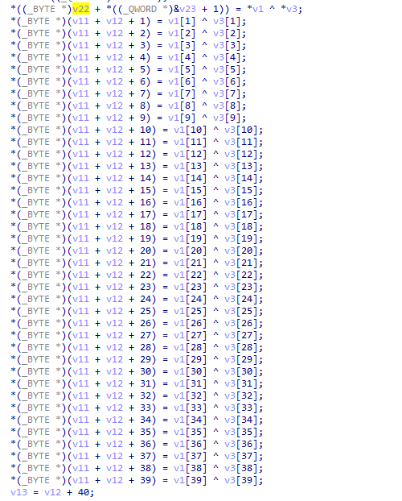

og dette skjer to ganger. Altså er det bare to buffere som XORes sammen, og inne i disse er det antageligvis noe interessant.

Blant rodata finner vi verdiene som brukes


Ved å XORe sammen disse, får vi første del av passord og flagget. Det er også mulig å sette breakpoint på `0x571D`, like etter at passordet er dekodet, og så gi en tilfeldig input.

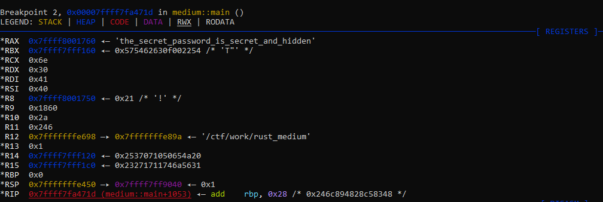


```
Enter password: the_secret_password_is_secret_and_hidden
Flag: etj{rust_sure_creates_long_and_weird_function_names}
```


### 3.3 Utfordringer vanskelig

#### 3.3.1_euler

Vedlagt er en PDF med mange oppgaver i. Alle er relatert til noe arbeid som Euler har vært involvert i. Oppgavene var ikke ekstremt vanskelige, men det var rimelig mange av de.

##### 1) Euler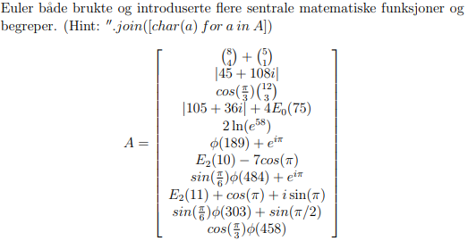

Her er det bare å regne ut. Notasjonen i første linje er binomial, Φ-funksjonen er Euler's totient og E-funksjonen er Euler-polynomer. De resterende er vel pensum på ungdomsskolen. Resultatet blir `Kunstkammer`, som er flagget.

##### 2) Sykler 

 `Euler fant ingen, men William Rowan hadde ingen problemer med å finne en.` Vedlagt er en lang graf med mange noder på, og et vidt spenn med tilkoblinger mellom nodene. Det hintes til `William Rowan Hamilton`, som blant annet er kjent for å ha forsket på konseptet Hamiltonvei (Hamilton Path), eller Hamilton Cycle. En slik vei, er en vei som starter i en node, besøker *alle* nodene kun én gang, og slutter der den begynte. Å finne en slik vei i en vilkårlig graf, er et NP-komplett problem, men det går an å få levelige algoritmer vha. f.eks. backtracing.

Jeg løste denne ved å navngi hver enkelt node med en id, og så transkribere hver enkelt tilkobling den hadde. Det var en grusom jobb med veldig stort potensiale for å gjøre feil. Til slutt satt jeg igjen med en tabell som så slik ut

```python
g3.graph = [#0 1 2 3 4 5 6 7 8 9 0 1 2 3 4 5 6 7 8 9 0 1 2 3 4 5 6 7 8 9 0 1 2 3 4 5 6 7 8 9 0
            [0,1,0,0,0,0,0,0,1,0,0,0,0,0,0,0,0,0,0,0,0,0,0,0,0,0,0,0,0,0,0,0,0,0,0,0,0,0,0,0,0], # 0
            [1,0,1,0,0,0,0,0,0,0,0,0,1,0,0,0,0,0,0,0,0,0,0,0,0,0,0,0,0,0,0,0,0,0,0,0,0,0,0,0,0], # 1
            [0,1,0,1,0,0,0,0,0,0,0,0,0,0,0,0,0,0,0,0,0,0,0,0,0,0,0,0,0,0,0,0,0,0,0,0,0,0,0,0,0], # 2
            [0,0,1,0,1,0,0,0,1,0,0,1,0,0,0,0,0,0,0,0,0,0,0,0,0,0,0,0,0,0,0,0,0,0,0,0,0,0,0,0,0], # 3
            [0,0,0,1,0,1,0,0,0,0,0,0,0,0,0,0,0,0,0,0,0,0,0,0,0,0,0,0,0,0,0,0,0,0,0,0,0,0,0,0,0], # 4
            [0,0,0,0,1,0,1,0,0,1,0,0,1,0,0,0,0,0,0,0,0,0,0,0,0,0,0,0,0,0,0,0,0,0,0,0,0,0,0,0,0], # 5
            [0,0,0,0,0,1,0,1,0,0,0,0,0,0,0,0,0,0,0,0,0,0,0,0,0,0,0,0,0,0,0,0,0,0,0,0,0,0,0,0,0], # 6
            [0,0,0,0,0,0,0,0,1,0,0,0,0,0,0,0,0,0,0,0,0,0,1,0,0,0,0,0,0,0,0,0,0,0,0,0,0,0,0,0,0], # 7
            [0,0,0,1,0,0,0,1,0,1,0,0,0,0,0,0,0,0,0,0,0,0,0,0,0,0,0,0,0,0,0,0,0,0,0,0,0,0,0,0,0], # 8
            [0,0,0,0,0,1,0,0,1,0,1,0,0,0,0,0,0,0,0,0,0,0,0,0,0,0,0,0,0,0,0,0,0,0,0,0,0,0,0,0,0], # 9
            [0,0,0,0,0,0,0,0,0,1,0,1,0,0,0,0,0,0,0,0,0,0,0,0,0,0,0,0,0,0,0,0,0,0,0,0,0,0,0,0,0], #10
            [0,0,0,1,0,0,0,0,0,0,1,0,1,0,0,0,0,0,0,0,0,0,0,0,0,0,0,0,0,0,0,0,0,0,0,0,0,0,0,0,0], #11
            [0,1,0,0,0,1,0,0,0,0,0,1,0,1,0,0,0,0,0,0,0,0,0,0,0,0,0,0,0,0,0,0,0,0,0,0,0,0,0,0,0], #12
            [0,0,0,0,0,0,0,0,0,0,0,0,1,0,0,0,0,0,0,0,0,0,0,0,0,0,0,0,0,0,1,0,0,1,0,0,0,0,0,0,0], #13
            [0,0,0,0,0,0,0,0,0,0,0,0,0,0,0,1,0,0,0,0,0,0,0,0,0,0,0,0,0,0,0,0,0,0,0,0,0,0,1,0,0], #14
            [0,0,0,0,0,0,0,0,0,0,0,0,0,0,1,0,1,0,0,0,0,0,0,0,0,0,0,0,0,0,0,0,0,0,0,0,0,0,0,0,0], #15
            [0,0,0,0,0,0,0,0,0,0,0,0,0,0,0,1,0,1,0,1,0,0,0,0,0,0,0,0,0,0,0,0,0,0,0,0,0,0,0,0,0], #16
            [0,0,0,0,0,0,0,0,0,0,0,0,0,0,0,0,1,0,1,1,0,0,0,1,0,0,0,0,1,0,0,0,0,0,0,0,0,0,0,0,0], #17
            [0,0,0,0,0,0,0,0,0,0,0,0,0,0,0,0,0,1,0,1,1,1,1,0,0,0,1,0,0,0,0,0,0,0,0,0,0,0,0,0,0], #18
            [0,0,0,0,0,0,0,0,0,0,0,0,0,0,0,0,1,1,1,0,1,0,0,0,0,0,0,0,0,0,0,0,0,0,0,0,0,0,0,0,1], #19
            [0,0,0,0,0,0,0,0,0,0,0,0,0,0,0,0,0,0,1,1,0,0,1,0,0,0,0,0,0,0,0,0,0,0,0,0,0,0,0,0,0], #20
            [0,0,0,0,0,0,0,0,0,0,0,0,0,0,0,0,0,0,1,0,0,0,0,0,0,1,0,0,0,0,0,0,0,0,0,0,0,0,0,0,1], #21
            [0,0,0,0,0,0,0,1,0,0,0,0,0,0,0,0,0,0,1,0,1,0,0,0,0,0,0,0,0,0,0,0,0,0,0,0,0,0,0,0,0], #22
            [0,0,0,0,0,0,0,0,0,0,0,0,0,0,0,0,0,1,0,0,0,0,0,0,1,0,0,1,0,0,0,0,0,0,0,0,0,0,0,0,0], #23
            [0,0,0,0,0,0,0,0,0,0,0,0,0,0,0,0,0,0,0,0,0,0,0,1,0,0,1,0,1,0,0,0,0,0,0,0,0,0,0,0,1], #24
            [0,0,0,0,0,0,0,0,0,0,0,0,0,0,0,0,0,0,0,0,0,1,0,0,0,0,0,1,0,0,0,0,0,0,0,0,0,0,0,0,0], #25
            [0,0,0,0,0,0,0,0,0,0,0,0,0,0,0,0,0,0,1,0,0,0,0,0,1,0,0,1,0,0,0,0,0,0,0,0,0,0,0,0,0], #26
            [0,0,0,0,0,0,0,0,0,0,0,0,0,0,0,0,0,0,0,0,0,0,0,1,0,1,1,0,1,0,0,0,0,0,0,0,0,0,0,0,0], #27
            [0,0,0,0,0,0,0,0,0,0,0,0,0,0,0,0,0,1,0,0,0,0,0,0,1,0,0,1,0,0,0,0,0,0,0,0,0,0,0,0,0], #28
            [0,0,0,0,0,0,0,0,0,0,0,0,0,0,0,0,0,0,0,0,0,0,0,0,0,0,0,0,0,0,0,0,1,1,0,0,0,1,0,0,0], #29
            [0,0,0,0,0,0,0,0,0,0,0,0,0,1,0,0,0,0,0,0,0,0,0,0,0,0,0,0,0,0,0,1,0,1,0,0,0,0,1,0,0], #30
            [0,0,0,0,0,0,0,0,0,0,0,0,0,0,0,0,0,0,0,0,0,0,0,0,0,0,0,0,0,0,1,0,1,0,0,0,0,0,0,1,0], #31
            [0,0,0,0,0,0,0,0,0,0,0,0,0,0,0,0,0,0,0,0,0,0,0,0,0,0,0,0,0,1,0,1,0,0,1,1,0,0,0,0,0], #32
            [0,0,0,0,0,0,0,0,0,0,0,0,0,1,0,0,0,0,0,0,0,0,0,0,0,0,0,0,0,1,1,0,0,0,1,0,0,0,1,0,0], #33
            [0,0,0,0,0,0,0,0,0,0,0,0,0,0,0,0,0,0,0,0,0,0,0,0,0,0,0,0,0,0,0,0,1,1,0,0,0,1,0,0,0], #34
            [0,0,0,0,0,0,0,0,0,0,0,0,0,0,0,0,0,0,0,0,0,0,0,0,0,0,0,0,0,0,0,0,1,0,0,0,0,1,1,0,0], #35
            [0,0,0,0,0,0,0,0,0,0,0,0,0,0,0,0,0,0,0,0,0,0,0,0,0,0,0,0,0,0,0,0,0,0,0,0,0,1,1,1,0], #36
            [0,0,0,0,0,0,0,0,0,0,0,0,0,0,0,0,0,0,0,0,0,0,0,0,0,0,0,0,0,1,0,0,0,0,1,1,1,0,0,0,0], #37
            [0,0,0,0,0,0,0,0,0,0,0,0,0,0,1,0,0,0,0,0,0,0,0,0,0,0,0,0,0,0,1,0,0,1,0,1,1,0,0,1,0], #38
            [0,0,0,0,0,0,0,0,0,0,0,0,0,0,0,0,0,0,0,0,0,0,0,0,0,0,0,0,0,0,0,1,0,0,0,0,1,0,1,0,0], #39
            [0,0,0,0,0,0,0,0,0,0,0,0,0,0,0,0,0,0,0,1,0,1,0,0,1,0,0,0,0,0,0,0,0,0,0,0,0,0,0,0,0], #40
           ]
```

og brukte en naiv algoritme for å regne ut veien. Til slutt så mappet jeg hver node i sykelen til en bokstav, slik som i grafen. Ut kom det noen ord som ikke var i helt riktig rekkefølge, men de var leselig nok til at jeg klarte å gjette resten: `viten om verden for vern av norge`, som er mottoet til E-tjenesten.

##### 3) Finn n

Siste oppgaven inkluderte et program kalt `h`, som tok inn et tall og spyttet ut to tall. Målet er å finne et tall `n` slik at outputen er en av de følgende:

```
a) h(n) = 8, 8
b) h(n) = 217772874500023635365563422386019273512381236824318290514357322123165713825792, 636647330747919895136525940302294632068470331232708261863503953920000000000000
c) h(n) = 9000000000000000000000000000000000000000000000000000000000, 3756326117848493706034345777213934145547380150921415411200
d) h(n) = 200000000000001220000000000000120, 99999922911895859181617256996352 (hint: n = p · q)
```

Etter å ha prøvd noen tall i stigende rekkefølge, så det ut som om resultatet dannet OEIS A152455, som beskrives som  `a(n) = minimal integer m such that there exists an m X m integer matrix of order n`. Det første tallet som kommer ut, er derimot totienten til tallet, og for tall med få faktorer så er det et begrenset antall tall som er lik en gitt totient. Wolframalpha kan faktisk løse de fleste av disse oppgavene, ved å be den løse `phi(n)=x` for et tall x. For b) og c) så kræsjer det derimot pga. kjøretid, men faktoriseringen av tallet i b) er `2^100 · 3^99` og er derfor enkel å løse, og for c) så kan vi observere noen mønster i antall løsninger ved å løse for f.eks. 9000 i stedet.

Løsningene blir som følger:

a) 15

b) 653318623500070906096690267158057820537143710472954871543071966369497141477376 (`(2*3)^100`)

c) 9000000000000000000000000000000000000000000000000000000001

d) 200000000000001250000000000000183 (`10000000000000061 * 20000000000000003`)


#### 3.3.2_rusty_reversing_hard

Denne gangen har vi ingen symboler. Breakpoints ser ut til å ikke virke helt som forventet. Heldigvis er programmet veldig likt medium-oppgaven. Vi hopper inn på ca. samme sted som sist (0x571D) og scroller litt oppover i koden. Der er det en funksjon som ligner veldig på libc sin strcmp, så vi setter et breakpoint der

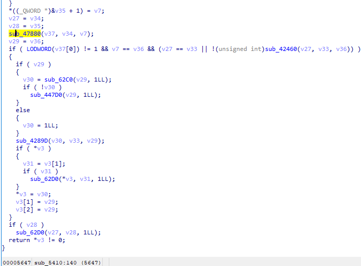


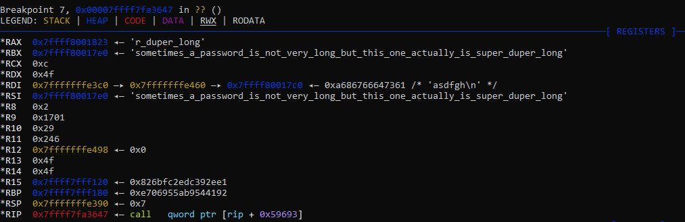

og ut kommer passordet.

```
root@f5ed25202d37:/ctf/work# ./rust_hard
Enter password: sometimes_a_password_is_not_very_long_but_this_one_actually_is_super_duper_long
Flag: etj{i_did_not_know_rust_did_dynamic_dispatch_with_such_weird_vftable_placement}
```


### 3.4 Utfordringer umulig

#### 3.4.8_transfer.root

I Transfer-oppgaven, så kan man ved å identifisere alle datatypene se at de inkluderer

- SetFilename(str)
- ChangeDirectory(str)
- ReadFile()
- WriteFile(str)
- ListDir()

Hvor de funksjonene som ikke tar parametere opererer på filnavn eller directory som er satt. Vi kan altså finne og lese filer andre steder enn i `/tmp/transfer`, og lese ut f.eks. `/root/FLAG` som gir noen bonuspoeng. Det er derimot noen begrensninger på lese-funksjonen, enten i lengde på data eller for string-representasjonen. Det var ikke mulig å lese ut `transfer`-binary, som et eksempel.