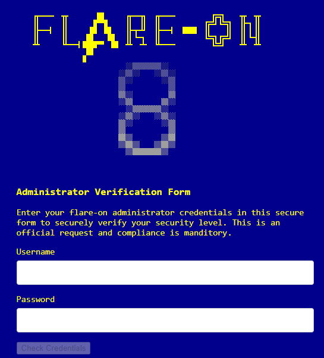
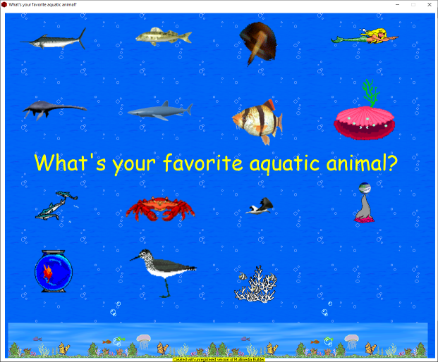
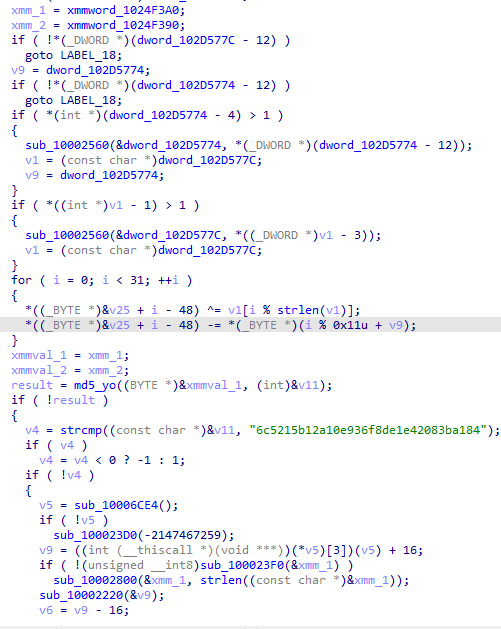
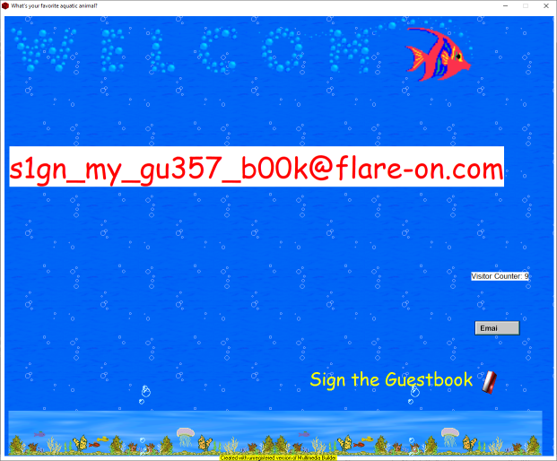
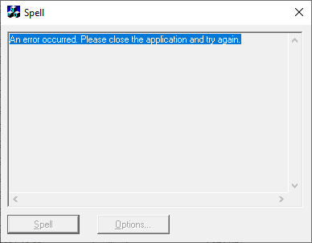
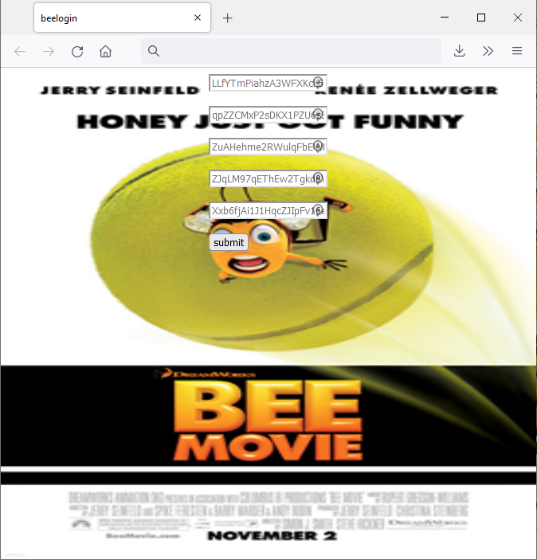

# Flare-On Challenge 8


Bla bla 

## 01 - Credchecker

```
Welcome to Flare-On 8! This challenge surves as your tutorial mission for the epic quest you are about to emark upon. Reverse engineer the Javascript code to determine the correct username and password the web page is looking for and it will show you the flag. Enter that flag here to advance to the next stage. All flags will be in the format of valid email addresses and all end with "@flare-on.com".
```





Very straight-forward "Sanity Check" challenge. The relevant code is non-obfuscated JS

```javascript
function checkCreds() {
	if (username.value == "Admin" && atob(password.value) == "goldenticket") 
	{
		var key = atob(encoded_key);
		var flag = "";
		for (let i = 0; i < key.length; i++)
		{
			flag += String.fromCharCode(key.charCodeAt(i) ^ password.value.charCodeAt(i % password.value.length))
		}
        //...
    }
```

And `atob` converts from base64 to bytes, which means the username is `Admin` and the password should be the base64 encoding of `goldenticket`, which is `Z29sZGVudGlja2V0`.


## 02 - Known

```
We need your help with a ransomware infection that tied up some of our critical files. Good luck.
```

We're given the binary "UnlockYourFiles.exe", and a bunch of files with the extension `.encrypted` appended to them. All the files are seemingly corrupted, possibly by the mentioned ransomware.

Booting up the program prints this dangerous-looking message


The "base64 blob" decodes into `(>0_0)> It's dangerous to add+ror alone! Take this <(0_0<)`, which hints to the encryption scheme being used. Reversing the binary a bit, it doesn't seem to check the decryption key at all, but will just assume it is correct and start unlocking files. The decryption routine looks like this:

```c
char __cdecl decrypt(_BYTE *data, _BYTE *key)
{
  int i; // ecx
  char result; // al

  for ( i = 0; i < 8; i++ )
  {
    result = __ROL1__(key[i] ^ data[i], i) - i;
    data[i] = result;
  }
  return result;
}
```

Where ROL1 is the bit-wise rotate left operation. The function is run on every 8-byte chunk of data from all the included files.

An easy way to recover the key, is to observe that some of the files have KNOWN plaintexts, which the name of the challenge hints to. For instance, there is a `latin_alphabet.txt.encrypted` file that takes up 26 bytes. We don't know the case of the alphabet, but the first 8 bytes are likely `ABCDEFGH`, `abcdefgh` or even `Abcdefgh`. We can quickly test all of them. Here I'm running the encryption algorithm on the known plaintext, which is decryption in reverse.

```python
alphabet = b"ABCDEFGH"
alpha = open("Files/latin_alphabet.txt.encrypted", "rb").read()
for i in range(8):
    w = (alphabet[i] + i) & 0xff
    w = rotr(w, i)
    print(chr(w ^ alpha[i]), end="")
```

and it prints out `No1Trust`. Entering this key as input into `UnlockYourFiles.exe` decrypts all the files for us, and the contents of `critical_data.txt` contains the flag:

`(>0_0)> You_Have_Awakened_Me_Too_Soon_EXE@flare-on.com <(0_0<)`

## 03 - Antioch

```
To solve this challenge, you'll need to ...AAARGH
```

This challenge features 31 Docker layers, and some metadata about the top layer. The information about the order of the bottom layers are either lost or removed. The top layer contains the ELF `AntiochOS`, a binary that provides you with a very poorly documented command prompt. The remaining layers contain some subset of the files `a.dat`, `b.dat`, ..., `z.dat` which are mostly filled with random-looking data, except for a very few files that are duplicates. Every Docker layer has some json data included, which includes metadata like architecture and author, but all of them seem to be dangling layers with no references anywhere.

Reversing the binary, it hides more commands than just "help" and "quit", and both are important. The first one is `consult`, which creates a buffer of size 4096, then tries to open up files named `X.dat` where X is a letter from a-z, in order. Non-existing files are ignored. For each file, it reads the contents and XORs it with the current buffer. In the end, the buffer contains the combined XOR of every `[a-z].dat` file in the current directory. Finally, the function iterates over the buffer and runs every byte through a lookup table, to map it to a character before outputing it. This lookup is essentially

```
V',`)(//\\\\\\||||||||||||_______________
```

where any bytes that fall outside this string becomes `.`, and every 16th character always becomes a newline. In short, the `consult` function is taking a bunch of dat files and converting them to something printable. Extracting a few of the Docker layers that contain these files, then running `consult`, gives just garbage output, with mostly dot symbols.

The second undocumented function, is `approach`, which asks you for a name. If you type a valid name, it will ask you for a quest, and finally your favorite color. All in line with the segment from "Monty Python and the Holy Grail (1975)". The check for the name is calculating the CRC32 of the input, using a poly8 lookup table, and then iterating through a list of hardcoded CRC pairs.

```c
  v2 = read_input();
  name_crc = do_crc32(buf, v2);
  cur = crc_list;
  cur_crc = 0xB59395A9;                         // CRC of "Bridge Keeper\n"
  while ( cur_crc != name_crc )
  {
    i = (unsigned int)(i + 1);
    if ( (_DWORD)i == 0x1E )
      return print(1u, "...AAARGH\n\n", 11LL);
    cur_crc = cur->name_crc;
    ++cur;
  }
  get_quest_string(s_buf);
  print(1u, s_buf, 20LL);
  if ( read_input() > 1 )
  {
    get_fav_color_string(s_buf);
    print(1u, s_buf, 29LL);
    input_color = read_input();
    calc_color_crc = do_crc32(buf, input_color);
//...
```

Notice how the quest string is ignored entirely, and as long as the input is more than just a newline, it is accepted. In each pair, the first CRC is the name, and the second is the color. Once you enter a valid name, quest and color, you are rewarded with the message `Right. Off you go. #`, where `#` is the index of the CRC pair, e.g. "3". Valid names for the CRCs seem to be names from the other Docker layer metadata files, namely the `author` field of them. Thus, "King Arthur" is a valid name, and so is "Dragon of Angnor". The colors are not found anywhere in particular, but in the end they aren't important either. For the curious, one of the colors, that weren't easily found in any color lists, was "Transparent". Also, all the CRCs are calculated **with the newline**.

Now, the final part of this challenge took quite a logic jump to piece together. But if we remember the Docker layers and the `consult` command; the only way to print something like a flag, is by having some specific constellation of dat files, such that `consult` ends up picking files that XOR together in a good combination. 

The final understanding is to map the author in every metadata file to the index of every CRC pair in the list. If we enter "Miss Islington" as the name, and "Brown" as the color, then the binary will tell us that is the first CRC pair, and thus also the first Docker layer. Miss Islington is found in the folder `b75ea3e81881c5d36261f64d467c7eb87cd694c85dd15df946601330f36763a4`, so that one is the first layer to extract. Continue with this for all of the 30 authors, overwriting as we go, and finally run consult.

```
....______.....
...|..____|....
...|.|__.......
...|..__|......
...|.|.........
...|_|.........
...............
...............
...._..........
...(_).........
...._..........
...|.|.........
...|.|.........
...|_|.........
...............
...............
...............
...............
...__...__.....
...\.\././.....
....\.V./......
.....\_/.......
...............

```

The final flag is `Five-Is-Right-Out@flare-on.com`


## 04 - Myaquaticlife

```
What would Flare-On do without a healthy amount of nostalgia for the abraisive simplicity of 1990's UI design? Probably do more actual work and less writing fun challenges like this.
```

We're greeted with `myaquaticlife.exe` that presents us with this animated program.



On the bottom it says "Created with unregistered version of Multimedia Builder", so that's a nice place to start researching. Multimedia Builder seems to be discontinued, as it so easily allowed malware to be included, that all their applications were often detected by some antivirus programs. The program is available for download in the Wayback Machine though. The scripts in [MMUnbilder](https://github.com/qprotex/MMUnbuilder) can also be used to extract the `.mbd` file from the challenge, to be opened up in Multimedia Builder. From there, it is easy to extract and inspect the internal components, and deduce what each button is doing. However, among the various GIF and HTML components, there is a `fathom.dll` plugin that sticks out.

The buttons inside the program, are defined by HTML to run a script function

```html
...
    <a href="script:Script1"></a>
    <a href="script:Script2"></a>
    <a href="script:Script3"></a>
...
```

where each script is defined like

```
Script1  part1$='derelict:MZZWP'
Script2  part2$='lagan:BAJkR'
Script3  part2$='flotsam:DFWEyEW'
Script4  part1$='flotsam:PXopvM'
...
```

Once we click the yellow text field, which is actually a button, Script17 is executed:

```
PluginRun("PlugIn","PluginFunc19")
PluginGet("PlugIn","var1$")
NextPage()
LoadVariable("visitors","count")
count = count + 1
SaveVariable("visitors","count")
vc$='Visitor Counter: ' + CHAR(count)
CreateText("mytext","visitlabel$,1050,580,yippy")
LoadText("visitlabel$","vc$")
colr$='TEXTCOLOR=255,0,0'
SetObjectParam("outlabel$","colr$")
SetObjectParam("outlabel$","FONTNAME=Comic Sans MS")
SetObjectParam("outlabel$","FONTSIZE=24")
colors$[1] = '255,0,0'
colors$[2] = '0,255,0'
colors$[3] = '0,0,255'
colors$[4] = '255,0,0'
colors$[5] = '0,255,0'
colors$[6] = '0,0,255'
colors$[7] = '255,0,0'
colors$[8] = '0,255,0'
colors$[9] = '0,0,255'
colors$[10] = '255,0,0'
colors$[11] = '0,255,0'
colors$[12] = '0,0,255'
colors$[13] = '255,0,0'
colors$[14] = '0,255,0'
colors$[15] = '0,0,255'
For Loop= 1 To 1000
  For Counter= 1 To 15
    CreateText("mytext","outlabel$,20,100 + 50 * Counter,yippy")
    LoadText("outlabel$","var1$")
    colr$='TEXTCOLOR='+colors$[Counter]
    SetObjectParam("outlabel$","colr$")
    SetObjectParam("outlabel$","FONTNAME=Comic Sans MS")
    SetObjectParam("outlabel$","FONTSIZE=48")
    Pause("1000")
    DeleteObject("outlabel$")
  Next Counter
Next Loop
```

And this ends up calling the named export `PluginFunc19` inside `fathom.dll`. That function reads the various part1-4 strings and strip off the start of them. `jetsam:SLdkv` becomes `SLdkv`, for instance. From there, it combines the remaining parts into longer strings.



After building two such keys, it takes the encrypted flag (xmmwords at 1024F3A0 and 1024F390), then XORs it with bytes from one key, and subtracts from the other key. Due to the wrapping logic, it also becomes clear that the second key is likely to be exactly 0x11 bytes. If the decrypted flag MD5-hashes into `6c5215b12a10e936f8de1e42083ba184`, then it's correct, and it is printed in the second screen.

When clicking certain buttons and debugging a bit, it starts to feel like that the 0x11 long key comes from "jetsam"-prefixed keys, of which there are only 3

```
Script11 part1$='jetsam:SLdkv'
Script7  part2$='jetsam:newaui'
Script10 part3$='jetsam:HwdwAZ'
```

and the second key comes from "flotsam"-prefixed keys, where the same is also true.

```
Script4  part1$='flotsam:PXopvM'
Script3  part2$='flotsam:DFWEyEW'
Script13 part3$='flotsam:BGgsuhn'
```

We can brute-force these combinations very quickly. Start with the encrypted flag, `9625a4a9a3969a909fafe538f9819e16f9cbe4a4878f8fbad29da7d1fca3a800`, then XOR it with each of the two key guesses until the final string (sans final nullbytes) hashes to `6c5215b12a10e936f8de1e42083ba184`. A few seconds later, and the strings `SLdkvnewauiHwdwAZ` and `PXopvMDFWEyEWBGgsuhn` pop out. By this point we also got the flag, but let's do it "The Right Way (tm)".

The scripts and clickable GIFS are matched such that the first GIF calls Script1, the second calls Script2, and the last GIF calls Script16, meaning the correct order is:

```
(line, row)
(3, 3)
(2, 3)
(3, 2)
(1, 4)
(1, 3)
(4, 1)
```

Which produces the strings "SLdkvnewauiHwdwAZ" and "PXopvMDFWEyEWBGgsuhn" used as keys to decrypt the flag.



`s1gn_my_gu357_b00k@flare-on.com`


## 05 - FLARE Linux VM

```
Because of your superior performance throughout the FLARE-ON 8 Challenge, the FLARE team has invited you to their office to hand you a special prize! Ooh – a special prize from FLARE ? What could it be? You are led by a strong bald man with a strange sense of humor into a very nice conference room with very thick LED dimming glass. As you overhear him mumbling about a party and its shopping list you notice a sleek surveillance camera. The door locks shut!

Excited, you are now waiting in a conference room with an old and odd looking computer on the table. The door is closed with a digital lock with a full keyboard on it.

Now you realise… The prize was a trap! They love escape rooms and have locked you up in the office to make you test out their latest and greatest escape room technology. The only way out is the door – but it locked and it appears you have to enter a special code to get out. You notice the glyph for U+2691 on it. You turn you attention to the Linux computer - it seems to have been infected by some sort of malware that has encrypted everything in the documents directory, including any potential clues.

Escape the FLARE Linux VM to get the flag - hopefully it will be enough to find your way out.

Hints:

    You can import "FLARE Linux VM.ovf" with both VMWare and VirtualBox.
    Log in as 'root' using the password 'flare'
    If you use VirtualBox and want to use ssh, you may need to enable port forwarding. The following link explains how to do it: https://nsrc.org/workshops/2014/btnog/raw-attachment/wiki/Track2Agenda/ex-virtualbox-portforward-ssh.htm
```

Challenge 5 gives us a VirtualBox image, consisting of a `.vmdk` file system and `.ovf`/`.mf` configuration and meta data files. We have full root access to the image, so the goal is not to privesc or necessarily find something locked behind permissions, or this could be solved by simply dumping the memory and searching through it.

Looking through running processes, command history, recently changed files, environment and all that jazz reveals a few interesting things:

- There is a binary at `/usr/bin/dot` that asks for a password.
- The command `FLARE` is aliased to `echo "The 13th byte of the password is 0x35"`
- Some ENV settings `NUMBER1=2`, `NUMBER2=3` and `NUMBER3=37`
- A `Documents` folder with files like `banana_chips.txt.broken` which seem encrypted
- Cron runs `zyppe` regularly.

To make sense of all these, let's look at `zyppe` first. The binary is a simple C++ application

```c++
int __cdecl main(int argc, const char **argv, const char **envp)
{
  char *v3; // rax
  const char *v4; // rsi
  const char *v5; // rax
  __int64 v6; // rdx
  __int64 v7; // rax
  unsigned int v9; // eax
  unsigned int v10; // ebx
  const char *v11; // rax
  __int64 v12; // rax
  __int64 v13; // rax
  char v15[32]; // [rsp+0h] [rbp-510h] BYREF
  char v16[32]; // [rsp+20h] [rbp-4F0h] BYREF
  char v17[32]; // [rsp+40h] [rbp-4D0h] BYREF
  char v18[512]; // [rsp+60h] [rbp-4B0h] BYREF
  char v19[528]; // [rsp+260h] [rbp-2B0h] BYREF
  char v20[46]; // [rsp+470h] [rbp-A0h] BYREF
  char v21; // [rsp+49Eh] [rbp-72h] BYREF
  char v22; // [rsp+49Fh] [rbp-71h] BYREF
  char v23[32]; // [rsp+4A0h] [rbp-70h] BYREF
  char v24[40]; // [rsp+4C0h] [rbp-50h] BYREF
  char *v25; // [rsp+4E8h] [rbp-28h]
  struct dirent *v26; // [rsp+4F0h] [rbp-20h]
  DIR *dirp; // [rsp+4F8h] [rbp-18h]

  std::allocator<char>::allocator(&v21, argv, envp);
  v3 = getenv("HOME");
  std::__cxx11::basic_string<char,std::char_traits<char>,std::allocator<char>>::basic_string(v20, v3, &v21);
  std::allocator<char>::~allocator(&v21);
  v4 = "/Documents";
  std::__cxx11::basic_string<char,std::char_traits<char>,std::allocator<char>>::operator+=(v20, "/Documents");
  v5 = (const char *)std::__cxx11::basic_string<char,std::char_traits<char>,std::allocator<char>>::c_str(v20);
  dirp = opendir(v5);
  if ( dirp )
  {
    while ( 1 )
    {
      v26 = readdir(dirp);
      if ( !v26 )
        break;
      std::allocator<char>::allocator(&v22, v4, v6);
      std::__cxx11::basic_string<char,std::char_traits<char>,std::allocator<char>>::basic_string(v15, v26->d_name, &v22);
      std::allocator<char>::~allocator(&v22);
      v7 = std::__cxx11::basic_string<char,std::char_traits<char>,std::allocator<char>>::find_last_of(v15, ".", -1LL);
      std::__cxx11::basic_string<char,std::char_traits<char>,std::allocator<char>>::substr(v16, v15, v7 + 1, -1LL);
      v4 = ".";
      if ( !(unsigned __int8)std::operator==<char>(v15, ".") )
      {
        v4 = "..";
        if ( !(unsigned __int8)std::operator==<char>(v15, "..") )
        {
          v4 = "broken";
          if ( !(unsigned __int8)std::operator==<char>(v16, "broken") )
          {
            std::operator+<char>(v23, v20, "/");
            std::operator+<char>(v17, v23, v15);
            std::__cxx11::basic_string<char,std::char_traits<char>,std::allocator<char>>::~basic_string(v23);
            std::ifstream::basic_ifstream(v19);
            v9 = std::operator|(8LL, 4LL);
            std::ifstream::open(v19, v17, v9);
            std::ofstream::basic_ofstream(v18);
            v10 = std::operator|(16LL, 4LL);
            std::operator+<char>(v24, v17, ".broken");
            std::ofstream::open(v18, v24, v10);
            std::__cxx11::basic_string<char,std::char_traits<char>,std::allocator<char>>::~basic_string(v24);
            v25 = (char *)operator new[](0x400uLL);
            std::istream::read((std::istream *)v19, v25, 1024LL);
            encrypt(v25);
            std::ostream::write((std::ostream *)v18, v25, 1024LL);
            std::ifstream::close(v19);
            std::ofstream::close(v18);
            v11 = (const char *)std::__cxx11::basic_string<char,std::char_traits<char>,std::allocator<char>>::c_str(v17);
            remove(v11);
            v12 = std::operator<<<char>(&std::cout, v15);
            v13 = std::operator<<<std::char_traits<char>>(v12, " is now a secret");
            v4 = (const char *)&std::endl<char,std::char_traits<char>>;
            std::ostream::operator<<(v13, &std::endl<char,std::char_traits<char>>);
            std::ofstream::~ofstream(v18);
            std::ifstream::~ifstream(v19);
            std::__cxx11::basic_string<char,std::char_traits<char>,std::allocator<char>>::~basic_string(v17);
          }
        }
      }
      std::__cxx11::basic_string<char,std::char_traits<char>,std::allocator<char>>::~basic_string(v16);
      std::__cxx11::basic_string<char,std::char_traits<char>,std::allocator<char>>::~basic_string(v15);
    }
    closedir(dirp);
  }
  std::__cxx11::basic_string<char,std::char_traits<char>,std::allocator<char>>::~basic_string(v20);
  return 0;
}
```

It checks all the files in `$HOME/Documents`, except `.` and `..` and tries to determine if they end with `.broken` or not. If they don't, they are encrypted and deleted. The file will also be truncated or extended to exactly 1024 bytes.

Encryption looks like this

```c++
__int64 __fastcall encrypt(char *a1)
{
  __int64 result; // rax
  int v2[256]; // [rsp+8h] [rbp-460h]
  char v3[60]; // [rsp+408h] [rbp-60h] BYREF
  unsigned int v4; // [rsp+444h] [rbp-24h]
  int v5; // [rsp+448h] [rbp-20h]
  int v6; // [rsp+44Ch] [rbp-1Ch]
  int k; // [rsp+450h] [rbp-18h]
  unsigned int v8; // [rsp+454h] [rbp-14h]
  int v9; // [rsp+458h] [rbp-10h]
  int j; // [rsp+45Ch] [rbp-Ch]
  int v11; // [rsp+460h] [rbp-8h]
  int i; // [rsp+464h] [rbp-4h]

  strcpy(v3, "A secret is no longer a secret once someone knows it");
  result = 'emos ecn';
  for ( i = 0; i <= 255; ++i )
  {
    result = i;
    v2[i] = i;
  }
  v11 = 0;
  for ( j = 0; j <= 255; ++j )
  {
    v11 = (v2[j] + v11 + v3[j % 52]) % 256;
    v6 = v2[j];
    v2[j] = v2[v11];
    result = v11;
    v2[v11] = v6;
  }
  v9 = 0;
  v11 = 0;
  v8 = 0;
  for ( k = 0; k <= 1023; ++k )
  {
    v9 = (v9 + 1) % 256;
    v11 = (v11 + v2[v9]) % 256;
    v5 = v2[v9];
    v2[v9] = v2[v11];
    v2[v11] = v5;
    v4 = v2[(v2[v11] + v2[v9]) % 256];
    a1[k] ^= v4 ^ v8;
    result = v4;
    v8 = v4;
  }
  return result;
}
```

This algorithm is very close to that of RC4, except that it does `a1[k] ^= v4 ^ v8` instead of `a1[k] ^= v4` in the actual encryption step, which ends up XORing `output[i]` with `keystream[i]` and `keystream[i-1]`, where `keystream[-1]` is initialized as 0. Whatever, the keystream will be the same for all files, so the easiest way to solve this is to just create a new document containing a known plaintext and manually run `zyppe`. Now we have a file that contains the keystream, after XORing away the known plaintext. This can be used to decrypt all the other files.

Now we have a brief look at `dot`, which is an even shorter C++ binary. It asks for an input, hashes it with sha256, and checks if the result is `b3c20caa9a1a82add9503e0eac43f741793d2031eb1c6e830274ed5ea36238bf`. If it is, the flag is created by transforming the input, by reversing the input string and subtracting 1 from every character. Since the `FLARE` command giving us the **13th** byte of the password, it's unreasonable to brute-force the entire password, simply due to length.

Next up follows a few "beginner CTF"-level ciphers to solve, and it helps having seen these before, in case the hints aren't making much sense. Here is a rough breakdown of how I think the order is meant to be:

```
udon_noddles.txt.broken b'"ugali", "unagi" and "udon noodles" are delicious. What a coincidence that all of them start by "u"!\n'

ugali.txt.broken b'Ugali with Sausages or Spaghetti is tasty. It doesn\xe2\x80\x99t matter if you rotate it left or right, it is still tasty! You should try to come up with a great recipe using CyberChef.\n'

unagi.txt.broken b'The 1st byte of the password is 0x45\n'
```

All these were plaintext, and gives us another byte of the password, hints to starting letter being important, and that rotating left and right is something that we should consider.

```
shopping_list.txt.broken
/
[U]don noodles
[S]trawberries
[R]eese's
/
[B]anana chips
[I]ce Cream
[N]atillas
/
[D]onuts
[O]melettes
[T]acos

sausages.txt.broken
The 2st byte of the password is 0x34

spaghetti.txt.broken
In the FLARE language "spaghetti" is "c3BhZ2hldHRp".

strawberries.txt.broken
In the FLARE team we like to speak in code. You should learn our language, otherwise you want be able to speak with us when you escape (if you manage to escape!). For example, instead of "strawberries" we say "c3RyYXdiZXJyaWVz".
```

The first file is in plaintext, and hints to `/USR/BIN/DOT`, the binary used to check the password. The other three have been bitwise rotated right 1 time, so we rotate them back. Two hint to base64, and one gives us another byte of the password.

```
raisins.txt.broken
The 3rd byte of the password is.. it is a joke, we don't like raisins!

rasberries.txt.broken
The 3rd byte of the password is: 0x51

reeses.txt.broken
We LOVE "Reese's", they are great for everything! They are amazing in ice-cream and they even work as a key for XOR encoding.
```

Files starting with "R" were all encoded with base64. Another password byte, and a hint about the XOR key `Reese's`.

```
backberries.txt.broken
"If you are not good in maths, the only thing that can save you is to be a bash expert. Otherwise you will be locked here forever HA HA HA!"

banana_chips.txt.broken
'Are you good at maths? We love maths at FLARE! We use this formula a lot to decode bytes: "ENCODED_BYTE + 27 + NUMBER1 * NUMBER2 - NUMBER3"'

blue_cheese.txt.broken
The 4th byte of the password is: 0x35
```

"B" files are decrypted by XORing with `Reese's`, which reveals yet another password byte and another hint at a cipher. We know the numbers already from the environment, so the formula evaluates to `ENCODED_BYTE - 4`. 

```
iced_coffee.txt.broken
"The only problem with RC4 is that you need a key. The FLARE team normally uses this number: "SREFBE" (as an UTF-8 string). If you have no idea what that means, you should give up and bake some muffins.\n"
SREFBE > 493513

ice_cream.txt.broken
If this challenge is too difficult and you want to give up or just in case you got hungry, what about baking some muffins? Try this recipe:
0 - Cinnamon
1 - Butter 150gr
2 - Lemon 1/2
3 - Eggs 3
4 - Sugar 150gr
5 - Flour 250gr
6 - Milk 30gr
7 - Icing sugar 10gr
8 - Apple 100gr
9 - Raspberries 100gr

Mix 0 to 9 and bake for 30 minutes at 180°C.

instant_noodles.txt.broken
'The 5th byte of the password is: 0xMS\n'  Milk=6 Sugar=4 -> The 5th byte of the password is: 0x64
```

"I" files are decrypted by subtracting 4 to each byte, like mentioned in the previous clue. We get another password byte and an RC4 key, but we need to look up the ingredients in `ice_cream.txt` to figure out what each of them mean, because it says it should be a number.

```
nachos.txt.broken
In the FLARE team we really like Felix Delastelle algorithms, specially the one which combines the Polybius square with transposition, and uses fractionation to achieve diffusion.

natillas.txt.broken
"Do you know natillas? In Spain, this term refers to a custard dish made with milk and KEYWORD, similar to other European creams as cr\xe8me anglaise. In Colombia, the delicacy does not include KEYWORD, and is called natilla.\n'"
KEYWORD = eggs

nutella.txt.broken
The 6th byte of the password is: 0x36
```

"N" files are decrypted with RC4, using the key `493513` which we just learned. Now we're told about an algorithm made by Felix Delastelle, and given a hint that the key should be the ingredient that differentiates natilla from natillas. Delastelle is known for `bifid` and the ingredient is `eggs`.

```
donuts.txt.broken
Did you know that Giovan Battista Bellaso loved microwaves?

dumplings.txt.broken
Are you missing something? You should search for it better! It's hidden, but not really.

.daiquiris.txt.broken
The 7th byte of the password is: 0x66
```

One of the "D" files were hidden, but all of them decrypted properly using bifid with the key "eggs". Now they mention "Giovan Battista Bellaso", known for creating the Vigenère cipher. Since bifid doesn't touch numbers, it was possible to get this flag byte for free.

```
oats.txt.broken
You should follow the FLARE team in Twitter. They post a bunch of interesting stuff and have great conversation on Twitter!
https://twitter.com/anamma_06
https://twitter.com/MalwareMechanic

omelettes.txt.broken
You should follow the FLARE team in Twitter. Otherwise they may get angry and not let you leave even if you get the flag.
https://twitter.com/anamma_06
https://twitter.com/osardar1
https://twitter.com/MalwareMechanic

oranges.txt.broken
The 8th byte of the password is: 0x60
```

Finally, the "O" files decrypt using Vigenère and the key `microwaves` and we have more than enough bytes of the password to brute-force the remaining.

There is also the files starting with "T", which seem to be hexadecimal data. I was not able to decrypt these, but apparently there is some AES key hidden in one of the Twitter accounts, though I was not able to find it.

```bash
localhost:~ # /usr/bin/dot
Password: E4Q5d6f`s4lD5I
Correct password!
Flag: H4Ck3r_e5c4P3D@flare-on.com
```


## 06 - PetTheKitty

```
Hello,

Recently we experienced an attack against our super secure MEOW-5000 network. Forensic analysis discovered evidence of the files PurrMachine.exe and PetTheKitty.jpg; however, these files were ultimately unrecoverable. We suspect PurrMachine.exe to be a downloader and do not know what role PetTheKitty.jpg plays (likely a second-stage payload). Our incident responders were able to recover malicious traffic from the infected machine. Please analyze the PCAP file and extract additional artifacts.

Looking forward to your analysis, ~Meow
```

Only the file `IR_PURRMACHINE.pcapng` is given here. Inside it, there is a few DNS requests for `🐈😸😻😹😺🐱😼🙀😿😾😽😻.flare-on.com` and `😺😸😹😻😼😽🙀😿😾🐱🐈.flare-on.com` but mostly traffic going to port 7331 and 1337 on some machine.

The first request is

```
00000000  4d 45 30 57 32 00 00 00  32 00 00 00 7e 6d 65 6f   ME0W2... 2...~meo
00000010  77 7e 20 28 3d 5e 2e 5e  3d 29 20 7e 6d 65 6f 77   w~ (=^.^ =) ~meow
00000020  7e 2e 2e 2e 2e 20 63 61  6e 20 68 61 7a 20 4d 65   ~.... ca n haz Me
00000030  65 6f 6f 6f 77 77 77 4d  65 6d 65 3f 3f 3f         eooowwwM eme???
```

Where an image file is sent back.

Next it sends

```
0000003E  4d 45 30 57 38 00 00 00  38 00 00 00 7e 6d 65 6f   ME0W8... 8...~meo
0000004E  77 7e 20 28 3d 5e 2e 5e  3d 29 20 7e 6d 65 6f 77   w~ (=^.^ =) ~meow
0000005E  7e 2e 2e 2e 2e 20 63 61  6e 20 68 61 7a 20 4d 65   ~.... ca n haz Me
0000006E  65 65 65 65 6f 6f 6f 6f  6f 77 77 57 61 72 65 3f   eeeeoooo owwWare?
0000007E  3f 3f 3f 3f                                        ????
```

and now the response is like

```
    000A24DC  4d 45 30 57 b1 29 00 00  b1 29 00 00 50 41 33 30   ME0W.).. .)..PA30
    000A24EC  c0 be 42 02 77 a0 d7 01  18 23 80 00 f2 15 21 00   ..B.w... .#....!.
    000A24FC  01 98 99 02 a4 40 68 12  45 48 15 82 c5 bb 22 9a   .....@h. EH....".
    000A250C  21 02 00 20 a8 b2 a3 3a  5b 00 a0 42 c3 dd 54 04   !.. ...: [..B..T.
    000A251C  db cc 36 b3 99 dd 6f f6  99 0f fa db e2 b6 fb ee   ..6...o. ........
    000A252C  83 ba 6d b6 b9 0f e1 e1  63 66 ba 6f ee b3 4d 6d   ..m..... cf.o..Mm
....
```

Then the connection is closed. A new connection is opened on port 1337, and now the communication consists entirely of messages that look like the last response, and are rather short.


By studying the initial message a bit, we can deduce a few things about the messages. They start with `ME0W` followed by a size field (4 bytes) and a second size field (4 bytes) and finally the data. For the initial messages, the two size fields are equal, but in some later messages they differ, and there's no clear pattern. The second size field is the length of the actual data being transmitted, and the first we need to figure out. The first field is still a mystery.

Now we have a cat picture, and lots of strange, short messages. All of the data payloads seem to start with `PA30` though, and file signature databases will quickly tell us that this is `Windows Update Binary Delta Compression`. The algorithm is proprietary and not very well documented, but Windows provides tools and APIs to apply these types of patches to any file. It has also been seen in some CTF challenges earlier.

After trying a few things, I finally manage to apply one of the messages as a patch onto the image that was originally sent. I used the script from [this article](https://wumb0.in/extracting-and-diffing-ms-patches-in-2020.html) to apply all the patches.

Applying the first patch onto the image, transforms the cat image into a DLL file (!). Reversing it reveals a very bare-bones RAT which receives commands and runs the command through `cmd.exe`. The data is encrypted using the repeating XOR key `"meoow"`.

When applying the remaining patches, they seem to only change the first few bytes of the file. And end up overwriting each other. But what makes more sense now, is to apply them 1 by 1, and use the first - unknown - length field to figure out how many bytes that are valid post-patch. Putting it all together:

```python
import struct
import subprocess

def bxor(s1: bytes, s2: bytes) -> bytes:
    return b''.join(bytes([a ^ b]) for a,b in zip(s1,s2))

ix = 0
def write_patch(data):
    global ix
    with open(f"patches/{ix}.p", "wb") as fdp:
        fdp.write(data)
    ix += 1

with open("stream1.bin", "rb") as fd: # "tcp.stream eq 1"
        while (hdr := fd.read(4)):
            assert hdr == b'ME0W'
            sz1 = struct.unpack("<I", fd.read(4))[0]
            sz2 = struct.unpack("<I", fd.read(4))[0]
            data = fd.read(sz2)
            assert data[0:4] == b"PA30"
            write_patch(data)
            wat = struct.unpack("<I", data[4:8])[0]
            #assert data[8:20] == bytes.fromhex("77a0d7011823c0b29f0b0101")
            subprocess.run(["python", "delta_patch.py", "-i", "init.p", "-o", "tmp", f"patches\\{ix-1}.p"])
            enc = open("tmp","rb").read()
            dec = bxor(enc, b"meoow"*len(enc))[:sz1]
            print(dec.decode())
```

where "init.p" is the entire, unmodified image sent in the first transmission.

The output from this is huge, but a bit funny. It shows a hacker trying to find the flag file inside a sea of memes and trolls. But in the middle of the "Never Gonna Give You Up" lyrics, we find the flag `1m_H3rE_Liv3_1m_n0t_a_C4t@flare-on.com`.


## 07 - Spel

```
Pro-tip: start disassembling this one then take a nice long break, you've earned it kid.
```


Here we get the single binary "spel.exe", which immediately throws an error when started. Browsing through the forms with Resource Hacker shows that there is a fleshed out program hidden in there somewhere, but reversing shows that it will always throw this error.




Whenever it is closed, something interesting happens: VirtualAlloc is called, some code is injected, then run. `NtDelayExecution` is called with a timeout of 360 seconds. After this, nothing interesting actually happens, but through some reversing effort, another path of the executable starts working if the binary is called `Spell.EXE`. It now implements some C2 communication, talking to `inactive.flare-on.com:888` and receiving data. The C2 loop contains 3 choices, where `exe` and `run` accept shellcode and the third option (`flare-on.com`) exits the loop and does something extra.

By hosting a fake C2 at the given hostname and port, which just responds with `"flare-on.com"` when the program connects, something interesting happens. The program reads an embedded file `PNG128.png` which has a bogus chunk type embedded that fails the CRC check (but the length is OK). This section is extracted. The MD5sum of the empty string (`d41d8cd98f00b204e9800998ecf8427e`) is used as an AES key to decrypt the first 32 bytes of the PNG128 section. This produces a perfectly padded string: `l3rlcps_7r_vb33eehskc3`, which is later indexed into from the function at `sub_180002730`.

```c
      case 0u:
        v17.m128i_i8[0]  ^= a1[436];
        break;
      case 1u:
        v17.m128i_i8[1]  ^= a1[437];
        break;
      case 2u:
        v17.m128i_i8[2]  ^= a1[430];
        break;
      case 3u:
...
```

where a1 is some huge context struct that contains all the metadata so far. Assuming the lowest of these numbers map to index 0 of the flag, and we can write a decryption routine for it.

```python
from Crypto.Cipher import AES
from Crypto.Util.Padding import unpad

iv = bytes([0x80]*16)

# From PNG128 section
cipher = bytes.fromhex("D7FB7E628DAB8765CD7185CE530F5A8C2D8A4537124B791D40DA768626D3D37217")[:32]

# From XORing
key = b'd41d8cd98f00b204e9800998ecf8427e'

scrambled_flag = unpad(AES.new(key, AES.MODE_CBC, iv).decrypt(cipher), 16)

"""
offsets from sub_180002730
      case 0u:
        v17.m128i_i8[0]  ^= a1[436];
        break;
      case 1u:
        v17.m128i_i8[1]  ^= a1[437];
        break;
      case 2u:
        v17.m128i_i8[2]  ^= a1[430];
        break;
      case 3u:
...
"""

offsets = [436,437,430,432,431,430,429,425,424,427,428,441,439,444,443,445,426,434,440,435,438,426]
offsets = [e-min(offsets) for e in offsets]
flag = bytes(scrambled_flag[offset] for offset in offsets)
print(flag)
```


The flag is also written to `Computer\HKEY_CURRENT_USER\SOFTWARE\Microsoft\Spell\0`, but not before it is XORed with `e2a4b7a7d7ac878d9b9c850dd88ee5fac3c1a806c2963`. `HKCU\Software\Microsoft\Spell` also contained some data XORed with `flare-on.com`. However, on my setup, the registry write didn't happen as expected, so it was easier to decrypt it myself.

`b3s7_sp3llcheck3r_ev3r@flare-on.com`


## 08 - Beelogin

```
You're nearly done champ, just a few more to go. we put all the hard ones at the beginning of the challenge this year so its smooth sailing from this point. Call your friends, tell 'em you won. They probably don't care. Flare-On is your only friend now.
```

The only file given here is `beelogin.html`, which includes a page that looks like this




When clicking on the submit button, a JavaScript error briefly appears in the console, and then the page refreshes - which clears the console by default. The HTML file includes a form field, an embedded image, and thousands of obfuscated functions. Most of them contain asserts or prints that match with various JQuery tests from its official repository. The code is also duplicated multiple times, and shuffled around, in order to mask the real code.

```html
<form onsubmit="Add(this)">  
<input type="Password" name="LLfYTmPiahzA3WFXKcL5BczcG1s1" id="LLfYTmPiahzA3WFXKcL5BczcG1s1" placeholder="LLfYTmPiahzA3WFXKcL5BczcG1s1"><br><br>
<input type="Password" name="qpZZCMxP2sDKX1PZU6sSMfBJA" id="qpZZCMxP2sDKX1PZU6sSMfBJA" placeholder="qpZZCMxP2sDKX1PZU6sSMfBJA"><br><br>
<input type="Password" name="ZuAHehme2RWulqFbEWBW" id="ZuAHehme2RWulqFbEWBW" placeholder="ZuAHehme2RWulqFbEWBW"><br><br>
<input type="Password" name="ZJqLM97qEThEw2Tgkd8VM5OWlcFN6hx4y2" id="ZJqLM97qEThEw2Tgkd8VM5OWlcFN6hx4y2" placeholder="ZJqLM97qEThEw2Tgkd8VM5OWlcFN6hx4y2"><br><br>
<input type="Password" name="Xxb6fjAi1J1HqcZJIpFv16eS" id="Xxb6fjAi1J1HqcZJIpFv16eS" placeholder="Xxb6fjAi1J1HqcZJIpFv16eS"><br><br>

<div><input id="submit" type="submit"></div>  
</form>
```

The various password fields are used in multiple places, where they are split on some token, assigned to a variable, and then never used again. After trying (and failing) to clean up the code a bit, I decided to just ignore the other JQuery code, and instead focus on the password fields by following them around and deleting dead-ends. Going backwards from the console error position, shows that something is being eval()'d, but it was invalid code. The active part of the code only uses the 4th password field, and the relevant pieces of code is below:

```javascript
qguBomGfcTZ6L4lRxS0TWx1IwG = xDyuf5ziRN1SvRgcaYDiFlXE3AwG.ZJqLM97qEThEw2Tgkd8VM5OWlcFN6hx4y2.value.split(';')

if(qguBomGfcTZ6L4lRxS0TWx1IwG[0].length == Ljasr99E9HLv1BBnSfEHYw)
    bNT5lGtaxYHeyHFeEdImdD12Csa7MlR = qguBomGfcTZ6L4lRxS0TWx1IwG[0].split('');
for (i=0; i < EuF8AepyhtkSXEWvNKIKZMaSHm4v.length; i++) {
    EuF8AepyhtkSXEWvNKIKZMaSHm4v[i] = (EuF8AepyhtkSXEWvNKIKZMaSHm4v[i].charCodeAt(0) + bNT5lGtaxYHeyHFeEdImdD12Csa7MlR[i % Ljasr99E9HLv1BBnSfEHYw].charCodeAt(0)) & 0xFF;
}
```

This is basically

```python
split_password4=form_object.password_4.value.split(';')
if(len(split_password4[0].length) == 64):
    key = split_password4[0]

for i in range(len(key)):
	decryption_key[i] = (decryption_key[i] + key[i % 64]) & 0xFF
```

and it modifies a certain, hard-coded key if the password length is 64. What is happening after this, is that the final key is used as an XOR key against a very long data field (after base64-decoding it), and then the result is passed to eval(). What's important to notice, is that the key that is modified is 221 bytes long. That means that the key repeats after 221 bytes, not 64 bytes like the given key, so it's not possible to combine these modifications. I spent some time pondering why the decryption in Python didn't match what I got on the JS side, until I noticed this.

What's similarly important, is that the given key is shorter than the hard-coded key. The effect of this is that byte 0 of the given key, modifies index 0, 64, 128 and 192 of the hard-coded key. It is thus possible to attack this encryption by brute-force, and get very few candidates in each position. Basically, we do

- Try every possible ASCII byte in position 0 of the 64-byte key, modifying certain indexes in the 221-byte key.
- Check every 221th byte of the output, starting from index 0, 64, 128 and 192.
- If any of them are *not* ASCII, discard the guess and continue.
- If everything is ASCII, add it to a list of candidates for that position.

```python
for c in alphabet:
    key[ix] = c
    dec = decode(DATA2, KEY2, key)
    if all(e in alphabet for e in dec[ix::len(KEY2)]) and \
       all(e in alphabet for e in dec[ix+64::len(KEY2)]) and \
       all(e in alphabet for e in dec[ix+128::len(KEY2)]):
        print(chr(c), dec[:64])
```

For many of the positions, there is only 1 choice. For others, there are 3 or 5. Through crib-dragging, I managed to recover parts of the start of the text, and Googled it. Turns out to be some quote from "The Bee Movie" as a comment:
`//Yes, but who can deny the heart that is yearning?`

The rest of the code is also lots of quotes, followed by 780k worth of JSfuck code. If I had looked at the end, instead of the beginning, this would've been a lot easier to crib-drag...

Anyhow, after decoding the obfuscated code, this is the result

```javascript
(function(qguBomGfcTZ6L4lRxS0TWx1IwG) {
    b64_data = "...";
    b64_key = "...";
    decoded_data = atob(b64_data).split('');
    length_data = decoded_data.length;
    decoded_key = atob(b64_key).split('');
    NbgNroelQqxtLGx4xr2FzHuonetRtscR2 = '87gfds8f4h4dsahfdjhkDHKHF83hNNFDHHKFBDSAKFSfsd47lmkbfjghgdfgda34'.split('');
    if (qguBomGfcTZ6L4lRxS0TWx1IwG[1].length == 64) NbgNroelQqxtLGx4xr2FzHuonetRtscR2 = qguBomGfcTZ6L4lRxS0TWx1IwG[1].split('');
    for (i = 0; i < decoded_key.length; i++) {
        decoded_key[i] = (decoded_key[i].charCodeAt(0) + NbgNroelQqxtLGx4xr2FzHuonetRtscR2[i % 64].charCodeAt(0)) & 0xFF;
    };
    for (i = 0; i < length_data; i++) {
        decoded_data[i] = (decoded_data[i].charCodeAt(0) - decoded_key[i % decoded_key.length]) & 0xFF;
    };
    decoded_data = String.fromCharCode.apply(null, decoded_data);
    if ('rFzmLyTiZ6AHlL1Q4xV7G8pW32' >= Oz9nOiwWfRL6yjIwvM4OgaZMIt0B) eval(decoded_data);
})(qguBomGfcTZ6L4lRxS0TWx1IwG);
```

Another level of the same thing! But now they're picking the 2nd part of the 4th password, after splitting by `;`. This time the hard-coded key is of a different length, but the solve code from the previous step still works. The decrypted output is also similar, with some quotes in comments, followed by lots and lots of JSfuck. Repeating what I did earlier gives the final payload

`alert("I_h4d_v1rtU411y_n0_r3h34rs4l_f0r_th4t@flare-on.com")`

which is also the flag.

To make this appear, the following string has to be entered in the 4th password field

`ChVCVYzI1dU9cVg1ukBqO2u4UGr9aVCNWHpMUuYDLmDO22cdhXq3oqp8jmKBHUWI;UQ8yjqwAkoVGm7VDdhLoDk0Q75eKKhTfXXke36UFdtKAi0etRZ3DoHPz7NxJPgHl`


## 09 - Evil

```
Mandiant's unofficial motto is "find evil and solve crime". Well here is evil but forget crime, solve challenge. Listen kid, RFCs are for fools, but for you we'll make an exception :)

The challenge has 3 false flags:
- !t_$uRe_W0u1d_B3_n1ce_huh!@flare-on.com
- 1s_tHi$_mY_f1aG@flare-on.com
- N3ver_G0nNa_g1ve_y0u_Up@flare-on.com

```


Evil is the challenge where most of my time was spent. It features the binary `evil.exe`, which is 2.8MiB and 32-bit. When opening up the binary in IDA, it fails to detect most of the functions properly. Inside a debugger, it exits early and/or produces a lot of exceptions. There's no output to be seen. Where do we even start?

### Initial analysis

The first thing to notice, is that the binary is producing a lot of exceptions on purpose. It's full of code sequences like `xor eax, eax; div eax` or `xor eax, eax; mov rdi, [eax]` which obviously crashes. The code right after these snippets is also looking very off, with seemingly strange instructions. What is happening here, is that the exception handler is catching these issues and fix them on the fly. In addition, there's some extra logic in the handler:

- The values in two of the registers are preserved during the exception, and contains two integer "hashes". The code is then using some PEB/TEB magic to iterate over every module reachable from Kernel32, and comparing these hashes.
- One hash matches the library name, another the function to execute
- The function is then executed, possibly popping a number of variables off the stack - but how many is invisible to static reverse-engineering.
- If the exception type is of a specific value, the bytecode is permanently patched to `0xD0FF` through VirtualProtecting the area writable, changing it, then write-protecting it again.
- EIP is increased by 3, which does an **unaligned jump** into the remaining instructions.

In short, the exceptions are actually calling some API calls, and this is not visible from our disassembly. We can fixup the code by replacing the exceptions with `call LibraryFunctionNamehere`, but not all of the libraries are imported by default, so this is painful to do. But some kind of call, does at least make IDA recognize the code as a function, which makes things better-looking, and the unaligned code becomes aligned.

The hashing function used to resolve looks something like

```python
def hash(bstr):
    h = 64
    for ix in range(min(len(bstr), 0x104)):
        h = bstr[ix] - 0x45523F21 * h
        h &= 0xFFFFFFFF
    return h
```

where e.g. `hash(b"AddVectoredExceptionHandler") == 0x542F881E`.


### Tracing and debugging

Trying to recover the main logic is a tedious - but steadily progressing - job. After some time, it is possible to see which APIs are called and where we should head next. The beginning of the program uses nearly every anti-debug trick in the book, with some anti-vm functions to boot. WMI is called to get a list of all the hardware, and these are hashed and compared, to make sure you're not running it in a VM. Real-Time functions are called to make sure the code isn't running under a debugger. There's quite a lot going on, and too much to really mention here. But some tricks later, and I got it running:

- Use scylla_hide to bypass anti-debug. Hit nearly every checkbox, because they're all used.
- Use the "trace over" function in x86dbg, to make the debugger ignore the exceptions happening, and jumping as you want.
- Change breakpoint type, or make sure to set breakpoints in places that are not affected by unaligned jumps after exceptions.

It's now clear that two things are required to make the program run. The first is admin permissions, due to listening on a UDP socket, which fails without it. The second is an argument on the command line, which is used inside the socket handling, and is the IP address to bind to. The program is also starting a lot of threads, which are spawning new threads, waiting for something, then repeating everything.

From debugging a short time, it becomes clear that various UDP packets from the network is picked up in one of the threads, then some comparisons happen. Multiple of the checks are on the header itself, where it checks that the destination port is 4356. But there's another check for some strange bit inside the PDU. Some research later points to the "evil bit" in the IPV4 header - which the intro text also hints to with `RFCs are for fools`. The evil bit was an April fools RFC. Once these checks are okay, some other checks happen on the data itself:

- The byte `\x01` calls a routine that decrypts a Rickroll BMP inside the binary, and shows it inside the terminal (didn't know you could!).
- `\x02` takes in some data, calculates the CRC32 of it, then appends it to a buffer.
- `\x03` calls the decryption routine for the flag, using the mentioned buffer as an RC4 key.

There are some decrypted strings inside the routine that decrypts the flag, and these are `'L0ve', 's3cret', '5Ex', 'g0d'`. Sending in these does not give the correct answer. But when I append a nullbyte to them, it suddenly works!

The flag is generated like this

```python
from Crypto.Util.number import long_to_bytes as l2b
from Crypto.Cipher import ARC4
import zlib

flag = bytes.fromhex("3238a70270dfe72bf77a77f576291ba287e4c2f953cc3f6ee89aa6820cbda4d196e87a8900c5f5")

words = [b'L0ve', b's3cret', b'5Ex', b'g0d']
rc4_k = b""
for word in words:
    rc4_k += l2b(zlib.crc32(word + b'\x00'), 4)

print(ARC4.new(rc4_k).decrypt(flag))
```

and it's possible to get the program to generate this by sending the following PDUs, while evil.exe is running and listening

```python
from scapy.all import *
import struct
import time

LOCAL_IP = "127.0.0.1"
PORT = 13337

words = [(2, b'L0ve\x00'), (2, b's3cret\x00'), (2, b'5Ex\x00'), (2, b'g0d\x00'), (3, b'MZ')]

for (type, data) in words:
    ip=IP(src=LOCAL_IP, dst=LOCAL_IP, flags=4, frag=0)
    pdu=UDP(sport=PORT, dport=4356)
    pload = struct.pack("<II", type, len(data)) + data
    send(ip/pdu/Raw(load=pload))
    time.sleep(0.1)

pkts = sniff(count=1,filter=f"udp and host {LOCAL_IP}")
print(pkts)
for pkt in pkts:
    print(pkt)
```

I was not able to actually sniff the PDUs on my local setup, but running Wireshark in the background reveals that the flag is correctly sent.

`n0_mOr3_eXcEpti0n$_p1ea$e@flare-on.com`


## 10 - Wizardcult

```
We have one final task for you. We captured some traffic of a malicious cyber-space computer hacker interacting with our web server. Honestly, I padded my resume a bunch to get this job and don't even know what a pcap file does, maybe you can figure out what's going on.
```

The final challenge only gives us `wizardcult.pcap`. The PCAP show that someone found an RCE exploit on a remote web server, and made it download the binary `induct` from `wizardcult-flare-on.com`, make it executable, and finally run it. The log also has a lot of IRC logs, which will need to be analyzed.

`induct` is a Golang binary, which contains a custom VM that runs a lot of code. My first instinct is to ignore it completely and try to figure out what it's doing by treating it as a black box - at least for the time being. Golang is hard. From the IRC logs, it's possible that the binary will try to connect through IRC, so I set up a server locally and hard-coded DNS for `wizardcult.flare-on.com` to my local IP. When I connect, I pick the name `dung3onm4st3r13` and join the channel `#dungeon` - again like the IRC log shows.

When running the binary, the bot predictably joins the server, but has a different name than in the log. I repeat all the messages sent from `dung3onm4st3r13` in the IRC log, but change the name to the actual bot name. It takes some time to paste in everything, due to message flood limits, and disabling them made the server unstable, so I let it be. After the bot finally claims that `I have now learned to brew the Potion of Acid Resistance`, I tell it to enter the dungeon, and the bot console then prints that it can't find the folder `/mages_tower`. After pasting in the second potion recipe, and sending the last message from the IRC log, I get the message `open /mages_tower/cool_wizard_meme.png: no such file or directory`. So I try to create this file, fill it with random data, and repeat the procedure. It now starts to print something like

```
PRIVMSG #dungeon :I cast Detect Magic on the Wyvern for 162d213 damage!
PRIVMSG #dungeon :I cast Sleep on the Wyvern for 208d45 damage!
PRIVMSG #dungeon :I cast Animate Dead on the Wyvern for 133d119 damage!
```

From here, I started experimenting a bit with the data contents and see how it affects the output. The first command is listing the directory contents of the folder, and is deterministic, meaning every call produces the same output (if nothing changes in the folder). This behavior is *not* present for the file exfiltration, where multiple calls to the procedure gives very different results every time. However, if I reset the bot, I get the exact same results when sending the commands again. It just isn't deterministic from call to call, like it has some kind of internal state that's not reset.

But just from prodding and poking a bit at the `listdir`-procedure, and comparing it to the image exfiltration, I learn that

- Every line contains 3 bytes of information: The spell name, the number of dice and the value of the dice.
- It's some kind of streaming cipher, without overhead, as the output length is equal to the input length. Changing a single byte in the input changes a single byte of the output.
- Repeating the same letter over and over leads to repeated outputs, but there's a period before the repeated messages start appearing.
- When the length of the image file is divisible by 24, the output is the same for repeated calls, meaning this is the period (or a multiple of it).
- If the PNG is an actual PNG, the start of the exfiltration output matches the one from the log 100% (which makes sense, since most PNGs have the same start), and this points to the key being embedded inside the binary - not randomized in any way.

From these observations, it's possible to make a lookup table for the encryption process. We don't even need to know what kind of value the spell names map to, because we can pick the plaintext ourselves and just map the words to a number.

To test out this theory, I create a file called `cool_wizard_meme.png` and fill it with `[0] * 24 + [1]*24 + [2]*24 + ... [255]*24`, and exfiltrated it. I also clean up the IRC log in the PCAP, to only include the part where the flag image is being extracted (`flagpng.txt`). The exfiltrated, known-plaintext output is collected from the log and stored as `allbytes.txt`.

```python
import re

CYCLE_LEN = 8
FLAGLEN = 52491

A = [{} for _ in range(CYCLE_LEN)]
B = [{} for _ in range(CYCLE_LEN)]
C = [{} for _ in range(CYCLE_LEN)]

lines = open(f"allbytes.txt").read().splitlines()
assert len(lines) == CYCLE_LEN * 256

for i,line in enumerate(lines):
    a, b, c = re.findall("I cast (.*) on the Wyvern for (\d+)d(\d+) damage!", line)[0]
    assert a not in A[i%CYCLE_LEN]
    assert b not in B[i%CYCLE_LEN]
    assert c not in C[i%CYCLE_LEN]
    A[i%CYCLE_LEN][a] = i//CYCLE_LEN
    B[i%CYCLE_LEN][b] = i//CYCLE_LEN
    C[i%CYCLE_LEN][c] = i//CYCLE_LEN

flag = bytearray(FLAGLEN * 3)
    
for i, line in enumerate(open("flagpng.txt").read().splitlines()):
    a, b, c = re.findall("PRIVMSG #dungeon :I cast (.*) on the Wyvern for (\d+)d(\d+) damage!", line)[0]
    flag[i*3+0] = A[i%CYCLE_LEN][a]
    flag[i*3+1] = B[i%CYCLE_LEN][b]
    flag[i*3+2] = C[i%CYCLE_LEN][c]

with open("flag.png", "wb") as fd:
    fd.write(flag)
```

This creates 3 lists with 8 lookups each; one list for each of the data holders (spell, roll, dice count). It makes sure the lookup has no duplicate values, such that a value could map to multiple inputs, and tries to decrypt the flag log using the lookups. Surprisingly, this works on the first try, and the challenge is solved in 4 hours - with no meaningful reversing completed.


`wh0_n33ds_sw0rds_wh3n_you_h4ve_m4ge_h4nd@flare-on.com`


