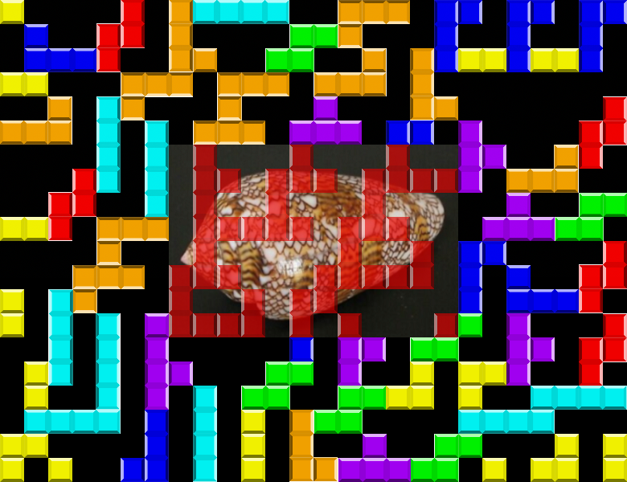

# NPST writeups


## 1. desember

### Velkommen til NPST
Vi får utdelt en link til https://login.npst.no med beskjed om å logge inn med brukernavn/passord `bruker` og `Advent2019`.
Innlogging med dette brukernavnet og passordet gir første flagg: `PST{a7966bf58e23583c9a5a4059383ff850}`.

### Velg passord
```
Gratulerer!

Nå er det på tide å bytte passord på brukeren din. Gjeldende passord policy er kjent for å være litt kranglete, så lykke til!
```

Etter innloggingen får man beskjeden "Du må endre passordet ditt". Ettersom man oppfyller kravene til passord, så får man flere og flere krav før et passord aksepteres. Kravene er som følger:

- Minst ett tegn fra hver av \[a-z\], \[A-Z\], \[0-9\] og \[*@!#%&()^~{}\]
- Tegnene skal opptre i stigende ASCII-verdi
- Summen av ASCII-verdiene modulo 128 må være lik 24.
- Passordet skal være 4 tegn.

Ettersom de oppgitte tegn-gruppene befinner seg på 4 ulike steder i ASCII-tabellen, så holder det derfor å ta et tegn fra hver av gruppene og velge bokstaven(e) slik at modulo-regelen følges. Det er mange gyldige løsninger, og for å finne en gyldig en raskt er det bare å plukke `*0` (de første fra gruppa) og velge en stor og en liten bokstav til å følge etter, helt til modulo-regelen inntreffer.

```python3
>>> sum(map(ord,"*0Oo")) % 128
24
```

Input av et gyldig passord gir flagget `PST{6a0f0731d84afa4082031e3a72354991}`.

### Passordgjenoppretting

```
En tidligere ansatt måtte slutte etter å ha endt opp på listen over slemme barn. Dessverre glemte vi å be han kopiere ut filene sine før han sluttet, og vi har følgelig ikke passordet.

Dette er det vi har av info:

    Brukernavn: admin
    ???: 42f82ae6e57626768c5f525f03085decfdc5c6fe

Klarer du å logge inn på kontoen?
```

Man må gjenkjenne at passordet her er oppgitt i et hash-format, og gjette at hashtypen er SHA-1. Mange fant kanskje passordet takket være Google-søk, men da oppgaven kom ut så var ikke denne hashen kjent for søkemotoren. Siden vi vet passord-policyen fra forrige oppgave, så er denne hashen derimot ekstremt lett å knekke, og hashcat med mask `?s?d?u?l` finner dette passordet på millisekunder: `42f82ae6e57626768c5f525f03085decfdc5c6fe:)9Fp`.

Innlogging med admin og det passordet gir flagget `PST{36044221cd3e991ffc56eb2f1e368ca0}` og et bilde som trengs i en senere oppgave.


## 3. desember - PPK

Vi blir introdusert til ENIGMA, men utfordret til å knekke en form for Penn-og-Papir Krypto (PPK). Uten noen nærmere informasjon får vi utdelt

`KNO fmwggkymyioån 30å6ø8432æå54710a9æ09a305å7z9829 fmwggkymyioån ngpoo`

Ettersom flagg-formatet er "PST{...}" og de tre første bokstavene i setningen også er store, så er det nærliggende å tenke at `KNO` skal representere `PST`. Ser man på alfabet-avstanden mellom "K" og "P", samt "N" og "S" osv. så er denne konstant, altså er det snakk om en rotering av bokstavene i alfabetet (aka. Caesar Cipher). Forskjellen her, er et `æøå` er inkludert i alfabetet. I tillegg så behandles store bokstaver for seg, og små bokstaver for seg, og tall har ikke blitt endret i det hele tatt.

```
>>> ALPHA = u"abcdefghijklmnopqrstuvwxyzæøå"
>>> c = u"KNO fmwggkymyioån 30å6ø8432æå54710a9æ09a305å7z9829 fmwggkymyioån ngpoo"
>>> ''.join([ALPHA[(ALPHA.index(e)+5)%len(ALPHA)] if e in ALPHA else e for e in c.lower()])
u'pst krøllparantes 30e6d8432ce54710f9c09f305e7b9829 krøllparantes slutt'
```

Flagget er `PST{30e6d8432ce54710f9c09f305e7b9829}`

## 5. desember - 🐒i

Dagsbriefen linker til https://npst.no/api/🙃.js med informasjon om at systemet er skrevet i nodeJS. Ingen ytterligere forklaring blir gitt. På API-siden, blir det oppgitt at man kan taste inn `?commands=🤷` for å få en oversikt over gyldig input, og dette er oppgitt til å være `✨, ⚡, 🔑, 🤷`. I tillegg får man oppgitt et "state"-array som inneholder `"[>🍕<, 🍉, 🐴, 🐟, 🚀, 🚩]"` ved oppstart. Rask fuzzing med disse viser at `🤷` alltid fører til hjelpemeldingen, `🔑` fører til at "message" blir satt, og at man ikke kan ha mer enn én `🔑`. `⚡` flytter pilene i state et hakk mot høyre, så man kan ha maksimalt 5 av disse. I tillegg så flyttes også flagget. `✨` ser derimot ut til å permutere state-arrayet. Målet ser derfor ut til å være å putte inn den riktige kombinasjonen av `✨` og `⚡` inntil pilene peker på et flagg, og så bruke `🔑` til å sette message til flagget.

Det finnes mange løsninger på denne, eksempelvis [⚡⚡⚡⚡✨🔑](https://npst.no/api/%F0%9F%99%83.js?commands=%E2%9A%A1%E2%9A%A1%E2%9A%A1%E2%9A%A1%E2%9C%A8%F0%9F%94%91) som gir flagget `PST{ba323c3f5b3f1b536461d41cc7f1ba60}`.

## 6. desember - PPKv2

Dagsbriefen er skrevet med L337-sp34k, og vi får igjen en ciphertext som ligner på den fra 3. desember.

`KNO fmw55k8m7i179 z98øyåz8æy67aåy0å6æ7aø1å1438åa5a fmw55k8m7i179 95p11`

Forskjellen denne gangen, er at tall også skal roteres i et separat alfabet, med en annen shift-kode enn teksten. Teksten er shiftet 5 ganger, som sist, mens tallene er shiftet 6 ganger.

```
>>> ALPHA = u"abcdefghijklmnopqrstuvwxyzæøå"
>>> DIGITS = "0123456789"
>>> ''.join([ALPHA[(ALPHA.index(e)+5)%len(ALPHA)] if e in ALPHA else DIGITS[(DIGITS.index(e)+6)%len(DIGITS)] if e in DIGITS else e for e in c.lower()])
u'pst krø11p4r3n735 b54daeb4ca23fea6e2c3fd7e7094ef1f krø11p4r3n735 51u77'
```

altså er flagget `PST{b54daeb4ca23fea6e2c3fd7e7094ef1f}`. Merk at denne oppgaven hadde en bug i starten, hvor en av bokstavene i den endelige hashen var feil. Siden flere av flaggene opptil det stadiet har vært MD5-hasher, så kunne man løse oppgaven tidlig ved å finne ut hva som var ødelagt ved å forsøke å gjette lignende hasher. Det finnes også nettsider som gjør dette automatisk, og f.eks. CrackStation oppga at de fant en delvis match med MD5-hashen for `jul1u5` (Første PPK hadde md5('julius') som flagg). Ved å simpelthen hashe `jul1u5` med MD5 og sette denne i flagg-formatet, så var det mulig å løse oppgaven før den ble fikset.

## 7. desember

### Nissens Verksted
Oppgitt URL er `https://verksted.npst.no/`, med beskjed om å finne et flagg. Nettsiden er en enkel JS-basert nettside som lazy-loader tusenvis av emoji-bilder, hvor det er et snevert utvalg av emojier som går igjen. Ved museklikk på en av emojiene, kommer det opp et potensielt flagg, med navnet på bildet (som er en hash) i "PST{...}"-formatet. Etter oppgaveteksten å dømme, skal vi finne en flagg-emoji blant alle disse.

Steg 1 er å laste ned alle bildene. Dette kan gjøres på flere måter, enten ved å hente ut arrayet over bilder fra JS-filen og kjøre den gjennom `curl` eller `wget`, men den desidert raskeste metoden var å bare bruke browseren. Hvis man scroller fort nedover, så begynner browseren å laste ned så mange bilder den bare klarer i parallell, og når alt er lastet inn, trykker man bare `Ctrl+S` og så blir alle bildene slengt i en mappe for offline-behandling.

Steg 2 er å filtrere bort alle bilder som går igjen. Det er flere metoder for dette også. Man kan sortere bildene etter størrelse, eller forsøke å kategorisere de på andre måter. En enkel metode, som krever litt kode, er å finne checksum av alle filene og se etter unike bilder. Denne kodesnutten sletter alle duplikat-bildene, hvis den kjøres i mappen hvor alle bildene ligger:

```python3
import os
from hashlib import md5

seen = set()

for file in os.listdir('.'):
    if file.endswith(".png"):
        checksum = md5(open(file,"rb").read()).hexdigest()
        if checksum in seen:
            os.unlink(file)
        else:
            seen.add(checksum)
```

Etterpå sitter man igjen med 67 unike bilder, og da er det rimelig enkelt å se at ett av de inneholder et flagg, nemlig `8798e1f0a271b09750a6531686fc621b.png` og flagget er dermed `PST{8798e1f0a271b09750a6531686fc621b}`.

### Bedriftsspionasje

```
Våre analytikere mistenker at det også kan foregå spionasje mot Nissens verksted. Kan du ta en ny titt og se om du finner noe muffens?
```

Scriptet fra den første delen har også med en pingvin-emoji, som også bare er inkludert én gang. Denne heter `b30b4add25b97721ebf0e7ad2eb26eb9.png` og flagget er derfor `PST{b30b4add25b97721ebf0e7ad2eb26eb9}`.

## 8. desember

### 8. desember
```
Lokalisering av isbjørn

Den 4. desember dro Jule NISSEN og Rudolf RØDNESE på joggetur til postkontoret for å hente juleønsker fra snille barn. Etter en noe turbulent sledetur iførte de seg NPSTs nye treningsklær og jogget fra sledeplassen til postkontoret. På turen tok Rudolf RØDNESE en liten omvei, hvor han observerte en mistenkelig isbjørn. Uheldigvis greier ikke Rudolf RØDNISSE å huske hvor han befant seg da han observerte isbjørnen.

Kan en alvebetjent se nærmere på dette, og rapportere tilbake lokasjonen til isbjørnen i intranettet?

Rudolf RØDNESE vil helst ha lokasjonen til isbjørnen (så nøyaktig som mulig) i uppercase, inklusive mellomrom, omgitt av PST{ og }.

Eksempel: Julenissens verksted → PST{JULENISSENS VERKSTED}.
```

I tillegg til denne teksten, er det inkludert et bilde av en nisse som bruker STRAVA-appen. Alt man skal finne for denne oppgaven, krever at man registrerer seg hos Strava og søker opp navnene som står i artikkelen. Det er mulig at man må se på Google Maps e.l. for å se hvilke bygninger nissen faktisk passerer på turen sin.

### Spionaktivitet
```
Det har kommet tips om mulig spionaktivitet utført av sørpolare agenter på Svalbard i tidsrommet Nissen og Rudolf var på løpetur.

Kan du identifisere en agent?
```

Ved å se på den initielle turen til jule NISSEN, så kan man se at han støtte på "Pen Gwyn" som også var ute på tur med Strava-appen. Inne på profilen hans, er flagg nummer 2. Profilbildet til Pen Gwyn er også et av bildene man trenger til en fremtidig oppgave.

```
Våre analytikere mistenker at Pen Gwyn har rapportert hjem til sine kontakter på sydpolen.

Klarer du å dekode noe av kommunikasjonen?
```

Inne på den ene løpeturen, er det valgt et tilpasset bilde for turen. Dette bildet har noen merkelige streker bak seg, som ved første øyekast ser ut som en strekkode. Det er derimot morse-kode, og ved dekoding får man flagg 3. Merk at dette bildet enten ble rapportert for misbruk, eller fjernet av Strava, noe som gjorde det vanskelig å løse oppgaven hvis man var sent ute. Det er ikke alltid så lurt å legge konkurransene til eksterne aktører utenfor ens kontroll.

## 10. desember - Vige vs. Nere

Her utdeles [følgende sjakkspill](https://lichess.org/yDDc9bR0) mellom Vige og Nere. Det gis også ut [PGN](https://en.wikipedia.org/wiki/Portable_Game_Notation), noe som bør få det til å ringe en bjelle. Løsningen her er to-delt.

Del 1: Gjette seg fram til at dette er steganografi via sjakk, og at den bruker [denne ekstremt spesifikke implementasjonen](https://incoherency.co.uk/chess-steg/). Dekoder man via denne, får man `HHL DJDWEDESKWCLXK u02s104y2s665t5v3w2619v6184su50t CGGXDAHTJTFMWH KEMIL`.

Del 2: "Vige vs. Nere" hinter veldig til at dette er Vigenere. Skal man følge tidligere flaggformat, så er plaintext noe sånt som "PST KRØLLPARANTES ... KRØLLPARANTES SLUTT", men her så er det andre ordet en bokstav lengre, og det er ingen `ÆØÅ` synlig. Hvis vi gjetter oss fram med Vigenere-nøkler, slik at "HHL" blir til "PST", så begynner nøkkelen med "SPS". Det er enkelt å tippe "SPST", som er den riktige løsningen, og alt dekodes til `PST KROELLPARENTES f02a104f2a665e5d3d2619d6184dc50a KROELLPARENTES SLUTT`

Flagg: `PST{f02a104f2a665e5d3d2619d6184dc50a}`

## 11. desember - 1337

```
Primære faktorer

En av NPSTs primære oppgaver er å overvåke kommunikasjonen mellom personer mistenkt for å utøve spionasje for sørpolarske aktører. En alvebetjent har snappet opp en melding tiltenkt en spion. Grunnet flere faktorer trenger vi hjelp med å finne ut av hva denne meldingen inneholder. Kan en alvebetjent se over meldingen og finne noen spor?
```

Det linkes til en melding.txt-fil med 1337 "1" og "0" om hverandre. Etter mye triksing og klipping, er det tydelig at strengene ikke er noe binært, morse e.l. Det hintes også veldig til ordet "faktor" i teksten, og faktorene til 1337 er 7 og 191. Ved å arrangere teksten i 7 rekker på 191 tegn hver, kan man se nyansene av tekst som såkalt "ASCII art". Alternativt kan man benytte [denne nettsiden](https://www.dcode.fr/binary-image) til å generere mulige bilder automatisk.

Etter noe mysing finner man flagget: `PST{LINEBREAK_IT_TILL_YOU_MAKE_IT}`

## 12. desember - Arbitrær kode
```
Evaluering av trusler

NPST har oppdaget et endepunkt som er tilgjengelig på SPST sin offentlige nettside. Det vites på dette tidspunktet ikke om dette endepunktet er tilgjengelig ved en feiltagelse, eller om det er meningen at dette skal brukes av deres agenter. En av NPSTs teknikere har påpekt at det ser ut til å være mulig å kjøre arbitrær kode via endepunktet. Det er ønskelig at en alvebetjent undersøker dette endepunktet og rapporterer eventuelle flagg via intranettet.

Url: https://api.spst.no/eval?eval=`<pre>${getFlag()}</pre>`
```

Denne oppgaven gir tilgang til et NodeJS-endepunkt som evaluerer all kode du putter inn i `eval`-parameteren. Siden det er nodeJS, kan vi kjøre både systemkommandoer og lese filer, så f.eks.

`https://api.spst.no/eval?eval=require(%27child_process%27).execSync(%22ls%20-al%20%22,%20function%20puts(error,%20stdout,%20stderr)%20{%20console.log(stdout)%20})` gir

```
total 7
drwxr-xr-x  2 root root   30 Dec 19 07:11 .
drwxr-xr-x 24 root root 4096 Oct 29 14:18 ..
-rw-rw-r--  1 root root 2936 Dec 31  1979 eval.js
```

Ved å kjøre "cat eval.js" på lignende vis, får vi ut koden (se eval.js). Det er ganske mye forskjellig som må forstås i denne filen, men i hovedsak så foregår det kryptering med nodeJS sin `crypto.scryptSync`, algoritmen `aes-192-cbc`, et passord på formatet `passord-??` hvor "??" er et tall, og et "salt" som vi må gjette oss fram til via kommentarene. Dette saltet var den kjemiske formelen for Natriumhydrogensulfat, som er NaHSO4. I tillegg måtte vi ha passordet, som enten kan brute-forces på rimelig kort tid, eller oppdages ved at inputen til `getSecretPasswordNumber()` følger fibonacii-rekken. Så etter 13 og 21 kommer 13+21=34. Ved å legge til de nødvendige hjelpefunksjonene, er denne linja alt man trenger for å skrive ut flagget.

```
console.log(decrypt("passord-"+getSecretPasswordNumber(34), "NaHSO4", getFlag()));
```

Løsningen er `PST{24e592de8b20fe09938916d79b08854e}`

## 13. desember - Token effort
```
Kan en alvebetjent finne ut av hvilken API-nøkkel som er kompromittert, og legge det inn i intranettet på formen PST{<den-kompromitterte-nøkkelen>}?
```

Vedlagt er 5 logg-filer, som er pakket ned voldsomt dypt inne i en 7z-fil, passordbeskyttet med passordet `Graylog`, som finnes i jobb-annonsen som de linker til. (Hintes til via "Bruke de små grå"). Målet er å finne en API-nøkkel som er kompromittert. I filene er det en authlog for en webserver, og rask sortering viser at hverken IP-adresser eller tokens er unike over tid. Noen tokens brukes bare en gang, mens andre brukes flere hundre ganger. I tillegg er det de samme User-Agentene som går igjen, foruten én red herring lagt inn på slutten av ene loggen. Det var nok svært nyttig å installere Graylog for å løse denne oppgaven, men jeg fant løsningen ved å filtrere bort requester som så veldig like ut. I resultatet etter dette, så var det en request som kjørte motsatt rekkefølge på parametrene og i tillegg inneholdt "pen gwyn".

```python
import re

files = ["2019-12-07.access.log", "2019-12-08.access.log", "2019-12-09.access.log", "2019-12-10.access.log"]

counts = {}
ip_counts = {}
token_counts = {}

ban = ["DELETE /lister/snille.php", "POST /lister/slemme.php", "POST /lister/snille.php", "DELETE /lister/slemme.php?jw", "GET /lister/snille.php", "GET /lister/slemme.php", "GET /index.html", "GET /lister/ ", "GET /robots.txt", "GET /inedx.html", "GET /old/verksted.jsp"]

for f in files:
    for line in open(f).readlines():
        for b in ban:
            if b in line: break
        else:
            print(line.rstrip())
        ip = line.split(" ")[0]
        ip_counts[ip] = ip_counts.get(ip, 0) + 1
        e = line.split(' "-" ')[-1].strip()
        token = re.findall("[a-f0-9]{32}", line)
        if token:
            token = token[0]
            token_counts[token] = token_counts.get(token, 0) + 1
        counts[e] = counts.get(e, 0) + 1
print(counts)
```

`PST{67e49727affdee991ec58180ee657b28}`

## 14. desember - Lekket data

```
Lekkasje fra SPST

NPST har gjennom en temmelig hemmelig kilde fått tilsendt et dokument som stammer fra SPST sitt interne nettverk. Kilden sier at filen kommer fra en harddisk som ikke ble makulert da datamaskinen ble kastet. Harddisken var markert med U+2295/U+22BB. Utover dette har vi ingen andre spor om krypteringen som er brukt. Kan en alvebetjent se om det finnes noen mulighet for å hente ut dataen her?

Det krypterte dokumentet følger etter en viktig beskjed om julebordet!
```

Vi får utdelt en veldig lang, base64-enkodet melding. Symbolhintet er XOR, så mest sannsynligvis er det brukt XOR på en tekstfil (eller en svært liten dokumentfil) med en repeterende nøkkel. Variasjonen i byte-verdiene viser at det er ekstremt usannsynlig at det er brukt samme byte for å kryptere hele meldingen, så første steg er å finne nøkkel-lengden. Dette kan gjøres på flere måter, men den enkleste å bruke på tekst er å XORe teksten med seg selv, med ulike offsets. For eksempel så XORer man bokstav 1 med bokstav 1+offset, bokstav 2 med bokstav 2+offset osv. og så teller man gjenværende bits. Man kan også bruke Manhattan distance eller andre mål, men poenget er at når offset blir lik nøkkel-lengden (eller en multippel av den) så nulles XOR-operasjonene på hver av bytene som XORes ut `((A XOR KEY) XOR (B XOR KEY)) == (A XOR B)`, og man sitter igjen med en bokstav XORet med en bokstav. Siden bokstaver har veldig like bit-sammensetninger, så får man en liten "dipp" i den sammenlagte verdien. Det finnes også et verktøy av Hellman som gjør dette automatisk. Merk at filen her er base64-dekodet før lagring:

```
$ xortool julebord.enc
The most probable key lengths:
   1:   10.6%
   5:   9.6%
   9:   8.8%
  11:   24.4%
  18:   5.8%
```

Det er svært sannsynlig at nøkkel-lengden er 11, og ut i fra vanskelighetsgraden på tidligere oppgaver så er det ikke urimelig å anta at nøkkelen er ASCII. Herfra er det flere mulige veier videre:

- Crib dragging. Anta at et spesifikt ord finnes i plaintext. Forsøk å XORe hele ciphertext med dette ordet, med alle mulige forskyvninger. Hvis resultatet etter XOR på et sted fortsatt er ASCII, så er det sannsynlig at resultatet er en del av nøkkelen. Prøv så å putte dette inn som en del av nøkkelen, og sett resten av de ukjente bokstavene i nøkkelen til f.eks. "a" enn så lenge. Ved korrekt gjetning, burde det være flere delvis dekrypterte ord og setninger i den dekrypterte teksten, og med litt prøving og feiling så kan disse ordene fullføres manuelt, og dermed røpe flere bokstaver i nøkkelen. Disse to operasjonene (fullføre ord ved å gjette key, så dekryptere på nytt) kan gjentas inntil så og si hele teksten er dekryptert.
- Brute-forcing. Hvis man med stor sikkerhet kan gjøre følgende antagelser: 1) Teksten består hovedsaklig av ASCII, eller et kjent alfabet og 2) Nøkkelen består av et (annet) kjent alfabet, og 3) Nøkkel-lengden er kjent, så kan man brute-force nøkkelen. Dette gjøres ved å plukke hver K'te bokstav, hvor K er nøkkel-lengden, og samle disse i flere lister. En liste for når man starter på første bokstav, en for når man starter på 2. osv. Så, for hver liste, så prøver man alle mulige nøkkel-bytes for den posisjonen. Dette gjør man ved å ta f.eks. "A" og så XORe alle bytes i liste 1 med "A" og se på resultatet. Hvis det er tilfeller hvor resultatet ikke blir ASCII (og det ikke er "æøåÆØÅ", linjeskift eller lignende) så forkastes den kandidaten. Så prøver man B osv. Til slutt sitter man igjen med noen kandidater for nøkkel på hver posisjon, og hvor mange dette er, avhenger av lengden på ciphertext. Jo lengre denne er, jo færre kandidater får vi.

Jeg løste oppgaven med crib dragging, men en mulig scriptet løsning er som følger:

```python3
from string import printable
KEYLEN = 11
ALPHA = printable + "æøåÆØÅ"
keybytes = []
ciphertext = open("julebord.enc","rb").read()

for key_pos in range(KEYLEN):
    candidates = []
    for key_cand in printable:
        for c_pos in range(key_pos, len(ciphertext), KEYLEN):
            if chr(ciphertext[c_pos] ^ ord(key_cand)) not in ALPHA:
                break
        else:
            candidates.append(key_cand)
    keybytes.append(candidates)

print('|'.join(''.join(e) for e in keybytes))
```

Output er `J|u|l|ef|n|EF|qr|T|e|i|t`, altså er det flere kandidater i noen av nøkkelposisjonene. Enkel gjetning tilsier derimot at nøkkelen her må være "JulenErTeit" og da får vi en kjempelang tekst etterfulgt av `PST{a392960421913165197845f34bf5d1a8}`.

Merk at for denne oppgaven, så ble ikke selve oppgaveinnleveringen åpnet før ganske seint på natta, så det var mange som hadde løst den i det den ble åpnet.

## 15. desember

### 15. desember
```
NPST har i all hemmelighet tatt beslag i en minnepenn som tilhører en sydpolarsk aktør ved navn Pen Gwyn. Minnepennen ser i første øyekast ut til å være privat og inneholde feriebilder, men det er også en kryptert zip fil lagret på den. NPST trenger tilgang til denne zip filen og søker umiddelbar hjelp fra alvebetjentene for å finne passordet. Merk: Passordet ønskes innlevert i klartekst på intranettet!
```

Vedlagt er en link til en dump av en minnepenn. Imaget er et NTFS-filsystem, som inneholder en passordbeskyttet ZIP-fil. Korte forsøk på å knekke passordet bar ingen frukter, men når vi ser nærmere på filen, så er det mulig å se at denne har noe kalt en "Alternate Data Stream", en lite kjent feature i NTFS-formatet. Man kan finne denne strømmen på flere ulike måter, enten via 7-Zip (som også kan åpne selve dd-filen), kommandoen `dir /r` i Windows, eller gjennom et recovery-program som testdisk. dir-kommandoen er noe som de aller fleste kan kjøre, og output fra den gir

```
11/29/2019  04:22 PM         5,676,023 feriebilder.zip
                                    89 feriebilder.zip:_:$DATA
```
Altså inneholder feriebilder.zip en ADS kalt `_` (understrek). Videre kan vi kjøre
```
C:\ctf>more < "feriebilder.zip:_:$DATA"
"RXQga2plbXBlbGFuZ3QgcGFzc29yZCBzb20gYWxkcmkgdmlsIGt1bm5lIGdqZXR0ZXMgYXYgTlBTVCEgOik="
```

som er base64-enkoding av `Et kjempelangt passord som aldri vil kunne gjettes av NPST! :)`, og det er passordet til ZIP-filen. `PST{Et kjempelangt passord som aldri vil kunne gjettes av NPST! :)}`.

### Alternativer
Her spør de om navnet på filen som vi fant passordet i, som er `_`. MD5 av dette er b14a7b8059d9c055954c92674ce60032, og flagget er da `PST{b14a7b8059d9c055954c92674ce60032}`. For de som bare kjørte `strings` på den første oppgaven, så var nok denne i overkant vanskelig med sine 20 maksforsøk :)

### Feriebilder
Inne i ZIP-filen er det 3 bilder. Det ene er et bilde av en huskelapp, med tredje bildet som vi trenger i en fremtidig oppgave. To andre er kalt "måltid.png" og "varm dag på stranda.png". Steganografi på det andre bildet, viser at det ligger noe tekst inne i bildet på det grønne bit-planet. For slike operasjoner kan man bruke verktøyet stegsolve, eller online-varianter som [dette](https://georgeom.net/StegOnline/image). Teksten sier `PST{md5(red_herring)}`, noe som fikk de fleste til å tro at dette faktisk *var* en red herring, og ikke noen løsning i det hele tatt. Løsningen var derimot å ta md5sum av hele bildet "måltid.png", som er et bilde av en pingvin som spiser nettopp en Red Herring.

## 17. desember - passorddatabase
Her får vi et Linux-program i ELF-format. Ved å kjøre det, så blir man spurt om et passord, og taster man feil så kommer det en feilmelding. Åpner man programmet i en disassembler eller dekompilator, så ser man at det foregår svært mange merkelige operasjoner i starten (flere hundre linjer med kalkulasjoner), men helt til slutt så utføres en enkel `strcmp`-operasjon med inputen. Denne operasjonen sammenligner to strenger, og det tyder derfor på at den foregående koden bygger opp en tekst-streng som den vil sammenligne med det vi putter inn. Den desidert enkleste løsningen her, er å bruke `ltrace`-verktøyet til å se hva strcmp i libc blir kalt med, og så kjøre programmet på nytt med riktig streng. 35 sekunders solve-time holdt så vidt til en andreplass på denne.

## 19. desember - PPKv3
```
I lys av senere tids passordproblematikk har NISSEN utviklet en ny PPK. Kan noen alvebetjenter undersøke om NISSEN har klart å luke ut alle svakheter fra tidligere designiterasjoner?

Eksempel
PPKv3("Pompøst og metodisk") → øMSijrt Mc SÅtMZPrU

ømQ UæjEEi4æÅktÅr i4æÅktÅr SZG tWM tPSÅ i4Z i4æÅktÅr rE0tt UæjEEi4æÅktÅr rE0tt
```

Denne gangen, så er det ikke rotasjon i alfabetet, og det er nok en grunn til at vi får oppgitt et eksempel. Gitt at formatet antageligvis er "PST krøllparentes ..." igjen, så er det nok snakk om en substitusjon denne gangen. Ved å lage en lookup basert på eksempelet, kan vi gjette oss til resten.

```python3
>>> t = str.maketrans("øMSijrt Mc SÅtMZPrUømQ", "Pompøst og metodiskPST")
>>> c = "ømQ UæjEEi4æÅktÅr i4æÅktÅr SZG tWM tPSÅ i4Z i4æÅktÅr rE0tt UæjEEi4æÅktÅr rE0tt"
>>> print(c.translate(t))
PST kæøEEp4æektes p4æektes mdG tWo time p4d p4æektes sE0tt kæøEEp4æektes sE0tt
```
og videre gjetting gir

```python3
>>> t = str.maketrans("øMSijrt Mc SÅtMZPrUømQæEkGW04", "Pompøst og metodiskPSTrln5wua")
>>> c = "ømQ UæjEEi4æÅktÅr i4æÅktÅr SZG tWM tPSÅ i4Z i4æÅktÅr rE0tt UæjEEi4æÅktÅr rE0tt"
>>> print(c.translate(t))
PST krøllparentes parentes md5 two time pad parentes slutt krøllparentes slutt

```

Litt feil rekkefølge i teksten, men de mener `PST{md5("two time pad")}` som er løsningen etter å ha regnet ut md5-hashen.

## 20. desember - Mystisk kort

```
NPST har grunn til å tro at SPST har noen systemer kjørende på meget gammel hardware. Fra temmelig hemmelige kilder har vi greie på at SPST har outsourcet utviklingen av disse systemene, og får tilsendt kildekode for oppdateringen og ny funksjonalitet på postkort. NPST har nylig snappet opp et slikt kort markert "360", som anntas å innholde kode av noe slag. Dessverre ser det ut til at teknikerne våre har noen hull i programmeringskunnskapene sine, de kommer rett og slett til kort. Kunne en alvebetjent sett på kortet?

1020 2020 0010 2012 2001 2200 1020 0000 0800 0200 0001 200A 2001 2200 1020 0C00 0300 0008 0800 1012
```

Det hintes til hullkort på IBM 360 her. De bruker en hex-variant av hver byte, som man kan velge å skrive en dekoder for, eller så kan man ta i bruk eksisterende verktøy. Jeg brukte [KeyPunch](https://www.masswerk.at/keypunch/?q=%0B1020%202020%200010%202012%202001%202200%201020%200000%200800%200200%200001%20200A%202001%202200%201020%200C00%200300%200008%200800%201012%20&c=data) til å automatisk generere et hullkort-bilde for meg, og så gikk jeg [til dette verktøyet](https://www.masswerk.at/cardreader/) for å dekode det. Resultatet ble `MD5(IBM 029+IBM/?60)` hvor ? er en korrupt/ugyldig byte. Det skulle ikke veldig mye gjetting til for å skjønne at denne skulle være en "3" og flagget blir derfor MD5 av "IBM 029/360" `PST{82bf59514b8529f30fe8897b0df3e373}`.

## 21. desember - Nytt kryptosystem

```
Nytt kryptosystem

SPST har nylig fått installert et nytt kryptosystem, og vi i NPST har vært tidlig på ballen og fått plassert avlyttingsutstyr på linjene over Antarktis.

Det kan se ut som at leverandøren til SPST har noen innkjøringsproblemer, da nøkkelen ikke ser ut til å virke. Klarer du å finne ut av hva som er galt?
```

Her gis en link til en JSON-fil:

```json
{
    "cipher": "aes-256-gcm",
    "ciphertext": "69cf99390e143fbab3ea8326c05b2fde58c964555bd673de10ff4cf2bf49586454b0466afd01c36b0e4dc1e3361d8ffec8998d88c13b6ff83798a4607b86f3d14f20f63486d256e65d2164ac90a931d7c36fed071321298ce6eb4206bbc31dbdbd08d72dca0f5ce486e68979f083e0e4f46d1f0eee0fec2aa48de030cb2f2069eb719563443c324b052a913e5007f114de4ed7ae44044c03278e2392b46e7815626424d735196f93adc446c4a4a30373e936fa7164112d0867e63e63a4d809d10e90e805130eb7114422ae17fddd3a272cee6100087fb37eb0268ab187721fc7e8dc8b2b79e91a1d9e276a16bcb79c36a7c91b127ea3b08fe57a33ba7d0767e35508b4ab2127aa0a2948cd2a1aace305a49cf63d03a41ca110e9d04636a85956aa1b9eac89bc4091ab59bd1ea9d9cd1c225422a7a40ef56d4b65d1e56f138df24dcf74557a72ba055160f82bf39470f785b12633584ae9639a4352ef08fe5c7f788b0f83021ccf13d7a99a0c088abf72ccc36a30e2447ce10157113a56461bfafd68be40f6f79dbdf2c901028cfe06a96e5ab9a1121c7e2d8b91e495c9722b2cd97d378844328bfba9870b814df60282fec98f70d1639d35205d399d0a858a5cf7210cd9110faecc55c79ae7fe963d908aaa8a34d68b4c0556aeaa4db1ec74cd321b249602c24dabc961b30ae456199fb1deca09f36cdf8a5d9b0b492e42f7f841cb4627880f9fdd4b2e2d94a553c61c5c9a0a253a4616af93310eb7a55a74316d595c017cd2953e505d893f85f324a50fecd459e6bce60294aef9e34b7d57c98f4e9dc5e09a9a6fe620865308d807d767e4c9fec6041b58d003b152d18473e8ce5a9bfe5203b748945a8f4c4683177b09c6b97603d37451a6220c7cf94fa4cb2f8c26331e08f8b8035acebdeaba4cec24bbdacad448b332ba67d355a91363d13a4030a7f4e5b3e0d12a5cca08d6431e356a1bf5050c9bb6373a375a58909cb59d851c0da4905a62389aef2809e354fb2d6b672071ded673f50a3ca475b229999d5a8566e3d7742a271c91f97d8182cb6dcbd3811276cea2386e66b10f047f5cfd0628e3a55ed420412a4fd1b568ef4a62384694dc6b966defe4226afcc545ff10cd61c181d5df9ce6011995df72a219f45ac44eccc63450989df746edbc7165ae008caa158c9298e6c8f8907be02c89313ec55be8eef3521a251518e394071b9deb5af8d2273cf7fe2ed9ddc96609a8057ca50e5a5c1b0a9b9e4dfa04e58be60feee17632dd713257916416471560c82da72e49962d1bfcda8db174948765bfc51159e98d38cad9a7ba51a7c8658af998534a6b223d25ba4805c4a12bf0807e043abc0b47e4562a800b6f79fca703bbd93b1c617d3a8b9244ebfcaffd7f8e44440a20ce1ed7ab8039d5cf182c7c16e7be51856ac8a516ca25acf79001af3612d7b4d304c2a5b9671620b80db4fedca8df2ec6b57ddbcf4fe9ece3da44bf47e0f3b21b61f0699e6c38a3169b2890f57636757a894caf22879b1515d1aa00ee8131d3cf7b61ab9c747690bd6ef3d93ed002c1f3a8e9b7a6b056f76cad42d67ae3f01c1d8d4d8576b950efe65b6312b700f2000f8c3821a70ba1e4800b5bdb4223f9db27c509495eb638025c4dc898c13ae9f86c944e5428209a111701bc4e2db44a7c890774b0063e20158fd0d9cebf4f05d40c74afd168d0e8968b14a56c95b0a3b657cbe0ad270170e4154d596c112156c2a9a9fc30898be1f362ca2ce1fe4e4399ab8ea3735b8f091ada9d613411b54760b7c39c956f225bb9724bd4fd8174a4703151d1b5acf2c979f446d8a33036ec652add04478a44f34bab617f15ed40451cf7603ead7f8f58f8e2fc02ca7c75c7d37cbcd9f09811abd881ef16a15e6bb4e1fe37ff96fe03421286fe37f19120fc66a105fb2b1ee0cbd19feb4e9f20b02fc5d06f6b0d8bbf393da408e2f7e7cae536852b5f81690596e78b66ca1ec10af873a8acd62cb716bdb40107019e7f3acb4d11d3e50590c2ca485c0b4a47f0c28847ee0afaa617284e5ef1fcf9fc5ec00c6cc2404016a565e4154538f93d0adee6cdb72665efb4a319a98dd58dd81e52263516a006c037a27ad249ce0efd69e4f6a685a1b6404e95938325bb1b2db35984bc37c4e9751825aaa592089511344328c84e18a470b718e3a3fa7cd6f06cf2c2352d5e6895c734bf1c8d22eb9c2037378f0609211298f71fa633ed923f31c934b05ece2375bbf700f4fd30525a20a510b7f0102f24ff2b7eb76ac77d98bc",
    "nonce": "d97c2e3410f37ac7b5dcd8df",
    "recovered_key": "800816b1629bcfa519f57a502a6a841298a9f5c20203d8818fdd18271a3b1682",
    "tag": "76fe172806c0b41816887630ca74f2f8",
    "uncertain_bits_count": 2
}
```

med et hint om at det er nøkkelen det er noe galt med. Ut i fra navnene "recovered_key" og "uncertain_bits_count", er den mest sannsynlige løsningen at key har 2 bit-feil. Vi kan enkelt og effektivt brute-force disse ved å iterere over alle bits, flippe en, og så flippe en av bitene som kommer etter. 

```
from binascii import unhexlify
from Crypto.Cipher import AES
from Crypto.Util.number import long_to_bytes

nonce = unhexlify("d97c2e3410f37ac7b5dcd8df")
tag = unhexlify("76fe172806c0b41816887630ca74f2f8")
data = unhexlify("69cf..98bc")

# Setter key til binær-versjonen av seg selv, så vi slipper altfor avansert bit-shifting
key = "1000000000001000000101101011000101100010100110111100111110100101000110011111010101111010010100000010101001101010100001000001001010011000101010011111010111000010000000100000001111011000100000011000111111011101000110000010011100011010001110110001011010000010"

for i in xrange(len(key)):
    for j in xrange(i+1, len(key)):
        key2 = list(key)
        key2[i] = "10"[key2[i] == "1"]
        key2[j] = "10"[key2[j] == "1"]
        key2 = long_to_bytes(int(''.join(key2), 2))
        try:
            cipher = AES.new(key2, AES.MODE_GCM, nonce)
            x = cipher.decrypt_and_verify(data, tag)
            print(x)
        except ValueError:
            pass
```
Output er en lang tekst og flagget `PST{7e7343c9cbe6114f8fd312490816387d}`

## 22. desember

### 22. desember
```
SPST har den siste tiden trappet opp sin pågående falske nyhets-kampanje. som, i følge betrodde kilder, refereres til som "Operasjon Avlys julen" internt hos SPST. Det er kritisk at vi får stoppet denne operasjonen så rask som mulig, men foreløpig har vi ikke helt oversikt over hva dette innebærer.

Analytikerne våre mener det kanskje ligger noe gjemt på SPST sin kampanje-side, men dessverre greier ikke agentene våre å finne noe. Kunne noen alvebetjeneter sett om de finner noe der?

https://spst.no
```

En litt gjettete oppgave, men målet er å sjekke robots.txt og finne ende-punktet `/temmelig-hemmelig` hvor flagget `PST{fc35fdc70d5fc69d269883a822c7a53e}` ligger.

### Kildekode

På `/temmelig-hemmelig` er det en input-boks hvor man skal taste inn en nøkkel. 200 pixler til venstre for siden, så ligger det en "Fork meg på GitHub"-link til [dette repoet](https://github.com/SydpolarSikkerhetstjeneste/spst.no). I historikken der, finner man ut at passordet en gang var "PINGVINERBESTINGENPROTEST", men at dette har blitt endret til morse.

```
$ curl 'https://spst.no/api/secret' -H 'X-Access-Code: .--. .. -. --. ...- .. -. . .-. -... . ... - .. -. --. . -. .--. .-. --- - . ... -'
<div>
<p>
Til Pen Gwyn<br>
Fra Keiserpingvinen
</p>
<p>
Alt ligger i vedlagt bilde.
</p>
<p>

</p>
</div>
```

i alt-teksten til bildet ligger neste flagg, `PST{f2e0e89f59722af1f388529720b9db03}`.

### (blank)

Navnet på den siste oppgaven hinter til at whitespace er viktig. Hvis vi bruker generiske steganografi-verktøy på bildet fra "Kildekode"-oppgaven, så finner man en lang streng med whitespaces i `b1,rgb,lsb,xy`. Når dette hentes ut via `$ ~/bin/zsteg -a 95728ce2159815f2e2a253c664b2493f.png -e 'b1,rgb,lsb,xy'` så får vi en stor QR-kode i ASCII-art-format, med "S" og " " (mellomrom) som karakterer i koden. Det er ikke så rett-fram å få dekodet denne slik den er, men om newlines i begge ender strippes bort, så kan vi kjøre en kjapp snutt for å lage et bilde av koden:

```python3
from PIL import Image

X, Y = 116, 116

img = Image.new("1", (X, Y))
im = img.load()
data = open("qr.txt").readlines()
for i in xrange(X):
    for j in range(Y):
        d = data[i][j]
        im[j,i] = 0 if d=="S" else 1
img.save("qr.png")
```


QR-koden dekoder til `/8a2a8e12017977d9dbf0ed33e254e94e.txt`, som ved første øyekast ser ut som den generiske HTTP 404-feilmeldingen for nettsiden, men det mangler noen wrapping tags rundt den. Ved nærmere undersøkelse, så er det flust av såkalte "zero-width space"-bokstaver, som er blanke og usynlige bokstaver. Det finnes et par ulike steganografi-varianter som bruker slike, og en av de første jeg prøvde var [denne her](https://330k.github.io/misc_tools/unicode_steganography.html). Ved å lime inn hele innholdet av `8a2a8e12017977d9dbf0ed33e254e94e.txt` inn på høyresiden av det nettstedet, etterfulgt av et trykk på "Decode", kommer flagget ut: `PST{67b8601a11e47a9ee3bf08ddfd0b79ba}`


## 23. desember

### Fragmentert samtale
Mange løste denne oppgaven via Finn-hintet, hvor de la sammen to og to og skjønte at det var snakk om en Finn-annonse fra PST. Siden det ikke er så mange av disse ute til enhver tid, så var det rimelig enkelt å prøve alle sammen, inntil man slumpet over annonsen for "Nettverksspesialist", som er løsningen.

Den faktiske måten å løse denne oppgaven på, krever fortsatt at man tar hintet om finn.no, men det innebærer også å dekode en VoIP-samtale, som består av en SIP2.0-header og en strøm av RTP over UDP. Ved hjelp av `rtpsplit` kan man forsøke å klistre sammen igjen disse fragmentene, og skape en RAW-fil. Deretter kan man benytte `sox` til å konvertere fra RAW til WAV, vha. parametrene man finner i `decoded.txt`-filen, blant annet det at lydformatet er `PCMA/8000`. Resultatet er en lydfil med noe støy, hvor man hører at noen taster inn flere tall via en telefon - noe som skaper disse gamle, karakteristiske lydene man kjenner igjen fra telefoner før i tiden. Disse signalene kalles [DTMF](https://en.wikipedia.org/wiki/Dual-tone_multi-frequency_signaling) eller "Dual-tone multi-frequency signaling", og ved å studere frekvensene i et lydprogram kan man enkelt finne ut hvilke knapper som ble trykt på. Disse knappene tilsvarer FINN-koden til samme artikkel som vi allerede har funnet.

### Mystisk julekort

```
Jule NISSEN fikk i går et meget spesielt julekort levert i den elektroniske postkassen hans. Julekortet har ingen bakside, og derfor heller ingen tekst knyttet til seg.

Klarer du å finne ut noe mer om avsender e.l.?
```

Denne oppgaven var mer eller mindre umulig å løse før det kom flere hint på den, og noen av hintene var egentlig mer ødeleggende enn noe annet. Poenget med denne, var at man skulle finne artikkelen om [Conus Textile](https://en.wikipedia.org/wiki/Conus_textile) hvor det nevnes at "The color pattern of its shell resembles a cellular automaton named Rule 30". [Rule 30](https://en.wikipedia.org/wiki/Rule_30) er en variant av Cellular Automata, en 2D-versjon av "Game of Life", hvor bit-mønsteret som avgjør den neste linja - representert binært - blir til tallet 30. Bildet vi fikk utdelt heter også 30.png, så dette er et klart hint til at vi er på rett vei. Hvis man representerer hver tetris-kvadrat som en "1" og mangel på en kloss som "0", og ser på bildet linje for linje, så skal dette følge rule 30.

Kjører man steganografi-verktøy på bitplan 0, får man også ut teksten

```
Dette ser kanskje ut som tetris, men det er ikke noe særlig til spill... 
Det er allikevel visse spilleregler du bør følge for å ikke gå deg vill...

Se deg litt rundt og se hva du kan finne. 

Ingenting av det du ser er tilfeldig valgt, 
det er en tanke bak alt...

LYKKE TIL! :D
```

etterfulgt av masse støy. Verdt å merke seg, er et QR-koden fra en tidligere oppgave hadde *ikke* støy etter seg, så det virket rimelig sikkert at de resterende dataene var viktige på et vis. En entropi-analyse av støyen viste at den var så godt som helt random, og man trenger derfor en eller annen nøkkel for å hente ut data.

Etter noe eksperimentering, ettersom det ikke var helt klart hvordan kantene skal behandles (man kan "wrappe" linja rundt, legge på et fast bitmønster hver runde, eller legge på inverterte bits hver runde) så fant jeg et mønster hvor jeg kunne generere hele tetris-mønsteret på bildet ut i fra den første linja alene. Jeg tenkte først at mønsteret BAK sneglen måtte være viktig, ettersom det bildet i midten var så stort. Her er dette tegnet inn, hvor de bak utgjør 96 bits.



Men uansett hvor mye jeg vridde og vendte på bitene i midten, så fikk jeg ikke ut noe. Jeg forsøkte å bruke de som en XOR string, som en AES-GCM nonce med key fra den tidligere oppgaven som brukte dette, som et (repeterende) orakel for hvilke bits jeg skulle hente ut (dette var svært nærme løsningen, men ikke helt riktig). Det som var enda mindre motiverende, var at uansett hva man gjorde så kom det aldri noe ASCII ut heller, så det var tydelig at jeg ikke var inne på noe som minnet om løsningen en gang.

Etter det tredje hintet ble lagt ut, ble det klart at jeg hadde litt rett i den ene metodikken min, men at det som var bak sneglen var like irrelevant som alle de andre klossene på bildet. Det man skulle gjøre, var å ta utgangspunkt i bitplan 0 på første linje med pixler i bildet. Hvis man tok alle de røde bitene og laget en bitstring av de, og alle de grønne og røde i hver sin bitstream, så hadde man 3 bitstrenger like lang som bredden på bildet. Derfra skulle man bruke rule30 til å regne ut bitmønsteret for rød, grønn og blå - hver for seg - for andre linje i bildet. Og så begynner man å dekode fra andre linje, første pixel, hvor man bygger en bit-stream ved å kun inkludere en bit fra bitplan0 hvis verdien fra rule30-kalkulasjonen er 1. Så hvis rule30 av RØD ble 1001..., GRØNN ble 0110... og BLÅ ble 0001..., så skal man ta for den første pixelen ta en bit fra rød, men ikke fra grønn eller blå (de var 0). For andre pixel tar man ikke rød, men grønn, og ikke blå. Hver gang man har 8 bits så lager man en byte ut av bitene og slenger det på output-strengen.

Se julekort.py for en implementasjon av denne algoritmen.

## 24. desember

Denne oppgaven gir deg minimalt med info, men her er det tydelig at man trenger bildene man har samlet fra tidligere. Det er mange steg i oppgaven, men kort fortalt utgjør de disse stegene:

1. Finne https://ops.spst.no via subdomene-søk.

2. Når man trykker på knappen kommer ENIGMA-kryptert tekst. Fra hver søndag i jula har det vært et bilde med ENIGMA-konfigurasjoner, og legger man til de i riktig rekkefølge får man dette oppsettet:
https://gchq.github.io/CyberChef/#recipe=Enigma('3-rotor','LEYJVCNIXWPBQMDRTAKZGFUHOS','A','A','ESOVPZJAYQUIRHXLNFTGKDCMWB%3CK','P','S','NZJHGRCXMYSWBOUFAIVLPEKQDT%3CAN','T','F','NZJHGRCXMYSWBOUFAIVLPEKQDT%3CAN','T','W','AY%20BR%20CU%20DH%20EQ%20FS%20GL%20IP%20JX%20KN%20MO%20TZ%20VW','CO%20NG%20RA%20TS',true)&input=U0FYVkMgT0lXUFQgR1FPSlogT1hFSEkgWlZDV1UgTkNDT1cgRklLVlAgTk9FTlQgQ0VUQVUgSUtQQ00gWkxPWVAgQkpIRUMgS1BFWEcgUkpXRE8gREpCQkkgSFFEVEcgRkZCUVYgTEpBWkMgWk9GSUMgWkFJV0ogUUVWQ0wgRlhBVkMgUERVV1QgR0JJR00gU1NXQU8gT1hKSFAgUExLWEggVEdRQVkgQ09JUUwgWlNXSUwgSEtNWVIgWU1QWlogUFRJRUwgUFNSSVAgWVZSS0MgRElOQlIgV0paSlAgSEhOWE0gSEdZV04gWFhJR0IgVVRUT1ggQUVQS1ogVFVDTUMgTUdGSEMgV0hTQVkgS0ZWVlMgUERCRkUgS0FCQUIgUE5CVlIgSVpHVFggUEVSSlogR0RIUUogSkRVWVYgRkFPWVYgSldaT1UgV1hYUFIgSFZETEwgQlFUSkkgSFVMUVAgQUNJWEcgTlVQVVMgUENLSFQgTE9LTE4gWkNMWk8gUVZXU0wgSFBCV0QgQVRaRVMgSkVJVE0gQUpJRlUgU0lWVkYgUEhQRU4gVVlIWksgQVdJWlkgTU5RTEggWlZLSkogRUVZU1ogTExVRU0gTlpBRkEgT1pYWUwgV0JSUFggSlVLUUcgS0lFWFggQ0RZQVQgSUhWSksgSE9NR0kgVVZBT1EgUEJYUk4gSEFBV0cgWE9CQVogVUlMSkIgS1lTQlAgSU9CS0ggR1laQkQgSVBRTkcgVlNVVFMgWVhPR1kgS0VJS0sgVElLS1EgUkZWV1EgTkJDRUsgVElKTEMgQ1hSREIgVFVOWFQgU0JLV1IgWURCUg

3. Dekryptert gir dette mange tall i bokstav-form, som vi dekoder enkelt med

```python
lookup = {"ONE":"1", "TWO":"2", "THREE":"3", "FOUR":"4", "FIVE":"5", "SIX":"6", "SEVEN":"7", "EIGHT":"8", "NINE":"9", "ZERO":"0"}

inp = \
"""
FIVEZ EROSI XNINE SIXSE VENSI XSEVE NTWOZ EROSI XONES EVENS IXTWO ONEZE ROAFO URNIN ESIXE SIXSE VENSI XFIVE SIXET WOZER OSIXT WOSIX FSIXB SEVEN THREE SEVEN FOURS IXONE SEVEN SIXSI XBSIX ASIXF IVESI XBSEV ENTHR EETWO EZERO AFOUR CSIXF IVESE VENFO URTWO ZEROS IXNIN ETWOZ EROSI XEIGH TSIXF IVESE VENEI GHTTW OZERO SEVEN ZEROC THREE AFIVE TWOZE ROSIX SIXCT HREEB EIGHT SIXCS IXSEV ENSIX FIVES IXESI XFOUR SIXFI VETWO ZEROS EVENT WOSIX FIVES IXSEV ENSIX FIVES EVENE IGHTT HREEA TWOZE ROFIV EBFIV ECSIX FOURS IXONE TWODS IXSIX FIVED SEVEN BTHRE ETWOS EVEND FIVEC TWOES EVENT HREES EVENZ EROSE VENTH REESE VENFO URFIV ECTWO ESIXE SIXF
"""

inp = inp.strip().replace(" ","")
for k,v in lookup.iteritems():
    inp = inp.replace(k,v)
print(inp.decode('hex'))
```

Resultatet er:
```
Pigg av!
Ingen bokstavkjeks.
Let i hex på følgende regex: [\da-f]{2}\.spst\.no
```

4. Og hvis man forsøker å se på TXT eller CNAME entries for domener som følger det regex-mønsteret, så ser man at TXT peker på en bokstav, og CNAME peker på en hex-byte (eller "slutt"). Vi samler alle TXT og CNAME entries for seg med et raskt script:

```python
from subprocess import Popen, PIPE

lookup = []

for i in range (0,256):
    res = ("{:02x}.spst.no".format(i))
    process = Popen(["dig", res,"-t","TXT"], stdout=PIPE)
    exit_code = process.wait()
    res = process.stdout.read().decode()
    dat = res.split('\n')
    a = dat[13]
    idx = a.index('"')
    lookup.append(a[idx+1:idx+2])

print(lookup)
```

og tilsvarende for CNAME. Når disse arrayene er lagret offline, så kan vi løse resten offline.

5. Nest siste steg er å plukke bytes i riktig rekkefølge. Det er 256 tall fra CNAME, hvor ett av de er "slutt", og er man oppmerksom så ser man at 0xf5 mangler. Da er det nærliggende å tenke at det er starten av sekvensen, og når man hopper fra steg til steg fra "f5" til "slutt", så får man dette:

```python
lookup = "ceW30l4kJ1wG6LHAZTwka0bRzxXBX27L7sMHpIrvoYV4e29RPWBbFTPYRbPWyzTrt05ABpVLn3FZn7egcpS0CbEKu9hL6eUZ10WeuqjGpcLGVBm4fFckRKH7S2FXO0dDNSaJq2sdyLqnqrvkGN4KQxlEFhdNjdwKK2vGaxiL34WP4omyDejXTzCpJiLDDVN8cBl6tm2OeN9QUjownGUQEzawpx9YPIukevqQg=W7jMrakG11bw944bJOzZNuM8Is"
link = ['cf', '91', '42', '45', '48', '17', '11', '93', '20', '75', 'a4', 'fe', '41', '13', 'c9', '53', '47', 'b7', '63', 'c2', '27', 'a1', '38', 'e3', 'bd', '5d', '2f', '05', '0d', '83', '78', '74', '4b', 'c4', '10', '16', '33', 'e2', 'eb', 'e5', '6f', '79', 'c6', 'd7', 'e6', 'b1', 'ea', 'df', 'e1', 'fc', 'f0', '52', 'f9', 'd4', '1e', 'd0', 'f2', '61', '09', '88', '71', 'bf', '43', '9c', '28', '24', '3a', 'ce', '23', '81', 'aa', 'cb', '19', 'c7', '04', 'dd', '12', '0a', '7e', '0b', '9e', '22', '57', 'a6', 'ab', '2a', 'bc', '5b', '0f', 'ba', 'ed', 'b3', '8c', '34', '4d', 'a0', '76', 'c5', '01', '0c', '06', 'd3', '25', '69', '49', '3b', 'ec', 'ef', 'c3', '32', 'f3', 'd5', '37', 'f7', '62', '31', '4a', '60', '07', 'd9', 'e4', '1d', 'f6', 'b6', 'e0', '65', '6b', '3e', 'b4', '9b', 'ae', '5e', '73', '99', 'de', 'c1', 'e7', '6d', '2e', '44', '7a', '15', '55', '21', '6e', '1a', 'e9', '3f', 'db', '5f', 'ee', '96', '7c', '39', '95', '1c', '4f', 'fa', '8e', '87', '26', 'cd', '35', '0e', '5c', 'd8', 'b2', 'bb', '3c', 'b5', '67', 'a9', '70', '8f', '85', 'ca', '8a', '6a', 'd2', '50', '2b', '51', '6c', '59', '98', '02', '40', 'c0', 'b8', '2c', '8d', '8b', '86', '46', '90', 'a3', '14', '94', 'a8', 'fd', '64', 'ac', 'b0', '30', 'd1', 'a5', '68', '3d', 'f8', 'da', '2d', '1b', '56', '58', 'dc', '72', '08', '36', '54', '80', '7b', '18', '00', '29', 'fb', '97', 'b9', '9a', '03', '4e', '4c', 'a7', '92', '77', '82', '66', '7d', 'slutt', 'c8', 'af', '5a', '7f', 'cc', '89', 'd6', 'ad', '84', '9d', 'ff', 'be', 'f4', '9f', '1f', 'a2', 'e8', 'f1']

out = ""
ix = 0xf5
while True:
    out += lookup[ix]
    if link[ix] == "slutt": break
    ix = int(link[ix], 16)
print(out)
```

med resultatet "bokstav=edG1y9Dq9ram2hb0mQYNT4wcWeNXRkY22JU7wa6qFJqkWMLRF0nxeFZNr02jxpJ7ZIzVeWnwe60pbSKLXcwvbV23yFOdN4aPXCV6GHN4fYnzswDTAop3O8vTEEDJFOeuKdBVWGcWy7LDcsucwz8nBHbR9UG9CP4zpMZLQPvEl1eu4Tp9Lto4zuA0ijU2eLk0qQBlRQdxZKrajIqiW5P1K1HkKrjgGIj4M7xP7Sg3pSNXLklGm4LBBbhG"

6. Siste steg nå er å huske at de nevnte "ingen bokstavkjeks" tidligere, og at de derfor er ute etter en cookie. Hvis man trykker på abort-knappen fra steg 2 igjen, med cookien "bokstav" satt slik som i resultatet, så får man følgende:

```
$ curl 'https://ops.spst.no/api/abort' -H 'Cookie: bokstav=edG1y9Dq9ram2hb0mQYNT4wcWeNXRkY22JU7wa6qFJqkWMLRF0nxeFZNr02jxpJ7ZIzVeWnwe60pbSKLXcwvbV23yFOdN4aPXCV6GHN4fYnzswDTAop3O8vTEEDJFOeuKdBVWGcWy7LDcsucwz8nBHbR9UG9CP4zpMZLQPvEl1eu4Tp9Lto4zuA0ijU2eLk0qQBlRQdxZKrajIqiW5P1K1HkKrjgGIj4M7xP7Sg3pSNXLklGm4LBBbhG'
Arrgh! Vi gir opp for denne gang.
https://npst.no/_6331fff126233c324c9f5fc49c49a8b6.html
```

På denne URLen ligger flagget.

PST{82a1f79e6ce39ef16d0ef4ef1c1d2fcc}
