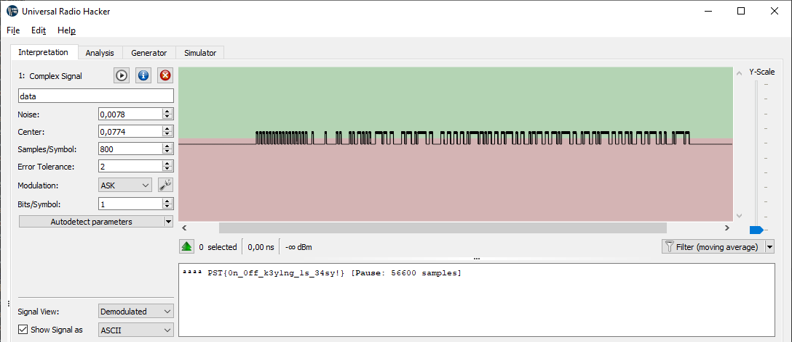
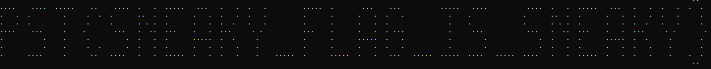
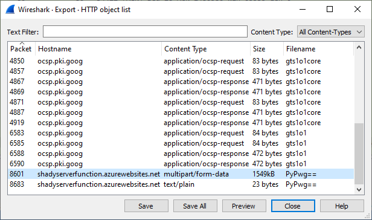
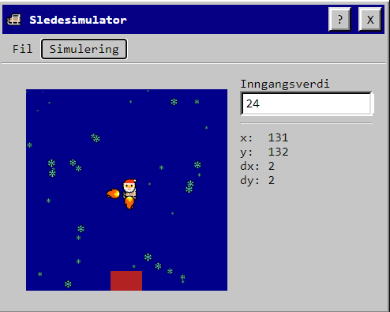

# NPST 2020 Løsninger


PST holdt en ny julekalender i 2020, med litt annet format. I stedet for CTFd, hadde de laget en ny plattform kalt `Digitalt Arkiv- og SaksbehandlingsSystem` eller `DASS`. Nettsiden har en Windows 95-look med egen epost-klient (`Snabel-A`), samt poengoversikt og litt forskjellig. Etterhvert så ble det også lansert utvidelsespakker til systemet, som introduserte et tegneprogram for å lage bakgrunner og en sledesimulator. Det ble også utviklet et eget programmeringsspråk kalt SLEDE8, som ble lagt ut på [NPM](https://www.npmjs.com/package/@pstnorge/slede8) og [Github](https://github.com/PSTNorge/slede8/), samt hostet på https://slede8.npst.no/.

Oppgavene kom i form av epost i Snabel-A klokka 07.00, og det var også noen skjulte oppgaver som ikke var poenggivende, men som hadde utslag på den endelige sorteringen på poengoversikten (Easter Eggs). De fleste av disse gikk ut på å lage mer avanserte SLEDE8-programmer enn hovedoppgaven tilsa, men noen var også gjemt godt.


- [Dag 1 - Velkommen](#dag-1---velkommen)
- [Dag 2 - MIDI](#dag-2---midi)
- [Dag 3 - Enhance!](#dag-3---enhance-)
  * [Easter egg 3](#easter-egg-3)
- [Dag 4 - Måltall](#dag-4---m-ltall)
- [Dag 5 - Passordlogg](#dag-5---passordlogg)
- [Dag 6 - Slede8](#dag-6---slede8)
  * [Easter egg 2](#easter-egg-2)
  * [Easter egg 5](#easter-egg-5)
- [Dag 7 - Rart signal](#dag-7---rart-signal)
- [Dag 8 - ASN.1](#dag-8---asn1)
- [Dag 9 - Hexmas](#dag-9---hexmas)
- [Dag 10 - Slede8 #2 ASCII](#dag-10---slede8-2-ascii)
  * [Easter egg 7](#easter-egg-7)
- [Dag 11 - Snill/slem SQLite](#dag-11---snill-slem-sqlite)
- [Dag 12 - Slede8 #3 Rev.](#dag-12---slede8-3-rev)
  * [Easter egg 8](#easter-egg-8)
- [Dag 13 - Fakset hexmelding](#dag-13---fakset-hexmelding)
- [Dag 14 - Slede8 #4 Baklengs](#dag-14---slede8-4-baklengs)
  * [Easter egg 9](#easter-egg-9)
- [Dag 15 - Rarere Signal](#dag-15---rarere-signal)
- [Dag 16 - Slede8 #5 Sortering](#dag-16---slede8-5-sortering)
  * [Easter egg 10](#easter-egg-10)
- [Dag 17 - Avlyttet](#dag-17---avlyttet)
- [Dag 18 - Pingvinteller](#dag-18---pingvinteller)
  * [Easter egg 11](#easter-egg-11)
- [Dag 19 - Reidar/Sigurd/Adrian](#dag-19---reidar-sigurd-adrian)
- [Dag 20 - Intranett](#dag-20---intranett)
- [Dag 21 - Generasjoner](#dag-21---generasjoner)
- [Dag 22 - CPA](#dag-22---cpa)
- [Dag 23 - JuleQoRt](#dag-23---juleqort)
- [Dag 24 - Autopilot](#dag-24---autopilot)
- [Easter egg - oppsummert](#easter-egg---oppsummert)


### Dag 1 - Velkommen

```
Emne: Velkommen til DASS
Hei,

Kan du bekrefte at du har fått tilgang til systemet? Det gjør du ved å svare på denne meldingen med verifiseringskoden RUV{JgkJqPåGtFgvLwnKilgp}.

OBS: Jeg mistet verifiseringskoden din i salaten, så mulig du må rette opp i den før du svarer.

Vennlig hilsen din nærmeste leder
```

Vi vet at flaggformatet er `PST{}`, og `RUV` er nøyaktig 2 bokstaver forskjøvet fra `PST`. Løsningen er derfor å rotere alt tilbake 2 bokstaver, men man skal tydeligvis ignorere `æøå`, samt brukte det engelske alfabetet. Dette er ekvivalent med å rotere teksten framover 24 steg på f.eks. CyberChef eller rot13.com.

Vi svarer på eposten med

`PST{HeiHoNåErDetJulIgjen}`

og får dette svaret

```
Emne: SV: SV: Velkommen til DASS
Strålende!

Velkommen til NPST! Som din nærmeste leder håper jeg du er klar for større utfordringer i dagene som kommer. Hver dag vil jeg ha nye arbeidsoppgaver til deg. Bruk gjerne tiden mellom oppgavene til å sette deg godt til rette i DASS og dets funksjoner.

For hver arbeidsoppgave du gjennomfører får du poeng som vises i poengoversikten. Hvordan du gjør det der kan muligens innvirke på neste års lønnsforhandlinger.
```


### Dag 2 - MIDI

```
Emne: Arbeidsoppgaver 2. desember
Etteretningsoffiseren GWYN, Pen ble stoppet i tollen ved utreise den 25. november. Vi sikret i den forbindelse et lagringsmidie som inneholdt en mystisk fil. Kan du analysere filen pen_gwyn_greatest_hits.mid?

Det er fortsatt uvisst hvorfor GWYN befant seg på Nordpolen på dette tidspunktet, men han skal ha blitt observert på det lokale vannhullet Svalbar.

📎 beslag.zip
```

Filen linker til [beslag.zip](https://dass.npst.no/filer/02-7888daf70d08a8a38bb671985a1834b2/beslag.zip), som inneholder filene `pen_gwyn_greatest_hits.mid` og `privat.7z`. 7z-filen inneholder igjen filene `cupcake.png` og `kladd.txt`, men disse er passordbeskyttede, og vi har ikke passordet.

mid-filen er en MIDI-fil, et format som lagrer tone, lengde osv. fra et instrument, f.eks. piano. Spiller vi av denne med et musikkprogram, så begynner den med en veldig lang skala, før det plutselig hopper veldig opp og ned. Siden dette er en tidlig oppgave, så er  det rimelig å anta at tonene representerer ASCII direkte. Siden alle tonene er like, foruten toneleie, så kan vi åpne filen direkte i en tekst-editor og se teksten. For å se den tydelig, må vi derimot fjerne metadata som lengde og av/på-status ved å fjerne tegnene `@€z`. Siden det registreres når man slipper hver knapp også, så er det dobbelt opp med hver bokstav, men dette kan fjernes enkelt.

Alternativ løsning, er å bare bruke et script til formålet. Man kan plukke ut hver 10. bokstav, fra og med indeks 268 til og med index 608, eller parse med et midi-bilbiotek

```python
from mido import MidiFile

mid = MidiFile('pen_gwyn_greatest_hits.mid', clip=True)
notes = list(mid.tracks[0])
flagg = ""
for note in notes:
    if note.type == "note_on":
        flagg += (chr(note.bytes()[1]))

print(flagg[flagg.index("PST"):flagg.index("}")+1])
```


Dette gir ut flagget `PST{BabyPenGwynDuhDuhDuhDuhDuhDuh}`, og når vi svarer på eposten kommer det flere responser:

```
Fra: Mellomleder
Emne SV: SV: Arbeidsoppgaver 2. desember
Kløktig utført! Resten av beslaget vil bli behandlet i linja.
```

```
Fra: Julenissen
Emne: SV: SV: SV: Velkommen til DASS
Flott å se at du er i gang med arbeidet. Håper du blir godt ivaretatt av din nærmeste leder, og bidrar til at det blir en god jul!

🎅
```


### Dag 3 - Enhance!

I løpet av kvelden på dag 2, så kom det en epost fra `Tastefinger` med innholdet

```
Emne: Endelig!
Jeg gjettet passordet til zip-fila,, og det funket!

Sendt fra min PDA.
```

```
Emne: Arbeidsoppgaver 3. desember
Din kollega Tastefinger har identifisert noe 🧁 med fila cupcake.png fra beslaget du arbeidet med i går. Det er SANNSYNLIG at det kan være informasjon i bildet som ikke er synlig med det blotte øye. Gleder meg til å høre hva du kommer frem til!
```


Passordet til 7z-filen er faktisk `til zip-fila,` og ut kommer `cupcake.png`, et veldig kornete bilde av en pingvin på en strand.


Prøver først bildeforbedringsfunksjonen til `DASS`, men den sier at bildet ikke kan forbedres. Kjører PNG-fila gjennom zsteg, og vi får raskt en YouTube-link til et CSI-klipp som heter "Enhance!", så jeg prøver forbedring en gang til, og nå virker det plutselig. Etter flere runder med forbedring, så kan man så vidt skimte flagget `PST{HuskMeteren}` på en palme i bakgrunnen.


#### Easter egg 3

Inne i det siste bildet, finnes det også et gjemt egg. Her brukes bare zsteg og så kommer et EGG ut via LSB-steg på bit 1

```
b1,rgb,lsb,xy       .. text: "EGG{MeasureOnceCutTwice}"
```

Sender dette til HR, og får årets første stjerne i margen. Fortsatt gjenstår filen `kladd.txt`, som inneholder noen emojis og base64-lignende tekst.

```
Emne: SV: SV: Arbeidsoppgaver 3. desember
Bra jobbet! Sammen er vi gode!
```


### Dag 4 - Måltall

```
Emne: Luke 4
Hei,

Som alle vet, så varer jula helt til påske, og her starter problemene...

Vi i mellomledergruppa har begynt på et forprosjekt for utredning av bemanningsstrategi for påsken i årene fremover. Systemet vi benytter for å finne ut når det er påske oppfører seg rart, slik at dette viktige arbeidet nå har blitt satt på vent. Klarer du å finne ut hva som er feil?

Vi i mellomledergruppa er svært interessert i måltall, og ledelsen ønsker en rapport snarest på summen av kolonnen Maaltall fra og med 2020 til og med 2040. Kan du svare meg med denne summen, omkranset av PST{ og } når du finner ut av det?

📎 filer.zip
```

Vedlagt er 5 filer:

```
DatoPaaske.csv
dbo.DatoPaaske.sql
dbo.FunctionPaaskeAften.sql
dbo.ProcedureDatoPaaske.sql
GenererRapport.sql
```

Den viktigste filen er egentlig `DatoPaaske.csv`, som viser hva de har regnet ut fra før:

```csv
DatoPaaskeId;PaaskeAften;PaaskeFerieUke;Aar;MaalTall
1;2020-04-11;15;2020;43930
2;2020-04-11;15;2020;43930
3;2021-04-03;13;2021;44287
4;2022-04-16;15;2022;44665
5;2024-03-30;13;2024;45379
6;2025-04-19;16;2025;45764
7;2026-04-04;14;2026;46114
8;2026-04-04;14;2026;46114
9;2027-03-27;12;2027;46471
10;2029-03-31;13;2029;47206
11;2030-04-20;16;2030;47591
12;2031-04-12;15;2031;47948
13;2032-03-27;13;2032;48298
14;2032-03-27;13;2032;48298
15;2033-04-16;15;2033;48683
16;2035-03-24;12;2035;49390
17;2036-04-12;15;2036;49775
18;2037-04-04;14;2037;50132
19;2037-04-04;14;2037;50132
20;2038-04-24;16;2038;50517
21;2039-04-09;14;2039;50867
```


Målet er å fikse/fullføre verdiene i den eksisterende CSV-filen, hvor kolonnen `MaalTall` er resultatet av en `DATETIME` konvertert til `INT`. I SQL, så blir dette til et tall som angir antall dager siden 1. januar 1900. Tidspunktet som blir konvertert, er datoene for påskeaften for årene fram mot 2040. Men det mangler en del år, og noen er dupliserte. Oppgaven går derfor ut på å summere antall dager siden 1. januar 1900 for hver påskeaften fra og med 2020 til og med 2040.

Påske-uka starter på første søndag, etter første fullmåne på (eller etter) vårjevndøgn, hvor vårjevndøgn defineres som 21. mars. Det finnes formler for å regne ut når påsken kommer, og siden vi ikke har noen irregulære år i perioden så blir det ganske enkel kode. I deres eksempelkode, så har de trukket fra 1 fra dagene, så derfor plusses det på 20, og ikke 21 til slutt.

```python
from datetime import date
måltall = 0
for y in range(2020, 2041):
    a = (19 * (y % 19) + 24) % 30
    b = ((2 * (y % 4)) + (4 * (y % 7)) + (6 * a) + 5) % 7
    måltall += (date(y, 3, 1) - date(1900, 1, 1)).days + (20+a+b)

print(f"PST{{{måltall}}}")
```


```
Emne: SV: SV: Luke 4
Takk for hjelpen!

Nå bør ledergruppa bli fornøyd.
```


### Dag 5 - Passordlogg

```
Emne: Luke 5
Det rapporteres om tilgangstrøbbel til dokumentasjonsvelvet. Vi har fått logger fra Seksjon for passord og forebygging i perioden der man mistenker at feilen kan ligge. Finner dere noe 🧁 i loggene?

📎 log.csv
```


Vi får utdelt en CSV-fil med UTF16-enkodet tekst, hvor hver linje er en epost med avsender, emne og et flagg. Det riktige flagget er det som har et sært, usynlig tegn, i navnet. Filen kan renskes opp litt ved å konvertere den

```python
from urllib.parse import unquote

with open("log-fixed.csv", "w") as fd:
    for line in open("log.csv", encoding="UTF-16").readlines():
        fd.write(unquote(line))
```

`2020-10-15 08:35:03;Nissen+<Jule+Nissen>;SPF+<Seksjon+for+Passord+og+Forebygging>;I+dag+har+jeg+lyst+til+at+PST{879502f267ce7b9913c1d1cf0acaf045}+skal+være+passordet+mitt`

Linjen over har et merkelig tegn i første instans av ordet "Nissen", mellom `i` og `s`. Dagens flagg er altså `PST{879502f267ce7b9913c1d1cf0acaf045}`.


```
Emne: SV: SV: Luke 5
Denne saken får prioritert videre behandling i linja!

Det kan se ut som om en trusselaktør har klart å tilbakestille Sjef NPSTs passord via et phishing-angrep.
```


### Dag 6 - Slede8

```
Emne: Luke 6
Det er på tide at dere begynner med e-læringen i SLEDE-8. Dette er arvtageren til SLEDE-4, og benyttes flittig av våre utviklere.

Fint hvis du rapporterer tilbake med verifikasjonskoden når du har løst e-læringsmodulen med kode 4032996b1bbb67f6. Utviklerverktøyet finner du her.

Se forøvrig vedlagt dokumentasjon.

📎 SLEDE8.md
```


Vi blir introdusert til SLEDE-8, et assembly-språk med egen debugger i browseren, og noen læringsmoduler. Ved å benytte den oppgitte koden `4032996b1bbb67f6` kan man hente ut en læringsmodul hvor man skal lese inn en del tall og legge de sammen. Dette løses enkelt med en loop:

```
SETT r0, 0    ; Output
SETT r14, 1   ; Immediate for dekrement
SETT r15, 0   ; Mål for loopen
LES r1        ; Antall ganger vi skal loope
loop:
LES r2        ; Les 1 byte
PLUSS r0, r2  ; Legg til byten til output
MINUS r1, r14 ; Trekk fra på telleren vår
ULIK r1, r15  ; Sjekk om vi er ferdig å loope
BHOPP loop    ; Nei? Loop!
SKRIV r0      ; Skriv ut sum
```

Som gir flagget

```
Godkjent! Din verifikasjonskode er: PST{ATastyByteOfSled}
```

#### Easter egg 2

Leser man dokumentasjonen for språket, så ser man også fort at `kladd.txt` fra dag 3 er en input til SLEDE8-programmet i nettleseren, og dette gir oss egg 2.

#### Easter egg 5

Ved å løse "Hello, World!"-modulen innebygd i SLEDE8-verktøyet, så får man enda et flagg. Denne trenger ikke å være mer avansert enn å bare laste inn verdier og skrive de ut direkte, uten noen form for looping.


### Dag 7 - Rart signal

```
Emne: Luke 7
Det har blitt fanget opp et rart signal her på julenissens verksted. Det ser ikke ut til at det er et kontinuerlig signal, da det ser til å komme og gå litt. Klarer du å finne ut hva det er?

📎 data.complex16u
```


Får utdelt filen `data.complex16u`, som inneholder signaldata. Åpner denne i `Universal Radio Hacker` og trykker `Autodetect parameters` under `Interpretation`, og så velges det å vise signalet som ASCII:




Flagget er `PST{0n_0ff_k3y1ng_1s_34sy!}`

```
Emne: SV: SV: Luke 7
Takk for innsatsen J
```


### Dag 8 - ASN.1

```
Emne: Luke 8
Det er viktig med faglig utvikling, også nå i førjulsstria. Dagens tema er ASN.1. Her er litt hjernetrim fra Nissens Kompetansebank™.

MIIBOTCCATAwggEnMIIBHjCCARUwggEMMIIBAzCB+zCB8zCB6zCB4zCB2zCB0zCByzCBwzCBuzCBszCBqzCBozCBnDCBlDCBjDCBhDB9MHYwbzBoMGEwWjBTMEwwRTA+MDcwMTAqMCMwHDAVMA4wBwUAoQMCAROgAwIBA6EDAgEMogMCAQChAwIBE6ADAgEBoQMCARKkAgUAoQMCARShAwIBDqIDAgEYoQMCAQShAwIBEqEDAgEOoQMCAQ6hAwIBB6IDAgECogMCAQigAwIBAaIDAgENogMCARKiAwIBAKMCBQCiAwIBE6IDAgESogMCAQ+hAwIBEaEDAgEOoQMCAQugAwIBAKIDAgEDoQMCAQyhAwIBFKEDAgESoQMCAQ+gAwIBAaEDAgEMoAMCAQOhAwIBEaEDAgEOogMCAQs=

Spec DEFINITIONS ::= BEGIN
    LinkedList ::= Node
    Node ::= SEQUENCE {
        child CHOICE {
            node Node,
            end NULL
        },
        value CHOICE {
            digit                [0] INTEGER(0..9),
            lowercase           [1] INTEGER(0..25),
            uppercase           [2] INTEGER(0..25),
            leftCurlyBracket    [3] NULL,
            rightCurlyBracket   [4] NULL
        }
    }
END
Lykke til!
```

ASN.1-specen er endret etter en oppfølgingsepost.

Oppgaven her ser rimelig vanskelig ut først, ettersom de definerer en sekvens med noder, og det er ikke umiddelbart mulig å se om disse er i riktig rekkefølge eller ikke. Etter å ha kompilert spec og parset data, så er det derimot bare en enkel traversering fra start til slutt som skal til.

```python
import asn1tools
import base64

SPEC = '''
Spec DEFINITIONS ::= BEGIN
    LinkedList ::= Node
    Node ::= SEQUENCE {
        child CHOICE {
            node Node,
            end NULL
        },
        value CHOICE {
            digit                [0] INTEGER(0..9),
            lowercase           [1] INTEGER(0..25),
            uppercase           [2] INTEGER(0..25),
            leftCurlyBracket    [3] NULL,
            rightCurlyBracket   [4] NULL
        }
    }
END
'''

flag = asn1tools.compile_string(SPEC, 'ber')

ber_data = base64.b64decode("MIIBOTCCATAwggEnMIIBHjCCARUwggEMMIIBAzCB+zCB8zCB6zCB4zCB2zCB0zCByzCBwzCBuzCBszCBqzCBozCBnDCBlDCBjDCBhDB9MHYwbzBoMGEwWjBTMEwwRTA+MDcwMTAqMCMwHDAVMA4wBwUAoQMCAROgAwIBA6EDAgEMogMCAQChAwIBE6ADAgEBoQMCARKkAgUAoQMCARShAwIBDqIDAgEYoQMCAQShAwIBEqEDAgEOoQMCAQ6hAwIBB6IDAgECogMCAQigAwIBAaIDAgENogMCARKiAwIBAKMCBQCiAwIBE6IDAgESogMCAQ+hAwIBEaEDAgEOoQMCAQugAwIBAKIDAgEDoQMCAQyhAwIBFKEDAgESoQMCAQ+gAwIBAaEDAgEMoAMCAQOhAwIBEaEDAgEOogMCAQs=")
node = flag.decode("LinkedList", ber_data)

lookup = {
    "lowercase": lambda x: chr(ord('a') + int(x)),
    "uppercase": lambda x: chr(ord('A') + int(x)),
    "digit":     lambda x: chr(ord('0') + int(x)),
    "leftCurlyBracket":  lambda x: "{",
    "rightCurlyBracket": lambda x: "}",
}

out = ""
while node:
    typ, val = node["value"]
    out += lookup[typ](val)
    node = node["child"][1]

print(out)
```

Og ut kommer `Lor3m1psumD0lorPST{ASN1IChooseYou}s1tAm3t` hvor flagget da er `PST{ASN1IChooseYou}`.


```
Emne: SV: SV: Luke 8
Godt jobbet!

Da vet vi at du kan bidra med lignende oppgaver i fremtiden.

Ikke glem å oppdatere kompetansen din i Kompetansebanken, det er viktig at profilen din ikke er under 100% oppdatert!
```


### Dag 9 - Hexmas

```
Emne: Luke 9
En samarbeidende tjeneste har sendt oss en chatlogg fra en antatt SPST agent. Meldingen vekket oppsikt pga den overdrevne bruken av emojier. Meldingen ser ut til å være obfuskert på en eller annen måte som ikke er kjent for oss fra tidligere beslag.

Vi lurer på om det kan være brukt HEXMAS-enkoding. Kan du undersøke det nærmere?

🎅🤶❄⛄🎄🎁🕯🌟✨🔥🥣🎶🎆👼🦌🛷

🤶🛷✨🎶🎅✨🎅🎅🛷🤶🎄🔥🎆🦌🎁🛷🎅❄🛷🛷🎅🎶🎅✨🎅🦌🥣🔥🛷🦌⛄🎅🌟🛷🛷🔥🎄🦌🎅✨🦌🦌🕯🎶🎅🤶🦌❄🎁🕯🎅✨🎶👼🌟🎆🕯🌟❄👼🎅🎅🤶❄🎄👼🎆🔥🎁🛷🤶👼🎅🎅🎅🎅🎅🎅
```


Den umiddelbare tanken ved denne oppgaven, er at hver emoji står for en gitt hex-nibble (0-f), og at den underliggende teksten er ASCII-hex. Dette kan dels bekreftes ved å observere at det er nøyaktig 16 unike emojis i teksten. Men det er to ting som skurrer for at dette skal være tilfelle:

- Det er altfor stor variasjon i første nibble i hver byte (burde vært 4-7 forskjellige, men er 14)
- Slutten har mange bytes som er bygd opp med samme nibble, og ingen av ASCII-tegnene på det formatet (0x11, 0x22, 0x33, ...) gir mening.

I tillegg til det overnevnte, så vil "PST" encodes som "50 53 54", og det eneste stedet hvor et sånt mønster er tilstede (🎅🎶🎅✨🎅🦌) gir ikke mening hvis resten av teksten skal oversettes på samme måte.

Etter å ha tatt et par steg tilbake, så observerte jeg at den første linjen hadde alle de 16 unike emojiene, og derfra var det enkelt. De representerer hex-alfabetet. Ved å dekode slik, ser man at det er gzip-data vi jobber med, og at flagget er emojis også.

```python
import gzip
from string import hexdigits

data = \
"""
🎅🤶❄⛄🎄🎁🕯🌟✨🔥🥣🎶🎆👼🦌🛷

🤶🛷✨🎶🎅✨🎅🎅🛷🤶🎄🔥🎆🦌🎁🛷🎅❄🛷🛷🎅🎶🎅✨🎅🦌🥣🔥🛷🦌⛄🎅🌟🛷🛷🔥🎄🦌🎅✨🦌🦌🕯🎶🎅🤶🦌❄🎁🕯🎅✨🎶👼🌟🎆🕯🌟❄👼🎅🎅🤶❄🎄👼🎆🔥🎁🛷🤶👼🎅🎅🎅🎅🎅🎅
"""

alphabet, message = data.strip().split("\n\n")
subst = {k:v for k,v in zip(alphabet, hexdigits)}

for k,v in subst.items():
    message = message.replace(k, v)
    
print(gzip.decompress(bytes.fromhex(message)).decode())
```

`PST{🧹🧹🎄🎅🎄🧹}`

```
Emne: SV: SV: Luke 9
Strålende utført!

Da vet vi at vi kan dekode lignende meldinger kjapt i fremtiden!
```


### Dag 10 - Slede8 #2 ASCII

```
Emne: Luke 10
Håper du er klar for nye utfordringer i SLEDE8.

Fint hvis du rapporterer tilbake med verifikasjonskoden når du har løst e-læringsmodulen med kode 82ec70284b51eb12. Utviklerverktøyet finner du fortsatt her.

Dokumentasjonen finner du også samme sted som tidligere.

📎 SLEDE8.md
```


Oppgaven går ut på å skrive et program som tar inn 2 tall fra input, adderer disse to, og skriver ut tallet som ASCII, i base-10. Løser dette rimelig hacky, ved å simpelthen telle antall hundretall, titall og enere, og så skrive ut disse. Det trengs litt ekstra logikk for å ikke skrive ut f.eks. "032" når antall hundretall er 0, men fortsatt skrive ut "102" selv om antall tiere er 0. Addisjon er allerede modulo 256 i SLEDE8-språket, så det trengs ikke noe logikk for å implementere dette.

```
; Føde består av to tall, A og B
; Skriv ut resultatet av (A + B) mod 256 som en ASCII-streng

; Eksempel: A=0xA0 og B=0x08 => '168'
; Eksempel: A=0xFF og B=0xFF => '254'

; r13 = antall_hundre
; r14 = antall_ti
; r15 = antall_en

SETT r3, 0x30      ; Konstant, ASCII '0'
SETT r4, 0         ; Mellomlagring av rest % 10^x
SETT r7, 0         ; Konstant
SETT r8, 100       ; Konstant
SETT r9, 10        ; Konstant
SETT r12, 1        ; Konstant

; r4 = (input[0] + input[1]) % 256
LES r4
LES r5
PLUSS r4, r5

delehundre:
ME r4, r8          ; hvis r4 < 100
BHOPP ferdig1      ; ferdig å telle antall_hundre
MINUS r4, r8       ; r4 -= 100
PLUSS r13, r12 ; 1 ; antall_hundre += 1
HOPP delehundre    ; Repeat

ferdig1:
LIK r13, r7        ; Hvis antall_hundre=0, ikke skriv ut hundretallet
BHOPP deleti
PLUSS r13, r3      ; Ellers pluss på ASCII '0' og skriv
SKRIV r13

deleti:
ME r4, r9          ; hvis r4 < 10
BHOPP ferdig2      ; ferdig å telle tiere
MINUS r4, r9       ; r4 -= 10
PLUSS r14, r12     ; antall_ti += 1
HOPP deleti

ferdig2:
ULIK r13, r7       ; Hvis antall_hundre!=0, skriv ut tiere selv om de er 0
BHOPP skriv
LIK r14, r7        ; Hvis antall_hundre=0 og antall_ti=0, ikke skriv noe
BHOPP deleen
skriv:
PLUSS r14, r3
SKRIV r14

deleen:
PLUSS r4, r3       ; Skriv ut antall enere uansett
SKRIV r4
; PST{++AndKissesWillBeAwardedToYou}
```

#### Easter egg 7

Ved innlevering så dukker det opp en ny epost:

```
Emne: SV: SV: Luke 10
Godt jobbet!

Å mestre SLEDE8 kan bli avgjørende i denne førjulstiden! Hvis du synes denne var lett kan du prøve deg på e-læringsmodulen med kode 8e7c9876c85e5471.
```

Denne modulen er veldig lik den forrige, men den store forskjellen er at nå skal tallet skrives ut fullstendig, ikke modulo 256. For å gjøre dette, så teller jeg antall enere og hundrere i to runder - en gang per input-tall - uten å nullstille tellerne mellom. Så kjører jeg en kjapp carry-runde på slutten for å propagere tallene som er i mente.

`EGG{ba92ae3a9af1a157703ca83d9a9fb11d}`


### Dag 11 - Snill/slem SQLite

```
Emne: Luke 11
Det interne sikkerhetsteamet hos NPST har oppdaget at det har skjedd en uautorisert modifikasjon på Nissens liste over snille og slemme barn. De påstår at en md5-sum har blitt endret på, men de trenger din hjelp til å finne ut nøyaktig hvilken. Vedlagt ligger en sikkerhetskopi med nissens liste fra det tidspunktet sikkerhetsteamet mener modifikasjonen har oppstått.

📎 liste.zip
```


Vedlagt er en fil som inneholder en SQLite-database, med shm- og wal-filer. I disse så kan man enkelt se endringer av databasen, men det er ikke nødvendig å bruke her. Vi ser nemlig fort at listene `slemme` og `snille` i databasen, har feltet `md5` som bare er `md5(fornavn+etternavn)`, så vi kan eksportere databasene til CSV og så sjekke hvilken som ikke matcher det formatet.

```python
from hashlib import md5

for fname in ["snille.csv", "slemme.csv"]:
    lines = open(fname).readlines()[1:]
    for line in lines:
        f,l,h = line.rstrip().split(",")
        hh = md5((f+l).encode()).hexdigest()
        if h!=hh:
            print(f"PST{{{h}}}")
```

`PST{49422712408d5409a3e40945204314e6}` er dermed svaret.

```
Emne: SV: SV: Luke 11
Godt jobbet, og interessant funn!

Dette tror jeg vi må ta videre i linja.
```


### Dag 12 - Slede8 #3 Rev.

```
Emne: Luke 12
Det rapporteres at SydpolarSikkerhetstjeneste (SPST) i starten av desember hadde publisert s8asm-kode fra sin GitHub-bruker. Dette ble raskt fjernet, men din kollega Tastefinger rakk å sikre kildekoden.

Vi stiller oss spørrende til hvordan de har fått tak i spesifikasjonen til dette språket. HR følger opp hvem som har sluttet ila det siste året, og hvorvidt noen av disse kan ha delt denne informasjonen til SPST.

I mellomtiden har jeg jobbet iherdig med å montere koden. Klarer du å forstå hva SPST vil med dette? Jeg ser frem til verdifull input fra deg!

Se vedlagt fil for den monterte koden. Tastefinger mente det var relevant å fortelle at du kan finne nyttige verktøy her.

📎 program.s8
```

Her får vi et "montert" SLEDE8-program, altså bare bytecodes. Jeg hadde på [forhånd skrevet en emulator](runner.py) som kunne kjøre monterte programmer, og den kom godt med her. For å løse oppgaven raskt, så satset jeg ikke på å reversere den fullstendig, men begynte å angripe ting i koden. Blant annet er det en referanse tidlig til DATA på offset 0x38, som begynner med `QQW~`. XORes dette med `PST{`får vi `[1,2,3,5]`. Ut i fra koden, så virker det som om det er to verdier som lagres, hvor den ene settes til den andre, og den andre til summen av seg selv og den foregående. Dette er Fibonacii-rekken, og kan enkelt utledes.

```python
fibonacci = [1, 1]
for i in range(100):
    fibonacci.append(fibonacci[-2] + fibonacci[-1])

data = open("program.s8", "rb").read()[7:] # Skip ".SLEDE8"
flagg = bytes([(data[0x38+i] ^ fibonacci[i+1]) % 256 for i in range(26)])
print(flagg.decode()) # PST{fib0nacc1_0net1m3_p4d}
```

Det programmet gjør, er å XORe vår input med tall fra Fibonacci-rekken (mod 256) og så XORes det igjen med det krypterte flagget på 0x38. Resultatet av operasjonen ORes sammen med et register, og hvis dette registeret er ulikt 0 til slutt, så er inputen antatt feil.

På Dag 16 ble kildekoden til dette programmet sendt som et hint til innboksen.

```
Emne: Hint: Luke 12
Hei,

Hvis du liker flatpakket bedre enn ferdigmontert så har jeg funnet frem kildekoden fra luke 12 til deg her!

   SETT r5,0
    SETT r6,1
    SETT r10,0
    SETT r11,1
    SETT r12,0
    FINN encflag
    SETT r9,26
encloop:
    LES r2
    LAST r3
    SETT r7,r5
    PLUSS r7,r6
    XELLER r2,r7
    XELLER r2,r3
    ELLER r12,r2
    SETT r5,r6
    SETT r6,r7
    MINUS r9,r11
    PLUSS r0,r11
    ULIK r9,r10
    BHOPP encloop

    LIK r12,r10
    BHOPP win
    FINN fail_string
    TUR print
    STOPP
win:
    FINN win_string
    TUR print
    STOPP

encflag:
    .DATA 81, 81, 87, 126, 110, 100, 119, 18, 89, 56, 243, 138, 72, 61, 235, 83, 125, 33, 92, 175, 28, 174, 80, 37, 85, 63

win_string:
    .DATA 75, 111, 114, 114, 101, 107, 116, 33, 0
fail_string:
    .DATA 70, 101, 105, 108, 33, 0

; r1:r0 - null-terminert streng
print:
    LAST r2
    LIK r2,r10
    BHOPP ferdig
    SKRIV r2
    PLUSS r0,r11
    HOPP print
ferdig:    
    RETUR
```


#### Easter egg 8

Etter å ha sendt inn svaret på luke 12, får vi denne eposten fra Mellomleder:

```
Emne: SV: SV: Luke 12
Takk for input!

Dette var føde til ettertanke. Hvis du har livslyst igjen kan du prøve på denne fila også.

📎 💀.s8
```

Vedlagt følger et annet, montert SLEDE8-program.

Dette programmet starter like greit med å deobfuskere/unpacke seg selv, før det starter å kjøre kode. Vi kan omgå dette ved å stoppe på første innlesing, og dumpe hele minneområdet til disk. Da får vi ut den faktiske koden som kjører.

Koden som sjekker flagget fungerer på samme måte som i den første delen. Noe XORes sammen, og resultatet ORes til et register som husker alle ulikheter i bits. Målet er å få resultatet av denne XOR-operasjonen til alltid bli 0, slik at OR-operasjonen aldri setter noen bits. Måten inputen modifiseres på før XOR, er derimot veldig annerledes i dette programmet.

Igjen kan vi angripe denne sammenligningen, og brute-force byte per byte. Den interessante instruksjonen er `XELLER r9, r2` til slutt, hvor `r9` inneholder forventet output og `r2` inneholder transformert input. Disse skal være like. Når vi legger inn `EGG{...` ser vi at dette er likt ved å printe begge verdiene i emulatoren

```
XELLER r9, r2 ['q', 'q', 113, 113, True]
XELLER r9, r2 ['\x81', '\x81', 129, 129, True]
XELLER r9, r2 ['µ', 'µ', 181, 181, True]
XELLER r9, r2 ['\x10', '\x10', 16, 16, True]
```

mens bokstavene etter blir feil. Det ser også ut til at outputen avhenger av forrige input-byte, så vi må starte på begynnelsen og jobbe oss fremover. De første bytene ser ut til å øke i takt med input-verdien, så det er enkelt å bare se på differansen mellom forventet output. Etter dette, så øker plutselig verdien med 8 i stedet for 1, men brute-force virker uansett.

Etter litt prøving og feiling: `EGG{513d38_master_reverser}`


### Dag 13 - Fakset hexmelding

```
Emne: Luke 13
Følgende melding ble tilsendt NPST per faks, og ingen i postmottaket forstår innholdet. Det ser ut som den bruker en eller annen form for hex-enkoding, men selv hex-dekodet gir faksen ingen mening.

Klarer du å finne mening i meldingen?

📎 melding.txt
```


`melding.txt` inneholder 10 linjer med hexadecimal tekst. Alle er like lange. Det hintes til "faks" i teksten, og at den skal hex-dekodes, så første tanke er at dette er et spesielt format brukt for faks. Enkel entropi- og frekvensanalyse viser derimot at dette er altfor tilfeldig til å følge noen standardisert format, med mindre alle headere er borte. Det rimer heller ikke at det er delt opp i linjer, hvis det er meningen at dette skal være étt segment.

Etter litt om og men, så gjenkjennes denne oppgaven som en skamløs kopi av en oppgave fra TG:Hack 2019, bare uten muligheten til å spørre en server om data og analysere denne over tid. Løsningen er å fjerne alle tegn som ikke har har "hull" i seg, og så studere det som gjenstår.

```python
msg = open("melding.txt").read()
for char in "ABCDEF0123456789":
    msg = msg.replace(char, "." if char in "ABD04689" else " ")
print(msg)
```



`PST{SNEAKY_FLAG_IS_SNEAKY}`

```
Emne: SV: SV: Luke 13
Godt løst!

Det var ikke lett å se med en gang.
```


### Dag 14 - Slede8 #4 Baklengs

```
Emne: Luke 14
Det nyeste innen måltallsrapportering er antall fullførte e-læringsmoduler i SLEDE8 blandt de ansatte, så kunne du gjennomført modul 97672649875ca349? Rapporter tilbake som vanlig når du er ferdig!

Utviklerverktøyet finner du fortsatt her. Se vedlagt dokumentasjon, eller på GitHub.

📎 SLEDE8.md
```


Dagens oppgave går ut på å lese inn tall helt til man ser en `00`, og så skrive ut igjen tallene man har lest - i motsatt rekkefølge. Min første tanke, er at her må vi endelig ta i bruk HENT/LAGR for å lagre ting i minne. Siste test sjekker også at det kan leses inn mer enn 256 verdier, altså må vi ta i bruk både r1 og r0 når vi kaller HENT/LAGR.

Logikken jeg kom opp med, er som følger:

- Start å lese tall inn i adresse 0x100 og opp. Dette tilsvarer r1=1, r0=0. Starter vi på 0, så er det mulig å overskrive egen kode.
- Les inn tall, og sammenlign med 0. Hvis vi leser en 0, start å skrive ut.
- For hvert tall som leses inn, øk r0 slik at neste tall leses inn i et nytt minneområde. Hvis r0 blir til 0 etter inkrementering, så har vi gått forbi 255 og tilbake på 0, og da må vi øke r1 også.
- Under utskriving, reduser r0 med 1 (og r1 om r0 er 0 før man wrapper). Ved å gjøre dette først, unngår vi å skrive ut den siste `00`-verdien som ble lest inn.
- Skriv ut tall.
- Hvis r0 og r1 er tilbake der de originalt var, avslutt.

Det er også en del 2 av denne oppgaven, som krever at man optimaliserer koden til å kjøre på 10,000 sykluser. Koden jeg skrev passet inn til å begynne med, så det var ikke noe å endre.

```
; Føde består av et ukjent antall verdier, der verdien 0x00 markerer siste verdi.
; Skriv ut verdiene i motsatt rekkefølge.

; Eksempel: 11223344556600 => 665544332211
; Eksempel: 0123456789abcdef00 => efcdab8967452301

SETT r1,  1 ; addr start (to not overwrite code)
SETT r13, 1 ; addr for compare
;SETT r14, 0 ; const 0
SETT r15, 1 ; const 1

loop:
LES r2        ; r2 = input
LIK r2, r14   ; if input == 0
BHOPP write   ; start writing
LAGR r2       ; else store at (r1<<8) | r0
PLUSS r0, r15 ; r0++ always
ULIK r0, r14  ; if r0 != 0: loop
BHOPP loop    ; else, we have read 0xFF values and wrapped around
PLUSS r1, r15 ; r1 += 1 need to increment high portion of memory
HOPP loop

write:
MINUS r0, r15 ; first value is the final 00, ignore
LAST r2       ; r2 = mem[ (r1<<8)|r0 ]
SKRIV r2      ; print r2
LIK r0, r14   ; if r0 == 0: done or wrapped?
BHOPP ferdig
HOPP write

; if r1 is not back to the initial value, decrement r1 and go again
ferdig:
ULIK r1, r13
BHOPP again
STOPP
again:
MINUS r1, r15
HOPP write
```

Innsendt modul gir dagens flagg: `PST{InReverseCountryEverythingIsPossible}`


#### Easter egg 9

Kode som kjører på under 10,000 sykluser får også egg nummer 9: `EGG{5f5fc8819e2cc6be9c6a19370a5030af}`


### Dag 15 - Rarere Signal

```
Emne: Luke 15
I etterkant av en privat reise (tidligere i år) for å se fotball i England, har en av alvebetjentene flere ganger fanget opp et mystisk signal. Det ser ut som signalet er ganske kontinuerlig, men det varierer litt i frekvens.

Denne oppgaven har ligget i backloggen hos oss, men det hadde vært veldig fint om du kan ta en titt og se om det er en beskjed i signalet!

📎 data2.complex16u
```


Enda en oppgave som kan løses i Universal Radio Hacker. Denne gangen må vi derimot dekode bitstringen som Manchester-enkoding før vi får flagget. Fremgangsmåten er den samme som på [Dag 7 - Rart signal](#dag-7---rart-signal), men vi må enten dekode bits selv, eller ta turen innom "Analysis" og velge `Manchester` i menyen der, samt `ASCII` som output.

`PST{m4nch3st3r_3nc0d1ng_1s_4_l0t_0f_fun!}`


```
SV: SV: Luke 15
Godt jobbet!

Det var jo en artig melding å sende med manchester-koding.
```


### Dag 16 - Slede8 #5 Sortering

```
Emne: Luke 16
Jeg ligger fortsatt litt bakpå måltallsmessig etter 'svar alle'-hendelsen tidligere i måneden. Det er nok derfor best for din lønnsutvikling om du gjennomfører e-læringsmodul a522c5a55bcb743e i SLEDE8.

Utviklerverktøyet finner du fortsatt her. Se dokumentasjon på GitHub.
```


Oppgaven i dag går ut på å lese inn N tall og så skrive de ut i sortert rekkefølge. Del 1 av oppgaven krever en løsning som bruker maksimalt `(24* N^2 + 5000)` sykler, mens del 2 setter grensen på 4608. Det betyr at man kan gjøre rundt 18 operasjoner per tall som leses inn, hvis det leses inn 255 tall.

En mer optimal løsning på denne er å ikke utføre noe sorterings-steg i det hele tatt, men telle forekomster av hvert tall, og så skrive disse ut i sortert rekkefølge. Det blir en slags variant av `Bucket sort`, bare at antall bøtter er lik antall unike elementer. 

Algoritmen blir da å lese inn tall til `r0` og så bruke `HENT/LAGR` til å inkrementere en teller på minneområdet på lokasjon `(r1<<8) | r0`. Når vi har lest N tall, så setter vi `r0` til 0 og begynner å lese ut verdiene. En pseudo-kode-variant ser sånn her ut:

```python
N = les()
while N:
    tall = les()
    minne[tall] += 1
    N -= 1

for i = 0..255:
    while minne[i]:
        skriv(i)
        minne[i] -= 1
```

SLEDE8-kode - etter-optimalisert ved å invertere noen sjekker så den kjørte for del 2:

```
; Første byte med føde er et tall N som representerer
; antallet påfølgende bytes med føde.
; de påfølgende verdiene representerer en liste med verdier.
; skriv ut verdiene i lista sortert i stigende rekkefølge

; Eksempel: 06112233445566 => 112233445566
; Eksempel: 06665544332211 => 112233445566

; OBS: Implementasjonen kan ikke benytte mer enn 4608 skritt.

LES r2      ; Antall tall vi skal lese inn
SETT r1, 1  ; Område å skrive tall til
SETT r14, 1 ; const 1
;SETT r15,0 ; const 0

loop:
  LES r0
  LAST r3
  PLUSS r3, r14
  LAGR r3
  MINUS r2, r14
  ULIK r2, r15
BHOPP loop

; Skriv ut fra minne[0]
SETT r0, 0

lesframinne:
LAST r3
loop2:
  LIK r3, r15
  BHOPP nextnum
  MINUS r3, r14
  SKRIV r0
HOPP loop2

nextnum:
PLUSS r0, r14
ULIK r0, r15
BHOPP lesframinne

ferdig:
```


Første flagg er `PST{youtu.be/k4RRi_ntQc8}` og ved innsending får man responsen:


```
Emne: SV: SV: Luke 16
👏

Erfaringene du tilgner deg nå kan bli avgjørende før du vet ordet av det.

Hvis du vil teste hvor effektiv algoritmen din er kan du forsøke deg på e-læringsmodul 611b1f7f8c63469e.
```

#### Easter egg 10

Med samme kode får vi et egg fra den neste læringsmodulen `EGG{a34ae56d455e16b08cfe07f585ed44d9}`


### Dag 17 - Avlyttet

```
Emne: Luke 17
NPST har avlyttet telefonen til en mistenkt etteretningsoffiser fra SPST. Teleoperatøren har oversendt data i henhold til ETSI232-1, men våre systemer klarer ikke å forstå innholdet. Vi mistenker at det er benyttet en svært enkel kode, men våre analytikere sier det er LITE SANNSYNLIG at XMAS er benyttet.

📎 data.b64.txt
📎 ETSI232-1.txt
```


Vedlagt ligger en ASN.1-spesifikasjon og noe base64-enkodet data. `XMAS` hinter til `XOR`, og det viser seg at de bare har XORet med tallet 36 ('$'). Koden er mye det samme som på Dag 8, men har et ekstra steg:

```python
# flag = kompilert ASN1-spec, og ber_data = b64dekodet input
dec = flag.decode(name="PS-PDU", data=ber_data)
print(dec['pSHeader'])
messages = dec['payload'][1]
for i,msg in enumerate(messages):
    t = (msg['payloadDirection']+":").ljust(12, " ")
    print(t + bxor(msg['cCContents'][1], bytes([36])*len(msg['cCContents'][1])).decode())
```

```
fromTarget: God kveld!
fromTarget: Over.
toTarget:   Hei.
toTarget:   Har du funnet noe gøy?
fromTarget: Ja, se her.
toTarget:   ??
toTarget:   Jeg ser ingen ting.
fromTarget: ****************
toTarget:   Jeg ser bare ****************
fromTarget: Oi, jeg copy/pastet passordet mitt ved en feil.
fromTarget: Bra det ble sladdet
toTarget:   jeger2
fromTarget: ??
toTarget:   Det funket ikke...
fromTarget: ... vent litt ..
fromTarget: d9c36ccf
toTarget:   hæ?
fromTarget: 6a38
fromTarget: 4281
fromTarget: b48f
toTarget:   ????
fromTarget: d14db694daae
toTarget:   Hva ser jeg på=
fromTarget: Det skal være en uuid.
fromTarget: Bindestrekknappen min funker ikke
toTarget:   Og hva godt skal det gjøre meg?
fromTarget: Du må ta md5 av uuid'en som lowercase hex og legge til det vanlige.
toTarget:   Skjønner!
toTarget:   Det funker ikke ...
fromTarget: Whoops. Uuiden skulle starte med c9c(...)
fromTarget: ... og slutte med (...)4a3
toTarget:   WIN! Takk.
fromTarget: Under og inn.
```

Løsningen er da å ta MD5 av korrekt UUID, ved å følge alle instruksjonene i meldingene.

`PST{0ae06caf767ac7ebce290cfc57be6a6f}`

```
Emne: SV: SV: Luke 17
Godt jobbet!
```


### Dag 18 - Pingvinteller

```
Emne: Luke 18
SPST har publisert noe de påstår er en svært avansert kunstig intelligens på sin GitHub-konto.

Jeg har sjekket den ut på pingvin.spst.no, men får bare opp et vakkert bilde av en pingvin. Kan du ta en titt?
```


Vi får en link til [Github](https://github.com/SydpolarSikkerhetstjeneste) og [pingvin.spst.no](https://pingvin.spst.no/). Sistnevnte kjører en service hvor vi kan sende inn input, og så blir den lest inn i et SLEDE8-program - etter base64-dekoding. Koden som kjøres der, ser slik ut i starten:

```javascript
const { assemble, step } = require("@pstnorge/slede8");
const tellPingviner = (flag, input) => {
    const sourceCode = tellPingvinerImpl(flag);
    
    const { exe } = assemble(sourceCode);
    const iter = step(exe, input, 2500);
    while (iter) {
        try {
            const tick = iter.next()
            if (tick.done) {
                return [...Buffer.from(tick.value.stdout)];
            }
        }
        catch (e) {
            throw e;
        }
     }
}

const tellPingvinerImpl = (flag) => `
SETT r10, 0
SETT r11, 1
HOPP forbi
flagg:
.DATA ${Buffer.from(flag).join(",")},0
print:
LAST r2
PLUSS r0, r11
LIK r2, r10
BHOPP print_ferdig
SKRIV r2
HOPP print
print_ferdig:
RETUR
input_buffer:
.DATA 0,0,0,0,0,0,0,0,0,0,0,0,0,0,0,0
.DATA 0,0,0,0,0,0,0,0,0,0,0,0,0,0,0,0
.DATA 0,0,0,0,0,0,0,0,0,0,0,0,0,0,0,0
.DATA 0,0,0,0,0,0,0,0,0,0,0,0,0,0,0,0
.DATA 0,0,0,0,0,0,0,0,0,0,0,0,0,0,0,0
.DATA 0,0,0,0,0,0,0,0,0,0,0,0,0,0,0,0
.DATA 0,0,0,0,0,0,0,0,0,0,0,0,0,0,0,0
.DATA 0,0,0,0,0,0,0,0,0,0,0,0,0,0,0,0
forbi:
TUR les_input
TUR tell_pingviner
TUR skriv_svar
fin:
STOPP

les_input:
FINN input_buffer
les_neste_input:
LES r2
; ULK r2, r11 ; dette funker ikke...
LIK r2, r10
BHOPP lest_ferdig
LAGR r2
PLUSS r0, r11
HOPP les_neste_input
.......
```

etterfulgt av noe kode som teller antall unicode-pingviner i inputen og skriver de ut. Flagget blir automatisk plassert som et DATA-område inn i koden, men aldri aksessert. Det er også en funksjon `print` som heller aldri kalles.

`les_input` leser til den oppdager en nullbyte, og så returnerer den og begynner å eksekvere `tell_pingviner`. Problemet her, er `input_buffer`-segmentet ikke er aligned. Det betyr at startadressen til bufferet ikke har 0 som laveste 8 bits. I tillegg er bufferet bare 128 bytes langt. Dette er to ganske kritiske feil. Når vi da leser inn input, så vil `r0` starte på f.eks. `50` og så lese inn 128 bokstaver. På den 129. bokstaven vil vi begynne å skrive utenfor `input_buffer`-segmentet og overskrive koden som er der.

(Etter ytterligere bokstaver, så vil r0 kunne wrappe helt rundt og begynne å skrive fra 0 igjen, men her vil det overskrive flagget, så det er mindre interessant.)

Det vi kan gjøre da, er å skrive over koden som kaller `TUR tell_pingviner`, som det er meningen at skal kjøre like etter at inputen er ferdig lest inn. Hvis vi erstatter denne med ekvivalenten til `FINN flagg` og `TUR print` så vil flagget skrives ut. Dessverre er `FINN` og `TUR` funksjoner som evalueres under montering/kompilering, så vi må gjette på adressene. Start-adressen til flagget er uavhengig av lengden på flagget, men adressen til `print`-funksjonen vil ligge rett bak flagget og derfor være forskjøvet. Dette kan brute-forces til vi får output.


```python
from requests import session
from base64 import b64encode
from urllib.parse import quote

URL  = "https://pingvin.spst.no/.netlify/functions/count?input="
s = session()

# Del 1   offset     SETT r0, 6 (flagg)  TUR print        Stopp å lese input
payload = b"A"*130 + bytes([1, 6]) + bytes([122, 2]) + bytes([0])
r = s.get(URL+quote(b64encode(payload).decode()))
print(''.join(map(chr,r.json()['svar'])))
```


#### Easter egg 11

Fra nettsiden linkes det også til https://egg.spst.no. Det viser set at om man tar passordet fra dag 17 (`****************`) så blir man videresendt til https://egg.spst.no/c9ac37f8b4a4d689456d756485428522/ hvor årets siste utmerkelse ligger: `EGG{AllIWantForChristmasIsPfeffErminZ}`.


### Dag 19 - Reidar/Sigurd/Adrian

```
Emne: Luke 19
For å forhindre at ansvaret for julegavehvelvet hviler på én enkeltperson, har alvebetjent Sigurd utviklet en algoritme som kan dele opp en hemmelighet i X-antall likeverdige andeler. Algoritmen er videre laget slik at det trengs Y-antall vilkårlige andeler for å kunne komme tilbake til den opprinnelige hemmeligheten.

I utprøvingsfasen har Sigurd delt opp nøkkelen til julegavehvelvet i fem andeler, og bestemt at det trengs tre andeler for å låse det opp. Sigurd har gitt de to første andelene (1 og 2) til Jule NISSEN, mens alvebetjent Reidar har fått andel 3, og alvebetjent Adrian har fått andel 5. Sigurd har beholdt andel 4 selv.

(X=5, Y=3)

Dette vil si at hvelvet kan åpnes enten av Jule NISSEN sammen med én vilkårlig alvebetjent, eller av alle tre alvebetjentene sammen.

Som en kuriositet kan vi nevne at Sigurds favorittall er 6864797660130609714981900799081393217269435300143305409394463459185543183397656052122559640661454554977296311391480858037121987999716643812574028291115057151 (base 10)

Nå viser det seg at Jule NISSEN har mistet sine andeler. De gjenværende kjente andelene er

Reidar: (3, 570999082059702856147787459046280784390391309763131887566210928611371012340016305879778028495709778777)
Sigurd: (4, 922383132557981536854118203074761267092170577309674587606956115449137789164641724882718353723838873409)
Adrian: (5, 1361613195680829887737031633110361870469394661742852962657887598996346260195423498636393760259000241699)
Klarer du å gjenskape nøkkelen til julegavehvelvet? Det sier seg selv at dette haster!
```


Samir's Secret Sharing Scheme - dette løser vi enkelt med Sage

```python
from Crypto.Util.number import long_to_bytes
p = 6864797660130609714981900799081393217269435300143305409394463459185543183397656052122559640661454554977296311391480858037121987999716643812574028291115057151 
F = FiniteField(p)
P = F['x']
shares = [(3, 570999082059702856147787459046280784390391309763131887566210928611371012340016305879778028495709778777),
          (4, 922383132557981536854118203074761267092170577309674587606956115449137789164641724882718353723838873409),
          (5, 1361613195680829887737031633110361870469394661742852962657887598996346260195423498636393760259000241699)]

print(long_to_bytes(P.lagrange_polynomial(shares)[0]))
```

`PST{f0rd3lt_4nsv4r_3r_d3t_b3st3_4nsv4r3t!}`

Poenget her, er at det har blitt generert en 2. grads-funksjon med ukjente heltallsparametre, og 3 unike punkter er nok til å finne kurven de går gjennom. Har man for få punkter, så er det uendelig antall løsninger (eksempelvis er det uendelig antall linjer av format `y=ax+b` som går gjennom étt oppgitt punkt - det samme gjelder for kurver av høyere orden). Vi kalkulerer alt over heltall, modulo et stort primtall. Primtallet her er `2^521-1`, et Mersenne-primtall, som også er det Wikipedia opererer med i sin artikkel om systemet. Det viktigste er at tallet er større enn tall-representasjonen av hemmeligheten. Primtall danner også et felt hvor kurven får én unik løsning, og vi unngår desimaltall (som fort kan lekke mer informasjon enn en share).

```
Emne: SV: SV: Luke 19
Da blir det pakker til jul i år også!

Det er bra, for jeg har ønsket meg en offisiell Windows 95 julegenser!
```


### Dag 20 - Intranett

```
Emne: Luke 20
Vi tror en inntrenger kan ha skaffet seg tilgang til vårt interne nettverk. Systemvariabler ser ut til å være tuklet med, men vi tror også at noe informasjon er på avveie?

Etter alle de merkelige hendelsene i det siste monitorerer vi heldigvis nettet vårt. Denne saken har høy prioritet, fint om du ser på den med en gang.

📎 trafikk.pcapng
```

Vedlagt er en trafikkdump med mye forskjellig i. Vi åpner denne i Wireshark, og ser på HTTP-objektene først. Her er det noe mystisk:




Det har blitt POSTet noe data til `http://shadyserverfunction.azurewebsites.net/api/submitit?code=aMdhWlyaKU5cMjZ4sk6njSRcVVrS6FpiKrLLvbNIswaNcBAW/PyPwg==`. Eksporterer vi denne, så er det to filer: `file1` som er noe base64-data og `file2` som er et ZIP-arkiv. 

Dekoder vi file1 så begynner den sånn her:

```
CLIENT_HANDSHAKE_TRAFFIC_SECRET c08e088c3a8de40c4e984836f470b57ddd9563580d77039a07902265be82c392 9a396f29df0c36bd2a48bc02230ba5e45593c8b8645d5cc095762c633ce1f40b
SERVER_HANDSHAKE_TRAFFIC_SECRET c08e088c3a8de40c4e984836f470b57ddd9563580d77039a07902265be82c392 677422db66a266caaef05441d06f62fd8d52a2133ecafc4b9a84fdad4e58c7fb
CLIENT_HANDSHAKE_TRAFFIC_SECRET f99a9091baec11d52ac93f72c532fc140bd963c3a9c57e19b715f1a5a732605f cd34d899919ad54828ed6477bd5e385d8a47deb2d42b12a04b36e54105a04c52
SERVER_HANDSHAKE_TRAFFIC_SECRET f99a9091baec11d52ac93f72c532fc140bd963c3a9c57e19b715f1a5a732605f bf8bf43e9e52d74284537291c5fa9cdc37fb7ea3ff83c0e9f4b087ea31ce7a1b
```

Erfarne brukere vil kjenne igjen dette som en debuglog fra en nettleser, hvor secrets brukt i TLS-handshakes blir dumpet. Dette brukes til å dekryptere trafikk mot nettsider som bruker `https://`-prefix, hvor klient og server blir enig om en hemmelig nøkkel. Vi kan be Wireshark om å lese en slik logg, og forsøke å dekryptere trafikk, ved å gå til `Preferences -> Protocols -> TLS` og legge til filen under feltet `(Pre)-Master-Secret log filename`, samt skru på dekryptering av TLS-trafikk.

Den andre filen er som sagt en ZIP-fil, og inneholder filen `file2`, som ikke har noen filendelse. Denne kjennes derimot raskt igjen som enda en pcap-fil via headeren i filen. Ved å åpne denne, kombinert med det forrige steget, så er det mulig å se en kryptert forbindelse hvor filen `secretdoc.pdf` blir aksessert via intranett. Denne filen inneholder flagget:

`PST{5h4dy53rv3r}`

```
Emne: SV: SV: Luke 20
Tusen takk!

Dette bekrefter mistanken om at en utenforstående har tilgang til vårt nettverk. Jeg lager en hastesak i linja.
```


### Dag 21 - Generasjoner

```
Emne: Luke 21
Vi har fått en melding fra en samarbeidende tjeneste, men det ser ut til at de har glemt å sende nøkkelen i en egen, sikker kanal.

En annen alvebetjent har identifisert et mønster i meldingen, og har klart å dekode de fire første tegnene. Dessverre har denne alvebetjenten avspasert idag, etter sigende for å spille tetris, så vi trenger din hjelp med resten av meldingen.

Lykke til!

📎 generasjoner.txt
```


`generasjoner.txt` inneholder følgende, hvor gen1 og utover er 288 tegn langt, men avkortet her for formatering.

```
gen0:01010000010100110101010001111011
gen1:01011000110111010101011010001001000111110...
gen2:01001101010001010101001011011111101000010...
gen3:01110101011011010101111001000000101100110...
gen4:00010101001001010100001111100001100111010...
gen5:10110101111111010110010000110010111001011...
gen6:10010100000001010011111001011110001111000...
gen7:11110110000011011100001111000011010001100...
gen8:00010011000101000110010001100101011010110...
gen9:00111101101101101011111010111101001010011...
```


For de som husker "Sneglen" i fjor, så er dette igjen en oppgave om Cellular Automata. Det var ikke så enkelt å forstå umiddelbart, men `gen0` her er binært for `PST{` og resten av linja er borte. Målet er derfor å finne ut hva som var på gen0, slik at vi kan få tilbake hele flagget. Ved å studere linjene nedover (untatt kantene), så ser vi at neste linje blir en '1' hvis et av disse 4 mønstrene er rett over: `001 010 100 110`. I cellular automata-regler, så tilsvarer dette en regel hvor bit nummer `1, 2, 4, 6` er 1 (telt fra høyre), altså `0b001010100 = 86`, så dette er kjent som "Rule 86". Vi kan enkelt kalkulere oss fra gen1 til gen2 og få samme resultat som i listen over.

Målet her, er å finne igjen hva gen0 var. Dette er vanligvis et problem som gir veldig mange løsninger, men akkurat Rule 86 er spesiell. Ser man på de 4 mønstrene som gir '1', så har alle forskjellige 2 første bits. Det betyr at hvis vi vet 2 bit, og hva resultatet i neste generasjon er, så kan vi med 100% sikkerhet vite hva den 3. biten skal være. 

For å finne igjen `gen0` trenger vi egentlig bare 2 bits fra `gen0`, samt `gen1`. Derfra er det bare å sjekke neste generasjon og se hva siste biten må være for at neste generasjon skal matche.

```python
from Crypto.Util.number import long_to_bytes

L = {'001':'1', '010':'1', '100':'1', '110':'1'}
flag = "01010000010100110101010001111011"
part = "010110001101110101010110100010010001111101011101000100110101110100011111100111011101101100110111101001100101110101000001001101011101110100100110101001101001010100100110010101101001111111000001110101101001010100010110010110001010010111010110100101100101100010100011100111011100000100000101"

while len(flag) != 288:
    flag += '1' if L.get(flag[-2:]+'1','0') == part[len(flag)-1] else '0'
print(long_to_bytes(int(flag,2)))
```

`PST{r3v3rs1bl3_c3llul4r_4ut0m4t0ns?}`

```
Emne: SV: SV: Luke 21
Tenk at det kunne være så lett!

Takk for hjelpen!
```


### Dag 22 - CPA

```
Emne: Luke 22
Hei,

Den eneste stasjonen for dekryptering av ønskelister har tatt kvelden! Vi har mottatt en kryptert ønskeliste fra en person høyt oppe på julenissens liste over snille barn, og nå klarer vi ikke dekryptere den. Med bare to dager til jul så er dette mildt sagt krise.

En av alvebetjentene har forsøkt å lese ut fastvaren fra en av reservesendestasjonene for å få tak i kryptonøkkelen, uten stort hell. Dessverre ser det ut som at mikrokontrolleren har lesebeskyttelse slått på.

Som et sidespor har en annen alvebetjent forsøkt å koble seg på med et oscilloskop for å måle strømforbruket, mens hun sendte 50 ønskelister som bare inneholdt vrøvl. På tross av iherdig innsats, ser ikke alvebetjenten noen sammenheng mellom de sendte ønskelistene og målt strømforbruk.

Finner du en sammenheng mellom ønskelister og strømforbruk? Og får du tak i kryptonøkkelen, og dekryptert den viktige meldingen?

📎 viktig_melding.json
📎 ønskelister.npy
📎 strømforbruk.npy
```


Dagens oppgave inneholder følgende JSON-data, og to numpy-arrays med bytes (uint8_t)

```json
{
	"algorithm": 	"AES-128-ECB",
	"library": 		"TINYAES128C",
	"platform": 	"STM32F3",
	"ciphertext": 	"44f23b820d2240177475c36842137ca1a84de5664f6a10f9a8b2d551704cf0d078028ab2aaccf5a179a404c2b7b2e6685291fa3db038facd111484f97d54f1f6"
}
```


Oppgaven beskriver en reell problemstilling, hvor man kanskje har tilgang til en enhet som kan kryptere noe for deg, men uten muligheten til å lese ut data eller kode. I noen tilfeller, så kan man da ta i bruk såkalte "side channels" for å hente ut informasjon om f.eks. interne nøkler. Eksempler på side channels er timing (måle hvor lang tid noe tar), hvor man kanskje har en sårbar kryptografisk implementasjon som avslutter tidlig når man sammenligner input mot noe hemmelig. Da kan man med statistikk finne ut hva som det faktisk sammenlignes med.

Et annet eksempel er strømforbruk, som er litt mer kronglete å måle pga. spesialutstyr. Strømbruken kan gi et pekepinn på hvor mange bits i et register som endrer tilstand. Det kan sammenlignes med hvor mange bits som burde endre seg, gitt S-box-substitusjonen som skjer under AES-kryptering. Ved å samle mye statistikk på strømbruk, gitt en viss plaintext som har blitt kryptert, så er det mulig å korrelere visse bytes i input mot visse bytes i output, og så få en rekke sannsynligheter på hva hver byte i nøkkelen burde være.

Det er nøyaktig dette vi får oppgitt i oppgaven. Dataene vi får, representerer 50 krypteringer med gitte plaintexts, og korresponderende traces med strømtrekk for hver av de. Dataene er ferdig normaliserte og justerte, slik at korreleringen inneholder minst mulig støy. Derfra kan vi bruke et angrep som heter "Correlation Power Analysis", hvor vi angriper en bestemt del av AES-algoritmen. I denne oppgaven så valgte jeg å angripe substitusjonssteget, da jeg hadde noe kode liggende for dette fra før av. AES består av et gitt antall runder med ulike operasjoner, som substitutebytes, shiftrows, og mixcolumns, hvor rundenøklene XORes inn helt til slutt i hver runde. Ved å se på strømtrekket i SubBytes, så kan vi gjette at første byte i key f.eks. er `0xAA`, XORe dette med første byte i plaintexten (la oss si at resultatet blir `0xBB`), og så se at Sboxen til AES erstatter `0xBB` med `0xEA`. Det fører til at 3 bits endrer seg. Vi kan styrke og svekke denne hypotesen ved å finne tilfeller der kun 2 bits burde ha blitt flippet, og se om strømtrekket er mer eller mindre enn i tilfellet der det skjedde med 3. Ved å lage slike hypoteser for alle bytes, i alle 16 posisjonene, så ender vi opp med en liste over "mest sannsynlige key-bytes i posisjon N i nøkkelen".

I praktiske tilfeller, så vil det være en del posisjoner hvor vi sitter igjen med flere kandidater i noen posisjoner. I så fall må man brute-force alle kombinasjoner av kandidater. Dette kan ta ganske lang tid, men ikke på langt nær så mye tid som det ville tatt å brute-force hele nøkkelrommet til AES. I oppgaven her sitt tilfelle, så er den mest sannsynlige nøkkelen også den nøkkelen som er riktig.

Jeg løste en lignende oppgave i Square CTF i 2018, men koden jeg laget der hadde konvertert npy-filene til et annet format. I stedet fant jeg noen write-ups på nett for samme oppgave, og trengte egentlig bare å endre på filnavnene de lastet, og legge til et dekrypteringssteg på slutten.

```python
from Crypto.Cipher import AES
from Crypto.Util.Padding import unpad
from tqdm import tqdm
import json
import numpy as np


HW = [bin(n).count("1") for n in range(0, 256)]

sbox = (
    0x63, 0x7c, 0x77, 0x7b, 0xf2, 0x6b, 0x6f, 0xc5, 0x30, 0x01, 0x67, 0x2b, 0xfe, 0xd7, 0xab, 0x76,
    0xca, 0x82, 0xc9, 0x7d, 0xfa, 0x59, 0x47, 0xf0, 0xad, 0xd4, 0xa2, 0xaf, 0x9c, 0xa4, 0x72, 0xc0,
    0xb7, 0xfd, 0x93, 0x26, 0x36, 0x3f, 0xf7, 0xcc, 0x34, 0xa5, 0xe5, 0xf1, 0x71, 0xd8, 0x31, 0x15,
    0x04, 0xc7, 0x23, 0xc3, 0x18, 0x96, 0x05, 0x9a, 0x07, 0x12, 0x80, 0xe2, 0xeb, 0x27, 0xb2, 0x75,
    0x09, 0x83, 0x2c, 0x1a, 0x1b, 0x6e, 0x5a, 0xa0, 0x52, 0x3b, 0xd6, 0xb3, 0x29, 0xe3, 0x2f, 0x84,
    0x53, 0xd1, 0x00, 0xed, 0x20, 0xfc, 0xb1, 0x5b, 0x6a, 0xcb, 0xbe, 0x39, 0x4a, 0x4c, 0x58, 0xcf,
    0xd0, 0xef, 0xaa, 0xfb, 0x43, 0x4d, 0x33, 0x85, 0x45, 0xf9, 0x02, 0x7f, 0x50, 0x3c, 0x9f, 0xa8,
    0x51, 0xa3, 0x40, 0x8f, 0x92, 0x9d, 0x38, 0xf5, 0xbc, 0xb6, 0xda, 0x21, 0x10, 0xff, 0xf3, 0xd2,
    0xcd, 0x0c, 0x13, 0xec, 0x5f, 0x97, 0x44, 0x17, 0xc4, 0xa7, 0x7e, 0x3d, 0x64, 0x5d, 0x19, 0x73,
    0x60, 0x81, 0x4f, 0xdc, 0x22, 0x2a, 0x90, 0x88, 0x46, 0xee, 0xb8, 0x14, 0xde, 0x5e, 0x0b, 0xdb,
    0xe0, 0x32, 0x3a, 0x0a, 0x49, 0x06, 0x24, 0x5c, 0xc2, 0xd3, 0xac, 0x62, 0x91, 0x95, 0xe4, 0x79,
    0xe7, 0xc8, 0x37, 0x6d, 0x8d, 0xd5, 0x4e, 0xa9, 0x6c, 0x56, 0xf4, 0xea, 0x65, 0x7a, 0xae, 0x08,
    0xba, 0x78, 0x25, 0x2e, 0x1c, 0xa6, 0xb4, 0xc6, 0xe8, 0xdd, 0x74, 0x1f, 0x4b, 0xbd, 0x8b, 0x8a,
    0x70, 0x3e, 0xb5, 0x66, 0x48, 0x03, 0xf6, 0x0e, 0x61, 0x35, 0x57, 0xb9, 0x86, 0xc1, 0x1d, 0x9e,
    0xe1, 0xf8, 0x98, 0x11, 0x69, 0xd9, 0x8e, 0x94, 0x9b, 0x1e, 0x87, 0xe9, 0xce, 0x55, 0x28, 0xdf,
    0x8c, 0xa1, 0x89, 0x0d, 0xbf, 0xe6, 0x42, 0x68, 0x41, 0x99, 0x2d, 0x0f, 0xb0, 0x54, 0xbb, 0x16)


def intermediate(pt, keyguess):
    return sbox[pt ^ keyguess]

textins = np.load("ønskelister.npy")
traces = np.load("strømforbruk.npy")
ciphertext = bytes.fromhex(json.load(open("viktig_melding.json"))["ciphertext"])

pt = textins
numtraces = np.shape(traces)[0]
numpoint = np.shape(traces)[1]

bestguess = bytearray([0] * 16)
pge = [256] * 16
for bnum in tqdm(range(0, 16), desc='Attacking subkeys'):
    cpaoutput = [0] * 256
    maxcpa = [0] * 256
    for kguess in range(0, 256):

        # Initialize arrays & variables to zero
        sumnum = np.zeros(numpoint)
        sumden1 = np.zeros(numpoint)
        sumden2 = np.zeros(numpoint)

        hyp = np.zeros(numtraces)
        for tnum in range(0, numtraces):
            hyp[tnum] = HW[intermediate(pt[tnum][bnum], kguess)]

        # Mean of hypothesis
        meanh = np.mean(hyp, dtype=np.float64)

        # Mean of all points in trace
        meant = np.mean(traces, axis=0, dtype=np.float64)

        # For each trace, do the following
        for tnum in range(0, numtraces):
            hdiff = (hyp[tnum] - meanh)
            tdiff = traces[tnum, :] - meant

            sumnum = sumnum + (hdiff * tdiff)
            sumden1 = sumden1 + hdiff * hdiff
            sumden2 = sumden2 + tdiff * tdiff

        cpaoutput[kguess] = sumnum / np.sqrt(sumden1 * sumden2)
        maxcpa[kguess] = max(abs(cpaoutput[kguess]))

    bestguess[bnum] = np.argmax(maxcpa)

    cparefs = np.argsort(maxcpa)[::-1]


print(f"Best Key Guess: {bestguess.hex()}")

print(unpad(AES.new(bestguess, AES.MODE_ECB).decrypt(ciphertext), 16).decode())
```


```
Best Key Guess: 9dedc4e592b7c01d43667efaa74eb6e5
PST{1n_4_w0rld_th4t_sh0uts_4ll_1_n33d_1s_4_wh1sp3r!}
```


```
Emne: SV: SV: Luke 22
Det var stor spenning knyttet til om du skulle løse denne oppgaven.

Godt jobbet!
```


### Dag 23 - JuleQoRt

```
Emne: Luke 23
Julenissens verksted på Nordpolen har mottatt dette julekortet. Kortet lå ikke i konvolutt, og har ingen poststempling eller frimerker. Noen må altså ha puttet det rett i postkassa.

Kan du undersøke om det er noe rart med kortet?

Julekort
```


Ved å undersøke ulike bitplanes, så er det en QR-kode i det røde laget, som sier `So close, yet so far...`. I det grønne laget er det noe som ser ut som midten av en QR-kode, og det blå laget er bare et rutemønster. Jeg forsøkte først å bytte transplantere de manglende bitene fra rød til grønn og dekode, men det kom ikke noe vettugt ut. Deretter forsøkte jeg å kombinere alle sammen med XOR, og det fungerte


```python
from PIL import Image
from pyzbar.pyzbar import decode
from functools import reduce

img = Image.open("julekort.png").convert("RGB")
im = img.load()
X,Y = img.size
new = Image.new("1", (X,Y))
newim = new.load()
mask = 0b00000001
for y in range(Y):
    for x in range(X):
        newim[x,y] = reduce(lambda x,y: x^y, im[x,y]) & mask

print(decode(new)[0].data.decode())
```

Koden dekoder til flagget: `PST{4ll_th3s3_d3l1c10us_l4y3rs}`


```
Emne: SV: SV: Luke 23
Det var en spesiell julehilsen.

Sikkert Tastefinger som prøver å være morsom...
```


### Dag 24 - Autopilot

```
Emne: Luke 24
Testflygingen i går avdekket store problemer med julenissens slede. Feilen er nå lokalisert til sledens autopilot.

Som du vet er reinsdyrene satt ut av spill, så autopiloten må fungere for at det skal bli en god jul. Heldigvis er autopiloten skrevet i SLEDE8, og det kan jo du!

Kan du utvikle en ny autopilot? Bruk det vanlige utviklingsverktøyet for SLEDE8.

I tillegg kan du oppgradere til Tjenestepakke 2, hvis du ikke allerede har gjort det. Der vil du finne et simuleringsverktøy slik at du kan teste løsningen din før den blir publisert til sleden.

Alle snille barn setter nå sin lit til deg! Lykke til!

Autopiloten er tilstandsløs. Den leser inn relevante posisjoner som føde, og gir fornuftig oppgulp. Dokumentasjon på disse er tilgjengelig i simulatoren. Oppgaven er enkel å grei: Bestem hvilke av de tre motorene, om noen, som skal være aktive basert på forrige og nåværende posisjon. Eneste man må tenke på er at man må lande mykt nok, samt treffe målet, slik at NISSEN kommer seg uskadet fra landingen.

Kunne gjort dette i en håndvending selv, men er dessverre opptatt med å spise pepperkaker.

Tastefinger

Sendt fra min PDA.
```


Ny servicepakke er lansert på DASS, og denne inkluderer en Sledesimulator




Funksjonaliteten inkluderer å sende inn firmware (et montert SLEDE8-program), som kan styre raketten. Inngangsverdien randomiserer et par ting som vind, initiell fart osv. Målet er å lage en autopilot som kan lande trygt for mange ulike inngangsverdier.

Autopiloten har derimot noen særtrekk:

- Maks 500 sykler.
- Input kommer i form av ASN.1-strukturerte data (x, y, forrige_x, forrige_y, mål_x, mål_y).
- Output skal være ASN.1-strukturerte data (Venstre motor, hovedmotor, høyre motor AV/PÅ).
- Autopiloten kjøres for hvert "steg", og man har ingen hukommelse fra gang til gang.

ASN.1-speccen ser sånn ut

```
Position ::= SEQUENCE {
	x INTEGER(0..255),
	y INTEGER(0..255)
}

Target ::= SEQUENCE {
	upperLeftCorner Position,
	lowerRightCorner Position
}

AutopilotFøde ::= SEQUENCE {
	currPos Position,
	prevPos Position,
	target Target
}

AutopilotOppgulp ::= SEQUENCE {
	leftThruster BOOLEAN,
	rightThruster BOOLEAN,
	verticalThruster BOOLEAN
}
```


Det å lese ASN.1 i SLEDE8 er ikke så greit, ettersom INTEGER-typen i ASN.1 er signed og kan være flere bytes. Det betyr at tall under 128 vil ta en byte og tall over vil ta flere. Dette kan vi løse ved å bare lese fram til vi ser en INTEGER, så lese lengden på den, og så velge å lese ett eller to tall basert på lengden. Dette i seg selv tar nesten 100 av 500 sykler, med mulighet for å optimalisere bort lesingen av målet, da det er statisk.

Outputen skal i følge en regex være `^30090101([0-9a-f]{2})0101([0-9a-f]{2})0101([0-9a-f]{2})$`, så denne er enkel nok å skrive ut.

Vi har rimelig god tid på å utføre selve landingen, så en naiv algoritme er å bare stabilisere `y` mens sleden finner riktig `x`-posisjon. Derfra lander den forsiktig, mens den forsøker å motvirke endringer i `dx`.

```
Emne: SV: SV: Luke 24
Dette kommer Sjef NPST til å sette pris på!

PS: Det er totalt mulig å få 11 utmerkelser.
```

```
Emne: SV: SV: SV: Luke 24
Kjære unblvr

Takket være deg er julen reddet! Tusen takk for innsatsen!

Jeg vil på vegne av hele NPST og vår samarbeidsparner PST ønske deg en riktig god jul!

🎅
```


### Easter egg - oppsummert

Nummer 1 fra `https://dass.npst.no/humans.txt`: `EGG{sh4rks_d0t_txt}`

Nummer 2 fra `kladd.txt` fra Dag 3. Dette er et program som kan kjøres i interpreteren gitt på Dag 6: `EGG{SLEDE8ExampleForSPSTInternalUseOnly}`

Nummer 3 fra LSB-stego i det siste forbedrede bildet på dag 3 (se dagen for nærmere beskrivelse): `EGG{MeasureOnceCutTwice}`

Nummer 4 fra en intern epost sendt fra Mellomleder, som alle fikk: `EGG{w0rlds_b3st_b0ss}`

Nummer 5 fra SLEDE8-interpreteren fra Dag 6, hvis man løser "Hello World"-modulen: `EGG{Hello, SLEDE8!}`

Nummer 6 fra feilmeldingen i Paint, hvis man oversetter opcodes til ASCII: `EGG{x86_machinE_codEr}`

Nummer 7 fra ekstraoppgaven på Dag 10: `EGG{ba92ae3a9af1a157703ca83d9a9fb11d}`

Nummer 8 fra ekstraoppgaven på Dag 12: `EGG{513d38_master_reverser}`

Nummer 9 fra ekstraoppgaven på Dag 14: `EGG{5f5fc8819e2cc6be9c6a19370a5030af}`

Nummer 10 fra ekstraoppgaven på Dag 16: `EGG{a34ae56d455e16b08cfe07f585ed44d9}`

Nummer 11 fra https://egg.spst.no ved å taste inn passordet fra Dag 17: `****************`. Da blir man videresendt til https://egg.spst.no/c9ac37f8b4a4d689456d756485428522/ hvor egget `EGG{AllIWantForChristmasIsPfeffErminZ}` ligger.