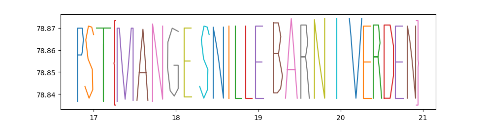
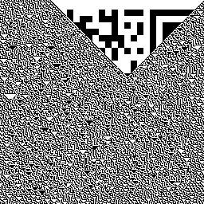
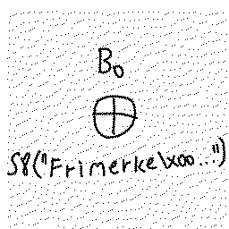
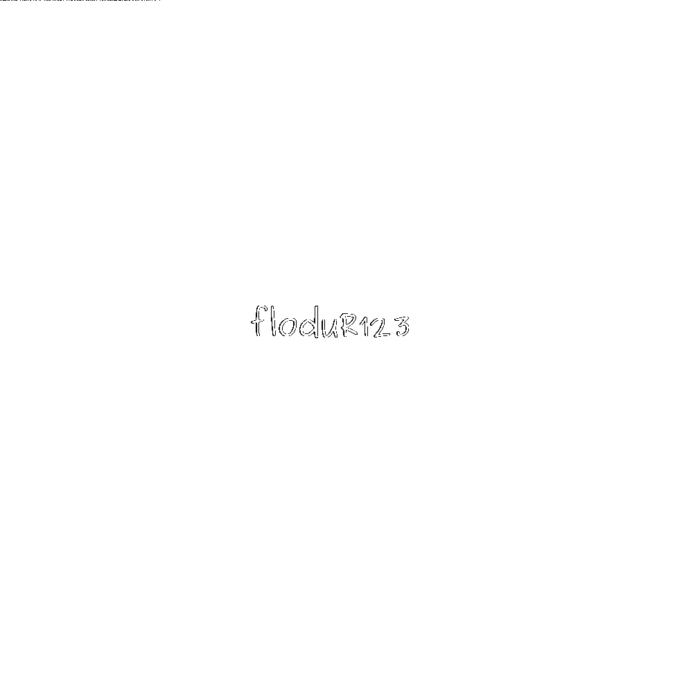
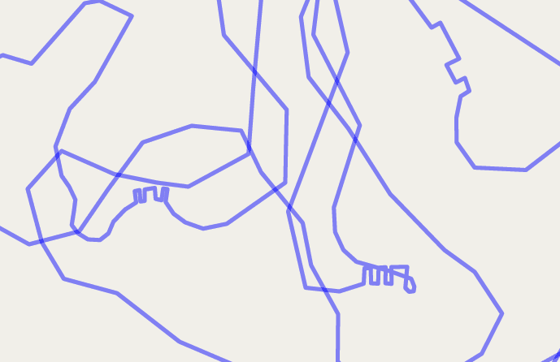
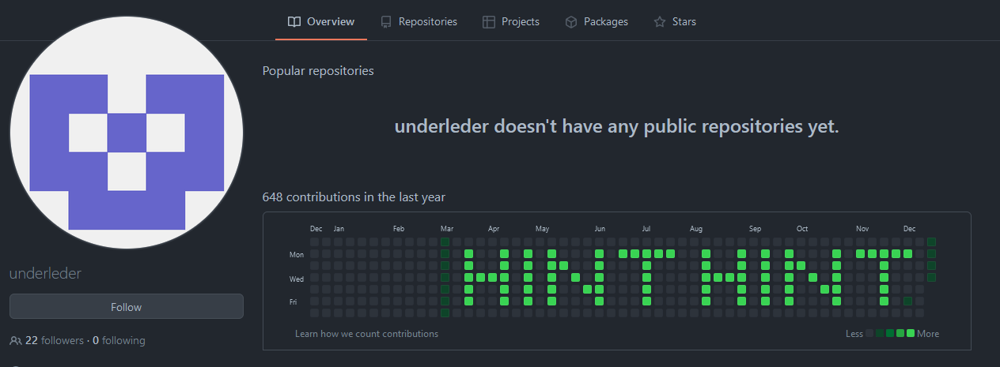
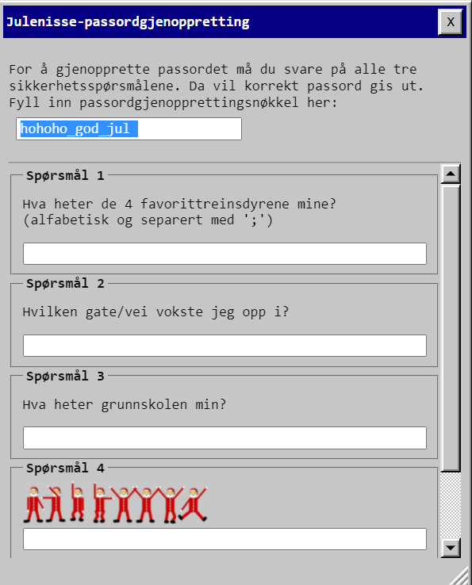

## Dag 1

```
Fra: HR
Sendt: 1.12.2021
Til: <brukernavn>
Emne: Velkommen til DASS!

Velkommen <brukernavn>!

Veldig hyggelig å ha deg ombord og fint å se at du har funnet veien inn til DASS. For at du skal finne deg mer til rette anbefaler jeg deg å sette ditt eget preg på systemet! Dette kan du gjøre ved å velge «Mal» fra startmenyen, mal din egen skrivebordsbakgrunn og velg Fil -> Sett som skrivebordsbakgrunn. Her er det bare kreativiteten som setter begrensninger, men i tilfelle du trenger litt starthjelp, legger jeg ved et eksempelbilde.

Spent på å følge deg videre, lykke til!

Hilsen HR

📎eksempel_bakgrunnsbilde.png
```

Vedlagt er et vakkert bilde av julenissen på sleden sin. Det virker ikke som om det er noe gjemt på selve bildet, men ulike verktøy viser at det er noe spesielt oppe i venstre hjørne, hvor pixlene varierer litt i stedet for å ha vanlig bakgrunnsfarge. Dette minner om LSB-steganografi, hvor noen bits med data er inkorporert i de siste bitsene i hver farge i noen pixler. `zsteg` kan sjekke en del slike konfigurasjoner.

```
$ ~/bin/zsteg eksempel_bakgrunnsbilde.png
imagedata           .. file: MIPSEB Ucode
b1,b,lsb,xy         .. file: GLS_BINARY_LSB_FIRST
b1,rgb,lsb,xy       .. text: "PST{HelloDASS}"
...
```

Dagens flagg er `PST{HelloDASS}`

```
Fra: HR
Sendt: 1.12.2021
Til: <brukernavn>
Emne: Re: Velkommen til DASS!

Bra jobba <brukernavn>! Mellomleder tar kontakt med deg i morgen med mer konkret informasjon angående hva du skal jobbe med.
```


## Dag 2

```
Fra: Mellomleder
Sendt: 2.12.2021
Til: <brukernavn>
Emne: Huskelapp

Velkommen til teamet <brukernavn>!

Vi går rett på sak. I fjor rakk ikke julenissen å dele ut pakker til alle som hadde gjort seg fortjent. For å komme til bunns i årsaken ble det satt ned et utvalg med mandat til å utnevne en kommisjon som skulle starte arbeidet med opprettelsen av en granskningskommité. Da granskningskommiteen kom med sin utredelse viste det seg at mulighetsrommet for å utøve slemme handlinger ble betraktelig redusert ved nedstenging og isolasjon. Det hadde rett og slett blitt for mange snille barn.

Da nedstenging og isolasjon delvis har vedvart, har det høy prioritet i år å finne en ny, mer optimal rute.

Julenissen fant i går en huskelapp som han tror kan være relevant, men han klarer ikke å finne ut av hva han skulle huske. Kunne du hjulpet han med det?

Mvh Mellomleder

📎huskelapp_til_2021.txt
```

Filen som blir utdelt inneholder en liste med lister, og ser sånn her ut:

```
[[78.836714, 16.805659], [78.85211, 16.805659], [78.862683, 16.805659], ... ]
```

med jevne mellomrom er det tomme lister (`[]`). Det minner veldig om GPS-koordinater, og en kjapp sjekk på Google Maps viser at det er tilfelle; det er steder på Svalbard. Målet er nok å visualisere disse punktene på et vis. Siden koordinatene har et veldig lite spenn i distanse, så trenger vi ikke å tenke på hvordan disse ser ut på en kule (i forhold til et 2D-plan).

```python
from matplotlib import pyplot as plt

coords = eval(open("huskelapp_til_2021.txt").read())
X,Y = [], []
while coords:
    cur = coords.pop(0)
    if cur:
        X.append(cur[0])
        Y.append(cur[1])
    else:
        plt.plot(Y,X)
        X,Y = [], []
plt.plot(Y,X)
plt.show()
```

Løsningen med matplotlib "løfter pennen" hver gang den ser en tom liste, da disse signaliserer at det startes på en ny bokstav.



`PST{MANGE SNILLE BARN I VERDEN}`

For de uten matplotlib, kan man bruke det innebygde biblioteket `turtle` også. Som en bonus får du en kul animasjon i tillegg til det hele.

```python
from turtle import *

coords = eval(open("huskelapp_til_2021.txt").read())

SCALE_X = 200
SCALE_Y = 600

diff = lambda a,b: (SCALE_X*(b[1]-a[1]), SCALE_Y*(b[0]-a[0]))

last = pos()
pu()
setx(-window_width()//2 + 10)
shape("turtle")
for coord in coords:
    if not coord:
        pu()
        continue
    
    if coord != coords[0]:
        goto(pos() + diff(last, coord))
    last = coord
    pd()

ht()
input("DONE")
```

```
Fra: Mellomleder
Sendt: 2.12.2021
Til: <brukernavn>
Emne: Re: Huskelapp

Selvfølgelig, det gir mening! Jaja, det visste han jo allerede.
```


## Dag 3

```
Fra: Mellomleder
Sendt: 3.12.2021
Til: <brukernavn>
Emne: Mistenkelig julekort

God fredag. Det Nordpolare Postkontor har oppdaget et julekort som er på vei til Antarktis. Etterretning viser at pingvinene i Antarktis ikke alltid har ren snø i skuffa. Det er derfor ønskelig at en alvebetjent gjennomfører en rutinemessig kontroll, og undersøker julekortets bakside og framside. Rapporter tilbake et eventuelt funn innpakket i pst{}.
```

Denne dagen blir det utdelt et innscannet postkort. På kantene av baksiden er det mulig å se noen symboler, og tilsvarende symboler er gjemt på forsiden også. Disse symbolene gjenkjenner jeg som Pigpen cipher, men det er ikke lett å forstå hvilken rekkefølge man skal lese symbolene. Etter litt prøving og feiling, innså jeg at vi måtte snu kortet opp-ned og så lese fra venstre mot høyre, fra topp til bunn. Da får vi ut "JULENISSENERTEIT", og dagens løsning er derfor `PST{JULENISSENERTEIT}`

```
Fra: Mellomleder
Sendt: 3.12.2021
Til: <brukernavn>
Emne: Re: Mistenkelig julekort

Vel vel. Tilsynelatende ikke noe muffens her, så julekortet blir sendt videre til Antarktis.
```


## Dag 4

```
Fra: Mellomleder
Sendt: 4.12.2021
Til: <brukernavn>
Emne: Krøll på verkstedet

HMS-ansvarlig var innom verkstedet i går og var helt forskrekket over rotet vi har etterlatt oss der. Jeg er litt opptatt med møter i dag, kan du ta deg tid til å rydde litt? Oversikt over hva vi har på verkstedet ligger vedlagt.

Mvh Mellomleder

📎verksted_npst.txt
```

Tekst-fila inneholder semikolon-separerte verdier, med en del whitespace rundt. Starten ser slik ut

```
               Indeks;Hylleplass;Utstyr;Id
 1;153a;justerbar skiftenøkkel_str_01;1629
  2;132;justerbar skiftenøkkel_str_02;1356
   3;7b;justerbar skiftenøkkel_str_03;1379
  4;126;justerbar skiftenøkkel_str_04;1069
```

Oppgaveteksten hinter til rot, og hvordan fikser man rot? Man rydder og **sorterer**. Løsningen på denne er litt guessy, men man skal altså sortere etter `Utstyr`-kolonnen og så hente ut `Hylleplass`-verdien. Hylleplass skal så tolkes som en hex-verdi, og hvis den viser seg å være ASCII så skal den inkluderes.

```python
from string import printable
L = list(line.strip().split(";") for line in open("verksted_npst.txt", encoding="utf-8").read().splitlines()[1:])
L.sort(key=lambda x:x[2])
flag = ''.join(filter(lambda x: x in printable, (chr(int(e[1].strip(),16)) for e in L)))

print(flag)
```

Flagget er `PST{DetBlirFortRot}`

```
Fra: Mellomleder
Sendt: 4.12.2021
Til: <brukernavn>
Emne: Re: Krøll på verkstedet

Takk <brukernavn>, la oss prøve å holde litt bedre orden der fremover.
```


## Dag 5

```
Fra: Mellomleder
Sendt: 5.12.2021
Til: <brukernavn>
Emne: Digitalt varelager

NPST har digitalisert varelageret sitt og flyttet det til skyen! For øyeblikket er det fortsatt i oppstartsfasen og trenger litt kvalitetssjekking.

Har du mulighet til å se om Varelager v1 funker som det skal og at det ikke skjuler seg noen feil i systemet?

Varelageret finner du her, og bruk programmeringsgrensesnittnøkkel v1_pgmsqxmddz.

Mvh Mellomleder
```

Det linkes til https://varelager.p26e.dev/, som en en portal hvor man kan taste inn `Programmeringsgrensesnittnøkkel` og `Søkeord`. Da jeg forsøkte meg på denne oppgaven, så fikk jeg bare feilmeldinger fra serveren - antageligvis pga. last - og etter en liten halvtime så var det mulig å løse den. Løsningen er enkel SQL injection, også hintet til via "hjelp" som spørring. Spørringen er antageligvis noe sånt som `SELECT * FROM v1 WHERE navn LIKE '%XXXX%'` hvor inputen som tastes inn er XXXX. 

En enkel måte å vinne denne på, er å observere at selve API-kallet returnerer mer data enn det som vises på nettsiden. Så ved å se på resultatet fra spørringen i DevTools, er det mulig å se de skjulte feltene `id` og `flagg`. En svært enkel spørring som `'--` får resultatet til å bli `SELECT * FROM v1 WHERE navn LIKE '%'--%'`, og dette matcher *alle* feltene, siden `%` er wildcard. `--` er tegnet for kommentar i SQL, og det gjør at `%'`en blir ignorert. Et av de returnerte feltene skiller seg ut:

```json
  {
    "id": "13b97062-dd26-41dc-bda0-58e4be6d1deb",
    "navn": "Ukjent vare",
    "antall": 1,
    "enhet": "stk",
    "kommentar": "🚩",
    "flagg": "PST{5Q1_1nj€Ⓒt10n}"
  }
```

Og der er flagget; `PST{5Q1_1nj€Ⓒt10n}`

```
Fra: Mellomleder
Sendt: 5.12.2021
Til: <brukernavn>
Emne: Re: Digitalt varelager

Bra jobba <brukernavn>! Jeg syntes det virket som om det var noe muffins i systemet. Forhåpentligvis funker alt bedre i neste oppdatering.
```


## Dag 6

Hviledag. Ingen oppgave på mandager.


## Dag 7

```
Fra: Mellomleder
Sendt: 7.12.2021
Til: <brukernavn>
Emne: Kryptert melding

Godt å se at du er klar for en ny arbeidsuke! Arbeidsoppgavene står i kø, så det er best å sette i gang umiddelbart:

Det er fanget opp en kryptert melding som Etterretningsalvdelingen har grunn til å tro at inneholder noe av interesse. Meldingen skiller seg ut fordi det ser ut til at mottaker er lokalisert i sydpolare strøk. For andre gang på under en uke! E-alvene er temmelig overbevist om at det er brukt temmelig sikker krypto her, fordi de ikke klarer å knekke meldingen. Og det sier litt, siden e-alvene våre er eksperter på knekking.

Uansett, kan du ta en titt? E-alvene mener det er en umulig oppgave siden de ikke klarer det, men jeg håper at du kanskje har litt nyansattflaks.

Her er meldingen:

Y2MPyYU4kblEXrEfExry4AIRAjqdke+JyQQN50Uj5GuCu5rE66lEzQXB5bE VOlNGRoU06Ny4vh/gzSPFV0mHUrxaaAVt1BwN1WN1HFT7baIejtR5KyG6 JK8yC70CpuPZV610coCiWzdFICcgEtAdQaesScLrg495kxofzG3EGvA=

Mellomleder
```

Strengen ser veldig ut som base64-alfabetet, og slutter med "=", som er normal padding for nevnte enkoding. Dekoder strengen som én streng (de to første linjene har feil padding, men padding brukes, ergo er det sannsynligvis én streng delt i tre) og får en ciphertext på 128 tegn. Allerede her ringer alarmbjellene for en block cipher, siden lengden er delelig med 16. I tillegg er det god entropi, samt spredning av byte-verdier, noe som tyder på at dette er en god krypteringsalgoritme. Sistnevnte hintes det også til i teksten. Slike analyser kan man enkelt gjøre med ting som index of coincidence, frekvensanalyse, o.l. Tatt vanskelighetsgraden hittil i betraktning, og det faktum at teksten er for kort til å gi gode analyser, så er det mest sannsynlig ikke meningen at vi skal bruke statistikk til å gjenkjenne teksten.

Men gitt at det er f.eks. AES, den mest kjente block cipheren i dag, og da i ECB-mode (fordi vi mangler en IV), hva er key? Her må vi bruke linja `Meldingen skiller seg ut fordi det ser ut til at mottaker er lokalisert i sydpolare strøk. For andre gang på under en uke!` og skjønne at det er samme mottaker som på Dag 3. Og dermed er løsningen fra Dag 3 muligens en nøkkel. AES-nøkler er enten 16, 24 eller 32 tegn lange, og strengen "JULENISSENERTEIT" er tilfeldigvis 16 tegn lang. Prøver først den, uten resultater, men med små bokstaver virker det, og vi får flagget.

```python
import base64
from Crypto.Cipher import AES
from Crypto.Util.Padding import unpad
enc = base64.b64decode("Y2MPyYU4kblEXrEfExry4AIRAjqdke+JyQQN50Uj5GuCu5rE66lEzQXB5bEVOlNGRoU06Ny4vh/gzSPFV0mHUrxaaAVt1BwN1WN1HFT7baIejtR5KyG6JK8yC70CpuPZV610coCiWzdFICcgEtAdQaesScLrg495kxofzG3EGvA=")
dec = AES.new(b"julenissenerteit", AES.MODE_ECB).decrypt(enc)
print(unpad(dec, AES.block_size).decode())
```

```
NPST skal endre paa pakkefordelingsruta i aar. Det gir mulighet for aa sabotere. XOXO M. PS Ikke god jul. PS pst{nootnoot}
```

Flagget er `pst{nootnoot}`


```
Fra: Mellomleder
Sendt: 7.12.2021
Til: <brukernavn>
Emne: Re: Kryptert melding

Konfidensiell informasjon er lekket! Det er uansett verdifullt for oss å vite om det, så takk for innsatsen. Kan det være vår uvenn Pen Gwyn som bedriver kvalme i år igjen? Uansett, jeg rapporterer dette videre til Julenissen, så blir det nok satt i gang strengere sikkerhetstiltak.

Mellomleder
```


## Dag 8

```
Fra: Mellomleder
Sendt: 8.12.2021
Til: <brukernavn>
Emne: Frimerke

En av alvebetjentene fant et løst frimerke i postmottaket. Initielle undersøkelser viser at det ikke kan ha sittet på julekortet som kom den 3. desember, da fiberne som sitter igjen i limet ikke er av samme type som julekortet. Fiberne kan minne om setetrekket fra en reinsdyrslede klasse 8.

Motivet på frimerket er av en slik karakter at det må undersøkes nærmere. Kan du ta en titt?

frimerke.png

Mellomleder
```


Et bilde av en snegle blir utdelt, og [PTSDen fra 2019](https://github.com/myrdyr/ctf-writeups/tree/master/npst19#mystisk-julekort) melder seg. Ved å kjøre ulike analyser på bildet, så er det tydelig at det er ulike ting lagret i LSB - hver farge for seg.






I det røde laget står det `B0 ⊕ S8("Frimerke\x00...")` og det blå laget har deler av noe som ligner på en QR-kode. Det grønne laget har noe regulære streker nedover, og ser vi på rådataene i LSB er det faktisk et "montert" (kompilert) SLEDE8-program. Litt mystisk å få denne oppgaven nå, ettersom SLEDE8 ikke har blitt introdusert enda for årets spillere.

Jeg hadde uansett lagt ut min simulator for SLEDE8 bytecode etter fjoråret, og flere andre har gjort det samme, så det er ikke problematisk å kjøre koden hvis man først gjenkjenner den. 

Først gjelder det å hente ut alle de ulike lagenes LSB-data

```
zsteg -e 'b1,r,lsb,xy' frimerke.png > r.dat
zsteg -e 'b1,g,lsb,xy' frimerke.png > g.dat
zsteg -e 'b1,b,lsb,xy' frimerke.png > b.dat
```

Deretter kjører jeg en SLEDE8-simulator med `g.dat` som programfil, og `b"Frimerke\x00\x00\x00\x00\x00\x00\x00\x00\x00\x00\x00\x00\x00\x00\x00\x00\x00\x00\x00\x00\x00\x00\x00\x00"` som "føde" til programmet. Etter hintet i ene bildet skulle det være `Frimerke` etterfulgt av flere nullbytes, og jeg la til nok til at programmet ikke lengre klaget på mangel av føde. Ut kommer 8192 bytes med data.

QR-koden har størrelsen `256x256`, som er 65536 pixler totalt. 8192 bytes er `8192*8 = 65536 bits`. Symbolet ⊕ brukes ofte om XOR, så nå gjenstår det egentlig bare å XORe sammen outputen fra SLEDE8 og QR-koden.

```python
from PIL import Image

def bxor(s1,s2):
    return b''.join(bytes([a ^ b]) for a,b in zip(s1,s2))

b = open("b.dat","rb").read()
o = open("s8_output.bin","rb").read()
w = bxor(o, b)

img = Image.new("L", (256,256))
im = img.load()

print(256*256, len(w)*8)
pixels = ''.join(format(e, "08b") for e in w)

for y in range(256):
    for x in range(256):
        im[x,y] = 255 if int(pixels[y*256+x]) else 0

img.save("comb.png")
```

Resultatet er en QR-kode


Flagget er `PST{R3m3mb3r_m3?_W3_h4d_SO_MUCH_FUN_t0g3th3r!_:D}`

```
Fra: Mellomleder
Sendt: 8.12.2021
Til: <brukernavn>
Emne: Re: Frimerke

Supert, takk skal du ha! Da var magefølelsen min riktig, her var det noe slimete!

Mellomleder
```


## Dag 9

```
Fra: Mellomleder
Sendt: 9.12.2021
Til: <brukernavn>
Emne: Nettverkstrafikk

Hei,

Fikk tilsendt denne filen fra IT-avdelingen i går, de har TAPpet filen ut av nettverket. Har du mulighet til å se på den? Mulig den gir oss litt mer informasjon angående lekkasjen vi hadde ut til SPST. Husk, dette forblir mellom oss, i tilfelle det viser seg å være en av våre egne.

Mvh Mellomleder

📎npst_02_12_21_18_00.pcap
```

PCAP-filen inneholder 1042 TCP-pakker som går på kryss og tvers mot målport 443. Source og Destination varierer veldig. Kun midten av trafikken er synlig, så det er ingen SYN/FIN/RST med i bildet, bare data. Dataene som sendes er i klartekst, eksempelvis `14 15 44  15 42  32 34 44 44 11 44 44`. Mange av de repeteres om og om igjen, foruten én melding.

Cluet her er ordet "TAP" i teksten. Dette er nemlig [TAP code](https://en.wikipedia.org/wiki/Tap_code), et Polybius square cipher med kvadratstørrelse 5x5, hvor C og K er slått sammen til én bokstav. Dette kan enkelt dekodes, men først må datalinjene hentes ut fra pcap-fila.

En av meldingene blir `pst crollparantes f apostrof jeg snaccer med deg fra crollparantes sourceip crollparantes slutt apostrof crollparantes slutt` som kan tolkes som `pst{f'jegsnakkermeddegfra{sourceip}'}`. Dekrypteres også source IP (43.44.45.15) videre som TAP code, så blir det til "stue" og der er flagget.

```python
#!/usr/bin/env python3
from scapy.all import *
from tapcode.tapcode import decipher

cap = rdpcap("npst_02_12_21_18_00.pcap")
for pdus in cap.sessions().values():
    for pdu in pdus:
        msg = (' '.join(decipher(e) for e in bytes(pdu["Raw"]).decode().split("  ")))
        if "pst" in msg:
            sourceip = decipher(pdu[IP].src)
            print(msg)

flagg = 'pst{' + f'jegsnakkermeddegfra{sourceip}' + '}'
print(flagg)
```

`pst{jegsnakkermeddegfrastue}`

```
Fra: Mellomleder
Sendt: 9.12.2021
Til: <brukernavn>
Emne: Re: Nettverkstrafikk

Oj, det var spennende. Takk for hjelpen <brukernavn>!
```


## Dag 10

```
Fra: Mellomleder
Sendt: 10.12.2021
Til: <brukernavn>
Emne: Oppdatering av varelageret

Alvebetjent Eline har oppgradert varelageret til v2 etter at det ble oppdaget litt muffins i versjon 1. Som en del av videreutviklingen har hun slått sammen v2 med resten av bruker-systemene til NPST, slik at det ikke trengs mange ulike databaser oppe i skyene.

Har du mulighet til å sjekke at alt funker som det skal etter Elines oppgradering?

Varelageret finner du som vanlig her, og bruk programmeringsgrensesnittnøkkel v2_vr7n0p1tf7.

Mvh Mellomleder
```

Etter oppgaven på dag 5, hadde jeg allerede tatt en titt i databasen, og sett at back-end var PostgreSQL, samt at det var schemas som het `v1` og `v2`. Jeg hadde ikke lesetilgang til v2, men antok at det kom til å komme en oppgave hvor vi fikk en v2-nøkkel som ga oss tilgang. Jeg hadde derimot sett tabellene og kolonnene for v2, og gjort klar en payload til når denne kom ut. Det er veldig mange måter å løse denne på, men hovedsaken var at v2 hadde `ting` (antall, enhet, flagg, id, kommentar, navn) og `brukere` (id, navn, passord).

Ved å dumpe alle brukerene, ser man fort at alle samen har passord på formatet `PST\{[a-f0-9]{30}\}`. Eposten nevner derimot navnet `Eline`, og hennes info er

```
5e50ae53-2f54-477c-9eea-e5ef28e9ad58,Eline,PST{c3ce11494e56a8897b6f80d1ca3dbe}
```

Så flagget er `PST{c3ce11494e56a8897b6f80d1ca3dbe}`.

```
Fra: Mellomleder
Sendt: 10.12.2021
Til: <brukernavn>
Emne: Re: Oppdatering av varelageret

Oii, det var ikke bra at alle brukerne lå så lett tilgjengelig! Vi skal få fiksa opp i det ASAP.
```


## Dag 11

```
Fra: Mellomleder
Sendt: 11.12.2021
Til: <brukernavn>
Emne: Muffens i filsystemet

Beklager for å forstyrre deg på en lørdag <brukernavn>, men det haster.

En av terminalene på julenissens kontor har utvist rar oppførsel de siste dagene. AlveCERT har sikret data fra hjemmeområdet, finner du noe muffens?

Mvh Mellomleder

📎sikring.tar.gz
```

Arkivet inneholder filen `sikring_alveCERT`, som `file` rapporterer å være `Linux jffs2 filesystem data big endian`. Verktøyet [jefferson](https://github.com/sviehb/jefferson/) kan pakke ut slike filsystemer, og en del filer spretter ut

```
-rwxrwx---+ 1 user None 140K Dec 11 18:08 .sys*
-rwxrwx---+ 1 user None  42K Dec 11 18:08 1.jpg*
-rwxrwx---+ 1 user None 202K Dec 11 18:08 2.jpg*
-rwxrwx---+ 1 user None  86K Dec 11 18:08 3.jpg*
-rwxrwx---+ 1 user None  69K Dec 11 18:08 4.jpg*
-rwxrwx---+ 1 user None  39K Dec 11 18:08 5.jpg*
-rwxrwx---+ 1 user None   15 Dec 11 18:08 flag.txt*
```

`flag.txt` inneholder derimot bare teksten `"this is not it"`, og den skjulte filen `.sys` var mystisk stor. Denne gangen sier `file` at det er `Linux Compressed ROM File System data, little endian size 143360 version #2 sorted_dirs CRC 0xf37c339d, edition 0, 34 blocks, 2 files`. Denne typen filsystemer får man også åpnet med 7-zip, og den viser at det er et bilde `guardians.jpg`. I EXIF-dataene til det bildet, står det at bildet ble laget av et program som het `CFG{WhyrYnzn}`, og en rask rot-13 på den gir `PST{JuleLama}` som løsning.

Dobbeltsjekker at det ikke er noe mer inni .sys

```
root@85a3732c8642:/# cramfsck -v .sys
d 0775        28  1000:232 /
f 0664    138809  1000:232 /guardians.jpg
.sys: OK
```


```
Fra: Mellomleder
Sendt: 11.12.2021
Til: <brukernavn>
Emne: Re: Muffens i filsystemet

Bra jobbet <brukernavn>, takk for hjelpen!
```


## Dag 12

```
Fra: Mellomleder
Sendt 12.12.2021
Til: <brukernavn>
Emne: Ugler i grøten

God søndag! Det er fanget opp tO krypterte meldinger som ble sendt under lunsjgrøTen i dag. Det vekker mistanke, siden alle alvebetjenter elsker grøt og aldri vil gå gliPp av en lunsjgrøt. Se de krypterte meldingene nederst i mailen. En dyktig alvebetjent har allerede funnet noen biter av klarteksten til melding 1:

"- - - k r o e l l - - - - - - - - - - - - - - - - - - - - - - - k r o e l l - - - - - - - -"

og noen biter av klarteksten til melding 2:

"- - - - - - - - - - - - - - - - p e n g w y n - - a - - o l - n - - - - - - - - - - - - - -"

Kan du se om du klarer å finne resten av klarteksten til begge meldingene? Legger også ved en tabell over ascii-verdier, kanskje du får bruk for den.

Melding 1:

00010101 00010100 00010011 00000000 00011101 00000011 00001010 00000010 00011100 00000011 00010101 00011001 00010111 00000001 00010001 00001001 00011111 00010010 00000100 00000000 00001001 00000111 00011010 00000000 00000001 00001110 00000000 00010101 00001011 00011111 00010000 00011000 00000000 00000000 00000000 00000000 00000000 00000000 00000000 00000000 00000000 00000000 00000000 00000000 00000000 00000000

Melding 2:

00010110 00001100 00000110 00000111 00001000 00000101 00001101 00001011 00000011 00011000 00011110 00001110 00010110 00001001 00010111 00001101 00011100 00010101 00001111 00010101 00010010 00010111 00011010 00001010 00011110 00000100 00000110 00000111 00001010 00000000 00010000 00000100 00011000 00011001 00000110 00001011 00000010 00001001 00000010 00001000 00011111 00001010 00011100 00010011 00000000 00011101
```

Leser av de store bokstavene i teksten og får OTP, fortkortelse for One-Time Pad. Det er mulig at vi har to meldinger som begge er kryptert med samme OTP, og da kan vi løse begge to samtidig med noe som kalles "crib dragging". Det er en teknikk hvor man gjetter deler av plaintexten i ene ciphertexten, og samtidig observerer hva den andre ciphertexten så dekrypteres til. Ved å følge med på begge to, er det mulig å sakte gjette seg fram til hva keyen er.

"ManyTimePad" er et verktøy som kan gjøre dette automatisk, og [her er en video](https://asciinema.org/a/YNV7PvWvVuaJdRrLfdlGNOExn) som demonstrerer hvordan man kan løse oppgaven med det.

Ut får vi to meldinger:
`skalgibeskjedfrapengwynomatsolenskinnerimorgen`
`pstkroellparentesberlinerkranserkroellparentes`

og keyen er `eggkolonpstkroellparentesertelujkroellparentes`

Dermed får vi både flagg og egg i dag

Flagg: `PST{berlinerkranser}`

Egg: `PST{erteluj}`


```
Fra: Mellomleder
Sendt 12.12.2021
Til: <brukernavn>
Emne: RE: Ugler i grøten

Ikke dårlig! Det er da strengt tatt ikke nødvendig å kryptere værmeldingen.. Men siden Pen Gwyn ble nevnt, så kan det jo faktisk være noe underfundig på gang. Best å holde øyne og alveører åpne!
```

```
Fra: Juleharen
Sendt: 12.12.2021
Til: <brukernavn>
Emne: Egg funnet!

Godt jobbet! Du har funnet et easter egg. Du er jammen meg oppmerksom.

Juleharen
```


## Dag 13

Hviledag. Ingen oppgave på mandager.


## Dag 14

```
Fra: Mellomleder
Sendt: 14.12.2021
Til: <brukernavn>
Emne: Reinsdyr på villspor

Fire av Julenissens favorittreinsdyr ble sluppet løs fra basen på Svalbard i går. Heldigvis er det sporing på reinsdyrene, så en av alvene i NPST har funnet en datamaskin og lastet ned sporingsdataen. Han klarer dessverre ikke å finne ut hvordan man får tak i GPS-filene.

Kan du hjelpe han?

Nb: Hvis du skulle finne noe mistenkelig i dataen, så rapporter tilbake med hva du fant, omkranset av PST{ og }.

Mvh Mellomleder

📎 sporing.zip
```

Filen `sporing.zip` inneholder `gps.7z`, som er et passordbeskyttet 7z-arkiv, `Rudolf.png` og `lost_key.txt`. Rudolf-bildet har, ved nærmere studering av de røde pixlene i bildet, dette her:



Og det er også passordet til 7z-fila. I tillegg gjemmer det seg noe stego i rød pixel bit 3 (kan ses som støy øverst til venstre i passord-bildet), som vi kan hente ut enkelt.

```python
from PIL import Image

img = Image.open("Rudolf.png")
im = img.load()
X, Y = img.size

bitstring = ""

for y in range(1):
    for x in range(512):
        r,g,b,a = im[x,y]
        bitstring += "1" if r&4 else "0"
        if len(bitstring) == 8:
            print(chr(int(bitstring, 2)), end="")
            bitstring = ""
```

Og vi får et egg: `PST{Egg_RudolfErRoedPaaNesen}`

Inni `gps.7z` finnes filen `Reindeer_tracker.kml`, som beskriver 4 GPS-ruter fra posisjonen "Slede" og ut som Rudolf, Prancer, Comet og Cupid. Ved å importere KML-filen inn i Google Earth, eller visualisere den på [KML viewer](https://kmlviewer.nsspot.net/), er det mulig å se noen veldig hakkete bevegelser.



Løsningen er å starte fra toppen og følge de 3 første banene ut, og så tolke de skarpe svingene som Morse-kode. Da får man `RUNFORESTRUN`, og ved å følge instruksjonene i eposten så blir det til `PST{RUNFORESTRUN}`.

```
Fra: Mellomleder
Sendt: 14.12.2021
Til: <brukernavn>
Emne: Re: Reinsdyr på villspor

Bra jobba <brukernavn>! Julenissen hilser og sier takk for at du reddet reinsdyrene hans.

Mellomleder
```


## Dag 15

```
Fra: Mellomleder
Sendt: 15.12.2021
Til: <brukernavn>
Emne: Kameraopptak gir klarhet

Etter gårsdagens reinsdyrflukt bestemmer alvebetjent M. Nist seg for å sjekke kameraloggen. Dessverre ser det ut som om det bare eR blått og grØnt støy Der... Klarer du å finne ut noe mer fra opptaket?

Mvh Mellomleder

📎 opptak.gif
```

`opptak.gif` er en GIF med 111 frames. Alle frames har tilsynelatende bare støy, hovedsaklig blått og grønt. Teksten hinter til "MNIST" og "RØD". Løsningen er å se på de røde pixlene, og så oppdage at det er et 27x27-bilde i det øverste hjørnet, og dette viser enten blankt eller et tall mellom 0 og 9. 

MNIST-hintet peker mot et stort datasett av håndskrevne tall, og tanken er nok at det skal lønne seg å bruke denne for å gjenkjenne tallene automatisk. Dessverre er det mye raskere å bare manuelt transkribere tallene, siden det ikke er altfor mange av de. Skriver noe rask kode for å filtrere bort alt annet enn rødt, samt croppe ut 27x27 pixler øverst til venstre:

```python
from PIL import Image

img = Image.open("opptak.gif")
for frame in range(img.n_frames):
    img.seek(frame)
    tmp = img.convert("RGB").crop((0,0,27,27))
    im = tmp.load()
    X, Y = tmp.size
    print(X,Y)
    for y in range(Y):
        for x in range(X):
            r,g,b = im[x,y]
            im[x,y] = (r, 0, 0)
    tmp.save(f"{frame}.png")
```

```python
>>> ''.join(chr(e) for e in [80,83,84,123,72,101,114,86,97,114,68,101,116,73,107,107,101,77,121,101,197,83,101,71,105,116,116,46,46,46,125])
'PST{HerVarDetIkkeMyeÅSeGitt...}'
```


```
Fra: Mellomleder
Sendt: 15.12.2021
Til: <brukernavn>
Emne: Re: Kameraopptak gir klarhet

Takk for meldingen <brukernavn>. Bra jobba!
```


## Dag 16

```
Fra: Mellomleder
Sendt: 16.12.2021
Til: <brukernavn>
Emne: Ødelagt julesang

Alvene på verkstedet klager over dårlig kvalitet på noen av julesangene som spilles over høyttalerne. Særlig denne sangen, "Rudolph, the Red-Nosed Reindeer", har mottatt mange klager. Kan du se om du finner ut hva som er galt?

📎 rudolf.wav

Det spilles et bredt spekter av julesanger på verkstedet, men denne sangen er egentlig en favoritt blant alvene. Da er det jo ekstra synd at lydkvaliteten er dårlig.

Mellomleder
```

Rett-fram oppgave. Det hintes til **spekter** og ca. midt i sangen ser man dette her på spektrogrammet til lydfila.


Flagget er `PST{H4KKIPL4PL4T4}`

```
Fra: Mellomleder
Sendt: 16.12.2021
Til: <brukernavn>
Emne: Re: Ødelagt julesang

Så flott at du fant ut av det. Da er det kanskje på tide å kjøpe nye plater.

Mellomleder
```


## Dag 17

```
Fra: Mellomleder
Sendt: 17.12.2021
Til: <brukernavn>
Emne: Klokt trasévalg

Hei,

nå Er det jo baRe en uke igjen til jul så vi må begynne å få på plass den nye pakkefordelingSruta. avdelingen for optimalisering og ruteplanlegging har jobbet hardt med å finne en trasé, og ga meg i går en Cd Hvor den foreløpige ruten er lagrEt. de fortalte meg at de hadde en baktanke med trasén, men ville ikke fortelle meg høyt hva dette var (i frykt for avlytting), så dette skulle komme frem fra fiLen. jeG sliteR med å tolke hvA de har tenkt. kunne du hjulPet meg?

mvH mellomleder

📎trasé.txt
```

De store bokstavene her hinter til "HERSCHELGRAPH"

`trasé.txt` inneholder bare

```
[-11.725769, -61.778000] 
[20.145221,-75.215909]
[52.300000,76.95000]
[23.101397,88.393575]
[-34.417148,19.248128]}
[-15.4825, 128.122778]  
[78.216667,15.633333]
[5.041066,7.919476]
[45.424722,-75.695000]
[21.150000,79.083333]
{[17.083333,-96.750000]
```

To av linjene har `{}`, som enten kan bety at det er starten og slutten på en liste over punkter - eller at det er relatert til flaggformatet. Koordiantene matcher GPS-koordinater, og etter å ha forsøkt å søke opp stedene, så kommer jeg ingen vei. Forsøkte å arrangere punktene som en Herschel Graph, regne ut korteste vei (Traveling Salesman Problem) da emnet tross alt er "Klokt trasévalg", osv. Det er vanskelig å skjønne hvor bokstavene fra flagget skal komme fra. Det kan være at koordinatene former bokstaver, former en strekfigur, eller at stedsnavnene (eller landene) skal brukes på et vis, men det er altfor stort scope til å finne en løsning.

Dagen etter dumper det inn et hint

```
Emne: Oppdatering klokt trasévalg

Oppdatering angående gårsdagens Mail. En alvebetjent har funnet alle koordinatene på kartet og hentet ut de tilhørende byene. Kan dette være til hjelp?

[-11.725769, -61.778000] = Rolim de moura
[20.145221,-75.215909] = Guantanamo
[52.300000,76.95000] = Pavlodar
[23.101397,88.393575] = Ektapur
[-34.417148,19.248128]} = Hermanus
[-15.4825, 128.122778] = Wyndham
[78.216667,15.633333] = Longerbyen
[5.041066,7.919476] = Uyo
[45.424722,-75.695000] = Ottawa
[21.150000,79.083333] = Nagpu
{[17.083333,-96.750000] = Oaxaca

Mellomleder
```

Og det snøret inn mulighetene betraktelig. Det er nok stedsnavnene (ikke landene) som skal brukes for å danne flagget. Problemet er at flagget skal starte med "PST", og vi har ikke alle de bokstavene i et logisk mønster. Det er ikke før vi tar alle forbokstavene og roterer de 4 fram i alfabetet, at det oppstår "PST", og det er for øvrig den eneste ROTasjonen som gir de bokstavene.

`RGPEHWLUONO` -> ROT4 -> `VKTILAPYSRS`

`VKTILAPYSRS` = `PST` + `VKILAYSR`

Mønsteret videre er fortsatt ikke åpenbart, men pga `{}` er første og siste bokstav gitt. `S VKIAYR L`

etter å omrokkere litt på bokstavene blir det til `PST{SKYRIVAL}`, som også er svaret.


```
Fra: Mellomleder
Sendt: 17.12.2021
Til: <brukernavn>
Emne: Re: Klokt trasévalg

Takk <brukernavn>! Sky rival, det er smart. Ingen grunn til å legge trasén forbi Sydpolen.
```


## Dag 18

```
Fra: Mellomleder
Sendt: 18.12.2021
Til: <brukernavn>
Emne: Grønne firkanter

Hei,

Alvdelingen for nettverksoperasjoner har utført en hemmelig nettverksoperasjon mot SPST. De har snublet over et "git repository", men de synes det er noe merksnodig med det. Alv en eller annen grunn så mener Alvdelingen for tekniske undersøkelser at det kan ha noe med "grønne firkanter" å gjøre, hva nå enn det betyr.

Kan du sjekke det ut?

📎groenne-firkanter.zip

Om du trenger hjelp så kunne du kanskje spurt alvdelingen for åpne kilder - de tar sikkert en titt på Github profilen til personen som "comitter" i repoet, kanskje det ligger et hint der.

Mvh

Mellomleder
```

Vedlagt er en zip som inneholder et GIT-repository. Personen som har committet ting kaller seg "underleder", og på GitHub-profilen til brukeren ser man dette 

De grønne firkantene som nevnes, er altså de grønne aktivitetsfirkantene på GitHub.

I git-repoet er det bare mange tomme commits langt inn i fremtiden

```bash
$ git log HEAD~3..HEAD
commit 01b2e67ed67ff5fb31a7b6e70fa9891018cf155c (HEAD -> master)
Author: Underleder <underleder@protonmail.com>
Date:   Sat Jun 10 03:00:00 2023 +0200

    Commit 1229

commit abf6af8a9c6ee123bef04e799f9ff0b0e539925f
Author: Underleder <underleder@protonmail.com>
Date:   Sat Jun 10 03:00:00 2023 +0200

    Commit 1228

commit f10eda41594fa5e6588d75a75831f01849ba32b6
Author: Underleder <underleder@protonmail.com>
Date:   Sat Jun 3 03:00:00 2023 +0200

    Commit 1227

```

Målet da, er å bygge en egen variant av disse grønne firkantene, for å visualisere et flagg på samme måte som der det står "HINT HINT".

Koden jeg skrev for dette er litt for hacky til å gi mening, så det er enklere å forklare stegene man må gjøre:

1. Parse alle commits, og hent ut normalisert tidspunkt (konverter til f.eks. UTC). Rekkefølgen er ikke viktig, bare tidspunktene.
2. Putt alle tidsstemplene i et sett, og observer at alle sammen representerer en hel time, f.eks. 03:00, 05:00 osv.
3. Start på det laveste tidspunktet og sjekk om dette er i settet, og legg til "1" i output hvis det var der, og øk telleren med 3600 (sekunder i en time). Gjør dette helt til telleren når det høyeste tidspunktet.
4. Det er 24 timer i en dag, og det holder å være aktiv en av de for å få en grønn firkant. Les ut 24 og 24 tegn fra output og se om det er en "1" inni der. Legg til "1" eller "0" i endelig output avhengig av svaret.

Til slutt sitter man igjen med en del pixler, som så kan konverteres til et svart-hvitt-bilde


Flagget er `PST{GET_CLEAN_GO_GREEN!}`

```
Fra: Mellomleder
Sendt: 18.12.2021
Til: <brukernavn>
Emne: Re: Grønne firkanter

Jasså ja! Det var det de mente med grønne firkanter. Bra jobba!

Mellomleder
```


## Dag 19

```
Fra: Mellomleder
Sendt: 19.12.2021
Til: <brukernavn>
Emne: ChimneyChopper

Hei <brukernavn>!

Nissen forsøker å være mer produktiv i år, og unngå å gå ned i feil pipe. For å sørge for spe-serialisert levering har alvene ordnet en helt ny leveransemetode for denne pakkeleveringen.

Nå handler det bare om å finne riktig pipe! Og hva var det han ønsket seg igjen...?

📎Chimney_Chopper.ps1

📎Chimney_Client.ps1
```

Vedlagt er to PowerShell-script, som implementerer en kommunikasjonskanal over named pipes. 

Klienten leser først en base64-enkodet ASCII art, og hasher denne med SHA256. Hvis denne matcher en hardkodet verdi, så sendes PID (Program Identifier) til Chopper

```powershell
$Adresse = $Pid

Write-Host "Nissens identitet er bekreftet"

$Mutant_in = Mutant("im_in")
Write-host "Sender data opp til mission control"

$Data = [Convert]::ToBase64String([System.Text.Encoding]::UTF8.GetBytes($Adresse))
pipe -Direction Out -Pipename "whereami_dot_exe" -Data $Data
```

ellers printes det ut en melding om at man kan lage sin egen klient.

Chopper-scriptet, på sin side, forsøker å base64-enkode en nisse-ASCII-art-greie til base64, og sende denne til klienten. Deretter mottar den noe data, og forsøker å bruke det til å dekryptere et flagg.

```powershell
$Payload = pipe -Direction In -Pipename "whereami_dot_exe"
Write-Host $Payload
$Loadstring = [Text.Encoding]::Utf8.GetString([Convert]::FromBase64String($Payload))
$addressLookup = (Get-FileHash -InputStream ([IO.MemoryStream]::new([byte[]][char[]]$Loadstring)) -Algorithm SHA384).hash

$Encrypted_Flag = "..."

$key = [byte[]]($addressLookup[0..15] -join "").ToCharArray()
$ss = ConvertTo-SecureString -String $Encrypted_Flag -Key $key
$way = [System.Runtime.InteropServices.Marshal]::SecureStringToGlobalAllocUnicode($ss)
$decoded = [System.Runtime.InteropServices.Marshal]::PtrToStringUni($way)
Write-Host "Korrekt adresse funnet! Deploy julegaver " -ForegroundColor Magenta
Write-Host $decoded -ForegroundColor Yellow
```

Det som sendes til `whereami_dot_exe` er PID fra klienten som en base64-streng, og denne dekodes og hashes med SHA384. De første 16 bytene av hashen (i hexadecimal og uppercase) brukes som en nøkkel for å dekryptere `$Encrypted_Flag`. SecureStrings bruker AES-CBC, så det er mulig å dekryptere denne i noe annet enn PowerShell, gitt at man vet keyen. Men her er det nok komponenter til å løse den i PowerShell alene, bare ved å klippe og lime litt. PID-verdiene er tall mellom 1 og 2^32, men Windows har en tendens til å gjenbruke PIDs lenge før tallet får en veldig høy verdi, så dette kan brute-forces.

```powershell
$ErrorActionPreference = "SilentlyContinue"
$Encrypted_Flag = "..."

for ($Adresse = 0; $Adresse -lt 300000; $Adresse++) {
    $addressLookup = (Get-FileHash -InputStream ([IO.MemoryStream]::new([byte[]][char[]]"$Adresse")) -Algorithm SHA384).hash
        try {
                $key = [byte[]]($addressLookup[0..15] -join "").ToCharArray()
                $ss = ConvertTo-SecureString -String $Encrypted_Flag -Key $key
                $way = [System.Runtime.InteropServices.Marshal]::SecureStringToGlobalAllocUnicode($ss)
                $decoded = [System.Runtime.InteropServices.Marshal]::PtrToStringUni($way)
                Write-Host "Korrekt adresse funnet! Deploy julegaver " -ForegroundColor Magenta
                Write-Host $decoded -ForegroundColor Yellow
                Write-Host $Adresse
                break
        }

        catch {
        }
}
```

Etter få sekunder kommer det output

```
Korrekt adresse funnet! Deploy julegaver
PST{Nissen_i_pipa}
19560
```


```
Fra: Mellomleder
Sendt: 19.12.2021
Til: <brukernavn>
Emne: Re: ChimneyChopper

Helt supert, <brukernavn>!

Nå fikk pipen en annen lyd, eller hva? He, he.
```


## Dag 20

Hviledag. Ingen oppgave på mandager.


## Dag 21

```
Fra: Mellomleder
Sendt: 21.12.2021
Til: <brukernavn>
Emne: Mulig lekkasje

NPST's sikkerhetssystemer er satt til øverste beredskap nå som jula nærmer seg, og den ene alvebetjenten oppdaget en melding som noen prøver å skjule. Kan du ta en nærmere titt på denne?

Mvh Mellomleder

brev.txt
```

Vedlagt er ganske lang tekst som inneholder et kort brev og en julesang. Åpnes det i en editor som viser teksten binært (eller som ikke dekoder UTF-8), så er det derimot tydelig at det er mye mer enn det vi ser. Det forklarer også hvorfor filen er 8.67KiB, når den kun inneholder rundt 3300 tegn.

Enkle analyser av tekstfilen viser at den inneholder bokstaver fra alfabetet og to de bytene  `'\u200c'` og `'\u200d'`. Disse tegnene kalles hhv. "zero-width non-joiner" og "zero-width joiner", og er usynlige tegn brukt for å kombinere eller splitte opp avanserte symboler brukt i noen språk. Brevet hinter også til dette med "**N‍**a‌p‌o‍l‌e‌o‌n‍s‌k‌a‌k‌e‌,‌ ‍**U‍**s‌t‍e‍k‍t‌ ‌c‍o‍o‌k‍i‌e‌ ‍d‌o‍u‍g‍h‌,‌ ‍**L‍**e‌f‍s‍e‍r‌,‌ ‍**L‍**u‌s‍s‍e‌k‌a‍t‌t‍e‌r‍,‍ ‌**B‍**e‍r‍l‌i‌n‌e‍r‌k‌r‌a‌n‌s‌e‍r‍,‌ ‍**R‍**i‌s‍t‍o‍p‌p‌e‌r‌,‍ ‍**E‍**p‌l‍e‌k‌a‍k‌e‍,‌ ‌**D‍**e‌l‌f‌i‌a‌k‌a‍k‍e‍,‌ ‌**D‍**o‍b‌l‍e‍ ‍s‌j‍o‌k‌o‌l‍a‍d‌e‍f‍l‍a‍r‌n‍,‍ ‍**E‌**i‌e‌r‌s‌c‍h‍e‍c‌k‌e‌,‌ ‌**T‍**y‍s‌k‌e‍ ‌s‍k‌i‌v‍e‌r‌,‌ ‌**E‌**p‌l‍e‍k‌a‍k‍e‍,‍ ‌**G‍**o‍r‌o‌ ‍o‍g‍ ‌**N‌**o‍n‌n‌e‌t‌t‌e‌r‍!‍" "**NULLBREDDETEGN**"

Siden kun to av disse tegnene er brukt, og antallet av de er delelig med 8, så er det rimelig å anta at disse brukes som binærkode. Hva som er 0, og hva som er 1, må man bare prøve seg fram til, men det er logisk om den laveste verdien er en 0.

```python
L = {'\u200c':'0', '\u200d':'1'}
F = int(''.join(L.get(e,'') for e in open("brev.txt").read()),2)
print(F.to_bytes((F.bit_length()+7)//8, "big").decode())
```

Teksten som kommer ut er

```
Jeg har planen klar!
De har nettopp delt ut oversikt over hvor nissen må stoppe og mate reinsdyrene underveis på ruta.

Her er det muligheter for å ødelegge!
Jeg holder dere oppdatert

-M
PST{ReadingBetweenTheLetters}
```


```
Fra: Mellomleder
Sendt: 21.12.2021
Til: <brukernavn>
Emne: Re: Mulig lekkasje

Bra jobba <brukernavn>! Det er viktig at vi fortsetter å stå på siste dagene frem mot jul.
```


## Dag 22

```
Fra: Mellomleder
Sendt: 22.12.2021
Til: <brukernavn>
Emne: Mistenkelig rute

Hei <brukernavn>,

Som du sikkert er klar over har de ansatte hos oss mulighet til å trene to timer i arbeidstiden i løpet av uken. Dette er et tilbud mange benytter seg av, spesielt etter at vi startet med utlån av GPS klokker til alle ansatte. De mest ivrige tar tar også med seg klokkene hjem i helgene. Ofte er dette ansatte med stor glede av sosiale medier, som liker å dele opplevelser med andre. Vi har spesielt lagt merke til et økt bruk av Instagram i arbeidstid.

Da en oppmerksom alvebetjent tok imot en klokke i går, fant hun en rute hun syns var veldig mistenkelig og rapporterte den inn. Det mistenktes at personen som lånte denne klokka kan ha hatt kontakt med en pingvin vi holder ekstra øye med. Legger ved både rute som ble funnet på klokka og nylige bevegelser gjort av pingvinen. Kan du ta en tit å se om det har skjedd noe mistenkelig?

Mellomleder

📎aktivitet_pingvin.kml 📎klokke_7_18_12_21.kml
```

Filene er så og si helt like. Begge inneholder de samme to aktivitetene, men rekkefølgen på de er omvendt. Målet her er å finne tidspunkt og sted noen kan ha møttes på. Ved å søke etter disse lokasjonene på Instagram (nevnt i oppgaveteksten) finner man mange bilder, men kun den oppgitte datoen er korrekt.

Løsningen er å se etter bilder rundt "Svalbard Global Seed Vault", og finne [dette bildet](https://www.instagram.com/p/CXniLlloNGv/) lastet opp 18. desember. Bildet er tatt av brukeren [chiliwilly1234](https://www.instagram.com/chiliwilly1234/), som kun har dette bildet på kontoen sin, men også beskrivelsen `pst{utpaaturaldrisur123} ` på profilen. Det er også flagget.


```
Fra: Mellomleder
Sendt: 22.12.2021
Til: <brukernavn>
Emne: Re: Mistenkelig rute

Takk for hjelpen <brukernavn>, dette var jo veldig mistenkelig.
```


## Dag 23

```
Fra: Julenissen
Sendt: 23.12.2021
Til: <brukernavn>
Emne: Sabotasje!

Alvene i sledegarasjen rapporterer om at noen har tuklet med julegaveruta som er lagt inn i slede-GPSen. Det er kritisk fordi det ikke er mulig å overstyre sledens GPS-kurs under flyturen. Det har visst blitt lagt til et stopp på Antarktis, rett utenfor SPST sitt hovedkvarter, og jeg (Julenissen) er redd for at SPST planlegger å rappe alle gavene fra sleden på selveste julaften.

I slede-GPS-loggen er det lagt igjen en kort beskjed: "Ikke god jul, hilsen M".

Det er derfor høy prioritet å finne ut hvem "M" er, før "M" klarer å utrette mer ugagn. Mellomleder har skrytt av din innsats denne førjulstiden, så jeg vil derfor betro denne viktige oppgaven til nettopp deg. Jeg personlig har ikke tid, for jeg skal først på gløggsmaking og så skal jeg se Grevinnen og Hovmesteren. Du blir gitt tilgang til kontoret mitt i kveld for å lete gjennom papirer og se om du klarer å finne ut hvem rakkeren er. Navnet rapporteres tilbake til meg (du må selv pakke navnet inn i formatet pst{}).

Dette oppdraget er gradert "Temmelig Hemmelig", så ikke fortell om dine funn til noen andre enn meg personlig.

📎 Julenissens_kontor.png

Hoho, Julenissen
```

Bildefilen er veldig stor ift. hva som faktisk er i bildet, og det viser seg at det gjemmer seg en ZIP-fil bak IEND-chunken i PNGen. Inni denne finnes det 4 filer:

- Barndomsfoto.png
- julekort.png
- note_to_elf.txt
- snille_og_slemme.pdf

PDF-filen inneholder 10 sider med navn som begynner på M, og hvorvidt de er snille, har mottatt gave, og er ansatt i NPST. TXT-filen har en forklaring til hva man skal gjøre:

```
En alvebetjent kom innom kontoret nettopp, og delte sin hypotese om hvem
som kan stå bak de uheldige hendelsene denne førjulstiden. Jeg skriver det ned
slik at jeg husker det til senere, for nå må jeg straks løpe for å rekke
lunsjgrøten. Alvebetjenten tror at den skyldige har et navn på M, fordi
vedkommende kaller seg for "M". Videre mente alvebetjenten at den skyldige må
være ansatt i NPST, av flere grunner. Først og fremst fordi vedkommende lekket
konfidensiell informasjon om pakkefordelingsruta tidlig i desember. Men også
fordi vedkommende kommuniserte med SPST fra vår stue.

Spørsmålet er da hvorfor en NPST-ansatt vil snu ryggen til julen og samarbeide
med SPST. Alle NPST-ansatte er "snille", og ikke "slemme". Hvis en alv skulle
hoppe over til "slem"-listen, så mister alven umiddelbart alvtorisasjonen og
dermed også jobben. Så hva kan være grunnen til at en "snill" alvebetjent ønsker
å sabotere årets julegavedistribusjon?
Det klarte ingen av oss å svare på.
```

Løsningen er altså å se etter en person som er ansatt og snill. Jeg gjør dette ved å kopiere over teksten til en tekstfil og så parse den. Dette gir 19 treff, hvorav 18 av disse har mottatt gave, og én har ikke. Kan dette være et godt motiv for sabotasjen? 

```python
for line in open("liste.txt").read().splitlines():
    navn, snill, gave, ansatt = line.split(" ")
    if snill == ansatt == "Ja" and gave == "Nei":
        print(f"PST{{{navn}}}")
```

Dette printer `PST{Maximilian}`, som også er dagens flagg.

```
Fra: Julenissen
Sendt: 23.12.2021
Til: <brukernavn>
Emne: Re: Sabotasje!

Å glitrende julekule, godt jobbet! Endelig har vi funnet rakkeren.

Maximilian innrømmer å ha båret nag over å ikke ha mottatt julegave i fjor, selv om han hadde gjort seg fortjent. Dette naget gikk gradvis over til hemningsløs arghet. Maximilian ville at andre skal føle smerten han har slitt med gjennom det siste året, og ønsket derfor å sabotere årets jul. For å lykkes med dette allierte han seg med agenter hos SPST.

For å hindre denne sabotasjen må vi rette opp i GPS-instillingene, men det får vente til i morgen tidlig kl. 9.

Hoho, Julenissen
```

Men hva med `Barndomsfoto.png` og `julekort.png`? Ved å se på det grønne laget på julekort-bildet, kommer dette fram 


hvor mellomrommet liner pent opp med klokkene på bildet


I de ulike farge-lagene befinner det seg også noen hint.

```
tikk... takk... tikk... takk...
lang kort lang kort
ikke tall men antall streker langs klokka
```

Man skal altså lese av klokkene, langeviser først, og telle antall streker. Den første klokka er 03:05, så viserne peker på 15 og 5. Den andre er 04:06, med visere på 20 og 6

Egget er altså `PST{EGG_515620}`


## Dag 24

```
Fra: Mellomleder
Sendt: 24.12.2021
Til: <brukernavn>
Emne: REDD JULA!

Selv om vi har funnet den ansvarlige må vi fortsatt fikse opp i ruta som er blitt tukla med, men Julenissen har glemt passordet til slede-GPSen.

Før du kan ta fri må du fikse en siste liten oppgave for Julenissen! Det er å finne ut av passordet til Julenissen med Julenisse-passordgjenopprettings-verktøyet, mens han gjør ferdig de siste forberedelsene til jul! Kanskje det ligger noe info på kontoret hans du kan bruke, eller har du hørt noe nyttig informasjon tidligere?

Det er viktig at du løser dette så fort som mulig slik at vi får reddet julen før det er for sent. Lykke til!

Rapporter tilbake med julenissens passord omkranset av PST{ og }, og bruk gjenopprettingsnøkkel hohoho_god_jul.

Mvh Mellomleder
```

Like før denne oppgaven ble sluppet, så kom det en oppdatering til DASS, hvor funksjonen `Julenisse-passordgjenoppretting` ble lagt til. Funksjonen var helt deobfuskert, så det var mulig å se spørsmålene før oppgaven ble lagt ut, men ikke så lett å levere uten å vite saltet som ble brukt i hashing-funksjonen deres. Dette ble utnyttet av flere som satt klar 15-30 minutter før oppgaven kom ut, men jeg var for sent ute til å få noen fordel.

Man skal nå svare på 4 spørsmål, og gjenopprette et passord for Julenissen.



De 4 reinsdyrene fås fra `Reindeer_tracker.kml` fra Dag 14. Gate/vei får man fra `Barndomsfoto.png` som ble funnet på Dag 23. Grunnskole har aldri blitt nevnt, men det er ikke mange grunnskoler på Svalbard i nærheten av veien som blir nevnt. Det siste spørsmålet er et cipher kalt [Flag Semaphore](https://en.wikipedia.org/wiki/Flag_semaphore), med en liten tvist på beina til Julenissen for å forvirre. Det er nemlig kun armenes posisjon som har noe å si.

Løsningene er som følger (blir automatisk konvertert til lower case)

```
comet;cupid;prancer;rudolf
hilmar rekstens vei
longyearbyen skole
godjuuul
```

Og det genererer passordet `1f2d444c083479aff98839fa6e48d00c`, altså er flagget `PST{1f2d444c083479aff98839fa6e48d00c}`.

```
Fra: Mellomleder
Sendt: 24.12.2021
Til: <brukernavn>
Emne: Re: REDD JULA!

Veldig bra jobba <brukernavn>! Takk for din innsats denne hektiske førjulstiden. Vi hadde ikke klart dette uten deg! Da er det bare å ta seg litt velfortjent ferie og julegrøt.

På vegne av hele NPST og Julenissen så ønsker vi deg en hjertelig god jul og et godt nytt år!
```


## Egg

Noen egg har allerede blitt nevnt, men det er 6 egg som ble funnet i løpet av konkurransen. Et var verdt 0 poeng, resten 5.

- [https://varelager.p26e.dev/](https://varelager.p26e.dev/) har en en [Logo_egg.png](https://varelager.p26e.dev/Logo_egg.jpg) under den primære logoen sin. `PST{EGG_StRpiITbqyEsBJM}`
- Nøkkelen for OTP på dag 12: `PST{erteluj}`
- Egg for å fullføre E-tjenesten sitt CyberTalent-oppdrag, annonsert på dag 13 i meldingen "Har du tid?"
- Stego på dag 14: `PST{Egg_RudolfErRoedPaaNesen}`
- Stego og gåte på dag 23. `PST{EGG_515620}`
- Et kaninhull gjemt i en av stillingsannonsene til PST (0 poeng, men svar fra HR)


