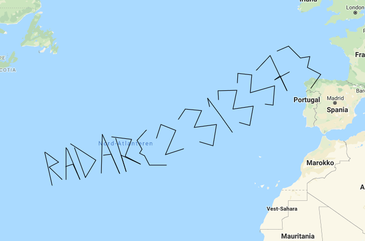
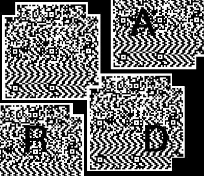
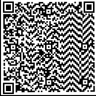

# AES

The code was copied nearly verbatim from https://stackoverflow.com/a/54024595. From initial analysis, this code does not contain any huge mistakes that would comprimise security. Which means we'll have to brute-force the key.

```python
encdata = open("flag.enc").read()

for line in open("../../wordlists/rockyou.txt").readlines():
    flag = ""
    try:
        flag = AESCipher(encdata,line.rstrip()).decrypt()
    except Exception:
        pass
    if "radar" in flag:
        print(line, flag)
        break
```

# Black

We are given a seemingly black image. Simply opening the photo in an mspaint-like editor and using the pain bucket tool (with white color) reveals the flag near the bottom. There are also multiple tools that can analyze the layers and find it, but in this case it wasn't needed.

`radar{reverse_color_give_flag}`

# blanks

We have a file with tabs and spaces. Replace tabs with `0` and spaces with `1` and you get a binary string. Unfortunately, there are some missing bits near the end, but we know that the last byte should be a `}`. Simply remove the last `6` bits and decode as binary.

`radar{blanks_but_not_blankz}`

# chose

The first version of this challenge looked like this:

```php
 <?php
require_once('flag.php');
error_reporting(0);
if(!isset($_GET['chose'])){die(highlight_file(__FILE__));}
@$chose = $_GET['chose'];
if(@file_get_contents($chose)!=="0"){die("null");}
echo "so ? what do u think now ? looklocklock :)";
@$s1=$_GET['sec1'];
@$s2=$_GET['sec2'];
$xx = 1337;$yy = 42;
if(intval($s1) !== $xx || $s1 === $xx){die("lol no\n");}
if(strlen($s2)==$yy){if(preg_match('/^\d+＄/', $s2) && !is_numeric($s2)){if($s2 == $xx){@$xx = $_GET['xx'];}}}
list($s1,$s2)=[$s2, $s1];
if(substr($xx, $yy) === sha1($xx)){foreach ($_GET as $lol => $hack_the_planet){$$lol = $hack_the_planet;}}
$v = "2";$m="?v";
if($$m !== $s1){die("whaaaa XD\n");}
assert_options(ASSERT_BAIL, 1);
assert("$yy == $xx");
echo "Good Job ;)";
?>
```

The goal is to reach the assert() function, which acts as an `eval()` that we can use to read the `flag.php` file. To accomplish this, we must accomplish the following:

* Provide a file that contains "0" to pass the file_get_contents check.
* Provide input parameter sec1 such that the integer value of sec1 is 1337, but also not be equal to the number 1337.
* (Optionally) provide another input parameter sec2 of length 42 that matches a regex that seemingly matches a number, but then also not be numeric. It should however be equal to 1337 when casted to a number. If we can do this, we can set the `$xx` variable needed later.
* (Optionally) Provide input parameter xx such that `substr($xx, 42) === sha1($xx)`. If we can do this, we can set any PHP variable through input parameters.
* Make sure that the variable named `s1` is equal to the variable named `?v`.

There are a few catches with the code. One is that the regex check is not using a normal `$` that would signify the end of the string, but a unicode look-alike. `file_get_contents` can also accept `data:,0` instead of just files. To pass the `sha1` check, we can make `xx` an array, as `sha1([]) === substr([], 42)`. Finally, to pass the last check, we need to pass the optional check that lets us set arbitrary PHP variables, and set one called `?v`.

The final payload looks like this:

`?chose=data%3A%2C0&sec1=1337&sec2=000000000000000000000000000000000001337＄&?v=000000000000000000000000000000000001337＄&xx[]=&yy=`

Where whatever you put in `yy` will be evaluated as PHP code, and can be used to read the flag. Unfortunately, the arranging team hosted this on the same server as the scoring system, and hadn't secured the challenge instance from the rest of the system. This led to this task being disabled, and any team that reported the RCE "mistake" was awarded 2000 points.


# EasyCrypto

We are given a bunch of binary segments. Reversing each of them, then decoding to ASCII, reveals a reversed flag.

```python
print(''.join(map(chr,[int(e[::-1],2) for e in "10111110 11100110 00101100 00110110 01100110 11111010 10011110 11001110 10000110 10100110 11111010 11001100 01101110 10010110 11100110 11111010 11001110 10100110 10010110 01001110 10000110 01110110 10010110 01000110 11111010 10011110 10101100 10000110 10100110 11011110 01001110 10000110 00100110 10000110 01001110".split(' ')])[::-1]))
```

`radar{ea5y_binaries_giv3_easy_fl4g}`


# EasyReverse

Opening `EasyReverse.exe` in dotPeek reveals the flag calculation function.

```
    public object flag()
    {
      string str1 = "radar";
      string str2 = "{";
      string str3 = "}";
      string str4 = "_";
      string str5 = "flagino";
      string str6 = "flago";
      str1 + str2 + str5 + str4 + str6 + str4 + str6 + str3;
      return (object) (str1 + str2 + str5 + str6 + str3);
    }
```

The flag here was actually not what was being returned, but the calculation above it.
`radar{flagino_flago_flago}`

# EasyWeb

A guessing challenge. The source of the website reveals `index.php?secretword=`. Guessing a few times we end up with the secret word being `radar` and we get the flag.

# Forbidd3n

The challenge wants us to access `/cgi-bin/`, but all we try gives 403 forbidden. After a hint is given out, we realise that `/` is actually mapped to `/~vulngeek/`, so we can access `cgi-bin` through `/~vulngeek/cgi-bin/`

# Hawking

Steghide. Can't remember the password, but it was something like `hawking` or `radar` - one of the first things to try.

`radar{h4wking_revealed_a_lot_of_secrets}`

# Ocean

We are given the file `unknown.zip` which is password protected. Basic cracking reveals that the password is `loveyou`. Inside is a file that we identified as a KML file with coordinates. This can be imported into Google maps.



# QRadar

This one was a bit difficult to understand at first. We get this image with seemingly 4 QR codes or pieces of QR codes.



Turns out they're all the same QR code, just copy-pasted around a bit, and 3 of them have been written on. I used the upper-left image as a base, rotated it 90 degrees anti-clockwise, and manually restored the missing corners.



# RadarEncrypt

You don't really need to decompile this one, as you can quickly discover the algorithm by just playing around with the program. Here you give some input, then a key that contains every unique character from the input. The output is each character in the plaintext's index in the key field, separated with `:`. We are given the pattern in the text file, so this one is fairly easy.

```python
print(''.join(["{qwertyuiopas_dfghjklzxcvbnm}"[i] for i in map(int,"4:11:14:11:4:0:8:26:14:3:22:13:9:15:13:27:11:19:3:13:12:27:11:20:20:13:23:4:6:10:5:9:4:28".split(':'))]))
```

`radar{index_of_make_small_cryptor}`

# RADARXORING

After a lot of reversing by a team-mate, the algorithm of this one was discovered to be as follows: The input password should be 8 characters, and the program calculates the MD5 hash of this password. It then takes the first 8 bytes of this hash and use it as a repeating XOR key. The key is applied to a huge binary blob contained in the program, and if the MD5 of this blob is `96f4d051b29f66a7f5934fe35f6aaf0b` after the XOR operation, the password is said to be correct, and the file `flag.bin` is written to disk.

Here we have three approaches:

* 1. Brute-force the password (keyspace 62^8)
* 2. Brute-force the key (keyspace 16^8)
* 3. Analyze the blob and determine the file type, then 2. for the rest.

I patched the binary to always dump the `flag.bin` regardless, and found that there were a LOT of repeating patterns. But it wasn't until I zoomed out really far in my editor that I noticed the pattern: a QR code! Knowing this, we were able to figure out that there are only a few valid characters in the file. Something to represent black, something to represent white, and newline characters. Fixing up the patterns a bit, we ended up with a text file with 500 lines with 500 characters on each. Plotting this with Python's PIL was fairly trivial from there on.

# Random

The PHP code generates a random number between 1 and 9, then subtracts this from each character's value in the flag. Finally it appends `ord(random_number)+49` to the end of the string. Here, the random number is found to be 5.

```python
print(''.join(map(chr,[e+5 for e in map(int,"109.92.95.92.109.118.109.92.105.95.90.100.110.90.105.106.111.90.98.106.106.95.90.100.95.96.92.90.103.106.103.120.102".split('.'))])))
```
`radar{rand_is_not_good_idea_lol}`

# RSA

The RSA step of this challenge was trivial (the `factor` tool cracked `n` in milliseconds), but the guessing step that followed it was not immediately obvious. What you had to do, was to split each 6-digit number into 3x 2-digit numbers, then treat those as integer values for characters. Mashing them all together revealed a base32-encoded string, which again decoded into a bunch of numbers. Those numbers represented the integer values for the flag. Full code here:

```python
from base64 import b32decode

def egcd(a, b):
    if a == 0:
        return (b, 0, 1)
    g, y, x = egcd(b%a,a)
    return (g, x - (b//a) * y, y)

def modinv(a, m):
    g, x, y = egcd(a, m)
    if g != 1:
        raise Exception('No modular inverse')
    return x%m

n = 7576962585305391589
p = 2045145391
q = 3704852779
e = 65537
phi = (p-1)*(q-1)
d = modinv(e, phi)
assert n == p*q

cc = [1265683495754363029, 1422867845936871540, 7495962311923944330, 6022768970112931054, 229419552321932918, 3656561926651753920, 1772755866314518285, 3365937215125857045, 3360046468411685558, 6665584816246982093, 3989488349327732617, 1904335850816135360, 229419552321932918, 31373686508890875, 1772755866314518285, 5055644333261405616, 2288021297643029596, 4671539261359863152, 6643261674820189024, 2766406176382193863, 1642404682569206145, 4025985104428009243, 5398532251800069162, 1221909921620717475, 2288021297643029596, 4671539261359863152, 664769064133108811, 2766406176382193863, 515730720669796421, 4822403277214863482, 4131241857203411167, 1873316133056870954, 6851707709007888739, 2526668656292689836, 3596520484061456107, 5493129668520855853, 1259752622063528705, 5484928886036822898, 4688751828022785921, 3365937215125857045, 3360046468411685558, 3958106079999151020, 5523706116292801963, 5055277716378667184, 3031183450926368572, 267859843632490692, 1852208473064098919, 888076521181220671, 6238421347230771761, 5942983273531489288, 140608813077386938, 2849086260420177433, 7178491026098905107, 3316744354054117337, 1764251739829230819, 339799054600629373]

res = ""

for c in cc:
    m = str(pow(c,d,n))
    intval = map(int,[m[0:2],m[2:4],m[4:]])
    res += ''.join(map(chr,intval))

print(''.join(map(chr,map(int,b32decode(res).split(' ')))))
```


# Scattered 1

Included was 576x jpg images named 1..576. Each of them included a single letter in the upper-left corner. After some cursory investigations, I found that a lof of the images shared the same MD5 sum, and that all that did had the same letter. Turned out that the solution was to take the letter from image 1,2,3...576 and append onto each other. That string would then be a base64 encoded string. Unfortunately, the images for `l` and `I` were 100% equal, down to the md5sum, so this gave some corruption.

Not being able to get tesseract working properly, I opted to manually create a mapping between md5sums and the character it represented.

```python
import hashlib
from manualmap import manual

def md5(fname):
    hash_md5 = hashlib.md5()
    with open(fname, "rb") as f:
        for chunk in iter(lambda: f.read(4096), b""):
            hash_md5.update(chunk)
    return hash_md5.hexdigest()

lookup = {}
for c,ix in manual.items():
    if ix != 0:
        h = md5("Scattered/%d.jpg" % ix)
        assert h not in lookup
        lookup[h] = c

res = ""

for i in range(1,577):
    h = md5("Scattered/%d.jpg" % i)
    if h in lookup:
        res += lookup[h]
    else:
        print(i, h)
        break
        
print((res+"==").decode('base-64'))
```

`radar{programming_is_important_good_job_bro}`

# Scattered 2

Scattered2 was the same as Scattered1, except the images had a number on them (destroying the md5sum approach), and randomized names. The goal was to take the letter from the image marked as 1,2,3... and do the base64 dance again.

While tesseract was able to discover the numbers, it did not have a 100% success rate, which could've led to some frustrating errors. Instead, I opted to just sort the images into buckets of 50 and do this challenge manually. I solved some pieces here and there until I located the position of the flag (near the end), then expanded the search for images in both directions.

`radar{pro_programmer_get_pro_flag_wow}`